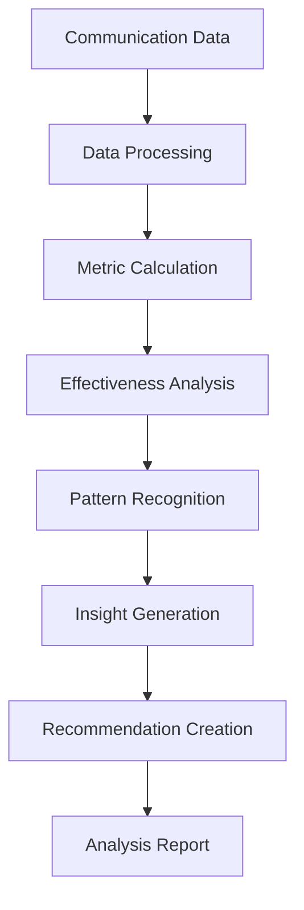
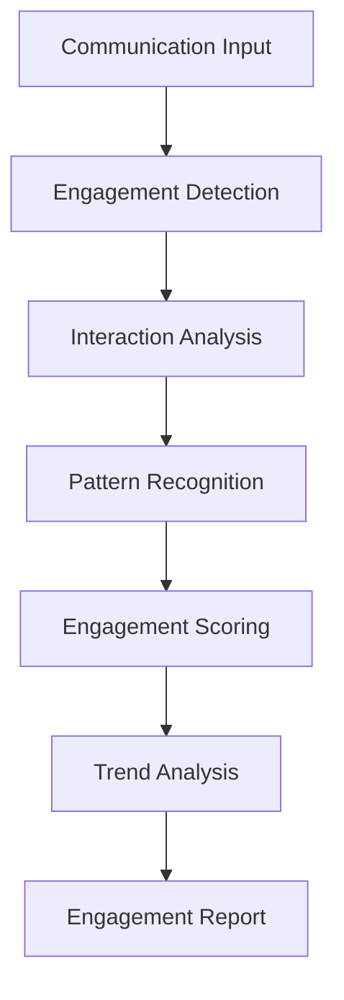
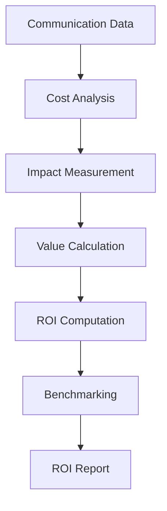

# **Communication Effectiveness Analyzer**

## **Overview**

The Communication Effectiveness Analyzer module provides comprehensive capabilities for analyzing communication effectiveness, measuring impact, tracking engagement, and providing actionable insights for communication optimization. It enables data-driven communication improvement and performance measurement.

## **Core Principles**

### **Effectiveness Measurement**
- **Impact Analysis**: Analyze communication impact and effectiveness
- **Engagement Tracking**: Track user engagement and interaction patterns
- **Performance Metrics**: Comprehensive performance metrics and KPIs
- **ROI Measurement**: Measure return on investment for communications

### **Data-Driven Insights**
- **Analytics Integration**: Integration of communication analytics and metrics
- **Pattern Recognition**: Recognition of effective communication patterns
- **Predictive Analytics**: Predictive analytics for communication optimization
- **Benchmarking**: Benchmarking against industry standards

### **Continuous Improvement**
- **Performance Monitoring**: Continuous performance monitoring and tracking
- **Optimization Insights**: Insights for communication optimization
- **A/B Testing**: A/B testing for communication effectiveness
- **Feedback Integration**: Integration of user feedback and preferences

## **Function Specifications**

### **Primary Functions**

#### **analyzeEffectiveness(communication: Communication, metrics: Metrics[]): EffectivenessResult**
- **Purpose**: Analyze communication effectiveness and impact
- **Parameters**:
  - `communication`: Communication data for analysis
  - `metrics`: Array of effectiveness metrics to analyze
- **Returns**: Effectiveness analysis result with insights and recommendations
- **Performance**: < 150ms analysis time, comprehensive insights

#### **measureEngagement(communication: Communication): EngagementResult**
- **Purpose**: Measure user engagement and interaction patterns
- **Parameters**:
  - `communication`: Communication data for engagement measurement
- **Returns**: Engagement measurement result with patterns and insights
- **Performance**: < 100ms measurement time, detailed analysis

#### **calculateROI(communication: Communication, costs: CostData): ROIResult**
- **Purpose**: Calculate return on investment for communications
- **Parameters**:
  - `communication`: Communication data for ROI calculation
  - `costs`: Cost data for ROI calculation
- **Returns**: ROI calculation result with metrics and insights
- **Performance**: < 80ms calculation time, accurate metrics

#### **generateInsights(communicationData: CommunicationData[]): InsightResult**
- **Purpose**: Generate actionable insights for communication optimization
- **Parameters**:
  - `communicationData`: Historical communication data
- **Returns**: Generated insights with recommendations and trends
- **Performance**: < 200ms insight generation, actionable recommendations

### **Configuration Functions**

#### **configureEffectiveness(options: EffectivenessConfig): void**
- **Purpose**: Configure effectiveness analysis parameters
- **Parameters**:
  - `options`: Effectiveness configuration object
- **Returns**: void
- **Performance**: < 10ms configuration time

#### **addEffectivenessMetric(metric: EffectivenessMetric): void**
- **Purpose**: Add custom effectiveness metric
- **Parameters**:
  - `metric`: Custom effectiveness metric configuration
- **Returns**: void
- **Performance**: < 50ms addition time

## **Integration Patterns**

### **Effectiveness Analysis Flow**


### **Engagement Measurement Flow**


### **ROI Calculation Flow**


## **Capabilities**

### **Effectiveness Analysis**
- **Impact Measurement**: Measure communication impact and effectiveness
- **Engagement Tracking**: Track user engagement and interaction patterns
- **Performance Metrics**: Comprehensive performance metrics and KPIs
- **ROI Measurement**: Measure return on investment for communications
- **Benchmarking**: Benchmark against industry standards and best practices

### **Analytics Integration**
- **Data Integration**: Integration with communication analytics platforms
- **Metric Calculation**: Calculation of comprehensive effectiveness metrics
- **Trend Analysis**: Analysis of effectiveness trends over time
- **Pattern Recognition**: Recognition of effective communication patterns
- **Predictive Analytics**: Predictive analytics for communication optimization

### **Performance Monitoring**
- **Real-time Monitoring**: Real-time monitoring of communication performance
- **Performance Tracking**: Continuous performance tracking and measurement
- **Alert System**: Alert system for performance issues and opportunities
- **Dashboard Integration**: Integration with performance dashboards
- **Reporting System**: Comprehensive reporting and analytics

### **Optimization Support**
- **A/B Testing**: A/B testing for communication effectiveness
- **Optimization Insights**: Insights for communication optimization
- **Recommendation Engine**: Recommendation engine for improvements
- **Feedback Integration**: Integration of user feedback and preferences
- **Continuous Improvement**: Support for continuous improvement processes

## **Configuration Examples**

### **Basic Effectiveness Configuration**
```yaml
communication_effectiveness:
  metrics:
    engagement_metrics:
      - "click_through_rate"
      - "time_on_page"
      - "interaction_rate"
      - "conversion_rate"
    impact_metrics:
      - "reach"
      - "impressions"
      - "awareness"
      - "brand_lift"
    roi_metrics:
      - "cost_per_acquisition"
      - "return_on_ad_spend"
      - "customer_lifetime_value"
      - "conversion_value"
  analysis:
    real_time_analysis: true
    trend_analysis: true
    pattern_recognition: true
    predictive_analytics: true
  performance:
    analysis_speed: "< 150ms"
    measurement_accuracy: "95%+"
    real_time_monitoring: true
    batch_processing: true
```

### **Advanced Effectiveness Configuration**
```yaml
communication_effectiveness:
  analytics:
    data_integration: true
    metric_calculation: true
    trend_analysis: true
    pattern_recognition: true
    predictive_analytics: true
  optimization:
    a_b_testing: true
    optimization_insights: true
    recommendation_engine: true
    feedback_integration: true
    continuous_improvement: true
  monitoring:
    real_time_monitoring: true
    performance_tracking: true
    alert_system: true
    dashboard_integration: true
    reporting_system: true
  benchmarking:
    industry_benchmarks: true
    competitive_analysis: true
    best_practices: true
    performance_comparison: true
```

### **Engagement Measurement Configuration**
```yaml
engagement_measurement:
  metrics:
    interaction_metrics:
      - "click_rate"
      - "scroll_depth"
      - "time_spent"
      - "bounce_rate"
    behavioral_metrics:
      - "session_duration"
      - "pages_per_session"
      - "return_visits"
      - "social_shares"
    conversion_metrics:
      - "lead_generation"
      - "sales_conversion"
      - "subscription_rate"
      - "retention_rate"
  analysis:
    pattern_recognition: true
    trend_analysis: true
    predictive_modeling: true
    segmentation_analysis: true
  optimization:
    engagement_optimization: true
    content_optimization: true
    timing_optimization: true
    channel_optimization: true
```

## **Error Handling**

### **Effectiveness Analysis Errors**
- **Analysis Failures**: Graceful degradation with partial results
- **Data Quality Issues**: Data validation and quality checking
- **Metric Errors**: Metric validation and correction
- **Insight Errors**: Insight validation and verification

### **Engagement Measurement Errors**
- **Measurement Failures**: Fallback to standard measurement methods
- **Data Collection Errors**: Data collection error handling and recovery
- **Pattern Recognition Errors**: Pattern validation and correction
- **Trend Analysis Errors**: Trend validation and correction

### **ROI Calculation Errors**
- **Calculation Failures**: Calculation validation and error recovery
- **Cost Data Errors**: Cost data validation and correction
- **Impact Measurement Errors**: Impact validation and correction
- **Benchmarking Errors**: Benchmarking validation and correction

### **Configuration Errors**
- **Invalid Configuration**: Configuration validation and error reporting
- **Metric Errors**: Metric validation and correction
- **Resource Errors**: Resource management and optimization
- **Performance Errors**: Performance monitoring and optimization

## **Performance Considerations**

### **Effectiveness Analysis Performance**
- **Analysis Speed**: < 150ms for effectiveness analysis
- **Measurement Accuracy**: 95%+ accuracy for effectiveness measurement
- **Throughput**: 5,000+ analyses per hour
- **Real-time Processing**: Real-time processing for live communications

### **Engagement Measurement Performance**
- **Measurement Speed**: < 100ms for engagement measurement
- **Pattern Recognition**: Fast pattern recognition and analysis
- **Trend Analysis**: Fast trend analysis and identification
- **Predictive Modeling**: Fast predictive modeling and forecasting

### **ROI Calculation Performance**
- **Calculation Speed**: < 80ms for ROI calculation
- **Cost Analysis**: Fast cost analysis and calculation
- **Impact Measurement**: Fast impact measurement and analysis
- **Benchmarking**: Fast benchmarking and comparison

### **Scalability**
- **Horizontal Scaling**: Horizontal scaling for high-volume processing
- **Vertical Scaling**: Vertical scaling for resource optimization
- **Load Balancing**: Intelligent load balancing and distribution
- **Resource Management**: Efficient resource allocation and management

## **Monitoring & Observability**

### **Effectiveness Metrics**
- **Analysis Accuracy**: Effectiveness analysis accuracy rates
- **Measurement Performance**: Measurement performance and reliability
- **Insight Quality**: Quality and relevance of generated insights
- **Optimization Impact**: Impact of optimization recommendations

### **Performance Metrics**
- **Processing Speed**: Average processing time and throughput
- **Memory Usage**: Memory usage and optimization metrics
- **CPU Usage**: CPU usage and optimization metrics
- **Throughput**: Overall system throughput and capacity

### **Quality Metrics**
- **Effectiveness Accuracy**: Effectiveness measurement accuracy and precision
- **Engagement Quality**: Engagement measurement quality and reliability
- **ROI Accuracy**: ROI calculation accuracy and reliability
- **Insight Relevance**: Relevance and usefulness of generated insights

### **Operational Metrics**
- **System Health**: Overall system health and availability
- **Resource Utilization**: Resource utilization and optimization
- **Error Tracking**: Error tracking and analysis
- **Performance Trends**: Performance trends and optimization

## **Security Considerations**

### **Data Privacy**
- **Communication Privacy**: End-to-end encryption for communication data
- **Analytics Privacy**: Privacy protection for analytics data
- **User Privacy**: Privacy protection for user engagement data
- **Data Retention**: Configurable retention policies

### **Access Control**
- **Authentication**: Strong authentication for effectiveness analysis services
- **Authorization**: Role-based access control for analysis functions
- **API Security**: Secure API access and rate limiting
- **Audit Logging**: Comprehensive audit trails for all operations

### **Content Security**
- **Input Validation**: Comprehensive input validation and sanitization
- **Data Validation**: Data validation and integrity checking
- **Metric Security**: Security for effectiveness metrics and calculations
- **Output Validation**: Validation of analysis outputs and results

---

**Version**: 1.0  
**Category**: Communication & Language  
**Subcategory**: Communication Analytics  
**Focus**: Comprehensive communication effectiveness analysis and measurement 