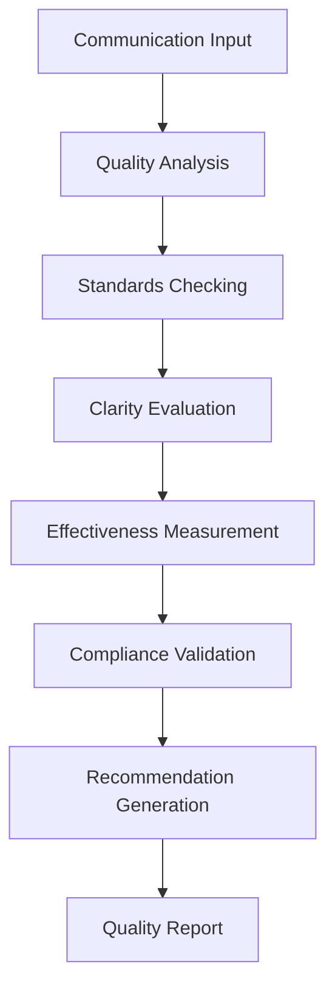
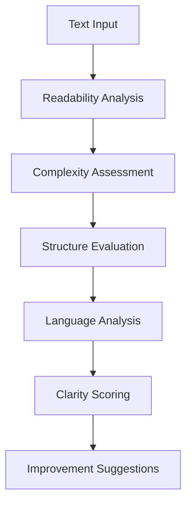
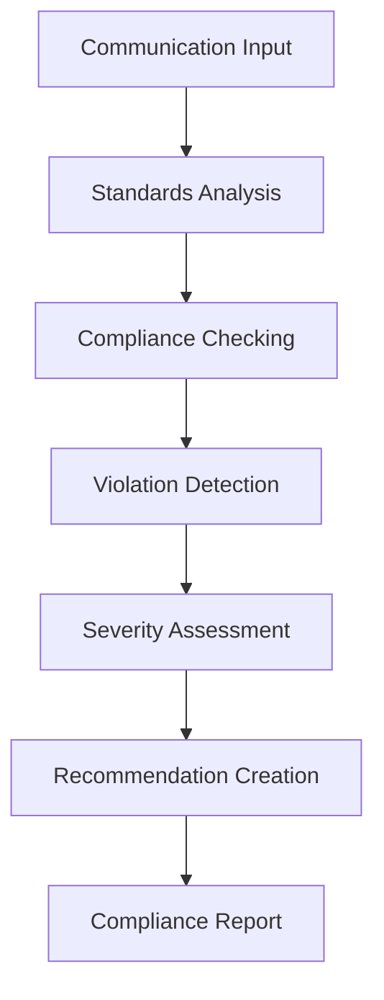

# **Communication Quality Assessor**

## **Overview**

The Communication Quality Assessor module provides comprehensive capabilities for assessing communication quality, measuring standards compliance, evaluating clarity and effectiveness, and providing quality improvement recommendations. It enables systematic quality assessment and continuous improvement of communications.

## **Core Principles**

### **Quality Assessment**
- **Quality Metrics**: Comprehensive quality metrics and standards
- **Compliance Checking**: Check compliance with communication standards
- **Clarity Evaluation**: Evaluate clarity and readability of communications
- **Effectiveness Measurement**: Measure communication effectiveness and impact

### **Standards Compliance**
- **Industry Standards**: Compliance with industry communication standards
- **Best Practices**: Adherence to communication best practices
- **Accessibility Standards**: Compliance with accessibility standards
- **Cultural Sensitivity**: Cultural sensitivity and appropriateness checking

### **Continuous Improvement**
- **Quality Monitoring**: Continuous quality monitoring and assessment
- **Improvement Recommendations**: Actionable improvement recommendations
- **Performance Tracking**: Track quality performance over time
- **Benchmarking**: Benchmark against quality standards and best practices

## **Function Specifications**

### **Primary Functions**

#### **assessQuality(communication: Communication, standards: QualityStandards[]): QualityResult**
- **Purpose**: Assess communication quality against defined standards
- **Parameters**:
  - `communication`: Communication content for quality assessment
  - `standards`: Array of quality standards to assess against
- **Returns**: Quality assessment result with scores and recommendations
- **Performance**: < 120ms assessment time, comprehensive evaluation

#### **evaluateClarity(text: string, context?: ClarityContext): ClarityResult**
- **Purpose**: Evaluate clarity and readability of communication
- **Parameters**:
  - `text`: Text content for clarity evaluation
  - `context`: Optional context for clarity assessment
- **Returns**: Clarity evaluation result with readability scores
- **Performance**: < 80ms evaluation time, detailed analysis

#### **checkCompliance(communication: Communication, standards: Standards[]): ComplianceResult**
- **Purpose**: Check compliance with communication standards
- **Parameters**:
  - `communication`: Communication content for compliance checking
  - `standards`: Standards to check compliance against
- **Returns**: Compliance check result with violations and recommendations
- **Performance**: < 100ms compliance check, comprehensive validation

#### **generateRecommendations(qualityData: QualityData[]): RecommendationResult**
- **Purpose**: Generate quality improvement recommendations
- **Parameters**:
  - `qualityData`: Historical quality assessment data
- **Returns**: Generated recommendations with priority and impact
- **Performance**: < 150ms recommendation generation, actionable insights

### **Configuration Functions**

#### **configureQuality(options: QualityConfig): void**
- **Purpose**: Configure quality assessment parameters
- **Parameters**:
  - `options`: Quality configuration object
- **Returns**: void
- **Performance**: < 10ms configuration time

#### **addQualityStandard(standard: QualityStandard): void**
- **Purpose**: Add custom quality standard
- **Parameters**:
  - `standard`: Custom quality standard configuration
- **Returns**: void
- **Performance**: < 50ms addition time

## **Integration Patterns**

### **Quality Assessment Flow**


### **Clarity Evaluation Flow**


### **Compliance Checking Flow**


## **Capabilities**

### **Quality Assessment**
- **Quality Metrics**: Comprehensive quality metrics and standards
- **Compliance Checking**: Check compliance with communication standards
- **Clarity Evaluation**: Evaluate clarity and readability of communications
- **Effectiveness Measurement**: Measure communication effectiveness and impact
- **Standards Validation**: Validate against industry and organizational standards

### **Standards Compliance**
- **Industry Standards**: Compliance with industry communication standards
- **Best Practices**: Adherence to communication best practices
- **Accessibility Standards**: Compliance with accessibility standards (WCAG, etc.)
- **Cultural Sensitivity**: Cultural sensitivity and appropriateness checking
- **Regulatory Compliance**: Compliance with regulatory requirements

### **Quality Monitoring**
- **Continuous Monitoring**: Continuous quality monitoring and assessment
- **Performance Tracking**: Track quality performance over time
- **Trend Analysis**: Analyze quality trends and patterns
- **Benchmarking**: Benchmark against quality standards and best practices
- **Alert System**: Alert system for quality issues and violations

### **Improvement Support**
- **Recommendation Engine**: Recommendation engine for quality improvements
- **Actionable Insights**: Actionable insights for quality enhancement
- **Priority Assessment**: Priority assessment for improvement recommendations
- **Impact Analysis**: Impact analysis for quality improvements
- **Continuous Improvement**: Support for continuous improvement processes

## **Configuration Examples**

### **Basic Quality Configuration**
```yaml
communication_quality:
  standards:
    industry_standards:
      - "apa_style"
      - "chicago_manual"
      - "mla_style"
    accessibility_standards:
      - "wcag_2.1"
      - "section_508"
      - "aria_guidelines"
    best_practices:
      - "clear_writing"
      - "active_voice"
      - "concise_messaging"
  assessment:
    quality_metrics: true
    compliance_checking: true
    clarity_evaluation: true
    effectiveness_measurement: true
  performance:
    assessment_speed: "< 120ms"
    evaluation_accuracy: "95%+"
    real_time_monitoring: true
    batch_processing: true
```

### **Advanced Quality Configuration**
```yaml
communication_quality:
  assessment:
    comprehensive_evaluation: true
    multi_dimensional_analysis: true
    context_aware_assessment: true
    cultural_sensitivity_checking: true
  monitoring:
    continuous_monitoring: true
    performance_tracking: true
    trend_analysis: true
    alert_system: true
  improvement:
    recommendation_engine: true
    actionable_insights: true
    priority_assessment: true
    impact_analysis: true
  benchmarking:
    industry_benchmarks: true
    competitive_analysis: true
    best_practices: true
    performance_comparison: true
```

### **Clarity Evaluation Configuration**
```yaml
clarity_evaluation:
  metrics:
    readability_metrics:
      - "flesch_reading_ease"
      - "flesch_kincaid_grade"
      - "gunning_fog_index"
      - "smog_index"
    complexity_metrics:
      - "sentence_length"
      - "word_length"
      - "syllable_count"
      - "paragraph_structure"
    language_metrics:
      - "active_voice_ratio"
      - "passive_voice_ratio"
      - "jargon_usage"
      - "technical_terms"
  evaluation:
    readability_analysis: true
    complexity_assessment: true
    structure_evaluation: true
    language_analysis: true
  improvement:
    improvement_suggestions: true
    alternative_phrasing: true
    structure_recommendations: true
    language_optimization: true
```

## **Error Handling**

### **Quality Assessment Errors**
- **Assessment Failures**: Graceful degradation with partial results
- **Standard Errors**: Standard validation and correction
- **Metric Errors**: Metric validation and correction
- **Evaluation Errors**: Evaluation validation and correction

### **Compliance Checking Errors**
- **Compliance Failures**: Compliance validation and error recovery
- **Standard Violations**: Violation detection and reporting
- **Validation Errors**: Validation error handling and recovery
- **Recommendation Errors**: Recommendation validation and correction

### **Clarity Evaluation Errors**
- **Evaluation Failures**: Fallback to basic evaluation methods
- **Readability Errors**: Readability validation and correction
- **Complexity Errors**: Complexity validation and correction
- **Language Errors**: Language validation and correction

### **Configuration Errors**
- **Invalid Configuration**: Configuration validation and error reporting
- **Standard Errors**: Standard validation and correction
- **Resource Errors**: Resource management and optimization
- **Performance Errors**: Performance monitoring and optimization

## **Performance Considerations**

### **Quality Assessment Performance**
- **Assessment Speed**: < 120ms for quality assessment
- **Evaluation Accuracy**: 95%+ accuracy for quality evaluation
- **Throughput**: 3,000+ assessments per hour
- **Real-time Processing**: Real-time processing for live communications

### **Compliance Checking Performance**
- **Checking Speed**: < 100ms for compliance checking
- **Validation Accuracy**: High accuracy for compliance validation
- **Violation Detection**: Fast violation detection and reporting
- **Recommendation Speed**: Fast recommendation generation

### **Clarity Evaluation Performance**
- **Evaluation Speed**: < 80ms for clarity evaluation
- **Readability Analysis**: Fast readability analysis and scoring
- **Complexity Assessment**: Fast complexity assessment and analysis
- **Language Analysis**: Fast language analysis and optimization

### **Scalability**
- **Horizontal Scaling**: Horizontal scaling for high-volume processing
- **Vertical Scaling**: Vertical scaling for resource optimization
- **Load Balancing**: Intelligent load balancing and distribution
- **Resource Management**: Efficient resource allocation and management

## **Monitoring & Observability**

### **Quality Metrics**
- **Assessment Accuracy**: Quality assessment accuracy rates
- **Compliance Performance**: Compliance checking performance and reliability
- **Clarity Quality**: Clarity evaluation quality and effectiveness
- **Improvement Impact**: Impact of quality improvement recommendations

### **Performance Metrics**
- **Processing Speed**: Average processing time and throughput
- **Memory Usage**: Memory usage and optimization metrics
- **CPU Usage**: CPU usage and optimization metrics
- **Throughput**: Overall system throughput and capacity

### **Quality Metrics**
- **Quality Accuracy**: Quality assessment accuracy and precision
- **Compliance Quality**: Compliance checking quality and reliability
- **Clarity Accuracy**: Clarity evaluation accuracy and precision
- **Recommendation Quality**: Quality and relevance of recommendations

### **Operational Metrics**
- **System Health**: Overall system health and availability
- **Resource Utilization**: Resource utilization and optimization
- **Error Tracking**: Error tracking and analysis
- **Performance Trends**: Performance trends and optimization

## **Security Considerations**

### **Data Privacy**
- **Communication Privacy**: End-to-end encryption for communication data
- **Quality Privacy**: Privacy protection for quality assessment data
- **Compliance Privacy**: Privacy protection for compliance checking data
- **Data Retention**: Configurable retention policies

### **Access Control**
- **Authentication**: Strong authentication for quality assessment services
- **Authorization**: Role-based access control for assessment functions
- **API Security**: Secure API access and rate limiting
- **Audit Logging**: Comprehensive audit trails for all operations

### **Content Security**
- **Input Validation**: Comprehensive input validation and sanitization
- **Data Validation**: Data validation and integrity checking
- **Standard Security**: Security for quality standards and metrics
- **Output Validation**: Validation of assessment outputs and results

---

**Version**: 1.0  
**Category**: Communication & Language  
**Subcategory**: Communication Analytics  
**Focus**: Comprehensive communication quality assessment and standards compliance 