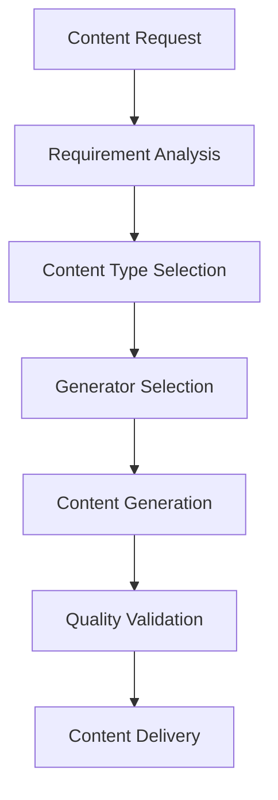
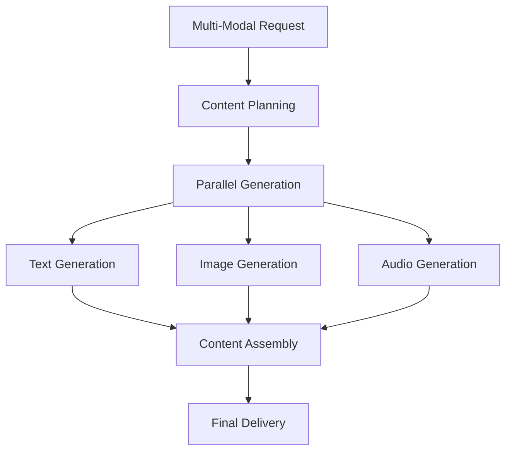
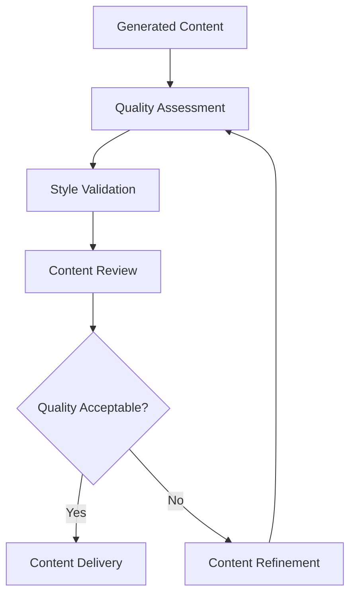

# **Content Creation**

## **Overview**

The Content Creation subcategory provides comprehensive capabilities for generating various types of content including text, images, audio, video, code, and documents. This subcategory forms the foundation for intelligent content generation across the kOS ecosystem.

## **Core Principles**

### **Quality-First Generation**
- **High-Quality Output**: Generate professional-quality content that meets industry standards
- **Context Awareness**: Create content that is contextually relevant and appropriate
- **User-Centric Design**: Focus on user needs and preferences in content generation
- **Continuous Improvement**: Continuously improve content quality through feedback and learning

### **Intelligent Creation**
- **AI-Powered Generation**: Leverage advanced AI models for intelligent content creation
- **Multi-Modal Support**: Support for text, image, audio, video, and code generation
- **Adaptive Creation**: Adapt content creation based on user feedback and preferences
- **Creative Intelligence**: Generate creative and innovative content solutions

### **Scalable Performance**
- **High Throughput**: Support high-volume content generation requirements
- **Fast Generation**: Generate content quickly without compromising quality
- **Resource Efficiency**: Optimize resource usage for cost-effective generation
- **Parallel Processing**: Support parallel content generation for improved performance

## **Modules**

### **01. Text Generator** ⏳ **PENDING**
- **Status**: Module specification needed
- **Focus**: Advanced text generation with natural language processing
- **Capabilities**: Multi-language text generation, style adaptation, tone control

### **02. Image Generator** ⏳ **PENDING**
- **Status**: Module specification needed
- **Focus**: High-quality image generation and manipulation
- **Capabilities**: Photorealistic generation, style transfer, resolution optimization

### **03. Audio Generator** ⏳ **PENDING**
- **Status**: Module specification needed
- **Focus**: Audio content generation and processing
- **Capabilities**: Speech synthesis, music generation, audio enhancement

### **04. Video Generator** ⏳ **PENDING**
- **Status**: Module specification needed
- **Focus**: Video content generation and editing
- **Capabilities**: Video synthesis, editing, effects, and optimization

### **05. Code Generator** ⏳ **PENDING**
- **Status**: Module specification needed
- **Focus**: Intelligent code generation and development
- **Capabilities**: Multi-language code generation, testing, documentation

### **06. Document Generator** ⏳ **PENDING**
- **Status**: Module specification needed
- **Focus**: Professional document creation and formatting
- **Capabilities**: Report generation, formatting, template management

### **07. Creative Content Generator** ⏳ **PENDING**
- **Status**: Module specification needed
- **Focus**: Creative and artistic content generation
- **Capabilities**: Creative writing, artistic generation, innovative content

### **08. Interactive Content Generator** ⏳ **PENDING**
- **Status**: Module specification needed
- **Focus**: Interactive and dynamic content creation
- **Capabilities**: Interactive elements, dynamic content, user engagement

## **Integration Patterns**

### **Content Generation Flow**


### **Multi-Modal Generation Flow**


### **Quality Assurance Flow**


## **Capabilities**

### **Text Generation**
- **Multi-Language Support**: Generate text in 100+ languages
- **Style Adaptation**: Adapt writing style to different contexts and audiences
- **Tone Control**: Control emotional tone and formality level
- **Length Optimization**: Generate content of specified length and complexity
- **Context Awareness**: Generate contextually relevant content

### **Media Generation**
- **High-Resolution Images**: Generate high-quality images up to 4K resolution
- **Audio Synthesis**: Generate natural-sounding speech and music
- **Video Creation**: Generate and edit video content with effects
- **Multi-Format Support**: Support multiple output formats and standards
- **Quality Optimization**: Optimize media quality and file sizes

### **Code Generation**
- **Multi-Language Support**: Generate code in multiple programming languages
- **Framework Integration**: Generate code for popular frameworks and libraries
- **Testing Integration**: Generate comprehensive test suites
- **Documentation**: Generate code documentation and comments
- **Best Practices**: Follow coding best practices and standards

### **Document Generation**
- **Professional Formatting**: Generate professionally formatted documents
- **Template Support**: Support for custom templates and layouts
- **Multi-Format Output**: Generate documents in multiple formats (PDF, DOCX, HTML)
- **Content Assembly**: Assemble complex documents from multiple sources
- **Version Control**: Support document versioning and change tracking

## **Configuration Examples**

### **Basic Content Generation Configuration**
```yaml
content_creation:
  text_generation:
    default_language: "en"
    style_adaptation: true
    tone_control: true
    quality_threshold: 0.8
  media_generation:
    image_quality: "high"
    audio_quality: "professional"
    video_quality: "hd"
    format_support: ["png", "jpg", "mp3", "mp4"]
  code_generation:
    language_support: ["python", "javascript", "typescript", "java"]
    testing_integration: true
    documentation: true
    best_practices: true
  document_generation:
    template_support: true
    multi_format: true
    professional_formatting: true
    version_control: true
```

### **Advanced Content Generation Configuration**
```yaml
content_creation:
  generation:
    ai_models: ["gpt-4", "dall-e-3", "whisper", "codex"]
    parallel_processing: true
    quality_optimization: true
    creative_mode: true
  optimization:
    performance_tuning: true
    resource_optimization: true
    cost_management: true
    scalability: "horizontal"
  integration:
    api_access: true
    webhook_support: true
    real_time_generation: true
    batch_processing: true
  security:
    content_validation: true
    safety_filters: true
    access_control: true
    audit_logging: true
```

## **Performance Considerations**

### **Generation Performance**
- **Text Generation**: < 5 seconds for 1000-word content
- **Image Generation**: < 30 seconds for high-quality images
- **Audio Generation**: < 10 seconds for 1-minute audio
- **Video Generation**: < 5 minutes for 1-minute video
- **Code Generation**: < 30 seconds for 500-line code

### **Quality Metrics**
- **Content Quality**: 95%+ user satisfaction rate
- **Style Consistency**: 90%+ style consistency across generations
- **Error Rate**: < 1% generation errors
- **Accuracy**: 95%+ content accuracy and relevance

### **Scalability**
- **Concurrent Generation**: Support 100+ concurrent generation requests
- **Throughput**: 1000+ content pieces per hour
- **Resource Efficiency**: Optimal resource usage and cost management
- **Load Balancing**: Intelligent load balancing across generation nodes

## **Security Considerations**

### **Content Safety**
- **Content Validation**: Validate all generated content for safety and appropriateness
- **Safety Filters**: Implement comprehensive safety filters and content moderation
- **Bias Detection**: Detect and mitigate bias in generated content
- **Copyright Protection**: Ensure generated content doesn't violate copyright

### **Access Control**
- **Authentication**: Strong authentication for content generation services
- **Authorization**: Role-based access control for different generation capabilities
- **Rate Limiting**: Implement rate limiting to prevent abuse
- **Usage Tracking**: Track and monitor content generation usage

### **Data Protection**
- **Privacy Protection**: Protect user data and privacy during generation
- **Secure Processing**: Secure processing of sensitive input data
- **Data Retention**: Configurable data retention policies
- **Audit Logging**: Comprehensive audit trails for all generation activities

## **Monitoring & Observability**

### **Generation Metrics**
- **Success Rate**: Track successful content generation rates
- **Generation Time**: Monitor content generation performance
- **Quality Scores**: Track content quality and user satisfaction
- **Error Rates**: Monitor generation errors and failures

### **Performance Metrics**
- **Response Time**: Monitor generation response times
- **Throughput**: Track generation throughput and capacity
- **Resource Usage**: Monitor resource utilization and optimization
- **Cost Metrics**: Track generation costs and efficiency

### **Quality Metrics**
- **User Satisfaction**: Track user satisfaction with generated content
- **Content Usage**: Monitor how generated content is used
- **Feedback Analysis**: Analyze user feedback and improvement areas
- **Quality Trends**: Track quality improvement trends over time

### **Operational Metrics**
- **System Health**: Monitor overall system health and availability
- **Service Status**: Track service status and uptime
- **Error Tracking**: Track and analyze generation errors
- **Performance Trends**: Monitor performance trends and optimization

---

**Version**: 1.0  
**Subcategory**: Content Creation  
**Status**: ⏳ **PENDING** - Subcategory index complete, modules need implementation  
**Focus**: Comprehensive content creation capabilities for all media types 