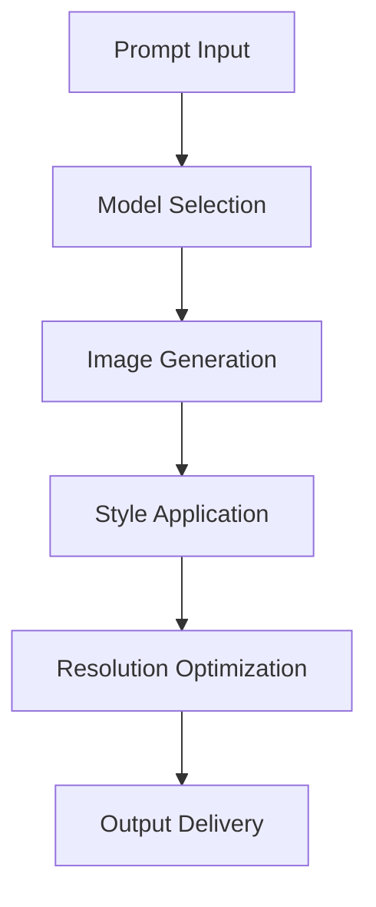

# **Image Generator**

## **Purpose**

The Image Generator provides high-quality image generation and manipulation capabilities using advanced AI models. It supports photorealistic generation, style transfer, resolution optimization, and multi-format output for a wide range of applications.

## **Core Principles**

- **Photorealistic Output**: Generate realistic and high-quality images
- **Style Adaptation**: Support for style transfer and artistic effects
- **Resolution Optimization**: Generate images at various resolutions up to 4K
- **Multi-Format Support**: Output in multiple image formats
- **User-Centric Design**: Focus on user requirements and creative intent

## **Function Specifications**

### **Core Functions**

#### **generateImage(prompt: string, options?: ImageGenOptions): Promise<ImageGenResult>**
Generates an image based on a prompt and optional parameters.

**Parameters:**
- `prompt`: Input prompt or description
- `options`: Optional generation options (style, resolution, format, etc.)

**Returns:**
- `ImageGenResult`: Generated image and metadata

**Example:**
```typescript
const result = await imageGenerator.generateImage(
  "A futuristic cityscape at sunset",
  { style: "photorealistic", resolution: "4K", format: "png" }
);
console.log(result.imageUrl);
```

#### **applyStyle(image: Buffer, style: string): Promise<ImageGenResult>**
Applies a style transfer or artistic effect to an image.

**Parameters:**
- `image`: Input image buffer
- `style`: Style or effect to apply

**Returns:**
- `ImageGenResult`: Styled image and metadata

**Example:**
```typescript
const styled = await imageGenerator.applyStyle(imageBuffer, "van-gogh");
console.log(styled.imageUrl);
```

#### **optimizeResolution(image: Buffer, targetResolution: string): Promise<ImageGenResult>**
Optimizes the resolution of an image.

**Parameters:**
- `image`: Input image buffer
- `targetResolution`: Target resolution (e.g., "1080p", "4K")

**Returns:**
- `ImageGenResult`: Optimized image and metadata

**Example:**
```typescript
const optimized = await imageGenerator.optimizeResolution(imageBuffer, "4K");
console.log(optimized.imageUrl);
```

## **Integration Patterns**

### **Image Generation Flow**


## **Capabilities**

- **Photorealistic Generation**: Realistic image output
- **Style Transfer**: Artistic and creative effects
- **Resolution Optimization**: Up to 4K output
- **Multi-Format Output**: PNG, JPG, GIF, WebP, etc.
- **Batch Generation**: Generate multiple images in parallel

## **Configuration Examples**

```yaml
image_generator:
  default_style: "photorealistic"
  max_resolution: "4K"
  format_support: ["png", "jpg", "gif", "webp"]
  batch_generation: true
```

## **Error Handling**

- **Model Failure**: Retry with fallback model
- **Unsupported Format**: Return error with supported formats
- **Resolution Too High**: Return error with max resolution info
- **Style Not Found**: Return error with available styles

## **Performance Considerations**

- **Generation Latency**: Optimized for < 2s
- **Batch Generation**: Support for batch image generation
- **Resource Usage**: Efficient GPU and memory usage

## **Security Considerations**

- **Content Filtering**: Filter unsafe or inappropriate images
- **Access Control**: Restrict access to sensitive generation features
- **Audit Logging**: Log all generation requests

## **Monitoring & Observability**

- **Generation Metrics**: Track request count, latency, and errors
- **Quality Metrics**: Track quality scores and feedback
- **Alerting**: Alerts for model failures or quality issues

---

**Version**: 1.0
**Focus**: High-quality, creative image generation for kOS ecosystem 