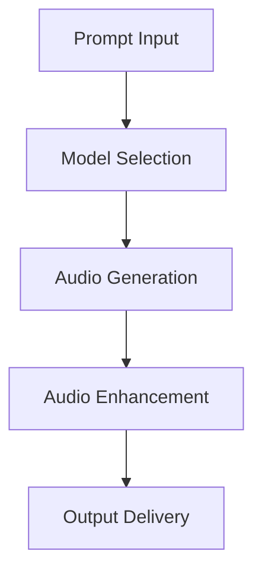

# **Audio Generator**

## **Purpose**

The Audio Generator provides advanced audio content generation and processing capabilities. It supports speech synthesis, music generation, audio enhancement, and multi-format output for a wide range of applications.

## **Core Principles**

- **Natural Sounding Output**: Generate realistic speech and music
- **Multi-Format Support**: Output in multiple audio formats
- **Audio Enhancement**: Improve audio quality and clarity
- **User-Centric Design**: Focus on user requirements and creative intent
- **Continuous Improvement**: Learn from feedback to improve output

## **Function Specifications**

### **Core Functions**

#### **generateAudio(prompt: string, options?: AudioGenOptions): Promise<AudioGenResult>**
Generates audio based on a prompt and optional parameters.

**Parameters:**
- `prompt`: Input prompt or description
- `options`: Optional generation options (voice, style, format, etc.)

**Returns:**
- `AudioGenResult`: Generated audio and metadata

**Example:**
```typescript
const result = await audioGenerator.generateAudio(
  "Read this text in a calm, professional voice.",
  { voice: "en-US-Wavenet-D", style: "calm", format: "mp3" }
);
console.log(result.audioUrl);
```

#### **enhanceAudio(audio: Buffer, options?: AudioEnhanceOptions): Promise<AudioGenResult>**
Enhances the quality of an audio file.

**Parameters:**
- `audio`: Input audio buffer
- `options`: Enhancement options (noise reduction, equalization, etc.)

**Returns:**
- `AudioGenResult`: Enhanced audio and metadata

**Example:**
```typescript
const enhanced = await audioGenerator.enhanceAudio(audioBuffer, { noiseReduction: true });
console.log(enhanced.audioUrl);
```

## **Integration Patterns**

### **Audio Generation Flow**


## **Capabilities**

- **Speech Synthesis**: Realistic text-to-speech
- **Music Generation**: AI-generated music and soundscapes
- **Audio Enhancement**: Noise reduction, equalization, effects
- **Multi-Format Output**: MP3, WAV, AAC, FLAC, etc.
- **Batch Generation**: Generate multiple audio files in parallel

## **Configuration Examples**

```yaml
audio_generator:
  default_voice: "en-US-Wavenet-D"
  format_support: ["mp3", "wav", "aac", "flac"]
  enhancement: true
  batch_generation: true
```

## **Error Handling**

- **Model Failure**: Retry with fallback model
- **Unsupported Format**: Return error with supported formats
- **Enhancement Failure**: Return error with details
- **Input Too Long**: Return error with max length info

## **Performance Considerations**

- **Generation Latency**: Optimized for < 2s
- **Batch Generation**: Support for batch audio generation
- **Resource Usage**: Efficient CPU and memory usage

## **Security Considerations**

- **Content Filtering**: Filter unsafe or inappropriate audio
- **Access Control**: Restrict access to sensitive generation features
- **Audit Logging**: Log all generation requests

## **Monitoring & Observability**

- **Generation Metrics**: Track request count, latency, and errors
- **Quality Metrics**: Track quality scores and feedback
- **Alerting**: Alerts for model failures or quality issues

---

**Version**: 1.0
**Focus**: Advanced, creative audio generation for kOS ecosystem 