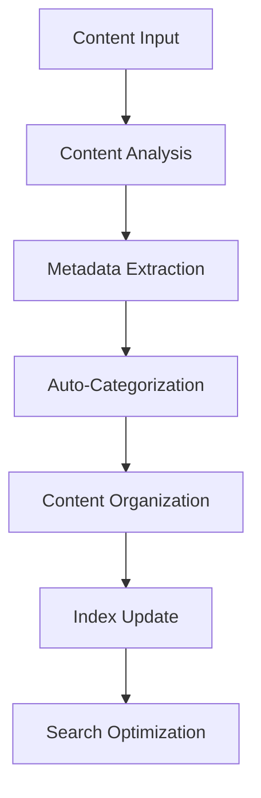

# **Content Organizer**

## **Purpose**

The Content Organizer provides intelligent content organization and categorization capabilities. It supports auto-categorization, metadata extraction, hierarchical organization, and tagging for efficient content management and discovery.

## **Core Principles**

- **Hierarchical Organization**: Organize content in logical structures
- **Auto-Categorization**: Automatically categorize content based on analysis
- **Metadata Management**: Extract and manage metadata for discovery
- **Tagging & Labeling**: Support for comprehensive tagging systems
- **Continuous Improvement**: Learn from feedback to improve organization

## **Function Specifications**

### **Core Functions**

#### **organizeContent(content: ContentItem, options?: OrganizerOptions): Promise<OrganizeResult>**
Organizes a content item using intelligent categorization and tagging.

**Parameters:**
- `content`: Content item to organize
- `options`: Optional organization options (category, tags, metadata, etc.)

**Returns:**
- `OrganizeResult`: Organization result and metadata

**Example:**
```typescript
const result = await contentOrganizer.organizeContent(
  contentItem,
  { category: "reports", tags: ["finance", "2025"] }
);
console.log(result.structure);
```

#### **extractMetadata(content: ContentItem): Promise<Metadata>**
Extracts metadata from a content item.

**Parameters:**
- `content`: Content item to extract metadata from

**Returns:**
- `Metadata`: Extracted metadata

**Example:**
```typescript
const metadata = await contentOrganizer.extractMetadata(contentItem);
console.log(metadata);
```

## **Integration Patterns**

### **Content Organization Flow**


## **Capabilities**

- **Hierarchical Structure**: Organize content in logical structures
- **Auto-Categorization**: Intelligent categorization based on content analysis
- **Tag Management**: Comprehensive tagging and labeling
- **Metadata Extraction**: Extract and manage metadata
- **Batch Organization**: Organize multiple content items in parallel

## **Configuration Examples**

```yaml
content_organizer:
  auto_categorization: true
  hierarchical_structure: true
  metadata_extraction: true
  tagging: true
  batch_organization: true
```

## **Error Handling**

- **Organization Failure**: Return error with details
- **Metadata Extraction Failure**: Return error with details
- **Invalid Content**: Return error with validation info
- **Tag Conflict**: Return error with conflict details

## **Performance Considerations**

- **Organization Latency**: Optimized for < 1s
- **Batch Organization**: Support for batch content organization
- **Resource Usage**: Efficient CPU and memory usage

## **Security Considerations**

- **Access Control**: Restrict access to organization features
- **Audit Logging**: Log all organization actions
- **Metadata Privacy**: Protect sensitive metadata

## **Monitoring & Observability**

- **Organization Metrics**: Track request count, latency, and errors
- **Metadata Metrics**: Track metadata extraction and quality
- **Alerting**: Alerts for organization failures or quality issues

---

**Version**: 1.0
**Focus**: Intelligent, automated content organization for kOS ecosystem 