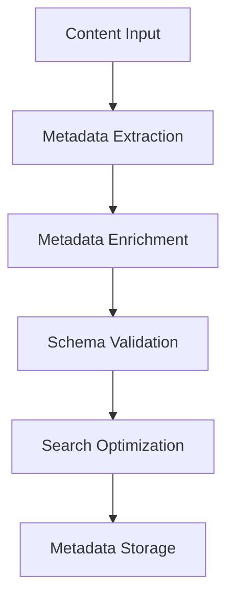

# **Content Metadata Manager**

## **Purpose**

The Content Metadata Manager provides comprehensive metadata management and enrichment for all content types. It supports metadata extraction, tagging, search optimization, schema management, and validation for efficient content discovery and organization.

## **Core Principles**

- **Metadata Extraction**: Automatically extract metadata from content
- **Tagging & Enrichment**: Enhance metadata with additional information
- **Search Optimization**: Optimize metadata for efficient search
- **Schema Management**: Manage metadata schemas and standards
- **Validation**: Validate metadata quality and completeness

## **Function Specifications**

### **Core Functions**

#### **extractMetadata(content: ContentItem): Promise<Metadata>**
Extracts metadata from a content item.

**Parameters:**
- `content`: Content item to extract metadata from

**Returns:**
- `Metadata`: Extracted metadata

**Example:**
```typescript
const metadata = await contentMetadataManager.extractMetadata(contentItem);
console.log(metadata);
```

#### **enrichMetadata(contentId: string, enrichment: MetadataEnrichment): Promise<Metadata>**
Enriches metadata for a content item.

**Parameters:**
- `contentId`: Content identifier
- `enrichment`: Additional metadata to add

**Returns:**
- `Metadata`: Enriched metadata

**Example:**
```typescript
const enriched = await contentMetadataManager.enrichMetadata("content123", { tags: ["finance", "2025"] });
console.log(enriched);
```

#### **validateMetadata(metadata: Metadata): Promise<ValidationResult>**
Validates the quality and completeness of metadata.

**Parameters:**
- `metadata`: Metadata to validate

**Returns:**
- `ValidationResult`: Validation result and suggestions

**Example:**
```typescript
const result = await contentMetadataManager.validateMetadata(metadata);
console.log(result.isValid);
```

## **Integration Patterns**

### **Metadata Management Flow**


## **Capabilities**

- **Metadata Extraction**: Extract and manage metadata
- **Tagging & Enrichment**: Add tags and enrich metadata
- **Search Optimization**: Optimize for efficient search
- **Schema Management**: Manage metadata schemas
- **Validation**: Validate metadata quality

## **Configuration Examples**

```yaml
content_metadata_manager:
  extraction: true
  enrichment: true
  search_optimization: true
  schema_management: true
  validation: true
```

## **Error Handling**

- **Extraction Failure**: Return error with details
- **Enrichment Failure**: Return error with details
- **Validation Failure**: Return error with suggestions
- **Schema Conflict**: Return error with conflict details

## **Performance Considerations**

- **Extraction Latency**: Optimized for < 1s
- **Batch Extraction**: Support for batch metadata extraction
- **Resource Usage**: Efficient CPU and memory usage

## **Security Considerations**

- **Access Control**: Restrict access to metadata management features
- **Audit Logging**: Log all metadata actions
- **Metadata Privacy**: Protect sensitive metadata

## **Monitoring & Observability**

- **Extraction Metrics**: Track request count, latency, and errors
- **Validation Metrics**: Track validation results and quality
- **Alerting**: Alerts for extraction or validation failures

---

**Version**: 1.0
**Focus**: Comprehensive, optimized metadata management for kOS ecosystem 