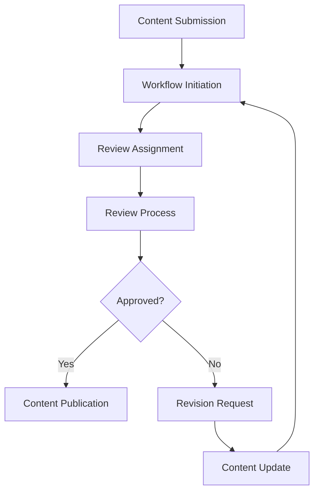

# **Content Workflow Manager**

## **Purpose**

The Content Workflow Manager provides workflow automation and approval process management for content. It supports workflow automation, approval routing, status tracking, and integration with business processes for efficient content lifecycle management.

## **Core Principles**

- **Process Automation**: Automate content workflow processes
- **Approval Routing**: Route content through approval workflows
- **Status Tracking**: Track content status throughout workflows
- **Notification System**: Notify stakeholders of workflow events
- **Integration**: Integrate with external workflow systems

## **Function Specifications**

### **Core Functions**

#### **initiateWorkflow(contentId: string, workflowType: string): Promise<WorkflowResult>**
Initiates a workflow for a content item.

**Parameters:**
- `contentId`: Content identifier
- `workflowType`: Type of workflow to initiate

**Returns:**
- `WorkflowResult`: Workflow initiation result and metadata

**Example:**
```typescript
const workflow = await contentWorkflowManager.initiateWorkflow("content123", "approval");
console.log(workflow.status);
```

#### **routeForApproval(contentId: string, approvers: string[]): Promise<ApprovalResult>**
Routes content for approval to specified approvers.

**Parameters:**
- `contentId`: Content identifier
- `approvers`: List of approver user IDs

**Returns:**
- `ApprovalResult`: Approval routing result and metadata

**Example:**
```typescript
const approval = await contentWorkflowManager.routeForApproval("content123", ["userA", "userB"]);
console.log(approval.status);
```

#### **trackStatus(contentId: string): Promise<StatusResult>**
Tracks the status of a content item in the workflow.

**Parameters:**
- `contentId`: Content identifier

**Returns:**
- `StatusResult`: Current status and metadata

**Example:**
```typescript
const status = await contentWorkflowManager.trackStatus("content123");
console.log(status.currentStatus);
```

## **Integration Patterns**

### **Workflow Management Flow**


## **Capabilities**

- **Process Automation**: Automate content workflows
- **Approval Routing**: Route content for approval
- **Status Tracking**: Track workflow status
- **Notification System**: Notify stakeholders
- **Integration**: Integrate with external workflow systems

## **Configuration Examples**

```yaml
content_workflow_manager:
  process_automation: true
  approval_routing: true
  status_tracking: true
  notification_system: true
  integration: true
```

## **Error Handling**

- **Workflow Initiation Failure**: Return error with details
- **Approval Routing Failure**: Return error with details
- **Status Tracking Failure**: Return error with details
- **Integration Failure**: Return error with details

## **Performance Considerations**

- **Workflow Latency**: Optimized for < 2s
- **Batch Workflow**: Support for batch workflow initiation
- **Resource Usage**: Efficient CPU and memory usage

## **Security Considerations**

- **Access Control**: Restrict access to workflow management features
- **Audit Logging**: Log all workflow actions
- **Workflow Privacy**: Protect sensitive workflow data

## **Monitoring & Observability**

- **Workflow Metrics**: Track request count, latency, and errors
- **Approval Metrics**: Track approval routing and status
- **Alerting**: Alerts for workflow or approval failures

---

**Version**: 1.0
**Focus**: Automated, integrated content workflow management for kOS ecosystem 