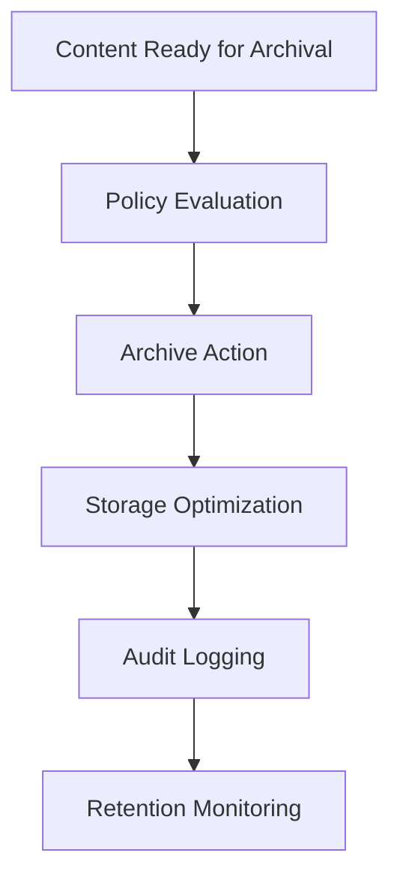

# **Content Archive Manager**

## **Purpose**

The Content Archive Manager provides content archival and retention management capabilities. It supports archival policies, retention management, storage optimization, and secure long-term storage for all content types.

## **Core Principles**

- **Archival Policies**: Define and enforce content archival policies
- **Retention Management**: Manage content retention periods and compliance
- **Storage Optimization**: Optimize storage for archived content
- **Secure Storage**: Ensure secure, tamper-proof storage of archived content
- **Audit Trails**: Maintain audit logs for all archival actions

## **Function Specifications**

### **Core Functions**

#### **archiveContent(contentId: string, options?: ArchiveOptions): Promise<ArchiveResult>**
Archives a content item according to defined policies.

**Parameters:**
- `contentId`: Content identifier to archive
- `options`: Optional archival options (retention, storage class, etc.)

**Returns:**
- `ArchiveResult`: Archival result and metadata

**Example:**
```typescript
const result = await contentArchiveManager.archiveContent("content123", { retention: "5y" });
console.log(result.status);
```

#### **restoreContent(contentId: string): Promise<RestoreResult>**
Restores archived content to active status.

**Parameters:**
- `contentId`: Content identifier to restore

**Returns:**
- `RestoreResult`: Restore result and metadata

**Example:**
```typescript
const restore = await contentArchiveManager.restoreContent("content123");
console.log(restore.status);
```

#### **purgeContent(contentId: string): Promise<PurgeResult>**
Permanently deletes archived content after retention period.

**Parameters:**
- `contentId`: Content identifier to purge

**Returns:**
- `PurgeResult`: Purge result and metadata

**Example:**
```typescript
const purge = await contentArchiveManager.purgeContent("content123");
console.log(purge.status);
```

## **Integration Patterns**

### **Archival Management Flow**


## **Capabilities**

- **Archival Policies**: Define and enforce policies
- **Retention Management**: Manage retention and compliance
- **Storage Optimization**: Optimize storage for cost and performance
- **Secure Storage**: Tamper-proof, encrypted storage
- **Audit Trails**: Maintain logs for all actions

## **Configuration Examples**

```yaml
content_archive_manager:
  archival_policies: true
  retention_management: true
  storage_optimization: true
  secure_storage: true
  audit_logging: true
```

## **Error Handling**

- **Archival Failure**: Return error with details
- **Restore Failure**: Return error with details
- **Purge Failure**: Return error with details
- **Policy Violation**: Return error with policy info

## **Performance Considerations**

- **Archival Latency**: Optimized for < 2s
- **Batch Archival**: Support for batch content archival
- **Resource Usage**: Efficient storage and retrieval

## **Security Considerations**

- **Access Control**: Restrict access to archival features
- **Audit Logging**: Log all archival actions
- **Data Privacy**: Protect sensitive archived content

## **Monitoring & Observability**

- **Archival Metrics**: Track request count, latency, and errors
- **Retention Metrics**: Track retention and compliance
- **Alerting**: Alerts for archival or retention failures

---

**Version**: 1.0
**Focus**: Secure, policy-driven content archival for kOS ecosystem 