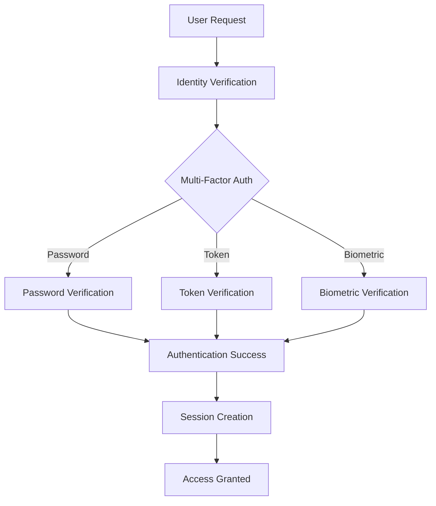
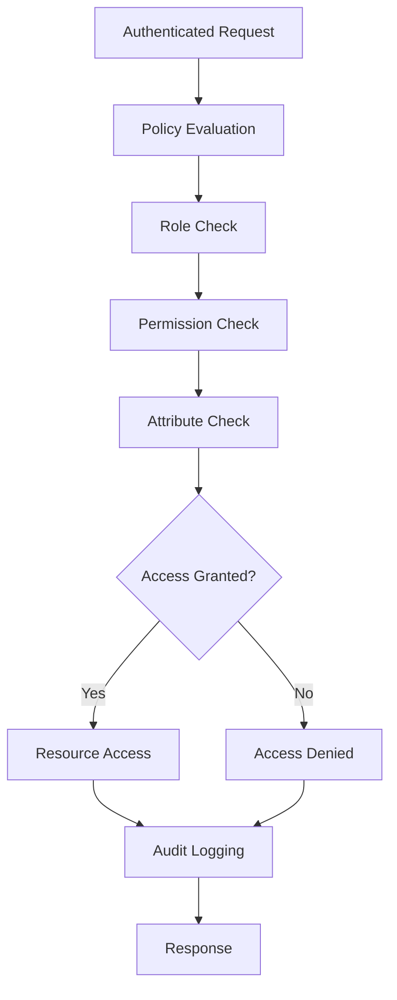
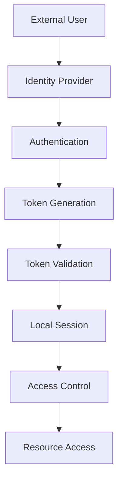

# **Authentication & Authorization Index**

## **Purpose**

This subcategory provides comprehensive authentication and authorization capabilities for the kOS ecosystem. It handles user and system authentication, access control, identity management, and authorization policies with enterprise-grade security standards and compliance frameworks.

## **Core Principles**

### **Identity Management**
- **Single Source of Truth**: Centralized identity management with consistent user data
- **Multi-Factor Authentication**: Multiple authentication factors for enhanced security
- **Identity Federation**: Support for federated identity providers and SSO
- **Identity Lifecycle**: Complete user lifecycle management from creation to deletion

### **Access Control**
- **Role-Based Access Control (RBAC)**: Granular access control based on user roles
- **Attribute-Based Access Control (ABAC)**: Dynamic access control based on attributes
- **Principle of Least Privilege**: Grant minimum necessary permissions
- **Just-In-Time Access**: Temporary elevated access for specific tasks

### **Security Standards**
- **Zero Trust Architecture**: Never trust, always verify every access request
- **Continuous Authentication**: Ongoing verification of user identity
- **Session Management**: Secure session handling with automatic timeout
- **Audit Trail**: Complete audit trail for all authentication and authorization events

## **Function Specifications**

### **Authentication Functions**
1. **[User Authentication](01_User_Authentication.md)** - Multi-factor user authentication with support for various authentication methods
2. **[System Authentication](02_System_Authentication.md)** - System-to-system authentication with certificate-based verification
3. **[Identity Provider](03_Identity_Provider.md)** - Centralized identity provider with federation support
4. **[Session Manager](04_Session_Manager.md)** - Secure session management with automatic timeout and renewal

### **Authorization Functions**
5. **[Access Control Manager](05_Access_Control_Manager.md)** - Centralized access control with RBAC and ABAC support
6. **[Policy Engine](06_Policy_Engine.md)** - Dynamic policy evaluation and enforcement
7. **[Permission Manager](07_Permission_Manager.md)** - Granular permission management and assignment
8. **[Authorization Auditor](08_Authorization_Auditor.md)** - Authorization audit logging and compliance reporting

## **Integration Patterns**

### **Authentication Flow**


### **Authorization Flow**


### **Identity Federation Flow**


## **Authentication Capabilities**

### **Multi-Factor Authentication**
- **Password Authentication**: Secure password-based authentication with policy enforcement
- **Token Authentication**: Time-based one-time password (TOTP) and hardware tokens
- **Biometric Authentication**: Fingerprint, facial recognition, and voice authentication
- **Certificate Authentication**: X.509 certificate-based authentication
- **Social Authentication**: OAuth 2.0 and OpenID Connect integration

### **Identity Management**
- **User Provisioning**: Automated user account creation and management
- **Identity Federation**: SAML 2.0 and OpenID Connect federation
- **Single Sign-On (SSO)**: Seamless authentication across multiple systems
- **Identity Synchronization**: Synchronization with external identity systems
- **Identity Governance**: Identity lifecycle management and compliance

### **Session Management**
- **Session Creation**: Secure session establishment with unique identifiers
- **Session Validation**: Continuous session validation and integrity checking
- **Session Timeout**: Automatic session timeout with configurable policies
- **Session Renewal**: Secure session renewal without re-authentication
- **Session Termination**: Secure session termination and cleanup

## **Authorization Capabilities**

### **Access Control Models**
- **Role-Based Access Control (RBAC)**: Access control based on user roles and responsibilities
- **Attribute-Based Access Control (ABAC)**: Dynamic access control based on user attributes
- **Policy-Based Access Control (PBAC)**: Rule-based access control with complex policies
- **Hierarchical Access Control**: Nested access control with inheritance
- **Time-Based Access Control**: Access control with temporal constraints

### **Policy Management**
- **Policy Creation**: Dynamic policy creation and management
- **Policy Evaluation**: Real-time policy evaluation and decision making
- **Policy Enforcement**: Automated policy enforcement and access control
- **Policy Auditing**: Policy compliance auditing and reporting
- **Policy Optimization**: Policy performance optimization and caching

### **Permission Management**
- **Permission Assignment**: Granular permission assignment to users and roles
- **Permission Inheritance**: Permission inheritance through role hierarchies
- **Permission Delegation**: Temporary permission delegation for specific tasks
- **Permission Auditing**: Permission audit logging and compliance reporting
- **Permission Optimization**: Permission optimization and cleanup

## **Configuration Examples**

### **Authentication Configuration**
```yaml
authentication:
  multi_factor:
    enabled: true
    methods:
      - password
      - totp
      - biometric
      - certificate
    required_factors: 2
  password_policy:
    min_length: 12
    require_special_chars: true
    require_numbers: true
    require_uppercase: true
    require_lowercase: true
    max_age: "90d"
    history_count: 5
  session_management:
    timeout: "8h"
    renewal_threshold: "1h"
    max_concurrent_sessions: 3
    secure_cookies: true
  identity_federation:
    saml2:
      enabled: true
      metadata_url: "https://idp.example.com/metadata"
    oidc:
      enabled: true
      issuer: "https://idp.example.com"
      client_id: "kOS-client"
```

### **Authorization Configuration**
```yaml
authorization:
  access_control:
    rbac:
      enabled: true
      role_hierarchy: true
      permission_inheritance: true
    abac:
      enabled: true
      attribute_sources:
        - user_profile
        - system_context
        - environmental
  policy_engine:
    evaluation_mode: "realtime"
    caching_enabled: true
    cache_ttl: "5m"
    optimization_enabled: true
  permission_management:
    granular_permissions: true
    delegation_enabled: true
    audit_logging: true
    compliance_reporting: true
```

### **Identity Management Configuration**
```yaml
identity_management:
  user_provisioning:
    automated: true
    approval_workflow: true
    role_assignment: true
  identity_federation:
    saml2:
      enabled: true
      metadata_refresh: "24h"
      certificate_validation: true
    oidc:
      enabled: true
      token_validation: true
      user_info_endpoint: true
  identity_synchronization:
    enabled: true
    sync_interval: "1h"
    conflict_resolution: "local_wins"
  identity_governance:
    lifecycle_management: true
    compliance_monitoring: true
    audit_reporting: true
```

## **Error Handling**

### **Authentication Errors**
- **Invalid Credentials**: Secure error handling without information disclosure
- **Account Lockout**: Automatic account lockout with configurable thresholds
- **Session Expiration**: Graceful session expiration with re-authentication
- **Multi-Factor Failures**: Fallback authentication methods and recovery procedures
- **Identity Provider Errors**: Offline authentication and local fallback

### **Authorization Errors**
- **Access Denied**: Detailed access denial logging with reason codes
- **Policy Evaluation Failures**: Default deny with audit logging
- **Permission Conflicts**: Conflict resolution with administrator notification
- **Session Validation Failures**: Automatic session termination and re-authentication
- **Policy Enforcement Errors**: Graceful degradation with security alerts

### **Identity Management Errors**
- **Provisioning Failures**: Retry mechanisms with administrator notification
- **Synchronization Errors**: Conflict resolution and data consistency checks
- **Federation Failures**: Local authentication fallback and error recovery
- **Lifecycle Management Errors**: Manual intervention with audit trail
- **Compliance Violations**: Automatic reporting and remediation procedures

## **Performance Considerations**

### **Authentication Performance**
- **Password Verification**: Optimized password hashing with hardware acceleration
- **Token Validation**: Cached token validation with minimal latency
- **Session Management**: Efficient session storage with distributed caching
- **Multi-Factor Processing**: Parallel factor verification for reduced latency
- **Identity Federation**: Optimized federation with connection pooling

### **Authorization Performance**
- **Policy Evaluation**: Cached policy evaluation with intelligent invalidation
- **Permission Checking**: Optimized permission lookups with indexing
- **Access Control**: Efficient access control with decision caching
- **Role Resolution**: Fast role resolution with hierarchical caching
- **Attribute Evaluation**: Optimized attribute evaluation with lazy loading

### **Identity Management Performance**
- **User Provisioning**: Asynchronous provisioning with background processing
- **Identity Synchronization**: Incremental synchronization with change detection
- **Federation Processing**: Optimized federation with connection pooling
- **Audit Logging**: Asynchronous audit logging with minimal impact
- **Compliance Reporting**: Scheduled reporting with data aggregation

## **Monitoring & Observability**

### **Authentication Metrics**
- **Authentication Success Rate**: Track successful authentication attempts
- **Multi-Factor Usage**: Monitor multi-factor authentication adoption
- **Session Metrics**: Track session creation, renewal, and termination
- **Identity Provider Performance**: Monitor external identity provider performance
- **Authentication Latency**: Track authentication response times

### **Authorization Metrics**
- **Access Control Decisions**: Track access granted/denied decisions
- **Policy Evaluation Performance**: Monitor policy evaluation times
- **Permission Usage**: Track permission usage and effectiveness
- **Role Distribution**: Monitor role assignment and usage patterns
- **Authorization Latency**: Track authorization response times

### **Identity Management Metrics**
- **User Provisioning Rate**: Track user account creation and management
- **Identity Synchronization**: Monitor synchronization success and performance
- **Federation Performance**: Track federation processing and performance
- **Compliance Status**: Monitor compliance with identity policies
- **Audit Log Completeness**: Track audit log completeness and quality

### **Alerting**
- **Authentication Alerts**: Alerts for failed authentication attempts and suspicious activity
- **Authorization Alerts**: Alerts for access violations and policy violations
- **Identity Management Alerts**: Alerts for provisioning failures and synchronization issues
- **Performance Alerts**: Alerts for performance degradation and system issues
- **Compliance Alerts**: Alerts for compliance violations and audit failures

## **Security Considerations**

### **Authentication Security**
- **Credential Protection**: Secure storage and transmission of credentials
- **Brute Force Protection**: Protection against brute force attacks
- **Session Security**: Secure session handling with encryption and validation
- **Multi-Factor Security**: Secure multi-factor authentication implementation
- **Identity Provider Security**: Secure integration with external identity providers

### **Authorization Security**
- **Access Control Security**: Secure access control implementation and enforcement
- **Policy Security**: Secure policy management and evaluation
- **Permission Security**: Secure permission management and assignment
- **Session Security**: Secure session validation and authorization
- **Audit Security**: Secure audit logging and compliance reporting

### **Identity Management Security**
- **Data Protection**: Protection of identity data and personal information
- **Provisioning Security**: Secure user provisioning and account management
- **Synchronization Security**: Secure identity synchronization and data consistency
- **Federation Security**: Secure identity federation and trust relationships
- **Compliance Security**: Secure compliance monitoring and reporting

---

**Version**: 1.0  
**Focus**: Comprehensive authentication and authorization capabilities for kOS ecosystem 