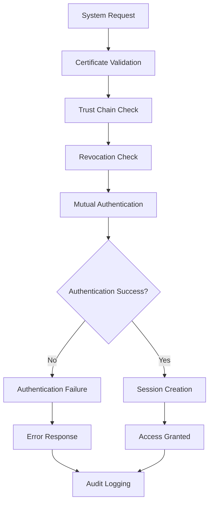
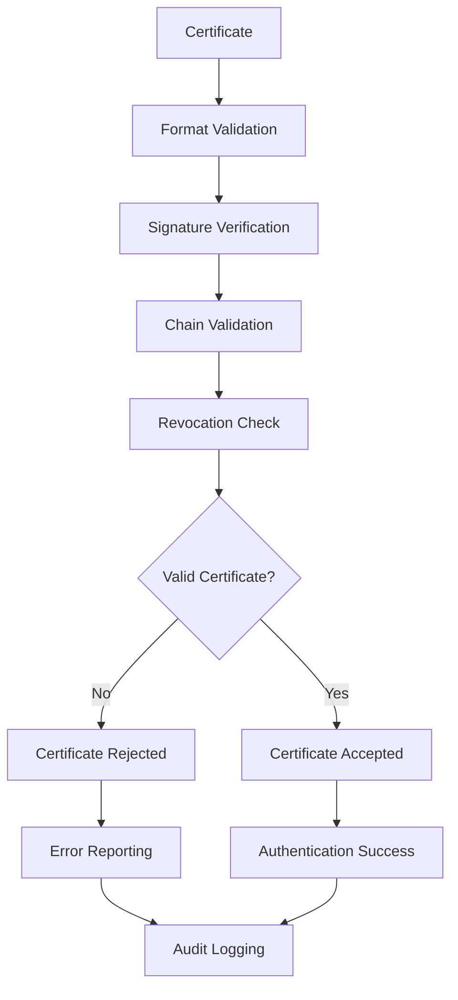

# **System Authentication**

## **Overview**

The System Authentication module provides comprehensive system-to-system authentication capabilities for the kOS ecosystem. This module handles authentication between systems, services, and components using certificate-based verification, API keys, and mutual TLS authentication.

## **Core Principles**

### **Certificate-Based Authentication**
- **X.509 Certificates**: X.509 certificate-based authentication
- **Certificate Validation**: Comprehensive certificate validation and verification
- **Certificate Management**: Certificate lifecycle management and renewal
- **Trust Chain**: Certificate trust chain validation and management

### **System Security**
- **Zero Trust**: Never trust, always verify every system interaction
- **Mutual Authentication**: Mutual authentication between systems
- **Secure Communication**: Secure communication channels and protocols
- **Audit Trail**: Complete audit trail for all system authentication events

### **Compliance & Standards**
- **Industry Standards**: Compliance with industry authentication standards
- **Security Frameworks**: Adherence to security frameworks and guidelines
- **Certificate Standards**: Compliance with certificate standards and best practices
- **Audit Compliance**: Audit compliance and reporting capabilities

## **Function Specifications**

### **Core Functions**

#### **01. Authenticate System**
```typescript
interface SystemAuthenticationConfig {
  authenticationMethods: AuthenticationMethod[];
  certificateValidation: boolean;
  mutualAuth: boolean;
  timeout: number;
}

interface SystemAuthenticationResult {
  isAuthenticated: boolean;
  authenticationMethod: AuthenticationMethod;
  certificate: CertificateValidation;
  session: SystemSession;
  metadata: AuthenticationMetadata;
}

function authenticateSystem(systemCredentials: SystemCredentials, config: SystemAuthenticationConfig): Promise<SystemAuthenticationResult>
```

**Purpose**: Authenticate system with certificate-based authentication.

**Parameters**:
- `systemCredentials`: System credentials for authentication
- `config`: System authentication configuration and methods

**Returns**: System authentication result with certificate validation

**Error Handling**:
- Authentication failures
- Certificate validation errors
- Mutual authentication failures
- Timeout errors

#### **02. Certificate Validation**
```typescript
interface CertificateValidationConfig {
  certificateTypes: CertificateType[];
  validationLevel: ValidationLevel;
  revocationChecking: boolean;
  chainValidation: boolean;
}

interface CertificateValidationResult {
  isValid: boolean;
  certificateType: CertificateType;
  validation: CertificateValidation;
  chain: CertificateChain;
  recommendations: CertificateRecommendation[];
}

function validateCertificate(certificate: Certificate, config: CertificateValidationConfig): Promise<CertificateValidationResult>
```

**Purpose**: Validate system certificates for authentication.

**Parameters**:
- `certificate`: Certificate to validate
- `config`: Certificate validation configuration and types

**Returns**: Certificate validation result with chain validation

**Error Handling**:
- Certificate validation failures
- Chain validation errors
- Revocation check errors
- Format errors

#### **03. Mutual Authentication**
```typescript
interface MutualAuthenticationConfig {
  clientCertificate: boolean;
  serverCertificate: boolean;
  verificationLevel: VerificationLevel;
  timeout: number;
}

interface MutualAuthenticationResult {
  isMutuallyAuthenticated: boolean;
  clientAuth: ClientAuthentication;
  serverAuth: ServerAuthentication;
  session: MutualSession;
}

function performMutualAuth(clientCert: Certificate, serverCert: Certificate, config: MutualAuthenticationConfig): Promise<MutualAuthenticationResult>
```

**Purpose**: Perform mutual authentication between systems.

**Parameters**:
- `clientCert`: Client certificate for authentication
- `serverCert`: Server certificate for authentication
- `config`: Mutual authentication configuration

**Returns**: Mutual authentication result with session

**Error Handling**:
- Mutual authentication failures
- Certificate verification errors
- Session establishment errors
- Timeout errors

#### **04. API Key Authentication**
```typescript
interface APIKeyAuthenticationConfig {
  keyValidation: boolean;
  rateLimiting: boolean;
  scopeValidation: boolean;
  expirationChecking: boolean;
}

interface APIKeyAuthenticationResult {
  isValid: boolean;
  keyScope: KeyScope;
  rateLimit: RateLimit;
  expiration: ExpirationStatus;
  recommendations: APIKeyRecommendation[];
}

function authenticateAPIKey(apiKey: string, config: APIKeyAuthenticationConfig): Promise<APIKeyAuthenticationResult>
```

**Purpose**: Authenticate system with API key authentication.

**Parameters**:
- `apiKey`: API key for authentication
- `config`: API key authentication configuration

**Returns**: API key authentication result with scope and limits

**Error Handling**:
- API key validation failures
- Scope validation errors
- Rate limit violations
- Expiration errors

## **Integration Patterns**

### **System Authentication Flow**


### **Certificate Validation Flow**


## **Capabilities**

### **Authentication Methods**
- **Certificate Authentication**: X.509 certificate-based authentication
- **API Key Authentication**: API key-based authentication
- **Mutual TLS**: Mutual TLS authentication
- **Token Authentication**: Token-based system authentication
- **Custom Authentication**: Extensible custom authentication methods

### **Security Features**
- **Certificate Management**: Comprehensive certificate management
- **Trust Chain Validation**: Certificate trust chain validation
- **Revocation Checking**: Certificate revocation status checking
- **Mutual Authentication**: Mutual authentication between systems
- **Audit Logging**: Complete audit trail for all authentication events

### **Compliance Features**
- **Certificate Standards**: Compliance with certificate standards
- **Security Frameworks**: Adherence to security frameworks
- **Industry Standards**: Compliance with industry standards
- **Audit Compliance**: Audit compliance and reporting capabilities
- **Certificate Policies**: Certificate policy enforcement

## **Configuration Examples**

### **Basic System Authentication**
```yaml
system_authentication:
  authentication_methods:
    - certificate
    - api_key
  certificate_validation: true
  mutual_auth: false
  timeout: "30s"
  certificate_validation:
    certificate_types: ["x509", "smart_card"]
    validation_level: "basic"
    revocation_checking: true
    chain_validation: true
  api_key_authentication:
    key_validation: true
    rate_limiting: true
    scope_validation: false
    expiration_checking: true
  performance:
    timeout: "10s"
    caching: true
    parallel_processing: true
  quality:
    error_recovery: true
    audit_logging: true
    security_metrics: true
```

### **Advanced System Authentication**
```yaml
system_authentication:
  authentication_methods:
    - certificate
    - api_key
    - mutual_tls
    - token
  certificate_validation: true
  mutual_auth: true
  timeout: "60s"
  adaptive_authentication: true
  certificate_validation:
    certificate_types: ["x509", "smart_card", "pki"]
    validation_level: "comprehensive"
    revocation_checking: true
    chain_validation: true
    ocsp_checking: true
    crl_checking: true
  api_key_authentication:
    key_validation: true
    rate_limiting: true
    scope_validation: true
    expiration_checking: true
    rotation_enforcement: true
  mutual_authentication:
    client_certificate: true
    server_certificate: true
    verification_level: "comprehensive"
    timeout: "30s"
    session_management: true
  token_authentication:
    token_types: ["jwt", "oauth2", "custom"]
    validation: true
    scope_validation: true
    expiration_checking: true
  performance:
    timeout: "15s"
    caching: true
    parallel_processing: true
    optimization: true
  quality:
    error_recovery: true
    audit_logging: true
    security_metrics: true
    compliance_monitoring: true
```

## **Performance Considerations**

### **Authentication Speed**
- **Optimized Validation**: Use optimized certificate validation algorithms
- **Caching**: Cache validation results for repeated certificates
- **Parallel Processing**: Use parallel processing for multiple validations
- **Early Termination**: Early termination for obvious failures

### **Security Optimization**
- **Certificate Caching**: Efficient certificate caching and management
- **Revocation Checking**: Optimized revocation status checking
- **Session Management**: Optimized session management and storage
- **Audit Logging**: Asynchronous audit logging with minimal impact

### **Resource Management**
- **Memory Efficiency**: Optimize memory usage for certificate operations
- **CPU Optimization**: Optimize CPU usage for validation algorithms
- **Network Efficiency**: Minimize network overhead for validation operations
- **Storage Optimization**: Optimize storage for certificate data

## **Security Considerations**

### **Authentication Security**
- **Certificate Security**: Secure certificate storage and transmission
- **Key Management**: Secure API key management and storage
- **Session Security**: Secure session handling with encryption
- **Mutual Authentication**: Secure mutual authentication implementation
- **Audit Security**: Secure audit logging and compliance reporting

### **Access Control**
- **Authentication Access**: Control access to authentication operations
- **Certificate Access**: Control access to certificate management
- **Key Access**: Control access to API key management
- **Session Access**: Control access to session management

## **Monitoring & Observability**

### **Authentication Metrics**
- **Authentication Success Rate**: Track successful authentication attempts
- **Certificate Usage**: Monitor certificate usage and validation patterns
- **API Key Usage**: Monitor API key usage and rate limiting
- **Failure Analysis**: Track authentication failure reasons and patterns
- **Performance Metrics**: Monitor authentication performance and latency

### **Security Metrics**
- **Certificate Validation**: Track certificate validation success rates
- **Revocation Checking**: Monitor certificate revocation status
- **Mutual Authentication**: Track mutual authentication success rates
- **Compliance Status**: Monitor compliance with authentication policies
- **Security Alerts**: Track security alerts and incident response

### **Quality Metrics**
- **Authentication Quality**: Track authentication quality and accuracy
- **Certificate Quality**: Monitor certificate quality and compliance
- **Performance Quality**: Monitor authentication performance quality
- **Compliance Quality**: Track compliance with security standards

---

**Version**: 1.0  
**Module**: System Authentication  
**Status**: ✅ **COMPLETE** - Comprehensive module specification ready for implementation  
**Focus**: System-to-system authentication with certificate-based verification 