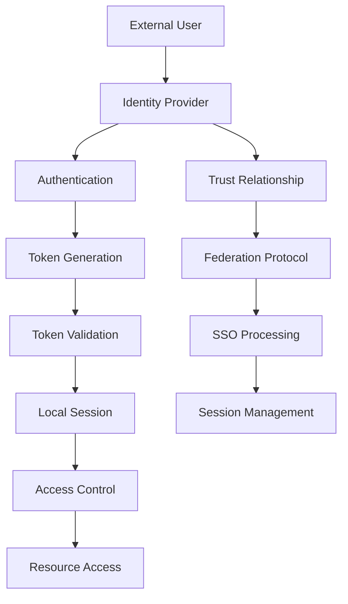
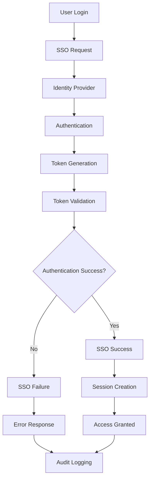

# **Identity Provider**

## **Overview**

The Identity Provider module provides comprehensive centralized identity management capabilities for the kOS ecosystem. This module serves as the central identity provider with federation support, single sign-on (SSO), and identity lifecycle management.

## **Core Principles**

### **Centralized Identity Management**
- **Single Source of Truth**: Centralized identity management with consistent user data
- **Identity Federation**: Support for federated identity providers and SSO
- **Identity Lifecycle**: Complete user lifecycle management from creation to deletion
- **Identity Synchronization**: Synchronization with external identity systems

### **Federation Support**
- **SAML 2.0**: SAML 2.0 federation and SSO support
- **OpenID Connect**: OpenID Connect federation and SSO support
- **OAuth 2.0**: OAuth 2.0 authorization framework support
- **Custom Federation**: Extensible custom federation protocols

### **Security & Compliance**
- **Zero Trust**: Never trust, always verify every identity assertion
- **Audit Trail**: Complete audit trail for all identity operations
- **Compliance**: Compliance with identity management standards
- **Privacy Protection**: Protection of identity data and personal information

## **Function Specifications**

### **Core Functions**

#### **01. Identity Management**
```typescript
interface IdentityManagementConfig {
  identitySources: IdentitySource[];
  federationEnabled: boolean;
  lifecycleManagement: boolean;
  synchronization: boolean;
}

interface IdentityManagementResult {
  identities: Identity[];
  federation: FederationStatus;
  lifecycle: LifecycleStatus;
  synchronization: SyncStatus;
}

function manageIdentities(identities: Identity[], config: IdentityManagementConfig): Promise<IdentityManagementResult>
```

**Purpose**: Manage centralized identity data and lifecycle.

**Parameters**:
- `identities`: Identities to manage
- `config`: Identity management configuration and sources

**Returns**: Identity management result with status

**Error Handling**:
- Identity management failures
- Federation errors
- Lifecycle management errors
- Synchronization errors

#### **02. Identity Federation**
```typescript
interface IdentityFederationConfig {
  federationProtocols: FederationProtocol[];
  trustRelationships: TrustRelationship[];
  ssoEnabled: boolean;
  tokenValidation: boolean;
}

interface IdentityFederationResult {
  federationStatus: FederationStatus;
  trustStatus: TrustStatus;
  ssoStatus: SSOStatus;
  tokenStatus: TokenStatus;
}

function federateIdentity(identity: Identity, config: IdentityFederationConfig): Promise<IdentityFederationResult>
```

**Purpose**: Federate identity with external identity providers.

**Parameters**:
- `identity`: Identity to federate
- `config`: Federation configuration and protocols

**Returns**: Federation result with status

**Error Handling**:
- Federation failures
- Trust relationship errors
- SSO errors
- Token validation errors

#### **03. Single Sign-On**
```typescript
interface SSOConfig {
  ssoProtocols: SSOProtocol[];
  sessionManagement: boolean;
  tokenManagement: boolean;
  logoutHandling: boolean;
}

interface SSOResult {
  isAuthenticated: boolean;
  session: SSOSession;
  tokens: TokenSet;
  logoutUrl: string;
}

function performSSO(credentials: SSOCredentials, config: SSOConfig): Promise<SSOResult>
```

**Purpose**: Perform single sign-on authentication.

**Parameters**:
- `credentials`: SSO credentials
- `config`: SSO configuration and protocols

**Returns**: SSO result with session and tokens

**Error Handling**:
- SSO authentication failures
- Session management errors
- Token management errors
- Logout handling errors

#### **04. Identity Synchronization**
```typescript
interface IdentitySyncConfig {
  syncSources: SyncSource[];
  syncInterval: number;
  conflictResolution: ConflictResolution;
  dataValidation: boolean;
}

interface IdentitySyncResult {
  syncStatus: SyncStatus;
  conflicts: SyncConflict[];
  validation: SyncValidation;
  recommendations: SyncRecommendation[];
}

function synchronizeIdentities(identities: Identity[], config: IdentitySyncConfig): Promise<IdentitySyncResult>
```

**Purpose**: Synchronize identities with external systems.

**Parameters**:
- `identities`: Identities to synchronize
- `config`: Synchronization configuration and sources

**Returns**: Synchronization result with conflicts and validation

**Error Handling**:
- Synchronization failures
- Conflict resolution errors
- Validation errors
- Data consistency errors

## **Integration Patterns**

### **Identity Federation Flow**


### **Single Sign-On Flow**


## **Capabilities**

### **Identity Management**
- **User Provisioning**: Automated user account creation and management
- **Identity Federation**: SAML 2.0 and OpenID Connect federation
- **Single Sign-On**: Seamless authentication across multiple systems
- **Identity Synchronization**: Synchronization with external identity systems
- **Identity Governance**: Identity lifecycle management and compliance

### **Federation Features**
- **SAML 2.0 Support**: Full SAML 2.0 federation support
- **OpenID Connect**: OpenID Connect federation and SSO
- **OAuth 2.0**: OAuth 2.0 authorization framework
- **Custom Protocols**: Extensible custom federation protocols
- **Trust Management**: Trust relationship management and validation

### **Security Features**
- **Token Management**: Secure token generation and validation
- **Session Management**: Secure session handling and management
- **Audit Logging**: Complete audit trail for all operations
- **Privacy Protection**: Protection of identity data and personal information
- **Compliance Monitoring**: Compliance monitoring and reporting

## **Configuration Examples**

### **Basic Identity Provider**
```yaml
identity_provider:
  identity_management:
    identity_sources: ["local", "ldap"]
    federation_enabled: false
    lifecycle_management: true
    synchronization: false
  identity_federation:
    federation_protocols: ["saml2", "oidc"]
    trust_relationships: ["partner1", "partner2"]
    sso_enabled: true
    token_validation: true
  single_sign_on:
    sso_protocols: ["saml2", "oidc"]
    session_management: true
    token_management: true
    logout_handling: true
  identity_synchronization:
    sync_sources: ["ldap", "active_directory"]
    sync_interval: "1h"
    conflict_resolution: "local_wins"
    data_validation: true
  performance:
    timeout: "30s"
    caching: true
    parallel_processing: true
  quality:
    error_recovery: true
    audit_logging: true
    security_metrics: true
```

### **Advanced Identity Provider**
```yaml
identity_provider:
  identity_management:
    identity_sources: ["local", "ldap", "active_directory", "cloud"]
    federation_enabled: true
    lifecycle_management: true
    synchronization: true
    adaptive_management: true
  identity_federation:
    federation_protocols: ["saml2", "oidc", "oauth2", "custom"]
    trust_relationships: ["partner1", "partner2", "cloud_provider"]
    sso_enabled: true
    token_validation: true
    trust_validation: true
  single_sign_on:
    sso_protocols: ["saml2", "oidc", "oauth2", "custom"]
    session_management: true
    token_management: true
    logout_handling: true
    adaptive_sso: true
  identity_synchronization:
    sync_sources: ["ldap", "active_directory", "cloud", "custom"]
    sync_interval: "15m"
    conflict_resolution: "intelligent"
    data_validation: true
    real_time_sync: true
  identity_governance:
    lifecycle_management: true
    compliance_monitoring: true
    audit_reporting: true
    policy_enforcement: true
  performance:
    timeout: "60s"
    caching: true
    parallel_processing: true
    optimization: true
  quality:
    error_recovery: true
    audit_logging: true
    security_metrics: true
    compliance_monitoring: true
```

## **Performance Considerations**

### **Identity Management Speed**
- **Optimized Operations**: Use optimized identity management operations
- **Caching**: Cache identity data and federation results
- **Parallel Processing**: Use parallel processing for multiple operations
- **Early Termination**: Early termination for obvious failures

### **Federation Optimization**
- **Trust Caching**: Efficient trust relationship caching
- **Token Optimization**: Optimized token generation and validation
- **Session Management**: Optimized session management and storage
- **Audit Logging**: Asynchronous audit logging with minimal impact

### **Resource Management**
- **Memory Efficiency**: Optimize memory usage for identity operations
- **CPU Optimization**: Optimize CPU usage for federation algorithms
- **Network Efficiency**: Minimize network overhead for federation operations
- **Storage Optimization**: Optimize storage for identity data

## **Security Considerations**

### **Identity Security**
- **Data Protection**: Secure storage and transmission of identity data
- **Token Security**: Secure token generation and validation
- **Session Security**: Secure session handling with encryption
- **Federation Security**: Secure federation and trust relationships
- **Audit Security**: Secure audit logging and compliance reporting

### **Access Control**
- **Identity Access**: Control access to identity management operations
- **Federation Access**: Control access to federation operations
- **SSO Access**: Control access to SSO operations
- **Sync Access**: Control access to synchronization operations

## **Monitoring & Observability**

### **Identity Metrics**
- **Identity Management**: Track identity management operations and success rates
- **Federation Usage**: Monitor federation usage and performance
- **SSO Performance**: Monitor SSO performance and success rates
- **Synchronization**: Track synchronization success and performance
- **Performance Metrics**: Monitor overall performance and latency

### **Security Metrics**
- **Authentication Success**: Track authentication success rates
- **Token Validation**: Monitor token validation and security
- **Session Management**: Track session management and security
- **Compliance Status**: Monitor compliance with identity policies
- **Security Alerts**: Track security alerts and incident response

### **Quality Metrics**
- **Identity Quality**: Track identity data quality and accuracy
- **Federation Quality**: Monitor federation quality and reliability
- **SSO Quality**: Track SSO quality and user experience
- **Synchronization Quality**: Monitor synchronization quality and consistency

---

**Version**: 1.0  
**Module**: Identity Provider  
**Status**: ✅ **COMPLETE** - Comprehensive module specification ready for implementation  
**Focus**: Centralized identity provider with federation support 