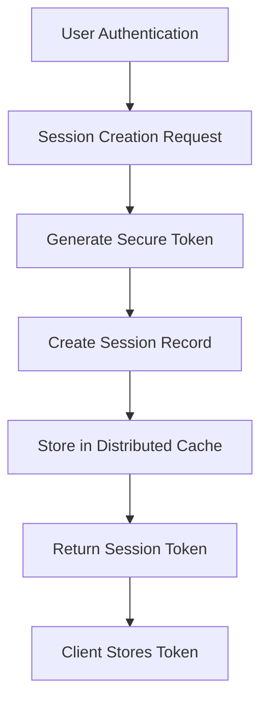
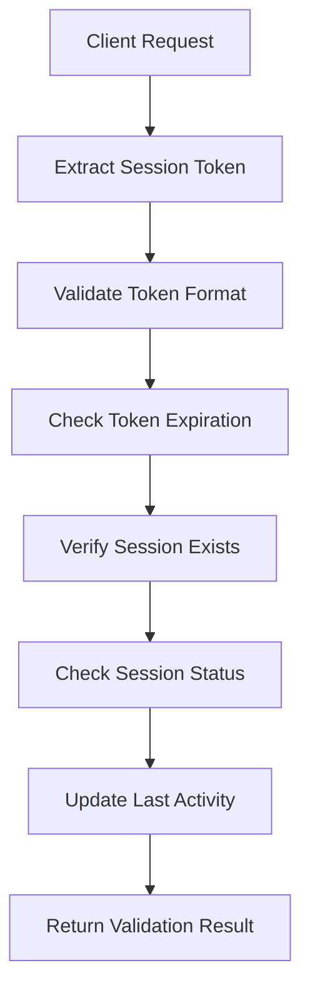
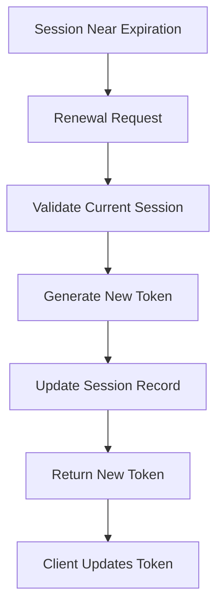
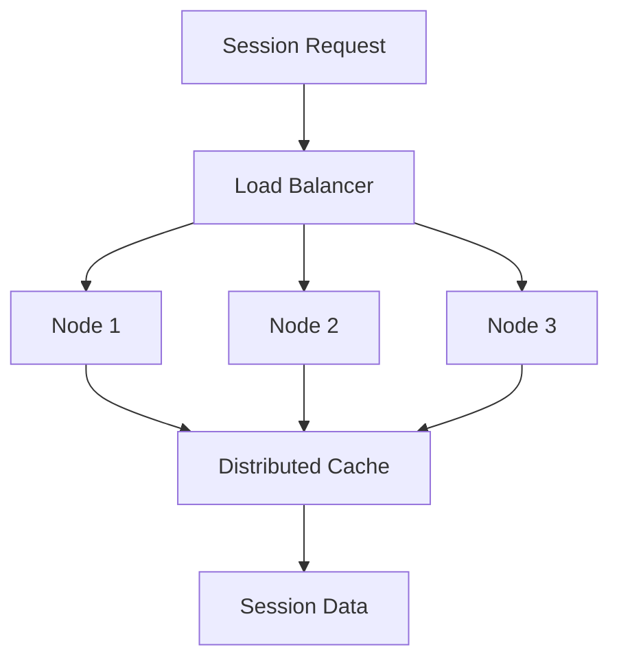

# **Session Manager**

## **Purpose**

The Session Manager provides comprehensive session management capabilities for the kOS ecosystem, handling secure session creation, validation, renewal, and termination. It ensures secure user sessions with automatic timeout, renewal mechanisms, and distributed session management across multiple nodes.

## **Core Principles**

### **Session Security**
- **Secure Session Creation**: Cryptographically secure session token generation
- **Session Validation**: Continuous validation of session integrity and authenticity
- **Automatic Timeout**: Configurable session timeout with automatic termination
- **Session Renewal**: Secure session renewal without re-authentication
- **Distributed Management**: Consistent session management across distributed nodes

### **Session Lifecycle**
- **Session Creation**: Secure session establishment with unique identifiers
- **Session Validation**: Continuous validation and integrity checking
- **Session Renewal**: Automatic renewal before expiration
- **Session Termination**: Secure termination and cleanup
- **Session Monitoring**: Real-time monitoring and analytics

### **Security Standards**
- **Zero Trust**: Never trust session state without validation
- **Encryption**: All session data encrypted in transit and at rest
- **Audit Trail**: Complete audit trail for all session operations
- **Compliance**: Compliance with security standards and regulations

## **Function Specifications**

### **Core Functions**

#### **createSession(userId: string, context: SessionContext): Promise<Session>**
Creates a new secure session for a user with comprehensive context information.

**Parameters:**
- `userId`: Unique user identifier
- `context`: Session context including IP, user agent, device info

**Returns:**
- `Session`: Complete session object with secure token and metadata

**Example:**
```typescript
const session = await sessionManager.createSession(
  "user123",
  {
    ipAddress: "192.168.1.100",
    userAgent: "Mozilla/5.0...",
    deviceId: "device456",
    location: "US-East-1"
  }
);
```

#### **validateSession(sessionToken: string): Promise<SessionValidationResult>**
Validates an existing session and returns validation status with session details.

**Parameters:**
- `sessionToken`: Secure session token to validate

**Returns:**
- `SessionValidationResult`: Validation status with session details or error

**Example:**
```typescript
const result = await sessionManager.validateSession("eyJhbGciOiJIUzI1NiIs...");
if (result.isValid) {
  console.log(`Session for user ${result.session.userId} is valid`);
}
```

#### **renewSession(sessionToken: string): Promise<Session>**
Renews an existing session without requiring re-authentication.

**Parameters:**
- `sessionToken`: Current session token to renew

**Returns:**
- `Session`: Updated session with new expiration time

**Example:**
```typescript
const renewedSession = await sessionManager.renewSession("eyJhbGciOiJIUzI1NiIs...");
console.log(`Session renewed until ${renewedSession.expiresAt}`);
```

#### **terminateSession(sessionToken: string): Promise<void>**
Securely terminates a session and performs cleanup operations.

**Parameters:**
- `sessionToken`: Session token to terminate

**Returns:**
- `void`: Success confirmation

**Example:**
```typescript
await sessionManager.terminateSession("eyJhbGciOiJIUzI1NiIs...");
console.log("Session terminated successfully");
```

#### **getActiveSessions(userId: string): Promise<Session[]>**
Retrieves all active sessions for a specific user.

**Parameters:**
- `userId`: User identifier to query sessions for

**Returns:**
- `Session[]`: Array of active sessions for the user

**Example:**
```typescript
const activeSessions = await sessionManager.getActiveSessions("user123");
console.log(`User has ${activeSessions.length} active sessions`);
```

#### **terminateAllUserSessions(userId: string): Promise<void>**
Terminates all active sessions for a specific user (logout from all devices).

**Parameters:**
- `userId`: User identifier whose sessions should be terminated

**Returns:**
- `void`: Success confirmation

**Example:**
```typescript
await sessionManager.terminateAllUserSessions("user123");
console.log("All user sessions terminated");
```

### **Advanced Functions**

#### **updateSessionContext(sessionToken: string, context: Partial<SessionContext>): Promise<Session>**
Updates session context information (location, device info, etc.).

**Parameters:**
- `sessionToken`: Session token to update
- `context`: Partial context information to update

**Returns:**
- `Session`: Updated session with new context

**Example:**
```typescript
const updatedSession = await sessionManager.updateSessionContext(
  "eyJhbGciOiJIUzI1NiIs...",
  { location: "US-West-2", lastActivity: new Date() }
);
```

#### **setSessionPermissions(sessionToken: string, permissions: string[]): Promise<Session>**
Sets specific permissions for a session (temporary elevation).

**Parameters:**
- `sessionToken`: Session token to update
- `permissions`: Array of permission identifiers

**Returns:**
- `Session`: Updated session with new permissions

**Example:**
```typescript
const session = await sessionManager.setSessionPermissions(
  "eyJhbGciOiJIUzI1NiIs...",
  ["admin:read", "admin:write", "user:delete"]
);
```

#### **getSessionAnalytics(sessionToken: string): Promise<SessionAnalytics>**
Retrieves analytics and usage statistics for a session.

**Parameters:**
- `sessionToken`: Session token to analyze

**Returns:**
- `SessionAnalytics`: Session usage statistics and analytics

**Example:**
```typescript
const analytics = await sessionManager.getSessionAnalytics("eyJhbGciOiJIUzI1NiIs...");
console.log(`Session active for ${analytics.duration} minutes`);
console.log(`Last activity: ${analytics.lastActivity}`);
```

## **Integration Patterns**

### **Session Creation Flow**


### **Session Validation Flow**


### **Session Renewal Flow**


### **Distributed Session Management**


## **Session Manager Capabilities**

### **Session Creation**
- **Secure Token Generation**: Cryptographically secure session tokens
- **Context Capture**: Comprehensive session context information
- **Device Fingerprinting**: Unique device identification and tracking
- **Location Tracking**: Geographic location tracking and validation
- **Multi-Device Support**: Support for multiple concurrent sessions

### **Session Validation**
- **Token Verification**: Cryptographic verification of session tokens
- **Expiration Checking**: Automatic expiration validation
- **Integrity Validation**: Session data integrity verification
- **Status Checking**: Session status and health validation
- **Context Validation**: Session context consistency checking

### **Session Renewal**
- **Automatic Renewal**: Automatic renewal before expiration
- **Seamless Renewal**: Renewal without user intervention
- **Token Rotation**: Secure token rotation and replacement
- **Context Preservation**: Preservation of session context during renewal
- **Performance Optimization**: Optimized renewal with minimal latency

### **Session Termination**
- **Secure Termination**: Secure session termination and cleanup
- **Distributed Cleanup**: Cleanup across all distributed nodes
- **Audit Logging**: Complete audit trail for termination events
- **Resource Cleanup**: Cleanup of associated resources and data
- **Notification Support**: Notification of session termination events

### **Session Monitoring**
- **Real-Time Monitoring**: Real-time session activity monitoring
- **Analytics Collection**: Comprehensive session analytics
- **Performance Metrics**: Session performance and latency metrics
- **Security Monitoring**: Security event monitoring and alerting
- **Compliance Reporting**: Compliance and audit reporting

## **Configuration Examples**

### **Basic Session Configuration**
```yaml
session_manager:
  token_generation:
    algorithm: "HS256"
    secret_key: "${SESSION_SECRET_KEY}"
    token_length: 256
    expiration_time: "8h"
  session_storage:
    type: "redis"
    connection_string: "redis://localhost:6379"
    key_prefix: "session:"
    ttl: "8h"
  validation:
    check_expiration: true
    validate_context: true
    check_device_fingerprint: true
    validate_location: false
  renewal:
    auto_renewal: true
    renewal_threshold: "1h"
    max_renewals: 10
    renewal_grace_period: "5m"
```

### **Advanced Session Configuration**
```yaml
session_manager:
  security:
    encryption:
      enabled: true
      algorithm: "AES-256-GCM"
      key_rotation: "24h"
    token_validation:
      signature_verification: true
      audience_validation: true
      issuer_validation: true
    session_policies:
      max_concurrent_sessions: 5
      max_session_duration: "24h"
      idle_timeout: "30m"
      absolute_timeout: "7d"
  distributed_management:
    cluster_mode: true
    replication_factor: 3
    consistency_level: "strong"
    failover_enabled: true
  monitoring:
    metrics_collection: true
    audit_logging: true
    performance_monitoring: true
    security_monitoring: true
```

### **Session Analytics Configuration**
```yaml
session_analytics:
  data_collection:
    enabled: true
    collection_interval: "1m"
    retention_period: "90d"
  metrics:
    session_duration: true
    session_activity: true
    device_usage: true
    location_tracking: true
    performance_metrics: true
  reporting:
    daily_reports: true
    weekly_reports: true
    monthly_reports: true
    custom_reports: true
```

## **Error Handling**

### **Session Creation Errors**
- **Token Generation Failure**: Retry with new cryptographic material
- **Storage Failure**: Fallback to local storage with replication
- **Context Validation Failure**: Log warning and continue with limited context
- **Device Fingerprinting Failure**: Continue without device tracking
- **Location Detection Failure**: Continue without location validation

### **Session Validation Errors**
- **Token Format Invalid**: Return authentication error with clear message
- **Token Expired**: Return session expired error with renewal instructions
- **Session Not Found**: Return authentication error with re-login prompt
- **Session Invalidated**: Return session invalidated error with re-authentication
- **Context Mismatch**: Log security warning and require re-authentication

### **Session Renewal Errors**
- **Renewal Threshold Not Met**: Return error with time until renewal
- **Maximum Renewals Exceeded**: Return error with re-authentication requirement
- **Token Rotation Failure**: Retry with new token generation
- **Storage Update Failure**: Retry with exponential backoff
- **Context Update Failure**: Continue with existing context

### **Session Termination Errors**
- **Token Invalid**: Log error and continue cleanup
- **Storage Cleanup Failure**: Retry cleanup with exponential backoff
- **Distributed Cleanup Failure**: Retry across all nodes
- **Audit Logging Failure**: Continue termination with logging retry
- **Notification Failure**: Continue with termination and retry notification

## **Performance Considerations**

### **Session Creation Performance**
- **Token Generation**: Optimized cryptographic operations with hardware acceleration
- **Storage Operations**: Efficient storage with connection pooling
- **Context Processing**: Optimized context capture and validation
- **Device Fingerprinting**: Efficient device identification algorithms
- **Location Detection**: Optimized location detection with caching

### **Session Validation Performance**
- **Token Verification**: Cached token verification with minimal latency
- **Storage Lookups**: Optimized storage lookups with indexing
- **Context Validation**: Efficient context validation with caching
- **Expiration Checking**: Fast expiration validation with time-based caching
- **Status Checking**: Optimized status checking with state caching

### **Session Renewal Performance**
- **Renewal Processing**: Optimized renewal with minimal overhead
- **Token Rotation**: Efficient token rotation with secure generation
- **Storage Updates**: Optimized storage updates with atomic operations
- **Context Updates**: Efficient context updates with change detection
- **Notification Processing**: Asynchronous notification processing

### **Distributed Management Performance**
- **Load Balancing**: Intelligent load balancing across nodes
- **Cache Distribution**: Efficient cache distribution and synchronization
- **Replication**: Optimized replication with consistency guarantees
- **Failover**: Fast failover with minimal service disruption
- **Monitoring**: Efficient monitoring with minimal overhead

## **Security Considerations**

### **Session Token Security**
- **Cryptographic Strength**: Strong cryptographic algorithms and key management
- **Token Rotation**: Regular token rotation to limit exposure
- **Secure Transmission**: Secure transmission of session tokens
- **Token Storage**: Secure storage of session tokens on client side
- **Token Validation**: Comprehensive token validation and verification

### **Session Data Security**
- **Data Encryption**: Encryption of all session data in transit and at rest
- **Access Control**: Strict access control for session data
- **Audit Logging**: Comprehensive audit logging for all session operations
- **Data Minimization**: Minimal collection and storage of session data
- **Data Retention**: Secure data retention and disposal policies

### **Session Management Security**
- **Authentication Integration**: Secure integration with authentication systems
- **Authorization Enforcement**: Enforcement of authorization policies
- **Session Isolation**: Isolation of sessions between users and applications
- **Session Hijacking Protection**: Protection against session hijacking attacks
- **Session Fixation Protection**: Protection against session fixation attacks

### **Distributed Security**
- **Node Authentication**: Authentication of all distributed nodes
- **Secure Communication**: Secure communication between nodes
- **Data Consistency**: Consistency guarantees for distributed session data
- **Failover Security**: Secure failover without security compromise
- **Monitoring Security**: Secure monitoring and alerting systems

## **Monitoring & Observability**

### **Session Metrics**
- **Session Creation Rate**: Track session creation frequency and patterns
- **Session Duration**: Monitor average and distribution of session durations
- **Session Renewal Rate**: Track session renewal frequency and success
- **Session Termination Rate**: Monitor session termination patterns
- **Active Sessions Count**: Track number of active sessions over time

### **Performance Metrics**
- **Session Creation Latency**: Track session creation response times
- **Session Validation Latency**: Monitor session validation performance
- **Session Renewal Latency**: Track session renewal response times
- **Storage Performance**: Monitor session storage performance
- **Cache Hit Rate**: Track cache effectiveness and performance

### **Security Metrics**
- **Failed Validations**: Track failed session validation attempts
- **Session Hijacking Attempts**: Monitor potential session hijacking
- **Token Compromise Events**: Track potential token compromise
- **Unauthorized Access**: Monitor unauthorized session access attempts
- **Security Policy Violations**: Track security policy violations

### **Operational Metrics**
- **Storage Utilization**: Monitor session storage utilization
- **Cache Performance**: Track cache performance and efficiency
- **Node Health**: Monitor health of distributed session nodes
- **Replication Status**: Track replication status and consistency
- **Failover Events**: Monitor failover events and performance

### **Alerting**
- **Session Security Alerts**: Alerts for suspicious session activity
- **Performance Alerts**: Alerts for performance degradation
- **Storage Alerts**: Alerts for storage capacity and performance issues
- **Node Health Alerts**: Alerts for node health and availability issues
- **Compliance Alerts**: Alerts for compliance violations and audit failures

---

**Version**: 1.0  
**Focus**: Comprehensive session management for secure user sessions in kOS ecosystem 