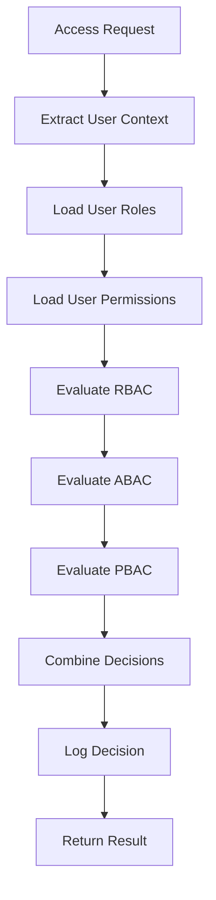
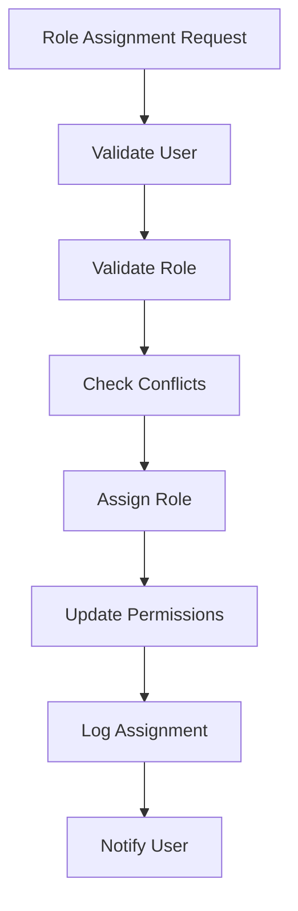
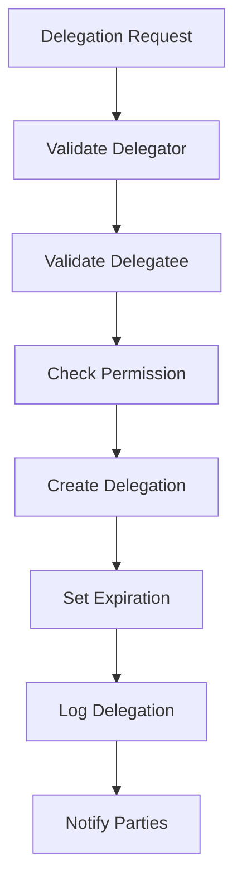
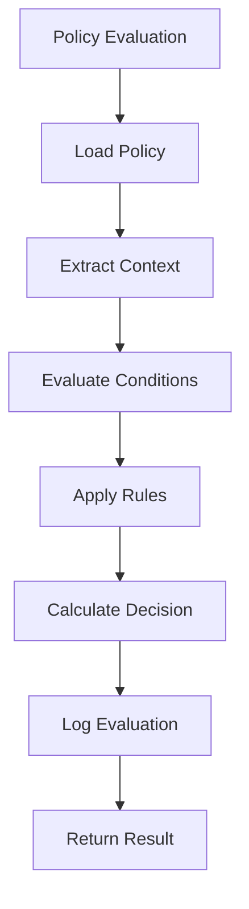

# **Access Control Manager**

## **Purpose**

The Access Control Manager provides comprehensive access control capabilities for the kOS ecosystem, implementing Role-Based Access Control (RBAC), Attribute-Based Access Control (ABAC), and Policy-Based Access Control (PBAC) models. It ensures secure resource access with granular permissions, dynamic policy evaluation, and comprehensive audit trails.

## **Core Principles**

### **Access Control Models**
- **Role-Based Access Control (RBAC)**: Access control based on user roles and responsibilities
- **Attribute-Based Access Control (ABAC)**: Dynamic access control based on user attributes
- **Policy-Based Access Control (PBAC)**: Rule-based access control with complex policies
- **Hierarchical Access Control**: Nested access control with inheritance
- **Time-Based Access Control**: Access control with temporal constraints

### **Security Standards**
- **Principle of Least Privilege**: Grant minimum necessary permissions
- **Zero Trust Architecture**: Never trust, always verify every access request
- **Continuous Authorization**: Ongoing verification of access permissions
- **Audit Trail**: Complete audit trail for all access control decisions
- **Compliance**: Compliance with security standards and regulations

### **Access Control Lifecycle**
- **Permission Assignment**: Granular permission assignment to users and roles
- **Permission Inheritance**: Permission inheritance through role hierarchies
- **Permission Delegation**: Temporary permission delegation for specific tasks
- **Permission Auditing**: Permission audit logging and compliance reporting
- **Permission Optimization**: Permission optimization and cleanup

## **Function Specifications**

### **Core Functions**

#### **checkAccess(userId: string, resource: string, action: string, context?: AccessContext): Promise<AccessDecision>**
Checks if a user has permission to perform an action on a specific resource.

**Parameters:**
- `userId`: Unique user identifier
- `resource`: Resource identifier to access
- `action`: Action to perform on the resource
- `context`: Optional access context (time, location, device, etc.)

**Returns:**
- `AccessDecision`: Access decision with reason and metadata

**Example:**
```typescript
const decision = await accessControlManager.checkAccess(
  "user123",
  "database:users",
  "read",
  {
    time: new Date(),
    location: "US-East-1",
    deviceId: "device456",
    ipAddress: "192.168.1.100"
  }
);

if (decision.granted) {
  console.log(`Access granted: ${decision.reason}`);
} else {
  console.log(`Access denied: ${decision.reason}`);
}
```

#### **assignRole(userId: string, roleId: string, scope?: string): Promise<void>**
Assigns a role to a user with optional scope limitation.

**Parameters:**
- `userId`: User identifier to assign role to
- `roleId`: Role identifier to assign
- `scope`: Optional scope limitation for the role

**Returns:**
- `void`: Success confirmation

**Example:**
```typescript
await accessControlManager.assignRole("user123", "admin", "department:engineering");
console.log("Role assigned successfully");
```

#### **revokeRole(userId: string, roleId: string): Promise<void>**
Revokes a role from a user.

**Parameters:**
- `userId`: User identifier to revoke role from
- `roleId`: Role identifier to revoke

**Returns:**
- `void`: Success confirmation

**Example:**
```typescript
await accessControlManager.revokeRole("user123", "admin");
console.log("Role revoked successfully");
```

#### **createRole(roleId: string, permissions: string[], metadata?: RoleMetadata): Promise<Role>**
Creates a new role with specified permissions.

**Parameters:**
- `roleId`: Unique role identifier
- `permissions`: Array of permission identifiers
- `metadata`: Optional role metadata (description, category, etc.)

**Returns:**
- `Role`: Created role object

**Example:**
```typescript
const role = await accessControlManager.createRole(
  "data_analyst",
  ["data:read", "reports:generate", "dashboards:view"],
  {
    description: "Data analyst with read access and reporting capabilities",
    category: "analytics",
    createdBy: "admin"
  }
);
```

#### **updateRole(roleId: string, updates: Partial<Role>): Promise<Role>**
Updates an existing role with new permissions or metadata.

**Parameters:**
- `roleId`: Role identifier to update
- `updates`: Partial role updates

**Returns:**
- `Role`: Updated role object

**Example:**
```typescript
const updatedRole = await accessControlManager.updateRole(
  "data_analyst",
  {
    permissions: ["data:read", "reports:generate", "dashboards:view", "data:export"],
    metadata: { description: "Enhanced data analyst role with export capabilities" }
  }
);
```

#### **deleteRole(roleId: string): Promise<void>**
Deletes a role and removes it from all users.

**Parameters:**
- `roleId`: Role identifier to delete

**Returns:**
- `void`: Success confirmation

**Example:**
```typescript
await accessControlManager.deleteRole("data_analyst");
console.log("Role deleted successfully");
```

### **Advanced Functions**

#### **delegatePermission(userId: string, targetUserId: string, permission: string, duration: string): Promise<Delegation>**
Temporarily delegates a specific permission to another user.

**Parameters:**
- `userId`: User delegating the permission
- `targetUserId`: User receiving the permission
- `permission`: Permission to delegate
- `duration`: Duration of delegation (e.g., "2h", "1d")

**Returns:**
- `Delegation`: Delegation object with details

**Example:**
```typescript
const delegation = await accessControlManager.delegatePermission(
  "admin123",
  "user456",
  "database:write",
  "4h"
);
console.log(`Permission delegated until ${delegation.expiresAt}`);
```

#### **revokeDelegation(delegationId: string): Promise<void>**
Revokes a previously granted delegation.

**Parameters:**
- `delegationId`: Delegation identifier to revoke

**Returns:**
- `void`: Success confirmation

**Example:**
```typescript
await accessControlManager.revokeDelegation("delegation789");
console.log("Delegation revoked successfully");
```

#### **evaluatePolicy(policyId: string, context: PolicyContext): Promise<PolicyEvaluation>**
Evaluates a specific policy against the given context.

**Parameters:**
- `policyId`: Policy identifier to evaluate
- `context`: Context for policy evaluation

**Returns:**
- `PolicyEvaluation`: Policy evaluation result

**Example:**
```typescript
const evaluation = await accessControlManager.evaluatePolicy(
  "data_access_policy",
  {
    userId: "user123",
    resource: "database:users",
    action: "read",
    time: new Date(),
    location: "US-East-1"
  }
);
console.log(`Policy evaluation: ${evaluation.result}`);
```

#### **getUserPermissions(userId: string): Promise<UserPermissions>**
Retrieves all permissions for a specific user.

**Parameters:**
- `userId`: User identifier to query permissions for

**Returns:**
- `UserPermissions`: Complete user permissions with roles and direct permissions

**Example:**
```typescript
const permissions = await accessControlManager.getUserPermissions("user123");
console.log(`User has ${permissions.roles.length} roles`);
console.log(`Direct permissions: ${permissions.directPermissions.length}`);
```

#### **getResourcePermissions(resourceId: string): Promise<ResourcePermissions>**
Retrieves all permissions for a specific resource.

**Parameters:**
- `resourceId`: Resource identifier to query permissions for

**Returns:**
- `ResourcePermissions`: Complete resource permissions with users and roles

**Example:**
```typescript
const permissions = await accessControlManager.getResourcePermissions("database:users");
console.log(`Resource has ${permissions.users.length} users with access`);
console.log(`Roles with access: ${permissions.roles.length}`);
```

## **Integration Patterns**

### **Access Control Flow**


### **Role Assignment Flow**


### **Permission Delegation Flow**


### **Policy Evaluation Flow**


## **Access Control Manager Capabilities**

### **Role-Based Access Control (RBAC)**
- **Role Management**: Complete role lifecycle management
- **Permission Assignment**: Granular permission assignment to roles
- **Role Hierarchy**: Hierarchical role inheritance and relationships
- **Role Constraints**: Role constraints and limitations
- **Role Auditing**: Complete role audit trail and reporting

### **Attribute-Based Access Control (ABAC)**
- **Attribute Evaluation**: Dynamic attribute evaluation and processing
- **Context Awareness**: Context-aware access control decisions
- **Environmental Factors**: Environmental and situational factors
- **Dynamic Policies**: Dynamic policy evaluation and enforcement
- **Attribute Sources**: Multiple attribute sources and providers

### **Policy-Based Access Control (PBAC)**
- **Policy Management**: Complete policy lifecycle management
- **Rule Evaluation**: Complex rule evaluation and processing
- **Policy Composition**: Policy composition and combination
- **Policy Optimization**: Policy performance optimization
- **Policy Auditing**: Policy audit trail and compliance reporting

### **Access Control Enforcement**
- **Real-Time Enforcement**: Real-time access control enforcement
- **Caching**: Intelligent caching for performance optimization
- **Distributed Enforcement**: Distributed enforcement across nodes
- **Fail-Safe**: Fail-safe access control with default deny
- **Performance Optimization**: Performance optimization and scaling

### **Access Control Monitoring**
- **Real-Time Monitoring**: Real-time access control monitoring
- **Analytics Collection**: Comprehensive access control analytics
- **Performance Metrics**: Access control performance metrics
- **Security Monitoring**: Security event monitoring and alerting
- **Compliance Reporting**: Compliance and audit reporting

## **Configuration Examples**

### **Basic Access Control Configuration**
```yaml
access_control:
  models:
    rbac:
      enabled: true
      role_hierarchy: true
      permission_inheritance: true
    abac:
      enabled: true
      attribute_sources:
        - user_profile
        - system_context
        - environmental
    pbac:
      enabled: true
      policy_evaluation: "realtime"
  enforcement:
    caching_enabled: true
    cache_ttl: "5m"
    default_decision: "deny"
    audit_logging: true
  roles:
    predefined_roles:
      - admin
      - user
      - guest
      - moderator
    custom_roles: true
    role_constraints: true
```

### **Advanced Access Control Configuration**
```yaml
access_control:
  security:
    encryption:
      enabled: true
      algorithm: "AES-256-GCM"
      key_rotation: "24h"
    token_validation:
      signature_verification: true
      audience_validation: true
      issuer_validation: true
    session_validation:
      continuous_validation: true
      context_validation: true
      device_validation: true
  distributed_management:
    cluster_mode: true
    replication_factor: 3
    consistency_level: "strong"
    failover_enabled: true
  monitoring:
    metrics_collection: true
    audit_logging: true
    performance_monitoring: true
    security_monitoring: true
```

### **Policy Configuration**
```yaml
policies:
  data_access_policy:
    description: "Policy for data access control"
    rules:
      - condition: "user.role == 'admin'"
        action: "allow"
        resources: ["*"]
      - condition: "user.role == 'user' AND resource.type == 'public'"
        action: "allow"
        resources: ["data:public:*"]
      - condition: "user.role == 'user' AND resource.owner == user.id"
        action: "allow"
        resources: ["data:user:*"]
      - condition: "default"
        action: "deny"
    attributes:
      - user.role
      - user.department
      - resource.type
      - resource.owner
      - time.hour
      - location.country
```

## **Error Handling**

### **Access Control Errors**
- **User Not Found**: Return access denied with user not found error
- **Role Not Found**: Return access denied with role not found error
- **Permission Not Found**: Return access denied with permission not found error
- **Policy Evaluation Failure**: Return access denied with policy error
- **Context Validation Failure**: Return access denied with context error

### **Role Management Errors**
- **Role Assignment Failure**: Retry with conflict resolution
- **Role Revocation Failure**: Retry with cleanup procedures
- **Role Creation Failure**: Return error with validation details
- **Role Update Failure**: Return error with conflict information
- **Role Deletion Failure**: Return error with dependency information

### **Permission Delegation Errors**
- **Delegation Creation Failure**: Return error with validation details
- **Delegation Validation Failure**: Return error with validation information
- **Delegation Expiration Failure**: Return error with expiration details
- **Delegation Revocation Failure**: Return error with revocation information
- **Delegation Conflict Failure**: Return error with conflict resolution

### **Policy Evaluation Errors**
- **Policy Loading Failure**: Return error with policy loading details
- **Policy Parsing Failure**: Return error with parsing information
- **Policy Execution Failure**: Return error with execution details
- **Policy Context Failure**: Return error with context information
- **Policy Decision Failure**: Return error with decision details

## **Performance Considerations**

### **Access Control Performance**
- **Permission Checking**: Optimized permission lookups with indexing
- **Role Resolution**: Fast role resolution with hierarchical caching
- **Policy Evaluation**: Cached policy evaluation with intelligent invalidation
- **Attribute Evaluation**: Optimized attribute evaluation with lazy loading
- **Decision Caching**: Intelligent decision caching with context awareness

### **Role Management Performance**
- **Role Assignment**: Optimized role assignment with batch processing
- **Role Revocation**: Efficient role revocation with cleanup optimization
- **Role Creation**: Fast role creation with validation optimization
- **Role Updates**: Optimized role updates with change detection
- **Role Deletion**: Efficient role deletion with dependency resolution

### **Permission Delegation Performance**
- **Delegation Creation**: Optimized delegation creation with validation
- **Delegation Validation**: Fast delegation validation with caching
- **Delegation Expiration**: Efficient expiration checking with scheduling
- **Delegation Revocation**: Optimized revocation with cleanup
- **Delegation Conflict Resolution**: Fast conflict resolution with algorithms

### **Policy Evaluation Performance**
- **Policy Loading**: Optimized policy loading with caching
- **Policy Parsing**: Fast policy parsing with optimization
- **Policy Execution**: Efficient policy execution with compilation
- **Policy Context**: Optimized context processing with caching
- **Policy Decision**: Fast decision calculation with optimization

## **Security Considerations**

### **Access Control Security**
- **Permission Validation**: Comprehensive permission validation and verification
- **Role Security**: Secure role management and assignment
- **Policy Security**: Secure policy management and evaluation
- **Delegation Security**: Secure permission delegation and management
- **Context Security**: Secure context validation and processing

### **Data Security**
- **Data Encryption**: Encryption of all access control data in transit and at rest
- **Access Control**: Strict access control for access control data
- **Audit Logging**: Comprehensive audit logging for all access control operations
- **Data Minimization**: Minimal collection and storage of access control data
- **Data Retention**: Secure data retention and disposal policies

### **System Security**
- **Authentication Integration**: Secure integration with authentication systems
- **Authorization Enforcement**: Enforcement of authorization policies
- **Session Security**: Secure session validation and authorization
- **Token Security**: Secure token management and validation
- **API Security**: Secure API access and validation

### **Distributed Security**
- **Node Authentication**: Authentication of all distributed nodes
- **Secure Communication**: Secure communication between nodes
- **Data Consistency**: Consistency guarantees for distributed access control data
- **Failover Security**: Secure failover without security compromise
- **Monitoring Security**: Secure monitoring and alerting systems

## **Monitoring & Observability**

### **Access Control Metrics**
- **Access Decisions**: Track access granted/denied decisions
- **Role Usage**: Monitor role assignment and usage patterns
- **Permission Usage**: Track permission usage and effectiveness
- **Policy Evaluations**: Monitor policy evaluation performance
- **Delegation Activity**: Track permission delegation activity

### **Performance Metrics**
- **Access Control Latency**: Track access control response times
- **Role Management Performance**: Monitor role management operations
- **Policy Evaluation Performance**: Track policy evaluation times
- **Permission Lookup Performance**: Monitor permission lookup performance
- **Cache Performance**: Track cache effectiveness and performance

### **Security Metrics**
- **Access Violations**: Track access violations and security incidents
- **Role Conflicts**: Monitor role conflicts and resolution
- **Policy Violations**: Track policy violations and enforcement
- **Delegation Abuse**: Monitor delegation abuse and misuse
- **Security Policy Violations**: Track security policy violations

### **Operational Metrics**
- **User Activity**: Monitor user access patterns and activity
- **Resource Usage**: Track resource access patterns and usage
- **System Health**: Monitor access control system health
- **Compliance Status**: Track compliance with access control policies
- **Audit Completeness**: Monitor audit log completeness and quality

### **Alerting**
- **Access Control Alerts**: Alerts for access violations and security incidents
- **Performance Alerts**: Alerts for performance degradation
- **Security Alerts**: Alerts for security violations and threats
- **Compliance Alerts**: Alerts for compliance violations and audit failures
- **System Alerts**: Alerts for system health and availability issues

---

**Version**: 1.0  
**Focus**: Comprehensive access control management for secure resource access in kOS ecosystem 