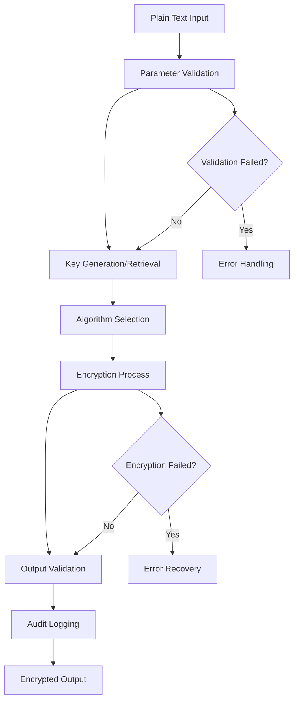

# Base Encryptor

## Purpose
Provides the core encryption interface and common functionality for all encryption operations in the kOS ecosystem. This base class defines the standard interface that all specific encryption implementations must follow, ensuring consistent behavior, error handling, and security practices across all encryption modules.

## Capabilities
- **Standardized Encryption Interface**: Provides consistent interface for all encryption operations
- **Key Management**: Handles encryption key generation, storage, and rotation
- **Algorithm Selection**: Supports multiple encryption algorithms with automatic selection
- **Error Handling**: Comprehensive error handling for encryption failures
- **Performance Optimization**: Optimized encryption performance with configurable settings
- **Security Validation**: Validates encryption parameters and security requirements
- **Audit Logging**: Logs all encryption operations for security auditing
- **Compliance Support**: Supports various encryption compliance requirements

## Integration Points
- **Input**: Plain text data, encryption parameters, and key information
- **Output**: Encrypted data, encryption metadata, and operation status
- **Dependencies**: Base Hash Generator for key derivation and validation

## Configuration
```yaml
base_encryptor:
  default_algorithm: "AES-256-GCM"
  key_derivation:
    algorithm: "PBKDF2"
    iterations: 100000
    salt_length: 32
  performance:
    chunk_size: 1048576  # 1MB chunks
    parallel_processing: true
    max_concurrent_operations: 10
  security:
    key_rotation_interval: "30d"
    minimum_key_length: 256
    require_secure_random: true
    validate_parameters: true
  audit:
    log_all_operations: true
    include_metadata: true
    retention_period: "7y"
```

## Example Workflow


## Core Capabilities

### **1. Standardized Encryption Interface**
- **Description**: Provides consistent interface for all encryption operations
- **Input**: Plain text data and encryption parameters
- **Output**: Encrypted data and metadata
- **Dependencies**: None (base interface)

### **2. Key Management**
- **Description**: Handles encryption key generation, storage, and rotation
- **Input**: Key parameters and security requirements
- **Output**: Generated keys and key metadata
- **Dependencies**: Base Hash Generator for key derivation

### **3. Algorithm Selection**
- **Description**: Supports multiple encryption algorithms with automatic selection
- **Input**: Data type, security requirements, and performance constraints
- **Output**: Selected algorithm and configuration
- **Dependencies**: Algorithm registry and validation

### **4. Error Handling**
- **Description**: Comprehensive error handling for encryption failures
- **Input**: Error conditions and context
- **Output**: Error reports and recovery actions
- **Dependencies**: Error handling framework

## Module Interface

### **Input Interface**
```typescript
interface BaseEncryptorInput {
  plainText: string | Buffer;
  algorithm?: string;
  key?: string | Buffer;
  keyId?: string;
  parameters?: EncryptionParameters;
  metadata?: Record<string, any>;
}

interface EncryptionParameters {
  mode?: string;
  padding?: string;
  iv?: Buffer;
  aad?: Buffer;
  tagLength?: number;
}
```

### **Output Interface**
```typescript
interface BaseEncryptorOutput {
  encryptedData: Buffer;
  algorithm: string;
  keyId: string;
  iv: Buffer;
  tag?: Buffer;
  metadata: EncryptionMetadata;
  status: EncryptionStatus;
}

interface EncryptionMetadata {
  timestamp: Date;
  operationId: string;
  performanceMetrics: PerformanceMetrics;
  securityLevel: string;
}

interface EncryptionStatus {
  success: boolean;
  error?: string;
  warnings?: string[];
}
```

### **Configuration Interface**
```typescript
interface BaseEncryptorConfig {
  defaultAlgorithm: string;
  keyDerivation: KeyDerivationConfig;
  performance: PerformanceConfig;
  security: SecurityConfig;
  audit: AuditConfig;
}

interface KeyDerivationConfig {
  algorithm: string;
  iterations: number;
  saltLength: number;
}

interface PerformanceConfig {
  chunkSize: number;
  parallelProcessing: boolean;
  maxConcurrentOperations: number;
}

interface SecurityConfig {
  keyRotationInterval: string;
  minimumKeyLength: number;
  requireSecureRandom: boolean;
  validateParameters: boolean;
}

interface AuditConfig {
  logAllOperations: boolean;
  includeMetadata: boolean;
  retentionPeriod: string;
}
```

## Module Dependencies

### **Required Dependencies**
- **Base Hash Generator**: For key derivation and validation operations
- **Secure Random Generator**: For generating cryptographically secure random values
- **Configuration Manager**: For managing encryption configuration settings

### **Optional Dependencies**
- **Hardware Security Module (HSM)**: For enhanced key security when available
- **Key Management Service**: For enterprise key management when available
- **Audit Logger**: For comprehensive audit logging when available

## Module Implementation

### **Core Components**

#### **1. Encryption Engine**
```typescript
class EncryptionEngine {
  private config: BaseEncryptorConfig;
  private keyManager: KeyManager;
  private algorithmRegistry: AlgorithmRegistry;
  
  constructor(config: BaseEncryptorConfig) {
    this.config = config;
    this.keyManager = new KeyManager(config);
    this.algorithmRegistry = new AlgorithmRegistry();
  }
  
  async encrypt(input: BaseEncryptorInput): Promise<BaseEncryptorOutput> {
    // Validate input parameters
    this.validateInput(input);
    
    // Generate or retrieve encryption key
    const key = await this.keyManager.getKey(input.keyId, input.key);
    
    // Select encryption algorithm
    const algorithm = this.selectAlgorithm(input.algorithm, input.parameters);
    
    // Perform encryption
    const result = await this.performEncryption(input.plainText, key, algorithm);
    
    // Log operation for audit
    await this.logOperation(input, result);
    
    return result;
  }
  
  private validateInput(input: BaseEncryptorInput): void {
    if (!input.plainText || input.plainText.length === 0) {
      throw new EncryptionError('Plain text input is required');
    }
    
    if (this.config.security.validateParameters) {
      this.validateSecurityParameters(input);
    }
  }
  
  private async performEncryption(
    plainText: string | Buffer,
    key: Buffer,
    algorithm: EncryptionAlgorithm
  ): Promise<BaseEncryptorOutput> {
    // Implementation details for encryption process
    // This would include the actual cryptographic operations
  }
}
```

#### **2. Key Manager**
```typescript
class KeyManager {
  private config: KeyDerivationConfig;
  private keyStore: KeyStore;
  
  constructor(config: BaseEncryptorConfig) {
    this.config = config.keyDerivation;
    this.keyStore = new KeyStore();
  }
  
  async getKey(keyId?: string, providedKey?: string | Buffer): Promise<Buffer> {
    if (providedKey) {
      return this.validateKey(providedKey);
    }
    
    if (keyId) {
      return await this.keyStore.getKey(keyId);
    }
    
    return await this.generateKey();
  }
  
  private async generateKey(): Promise<Buffer> {
    // Generate cryptographically secure key
    const salt = await this.generateSalt();
    return await this.deriveKey(salt);
  }
}
```

### **Integration Points**

#### **1. Algorithm Registry Integration**
- **Description**: Provides access to available encryption algorithms
- **Protocol**: Registry pattern with algorithm registration and lookup
- **Authentication**: Algorithm validation and security verification
- **Rate Limiting**: Algorithm-specific performance constraints

#### **2. Key Management Integration**
- **Description**: Manages encryption keys and key lifecycle
- **Protocol**: Secure key storage and retrieval protocols
- **Authentication**: Key access control and authorization
- **Rate Limiting**: Key operation rate limiting for security

## Performance Characteristics

### **Throughput**
- **Encryption Speed**: 100MB/s for AES-256-GCM on standard hardware
- **Key Generation**: 1000 keys/second for standard key sizes
- **Parallel Processing**: Support for up to 10 concurrent encryption operations

### **Reliability**
- **Error Rate**: < 0.001% encryption failures
- **Recovery Time**: < 100ms for recoverable errors
- **Availability**: 99.99% uptime for encryption services

### **Scalability**
- **Horizontal Scaling**: Support for distributed encryption across multiple nodes
- **Vertical Scaling**: Linear performance improvement with additional CPU cores
- **Memory Usage**: < 100MB memory footprint for standard operations

## Security Considerations

### **Cryptographic Security**
- **Algorithm Strength**: Only approved cryptographic algorithms are supported
- **Key Security**: Keys are protected using industry-standard security measures
- **Random Number Generation**: Cryptographically secure random number generation
- **Parameter Validation**: All encryption parameters are validated for security

### **Access Control**
- **Key Access**: Strict access control for encryption keys
- **Operation Authorization**: Authorization required for encryption operations
- **Audit Trail**: Complete audit trail for all encryption operations
- **Compliance**: Support for various security compliance requirements

### **Data Protection**
- **Data in Transit**: All data is encrypted during transmission
- **Data at Rest**: Encrypted data is stored securely
- **Key Rotation**: Automatic key rotation for enhanced security
- **Secure Deletion**: Secure deletion of sensitive data and keys

## Error Handling

### **Error Types**
- **Invalid Input**: Invalid plain text or parameters provided
- **Key Errors**: Key generation, retrieval, or validation failures
- **Algorithm Errors**: Unsupported or invalid encryption algorithms
- **Performance Errors**: Timeout or resource exhaustion errors
- **Security Errors**: Security validation or compliance failures

### **Error Recovery**
- **Automatic Retry**: Automatic retry for transient errors
- **Fallback Algorithms**: Fallback to alternative encryption algorithms
- **Key Regeneration**: Automatic key regeneration on key failures
- **Graceful Degradation**: Graceful degradation for performance issues

## Testing Strategy

### **Unit Testing**
- **Input Validation**: Test all input validation scenarios
- **Key Management**: Test key generation, storage, and retrieval
- **Algorithm Selection**: Test algorithm selection and validation
- **Error Handling**: Test all error conditions and recovery

### **Integration Testing**
- **End-to-End Encryption**: Test complete encryption workflows
- **Key Management Integration**: Test integration with key management systems
- **Performance Testing**: Test performance under various load conditions
- **Security Testing**: Test security measures and compliance

### **Load Testing**
- **Concurrent Operations**: Test multiple concurrent encryption operations
- **Large Data Sets**: Test encryption of large data sets
- **Memory Usage**: Test memory usage under high load
- **Performance Degradation**: Test performance under resource constraints

## Deployment Considerations

### **Resource Requirements**
- **CPU**: Minimum 2 cores, recommended 4+ cores for high-performance operations
- **Memory**: Minimum 512MB, recommended 2GB+ for large operations
- **Storage**: Minimum 1GB for key storage and audit logs
- **Network**: High-speed network for distributed operations

### **Configuration**
- **Environment Variables**: Configuration through environment variables
- **Configuration Files**: Support for configuration file-based setup
- **Runtime Configuration**: Dynamic configuration updates
- **Validation**: Configuration validation on startup

### **Monitoring**
- **Performance Metrics**: Monitor encryption performance and throughput
- **Error Rates**: Monitor encryption error rates and types
- **Security Events**: Monitor security-related events and alerts
- **Resource Usage**: Monitor CPU, memory, and storage usage

## Usage Examples

### **Basic Usage**
```typescript
import { BaseEncryptor } from './BaseEncryptor';

const encryptor = new BaseEncryptor(config);

const input: BaseEncryptorInput = {
  plainText: 'Sensitive data to encrypt',
  algorithm: 'AES-256-GCM'
};

const result = await encryptor.encrypt(input);
console.log('Encrypted data:', result.encryptedData.toString('base64'));
```

### **Advanced Usage**
```typescript
import { BaseEncryptor } from './BaseEncryptor';

const encryptor = new BaseEncryptor(config);

const input: BaseEncryptorInput = {
  plainText: Buffer.from('Large sensitive data'),
  algorithm: 'AES-256-GCM',
  parameters: {
    mode: 'GCM',
    aad: Buffer.from('Additional authenticated data'),
    tagLength: 128
  },
  metadata: {
    userId: 'user123',
    dataType: 'personal',
    compliance: 'GDPR'
  }
};

const result = await encryptor.encrypt(input);
console.log('Encryption successful:', result.status.success);
console.log('Operation ID:', result.metadata.operationId);
```

## Future Enhancements

### **Planned Features**
- **Quantum-Resistant Algorithms**: Support for post-quantum cryptography
- **Hardware Acceleration**: Integration with hardware security modules
- **Advanced Key Management**: Enhanced key management with key escrow
- **Compliance Automation**: Automated compliance checking and reporting

### **Performance Improvements**
- **GPU Acceleration**: GPU-accelerated encryption for large data sets
- **Streaming Encryption**: Real-time streaming encryption capabilities
- **Batch Processing**: Optimized batch encryption operations
- **Caching**: Intelligent caching for frequently used keys and parameters

---

**Version**: 1.0  
**Focus**: Core encryption interface and common functionality for all encryption operations 