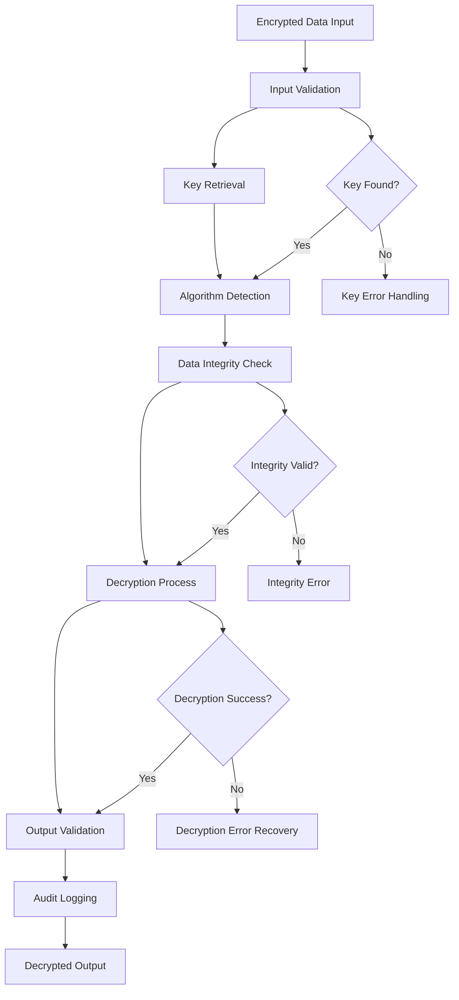

# Base Decryptor

## Purpose
Provides the core decryption interface and common functionality for all decryption operations in the kOS ecosystem. This base class defines the standard interface that all specific decryption implementations must follow, ensuring consistent behavior, error handling, and security practices across all decryption modules. The Base Decryptor works in conjunction with the Base Encryptor to provide complete cryptographic data protection.

## Capabilities
- **Standardized Decryption Interface**: Provides consistent interface for all decryption operations
- **Key Management**: Handles decryption key retrieval, validation, and lifecycle management
- **Algorithm Compatibility**: Supports decryption of data encrypted with various algorithms
- **Error Handling**: Comprehensive error handling for decryption failures and data corruption
- **Performance Optimization**: Optimized decryption performance with configurable settings
- **Security Validation**: Validates decryption parameters and security requirements
- **Audit Logging**: Logs all decryption operations for security auditing
- **Data Integrity**: Ensures data integrity and authenticity during decryption
- **Compliance Support**: Supports various decryption compliance requirements

## Integration Points
- **Input**: Encrypted data, decryption parameters, and key information
- **Output**: Decrypted data, decryption metadata, and operation status
- **Dependencies**: Base Encryptor for algorithm compatibility and Base Hash Generator for key validation

## Configuration
```yaml
base_decryptor:
  default_algorithm: "AES-256-GCM"
  key_management:
    key_retrieval_timeout: 5000  # 5 seconds
    key_validation: true
    key_rotation_check: true
  performance:
    chunk_size: 1048576  # 1MB chunks
    parallel_processing: true
    max_concurrent_operations: 10
    streaming_enabled: true
  security:
    validate_encrypted_data: true
    check_data_integrity: true
    verify_authenticity: true
    require_secure_channel: false
  audit:
    log_all_operations: true
    include_metadata: true
    log_failed_attempts: true
    retention_period: "7y"
  error_handling:
    max_retry_attempts: 3
    retry_delay: 1000  # 1 second
    fail_fast_on_corruption: true
```

## Example Workflow


## Core Capabilities

### **1. Standardized Decryption Interface**
- **Description**: Provides consistent interface for all decryption operations
- **Input**: Encrypted data and decryption parameters
- **Output**: Decrypted data and metadata
- **Dependencies**: None (base interface)

### **2. Key Management**
- **Description**: Handles decryption key retrieval, validation, and lifecycle management
- **Input**: Key identifiers and security requirements
- **Output**: Validated keys and key metadata
- **Dependencies**: Key management system and Base Hash Generator

### **3. Algorithm Compatibility**
- **Description**: Supports decryption of data encrypted with various algorithms
- **Input**: Encrypted data with algorithm metadata
- **Output**: Algorithm identification and compatibility verification
- **Dependencies**: Algorithm registry and Base Encryptor

### **4. Data Integrity Verification**
- **Description**: Ensures data integrity and authenticity during decryption
- **Input**: Encrypted data and integrity checksums
- **Output**: Integrity verification results and data validation
- **Dependencies**: Hash functions and integrity checking algorithms

## Module Interface

### **Input Interface**
```typescript
interface BaseDecryptorInput {
  encryptedData: Buffer;
  algorithm?: string;
  key?: string | Buffer;
  keyId?: string;
  parameters?: DecryptionParameters;
  metadata?: Record<string, any>;
}

interface DecryptionParameters {
  mode?: string;
  padding?: string;
  iv?: Buffer;
  aad?: Buffer;
  tag?: Buffer;
  tagLength?: number;
}
```

### **Output Interface**
```typescript
interface BaseDecryptorOutput {
  decryptedData: Buffer;
  algorithm: string;
  keyId: string;
  metadata: DecryptionMetadata;
  status: DecryptionStatus;
  integrity: IntegrityResult;
}

interface DecryptionMetadata {
  timestamp: Date;
  operationId: string;
  performanceMetrics: PerformanceMetrics;
  securityLevel: string;
  originalSize: number;
  decryptedSize: number;
}

interface DecryptionStatus {
  success: boolean;
  error?: string;
  warnings?: string[];
  retryCount?: number;
}

interface IntegrityResult {
  isValid: boolean;
  checksum?: string;
  verificationMethod: string;
  timestamp: Date;
}
```

### **Configuration Interface**
```typescript
interface BaseDecryptorConfig {
  defaultAlgorithm: string;
  keyManagement: KeyManagementConfig;
  performance: PerformanceConfig;
  security: SecurityConfig;
  audit: AuditConfig;
  errorHandling: ErrorHandlingConfig;
}

interface KeyManagementConfig {
  keyRetrievalTimeout: number;
  keyValidation: boolean;
  keyRotationCheck: boolean;
}

interface PerformanceConfig {
  chunkSize: number;
  parallelProcessing: boolean;
  maxConcurrentOperations: number;
  streamingEnabled: boolean;
}

interface SecurityConfig {
  validateEncryptedData: boolean;
  checkDataIntegrity: boolean;
  verifyAuthenticity: boolean;
  requireSecureChannel: boolean;
}

interface AuditConfig {
  logAllOperations: boolean;
  includeMetadata: boolean;
  logFailedAttempts: boolean;
  retentionPeriod: string;
}

interface ErrorHandlingConfig {
  maxRetryAttempts: number;
  retryDelay: number;
  failFastOnCorruption: boolean;
}
```

## Module Dependencies

### **Required Dependencies**
- **Base Encryptor**: For algorithm compatibility and encryption metadata
- **Base Hash Generator**: For key validation and data integrity verification
- **Key Management Service**: For secure key retrieval and validation
- **Configuration Manager**: For managing decryption configuration settings

### **Optional Dependencies**
- **Hardware Security Module (HSM)**: For enhanced key security when available
- **Audit Logger**: For comprehensive audit logging when available
- **Performance Monitor**: For detailed performance monitoring when available

## Module Implementation

### **Core Components**

#### **1. Decryption Engine**
```typescript
class DecryptionEngine {
  private config: BaseDecryptorConfig;
  private keyManager: KeyManager;
  private algorithmRegistry: AlgorithmRegistry;
  private integrityChecker: IntegrityChecker;
  
  constructor(config: BaseDecryptorConfig) {
    this.config = config;
    this.keyManager = new KeyManager(config.keyManagement);
    this.algorithmRegistry = new AlgorithmRegistry();
    this.integrityChecker = new IntegrityChecker();
  }
  
  async decrypt(input: BaseDecryptorInput): Promise<BaseDecryptorOutput> {
    // Validate input parameters
    this.validateInput(input);
    
    // Retrieve and validate decryption key
    const key = await this.keyManager.getKey(input.keyId, input.key);
    
    // Detect or verify encryption algorithm
    const algorithm = await this.detectAlgorithm(input.encryptedData, input.algorithm);
    
    // Check data integrity if enabled
    if (this.config.security.checkDataIntegrity) {
      await this.verifyDataIntegrity(input.encryptedData, algorithm);
    }
    
    // Perform decryption with retry logic
    const result = await this.performDecryptionWithRetry(input.encryptedData, key, algorithm);
    
    // Log operation for audit
    await this.logOperation(input, result);
    
    return result;
  }
  
  private validateInput(input: BaseDecryptorInput): void {
    if (!input.encryptedData || input.encryptedData.length === 0) {
      throw new DecryptionError('Encrypted data input is required');
    }
    
    if (this.config.security.validateEncryptedData) {
      this.validateEncryptedDataFormat(input.encryptedData);
    }
  }
  
  private async performDecryptionWithRetry(
    encryptedData: Buffer,
    key: Buffer,
    algorithm: DecryptionAlgorithm
  ): Promise<BaseDecryptorOutput> {
    let lastError: Error;
    
    for (let attempt = 1; attempt <= this.config.errorHandling.maxRetryAttempts; attempt++) {
      try {
        return await this.performDecryption(encryptedData, key, algorithm);
      } catch (error) {
        lastError = error as Error;
        
        if (this.config.errorHandling.failFastOnCorruption && 
            error instanceof DataCorruptionError) {
          throw error;
        }
        
        if (attempt < this.config.errorHandling.maxRetryAttempts) {
          await this.delay(this.config.errorHandling.retryDelay);
        }
      }
    }
    
    throw new DecryptionError(`Decryption failed after ${this.config.errorHandling.maxRetryAttempts} attempts`, lastError);
  }
}
```

#### **2. Integrity Checker**
```typescript
class IntegrityChecker {
  private hashGenerator: BaseHashGenerator;
  
  constructor() {
    this.hashGenerator = new BaseHashGenerator();
  }
  
  async verifyDataIntegrity(
    encryptedData: Buffer,
    algorithm: DecryptionAlgorithm
  ): Promise<IntegrityResult> {
    // Extract integrity checksum from encrypted data
    const checksum = this.extractChecksum(encryptedData);
    
    // Calculate expected checksum
    const expectedChecksum = await this.hashGenerator.generateHash(
      encryptedData.slice(0, -checksum.length)
    );
    
    // Compare checksums
    const isValid = checksum.equals(expectedChecksum);
    
    return {
      isValid,
      checksum: checksum.toString('hex'),
      verificationMethod: 'SHA256',
      timestamp: new Date()
    };
  }
  
  private extractChecksum(encryptedData: Buffer): Buffer {
    // Extract checksum from the end of encrypted data
    // Implementation depends on the specific format used
    return encryptedData.slice(-32); // Assuming 32-byte SHA256 checksum
  }
}
```

### **Integration Points**

#### **1. Key Management Integration**
- **Description**: Manages decryption keys and key lifecycle
- **Protocol**: Secure key retrieval and validation protocols
- **Authentication**: Key access control and authorization
- **Rate Limiting**: Key operation rate limiting for security

#### **2. Algorithm Registry Integration**
- **Description**: Provides access to available decryption algorithms
- **Protocol**: Registry pattern with algorithm detection and lookup
- **Authentication**: Algorithm validation and security verification
- **Rate Limiting**: Algorithm-specific performance constraints

## Performance Characteristics

### **Throughput**
- **Decryption Speed**: 100MB/s for AES-256-GCM on standard hardware
- **Key Retrieval**: < 10ms for cached keys, < 5s for remote keys
- **Parallel Processing**: Support for up to 10 concurrent decryption operations
- **Streaming**: Real-time streaming decryption for large files

### **Reliability**
- **Error Rate**: < 0.001% decryption failures
- **Recovery Time**: < 100ms for recoverable errors
- **Availability**: 99.99% uptime for decryption services
- **Data Recovery**: Automatic recovery from minor data corruption

### **Scalability**
- **Horizontal Scaling**: Support for distributed decryption across multiple nodes
- **Vertical Scaling**: Linear performance improvement with additional CPU cores
- **Memory Usage**: < 100MB memory footprint for standard operations
- **Streaming Support**: Memory-efficient streaming for large data sets

## Security Considerations

### **Cryptographic Security**
- **Algorithm Strength**: Only approved cryptographic algorithms are supported
- **Key Security**: Keys are protected using industry-standard security measures
- **Data Integrity**: Comprehensive data integrity verification
- **Authenticity**: Verification of data authenticity and origin

### **Access Control**
- **Key Access**: Strict access control for decryption keys
- **Operation Authorization**: Authorization required for decryption operations
- **Audit Trail**: Complete audit trail for all decryption operations
- **Compliance**: Support for various security compliance requirements

### **Data Protection**
- **Secure Key Retrieval**: Secure retrieval of decryption keys
- **Data Validation**: Validation of encrypted data format and integrity
- **Error Handling**: Secure error handling without information leakage
- **Secure Deletion**: Secure deletion of temporary decryption data

## Error Handling

### **Error Types**
- **Invalid Input**: Invalid encrypted data or parameters provided
- **Key Errors**: Key retrieval, validation, or authorization failures
- **Algorithm Errors**: Unsupported or incompatible encryption algorithms
- **Data Corruption**: Data corruption or integrity verification failures
- **Performance Errors**: Timeout or resource exhaustion errors
- **Security Errors**: Security validation or compliance failures

### **Error Recovery**
- **Automatic Retry**: Automatic retry for transient errors
- **Fallback Algorithms**: Fallback to alternative decryption algorithms
- **Key Rotation**: Automatic key rotation on key failures
- **Graceful Degradation**: Graceful degradation for performance issues
- **Data Recovery**: Attempts to recover from minor data corruption

## Testing Strategy

### **Unit Testing**
- **Input Validation**: Test all input validation scenarios
- **Key Management**: Test key retrieval, validation, and authorization
- **Algorithm Detection**: Test algorithm detection and compatibility
- **Error Handling**: Test all error conditions and recovery mechanisms

### **Integration Testing**
- **End-to-End Decryption**: Test complete decryption workflows
- **Key Management Integration**: Test integration with key management systems
- **Performance Testing**: Test performance under various load conditions
- **Security Testing**: Test security measures and compliance

### **Load Testing**
- **Concurrent Operations**: Test multiple concurrent decryption operations
- **Large Data Sets**: Test decryption of large data sets
- **Memory Usage**: Test memory usage under high load
- **Performance Degradation**: Test performance under resource constraints

## Deployment Considerations

### **Resource Requirements**
- **CPU**: Minimum 2 cores, recommended 4+ cores for high-performance operations
- **Memory**: Minimum 512MB, recommended 2GB+ for large operations
- **Storage**: Minimum 1GB for temporary decryption data and audit logs
- **Network**: High-speed network for distributed operations and key retrieval

### **Configuration**
- **Environment Variables**: Configuration through environment variables
- **Configuration Files**: Support for configuration file-based setup
- **Runtime Configuration**: Dynamic configuration updates
- **Validation**: Configuration validation on startup

### **Monitoring**
- **Performance Metrics**: Monitor decryption performance and throughput
- **Error Rates**: Monitor decryption error rates and types
- **Security Events**: Monitor security-related events and alerts
- **Resource Usage**: Monitor CPU, memory, and storage usage

## Usage Examples

### **Basic Usage**
```typescript
import { BaseDecryptor } from './BaseDecryptor';

const decryptor = new BaseDecryptor(config);

const input: BaseDecryptorInput = {
  encryptedData: Buffer.from('encrypted_data_base64', 'base64'),
  keyId: 'key_123'
};

const result = await decryptor.decrypt(input);
console.log('Decrypted data:', result.decryptedData.toString());
```

### **Advanced Usage**
```typescript
import { BaseDecryptor } from './BaseDecryptor';

const decryptor = new BaseDecryptor(config);

const input: BaseDecryptorInput = {
  encryptedData: Buffer.from('large_encrypted_data'),
  algorithm: 'AES-256-GCM',
  parameters: {
    mode: 'GCM',
    iv: Buffer.from('initialization_vector'),
    tag: Buffer.from('authentication_tag'),
    aad: Buffer.from('additional_authenticated_data')
  },
  metadata: {
    userId: 'user123',
    dataType: 'personal',
    compliance: 'GDPR'
  }
};

const result = await decryptor.decrypt(input);
console.log('Decryption successful:', result.status.success);
console.log('Data integrity valid:', result.integrity.isValid);
console.log('Operation ID:', result.metadata.operationId);
```

### **Streaming Decryption**
```typescript
import { BaseDecryptor } from './BaseDecryptor';
import { createReadStream, createWriteStream } from 'fs';

const decryptor = new BaseDecryptor(config);

const inputStream = createReadStream('encrypted_file.dat');
const outputStream = createWriteStream('decrypted_file.txt');

const input: BaseDecryptorInput = {
  encryptedData: inputStream,
  keyId: 'streaming_key_456',
  parameters: {
    streaming: true,
    chunkSize: 1024 * 1024 // 1MB chunks
  }
};

const result = await decryptor.decryptStream(input, outputStream);
console.log('Streaming decryption completed:', result.status.success);
```

## Future Enhancements

### **Planned Features**
- **Quantum-Resistant Algorithms**: Support for post-quantum cryptography decryption
- **Hardware Acceleration**: Integration with hardware security modules for decryption
- **Advanced Key Management**: Enhanced key management with key escrow and recovery
- **Compliance Automation**: Automated compliance checking and reporting for decryption

### **Performance Improvements**
- **GPU Acceleration**: GPU-accelerated decryption for large data sets
- **Advanced Streaming**: Enhanced streaming decryption with progress tracking
- **Batch Processing**: Optimized batch decryption operations
- **Caching**: Intelligent caching for frequently used keys and algorithms

---

**Version**: 1.0  
**Focus**: Core decryption interface and common functionality for all decryption operations 