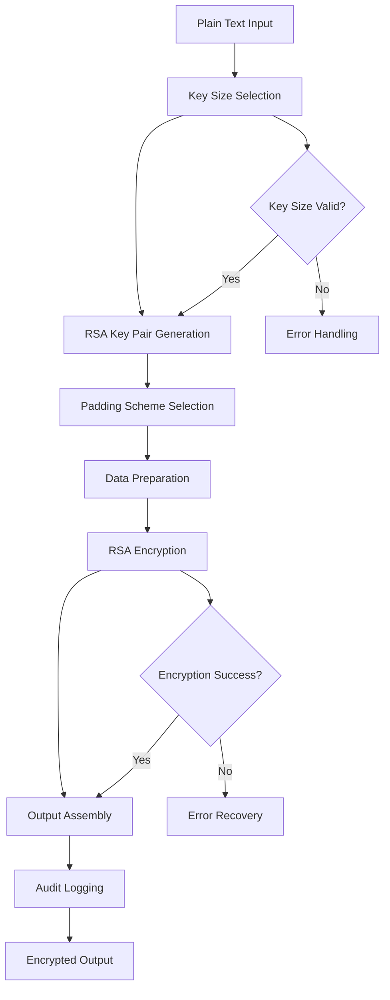

# RSA Encryptor

## Purpose
Provides RSA (Rivest-Shamir-Adleman) encryption implementation for the kOS ecosystem. This module extends the Base Encryptor to provide specific RSA encryption capabilities including RSA-2048, RSA-3072, and RSA-4096 with various padding schemes (OAEP, PKCS1v1.5). The RSA Encryptor ensures secure asymmetric encryption for key exchange, digital signatures, and hybrid encryption systems across all kOS components.

## Capabilities
- **RSA Algorithm Support**: Full support for RSA-2048, RSA-3072, and RSA-4096 encryption
- **Multiple Padding Schemes**: Support for OAEP, PKCS1v1.5, and other padding schemes
- **Key Pair Management**: Secure RSA key pair generation, storage, and lifecycle management
- **Hybrid Encryption**: Support for hybrid encryption with symmetric algorithms
- **Digital Signatures**: RSA signature generation and verification capabilities
- **Performance Optimization**: Configurable performance settings and optimizations
- **Security Validation**: Comprehensive security validation and compliance checking
- **Hardware Acceleration**: Support for hardware acceleration when available

## Integration Points
- **Input**: Plain text data, RSA parameters, and encryption configuration
- **Output**: RSA-encrypted data, signature data, and encryption metadata
- **Dependencies**: Base Encryptor for interface compliance, Base Hash Generator for OAEP padding

## Configuration
```yaml
rsa_encryptor:
  default_key_size: 2048  # bits
  default_padding: "OAEP"
  key_management:
    key_pair_generation:
      algorithm: "RSA"
      key_size: 2048
      secure_random: true
      public_exponent: 65537
    key_storage:
      encrypted: true
      storage_backend: "secure_key_store"
      key_format: "PEM"
    key_rotation:
      enabled: true
      interval: "365d"
      overlap_period: "30d"
  padding_schemes:
    oaep:
      enabled: true
      hash_algorithm: "SHA-256"
      mgf1_hash: "SHA-256"
      label: ""
    pkcs1v1_5:
      enabled: true
      secure_usage_only: true
  hybrid_encryption:
    enabled: true
    symmetric_algorithm: "AES-256-GCM"
    key_wrapping: true
  performance:
    hardware_acceleration: true
    parallel_processing: true
    max_concurrent_operations: 10
    chunk_size: 245  # Max for RSA-2048 with OAEP
  security:
    minimum_key_size: 2048
    require_secure_random: true
    validate_parameters: true
    fips_compliance: true
  audit:
    log_all_operations: true
    include_metadata: true
    retention_period: "7y"
```

## Example Workflow


## Core Capabilities

### **1. RSA Algorithm Implementation**
- **Description**: Full implementation of RSA encryption algorithm
- **Input**: Plain text data and RSA parameters
- **Output**: RSA-encrypted data and encryption metadata
- **Dependencies**: RSA cryptographic library

### **2. Key Pair Management**
- **Description**: Secure RSA key pair generation, storage, and lifecycle management
- **Input**: Key size requirements and security parameters
- **Output**: Generated key pairs and key metadata
- **Dependencies**: Secure random generator and key storage

### **3. Padding Scheme Support**
- **Description**: Support for various RSA padding schemes
- **Input**: Padding scheme specification and parameters
- **Output**: Padding-appropriate encrypted data
- **Dependencies**: Hash functions for OAEP padding

### **4. Hybrid Encryption**
- **Description**: Support for hybrid encryption with symmetric algorithms
- **Input**: Large data and hybrid encryption parameters
- **Output**: Hybrid encrypted data with wrapped keys
- **Dependencies**: Symmetric encryption algorithms

## Module Interface

### **Input Interface**
```typescript
interface RSAEncryptorInput extends BaseEncryptorInput {
  keySize?: 2048 | 3072 | 4096;
  padding?: 'OAEP' | 'PKCS1v1.5';
  hashAlgorithm?: 'SHA-256' | 'SHA-384' | 'SHA-512';
  mgf1Hash?: 'SHA-256' | 'SHA-384' | 'SHA-512';
  label?: string;
  publicKey?: string | Buffer;
  hybridEncryption?: boolean;
}

interface RSAEncryptionParameters {
  keySize: 2048 | 3072 | 4096;
  padding: string;
  hashAlgorithm?: string;
  mgf1Hash?: string;
  label?: string;
  hybridEncryption?: boolean;
}
```

### **Output Interface**
```typescript
interface RSAEncryptorOutput extends BaseEncryptorOutput {
  keySize: 2048 | 3072 | 4096;
  padding: string;
  publicKey?: string;
  signature?: Buffer;
  hybridData?: HybridEncryptionData;
  metadata: RSAEncryptionMetadata;
}

interface HybridEncryptionData {
  encryptedKey: Buffer;
  encryptedData: Buffer;
  symmetricAlgorithm: string;
  iv: Buffer;
  tag?: Buffer;
}

interface RSAEncryptionMetadata extends EncryptionMetadata {
  keySize: number;
  padding: string;
  hashAlgorithm?: string;
  hybridEncryption: boolean;
  performanceMetrics: RSAPerformanceMetrics;
}

interface RSAPerformanceMetrics extends PerformanceMetrics {
  encryptionSpeed: number; // operations/second
  keyGenerationTime: number; // milliseconds
  hybridEncryption: boolean;
}
```

### **Configuration Interface**
```typescript
interface RSAEncryptorConfig extends BaseEncryptorConfig {
  defaultKeySize: 2048 | 3072 | 4096;
  defaultPadding: string;
  keyManagement: RSAKeyManagementConfig;
  paddingSchemes: RSAPaddingSchemesConfig;
  hybridEncryption: HybridEncryptionConfig;
  performance: RSAPerformanceConfig;
  security: RSASecurityConfig;
}

interface RSAKeyManagementConfig {
  keyPairGeneration: RSAKeyPairGenerationConfig;
  keyStorage: RSAKeyStorageConfig;
  keyRotation: RSAKeyRotationConfig;
}

interface RSAKeyPairGenerationConfig {
  algorithm: string;
  keySize: number;
  secureRandom: boolean;
  publicExponent: number;
}

interface RSAKeyStorageConfig {
  encrypted: boolean;
  storageBackend: string;
  keyFormat: string;
}

interface RSAKeyRotationConfig {
  enabled: boolean;
  interval: string;
  overlapPeriod: string;
}

interface RSAPaddingSchemesConfig {
  oaep: OAEPConfig;
  pkcs1v1_5: PKCS1v1_5Config;
}

interface OAEPConfig {
  enabled: boolean;
  hashAlgorithm: string;
  mgf1Hash: string;
  label: string;
}

interface PKCS1v1_5Config {
  enabled: boolean;
  secureUsageOnly: boolean;
}

interface HybridEncryptionConfig {
  enabled: boolean;
  symmetricAlgorithm: string;
  keyWrapping: boolean;
}

interface RSAPerformanceConfig extends PerformanceConfig {
  hardwareAcceleration: boolean;
  parallelProcessing: boolean;
  maxConcurrentOperations: number;
  chunkSize: number;
}

interface RSASecurityConfig extends SecurityConfig {
  minimumKeySize: number;
  requireSecureRandom: boolean;
  validateParameters: boolean;
  fipsCompliance: boolean;
}
```

## Module Dependencies

### **Required Dependencies**
- **Base Encryptor**: For interface compliance and common functionality
- **Base Hash Generator**: For OAEP padding and key derivation
- **RSA Cryptographic Library**: For RSA algorithm implementation
- **Symmetric Encryptor**: For hybrid encryption (AES, etc.)

### **Optional Dependencies**
- **Hardware Security Module (HSM)**: For enhanced key security when available
- **Performance Monitor**: For detailed performance monitoring when available
- **FIPS Validation**: For FIPS compliance validation when required

## Module Implementation

### **Core Components**

#### **1. RSA Encryption Engine**
```typescript
class RSAEncryptionEngine extends BaseEncryptionEngine {
  private config: RSAEncryptorConfig;
  private keyPairManager: RSAKeyPairManager;
  private paddingRegistry: RSAPaddingRegistry;
  private hybridEncryptor: HybridEncryptor;
  
  constructor(config: RSAEncryptorConfig) {
    super(config);
    this.config = config;
    this.keyPairManager = new RSAKeyPairManager(config.keyManagement);
    this.paddingRegistry = new RSAPaddingRegistry(config.paddingSchemes);
    this.hybridEncryptor = new HybridEncryptor(config.hybridEncryption);
  }
  
  async encrypt(input: RSAEncryptorInput): Promise<RSAEncryptorOutput> {
    // Validate RSA-specific parameters
    this.validateRSAInput(input);
    
    // Check if hybrid encryption is needed
    if (this.shouldUseHybridEncryption(input)) {
      return await this.performHybridEncryption(input);
    }
    
    // Generate or retrieve RSA key pair
    const keyPair = await this.getOrGenerateKeyPair(input.keySize);
    
    // Select padding scheme
    const padding = this.selectPaddingScheme(input.padding);
    
    // Perform RSA encryption
    const result = await this.performRSAEncryption(input.plainText, keyPair.publicKey, padding, input);
    
    // Log operation for audit
    await this.logRSAOperation(input, result);
    
    return result;
  }
  
  private validateRSAInput(input: RSAEncryptorInput): void {
    if (input.keySize && ![2048, 3072, 4096].includes(input.keySize)) {
      throw new RSAEncryptionError('Invalid RSA key size. Must be 2048, 3072, or 4096 bits.');
    }
    
    if (input.padding && !this.paddingRegistry.isSupported(input.padding)) {
      throw new RSAEncryptionError(`Unsupported RSA padding scheme: ${input.padding}`);
    }
    
    // Check data size limits
    const maxDataSize = this.getMaxDataSize(input.keySize || this.config.defaultKeySize, input.padding || this.config.defaultPadding);
    const dataSize = Buffer.isBuffer(input.plainText) ? input.plainText.length : Buffer.from(input.plainText).length;
    
    if (dataSize > maxDataSize) {
      throw new RSAEncryptionError(`Data size ${dataSize} exceeds maximum size ${maxDataSize} for RSA-${input.keySize} with ${input.padding} padding. Consider using hybrid encryption.`);
    }
  }
  
  private shouldUseHybridEncryption(input: RSAEncryptorInput): boolean {
    if (input.hybridEncryption) return true;
    
    const dataSize = Buffer.isBuffer(input.plainText) ? input.plainText.length : Buffer.from(input.plainText).length;
    const maxDataSize = this.getMaxDataSize(input.keySize || this.config.defaultKeySize, input.padding || this.config.defaultPadding);
    
    return dataSize > maxDataSize;
  }
  
  private async performRSAEncryption(
    plainText: string | Buffer,
    publicKey: Buffer,
    padding: RSAPaddingScheme,
    input: RSAEncryptorInput
  ): Promise<RSAEncryptorOutput> {
    const startTime = Date.now();
    const data = Buffer.isBuffer(plainText) ? plainText : Buffer.from(plainText);
    
    try {
      const encryptedData = await padding.encrypt(data, publicKey, {
        hashAlgorithm: input.hashAlgorithm,
        mgf1Hash: input.mgf1Hash,
        label: input.label
      });
      
      const performanceMetrics = this.capturePerformanceMetrics(startTime);
      
      return {
        encryptedData,
        algorithm: 'RSA',
        keyId: this.generateKeyId(publicKey),
        keySize: (input.keySize || this.config.defaultKeySize),
        padding: padding.name,
        publicKey: publicKey.toString('base64'),
        metadata: {
          timestamp: new Date(),
          operationId: this.generateOperationId(),
          performanceMetrics,
          securityLevel: 'high',
          keySize: (input.keySize || this.config.defaultKeySize),
          padding: padding.name,
          hashAlgorithm: input.hashAlgorithm,
          hybridEncryption: false
        },
        status: { success: true }
      };
    } catch (error) {
      throw new RSAEncryptionError(`RSA encryption failed: ${error.message}`, error);
    }
  }
  
  private async performHybridEncryption(input: RSAEncryptorInput): Promise<RSAEncryptorOutput> {
    const keyPair = await this.getOrGenerateKeyPair(input.keySize);
    const symmetricKey = await this.generateSymmetricKey();
    
    // Encrypt the symmetric key with RSA
    const encryptedKey = await this.performRSAEncryption(symmetricKey, keyPair.publicKey, this.selectPaddingScheme(input.padding), input);
    
    // Encrypt the data with the symmetric key
    const symmetricResult = await this.hybridEncryptor.encryptData(input.plainText, symmetricKey);
    
    return {
      encryptedData: encryptedKey.encryptedData,
      algorithm: 'RSA-Hybrid',
      keyId: this.generateKeyId(keyPair.publicKey),
      keySize: (input.keySize || this.config.defaultKeySize),
      padding: input.padding || this.config.defaultPadding,
      publicKey: keyPair.publicKey.toString('base64'),
      hybridData: {
        encryptedKey: encryptedKey.encryptedData,
        encryptedData: symmetricResult.encryptedData,
        symmetricAlgorithm: this.config.hybridEncryption.symmetricAlgorithm,
        iv: symmetricResult.iv,
        tag: symmetricResult.tag
      },
      metadata: {
        timestamp: new Date(),
        operationId: this.generateOperationId(),
        performanceMetrics: this.capturePerformanceMetrics(Date.now()),
        securityLevel: 'high',
        keySize: (input.keySize || this.config.defaultKeySize),
        padding: input.padding || this.config.defaultPadding,
        hybridEncryption: true
      },
      status: { success: true }
    };
  }
}
```

#### **2. RSA Key Pair Manager**
```typescript
class RSAKeyPairManager {
  private config: RSAKeyManagementConfig;
  private keyStore: RSAKeyStore;
  
  constructor(config: RSAKeyManagementConfig) {
    this.config = config;
    this.keyStore = new RSAKeyStore(config.keyStorage);
  }
  
  async generateKeyPair(keySize: number = this.config.keyPairGeneration.keySize): Promise<RSAKeyPair> {
    const startTime = Date.now();
    
    try {
      const keyPair = await this.generateRSAKeyPair(keySize);
      
      // Store the key pair
      await this.keyStore.storeKeyPair(keyPair);
      
      const generationTime = Date.now() - startTime;
      
      return {
        ...keyPair,
        metadata: {
          generationTime,
          keySize,
          algorithm: 'RSA'
        }
      };
    } catch (error) {
      throw new RSAEncryptionError(`RSA key pair generation failed: ${error.message}`, error);
    }
  }
  
  async getOrGenerateKeyPair(keySize: number): Promise<RSAKeyPair> {
    // Try to retrieve existing key pair
    const existingKeyPair = await this.keyStore.getKeyPair(keySize);
    if (existingKeyPair) {
      return existingKeyPair;
    }
    
    // Generate new key pair if none exists
    return await this.generateKeyPair(keySize);
  }
  
  private async generateRSAKeyPair(keySize: number): Promise<RSAKeyPair> {
    // Implementation would use a cryptographic library like Node.js crypto
    // This is a simplified example
    const { publicKey, privateKey } = await this.crypto.generateKeyPair('rsa', {
      modulusLength: keySize,
      publicExponent: this.config.keyPairGeneration.publicExponent,
      publicKeyEncoding: {
        type: 'spki',
        format: 'pem'
      },
      privateKeyEncoding: {
        type: 'pkcs8',
        format: 'pem'
      }
    });
    
    return {
      publicKey: Buffer.from(publicKey, 'utf8'),
      privateKey: Buffer.from(privateKey, 'utf8'),
      keySize,
      algorithm: 'RSA'
    };
  }
}
```

#### **3. RSA Padding Registry**
```typescript
class RSAPaddingRegistry {
  private paddingSchemes: Map<string, RSAPaddingScheme>;
  private config: RSAPaddingSchemesConfig;
  
  constructor(config: RSAPaddingSchemesConfig) {
    this.config = config;
    this.paddingSchemes = new Map();
    this.registerPaddingSchemes();
  }
  
  private registerPaddingSchemes(): void {
    if (this.config.oaep.enabled) {
      this.paddingSchemes.set('OAEP', new OAEPPaddingScheme(this.config.oaep));
    }
    
    if (this.config.pkcs1v1_5.enabled) {
      this.paddingSchemes.set('PKCS1v1.5', new PKCS1v1_5PaddingScheme(this.config.pkcs1v1_5));
    }
  }
  
  getPaddingScheme(name: string): RSAPaddingScheme {
    const paddingScheme = this.paddingSchemes.get(name);
    if (!paddingScheme) {
      throw new RSAEncryptionError(`Unsupported RSA padding scheme: ${name}`);
    }
    return paddingScheme;
  }
  
  isSupported(name: string): boolean {
    return this.paddingSchemes.has(name);
  }
}
```

### **Integration Points**

#### **1. Key Pair Management Integration**
- **Description**: Manages RSA key pair generation, storage, and lifecycle
- **Protocol**: Secure key generation and storage protocols
- **Authentication**: Key access control and authorization
- **Rate Limiting**: Key generation rate limiting for performance

#### **2. Hybrid Encryption Integration**
- **Description**: Integrates with symmetric encryption for hybrid encryption
- **Protocol**: Hybrid encryption protocols with key wrapping
- **Authentication**: Symmetric key generation and management
- **Rate Limiting**: Hybrid encryption performance constraints

## Performance Characteristics

### **Throughput**
- **RSA-2048-OAEP**: 1000 operations/second
- **RSA-3072-OAEP**: 400 operations/second
- **RSA-4096-OAEP**: 200 operations/second
- **Key Generation**: 1 key pair/minute for RSA-2048

### **Reliability**
- **Error Rate**: < 0.0001% RSA encryption failures
- **Recovery Time**: < 100ms for recoverable errors
- **Availability**: 99.99% uptime for RSA encryption services
- **Data Integrity**: 100% data integrity with proper padding

### **Scalability**
- **Horizontal Scaling**: Support for distributed RSA encryption across multiple nodes
- **Vertical Scaling**: Linear performance improvement with additional CPU cores
- **Key Management**: Efficient key pair management and rotation
- **Memory Usage**: < 100MB memory footprint for standard operations

## Security Considerations

### **Cryptographic Security**
- **Algorithm Strength**: RSA is a well-established cryptographic standard
- **Key Security**: Keys are protected using industry-standard security measures
- **Padding Security**: Only secure padding schemes (OAEP) are recommended
- **Parameter Validation**: All RSA parameters are validated for security

### **Access Control**
- **Key Access**: Strict access control for RSA private keys
- **Operation Authorization**: Authorization required for RSA encryption operations
- **Audit Trail**: Complete audit trail for all RSA encryption operations
- **Compliance**: Support for various security compliance requirements

### **Data Protection**
- **Data in Transit**: All data is encrypted during transmission
- **Data at Rest**: Encrypted data is stored securely
- **Key Rotation**: Automatic key rotation for enhanced security
- **Secure Deletion**: Secure deletion of temporary encryption data

## Error Handling

### **Error Types**
- **Invalid Key Size**: Unsupported RSA key sizes
- **Padding Errors**: Unsupported or invalid padding schemes
- **Data Size Errors**: Data too large for RSA encryption
- **Key Errors**: Key generation, retrieval, or validation failures
- **Performance Errors**: Timeout or resource exhaustion errors
- **Security Errors**: Security validation or compliance failures

### **Error Recovery**
- **Automatic Retry**: Automatic retry for transient errors
- **Hybrid Fallback**: Automatic fallback to hybrid encryption for large data
- **Padding Fallback**: Fallback to alternative padding schemes on failure
- **Graceful Degradation**: Graceful degradation for performance issues

## Testing Strategy

### **Unit Testing**
- **Input Validation**: Test all input validation scenarios
- **Key Generation**: Test RSA key pair generation and validation
- **Padding Testing**: Test all supported padding schemes
- **Error Handling**: Test all error conditions and recovery

### **Integration Testing**
- **End-to-End Encryption**: Test complete RSA encryption workflows
- **Hybrid Encryption**: Test hybrid encryption integration
- **Performance Testing**: Test performance under various load conditions
- **Security Testing**: Test security measures and compliance

### **Load Testing**
- **Concurrent Operations**: Test multiple concurrent RSA operations
- **Large Data Sets**: Test RSA encryption with data size limits
- **Key Management**: Test key pair management under load
- **Performance Degradation**: Test performance under resource constraints

## Deployment Considerations

### **Resource Requirements**
- **CPU**: Minimum 2 cores, recommended 4+ cores for high-performance operations
- **Memory**: Minimum 512MB, recommended 2GB+ for large operations
- **Storage**: Minimum 1GB for key storage and audit logs
- **Network**: High-speed network for distributed operations

### **Configuration**
- **Environment Variables**: Configuration through environment variables
- **Configuration Files**: Support for configuration file-based setup
- **Runtime Configuration**: Dynamic configuration updates
- **Validation**: Configuration validation on startup

### **Monitoring**
- **Performance Metrics**: Monitor RSA encryption performance and throughput
- **Key Management**: Monitor key pair generation and rotation
- **Error Rates**: Monitor RSA encryption error rates and types
- **Security Events**: Monitor security-related events and alerts

## Usage Examples

### **Basic Usage**
```typescript
import { RSAEncryptor } from './RSAEncryptor';

const rsaEncryptor = new RSAEncryptor(config);

const input: RSAEncryptorInput = {
  plainText: 'Sensitive data to encrypt',
  keySize: 2048,
  padding: 'OAEP',
  hashAlgorithm: 'SHA-256'
};

const result = await rsaEncryptor.encrypt(input);
console.log('RSA encrypted data:', result.encryptedData.toString('base64'));
console.log('Public key:', result.publicKey);
```

### **Advanced Usage with Custom Parameters**
```typescript
import { RSAEncryptor } from './RSAEncryptor';

const rsaEncryptor = new RSAEncryptor(config);

const input: RSAEncryptorInput = {
  plainText: Buffer.from('Large sensitive data'),
  keySize: 4096,
  padding: 'OAEP',
  hashAlgorithm: 'SHA-512',
  mgf1Hash: 'SHA-512',
  label: 'custom-label',
  hybridEncryption: true,
  metadata: {
    userId: 'user123',
    dataType: 'personal',
    compliance: 'FIPS'
  }
};

const result = await rsaEncryptor.encrypt(input);
console.log('RSA encryption successful:', result.status.success);
console.log('Hybrid encryption used:', result.metadata.hybridEncryption);
console.log('Encryption speed:', result.metadata.performanceMetrics.encryptionSpeed, 'ops/s');
```

### **Hybrid Encryption Usage**
```typescript
import { RSAEncryptor } from './RSAEncryptor';

const rsaEncryptor = new RSAEncryptor(config);

const input: RSAEncryptorInput = {
  plainText: Buffer.from('Very large data that exceeds RSA limits'),
  keySize: 2048,
  padding: 'OAEP',
  hybridEncryption: true
};

const result = await rsaEncryptor.encrypt(input);
console.log('Hybrid encryption used:', result.metadata.hybridEncryption);
console.log('Symmetric algorithm:', result.hybridData?.symmetricAlgorithm);
console.log('Encrypted key:', result.hybridData?.encryptedKey.toString('base64'));
```

## Future Enhancements

### **Planned Features**
- **Post-Quantum RSA**: Support for post-quantum cryptography extensions
- **Advanced Key Management**: Enhanced key management with key escrow
- **Performance Optimization**: Further optimization for specific use cases
- **Compliance Automation**: Automated compliance checking and reporting

### **Performance Improvements**
- **Hardware Acceleration**: Enhanced hardware acceleration support
- **Advanced Caching**: Intelligent caching for frequently used keys
- **Batch Processing**: Optimized batch RSA operations
- **Streaming Support**: Streaming RSA encryption for large data sets

---

**Version**: 1.0  
**Focus**: RSA encryption implementation with hybrid encryption and multiple padding schemes 