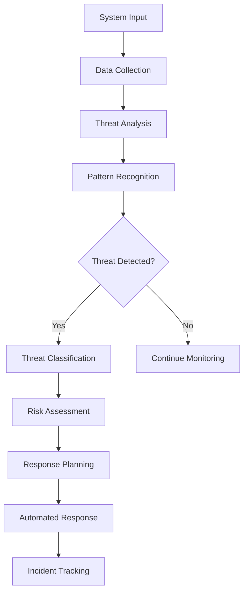
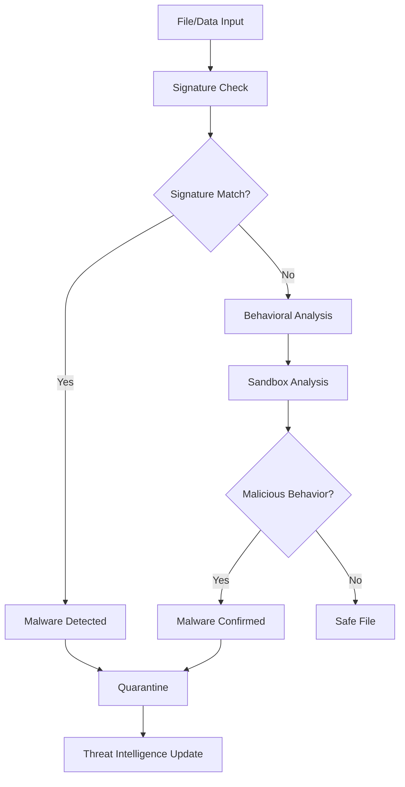
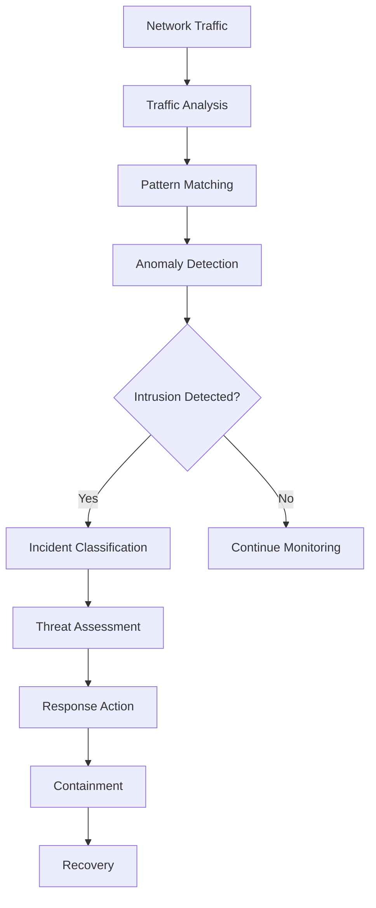

# **Threat Detection Index**

## **Purpose**

This subcategory provides comprehensive threat detection and security monitoring capabilities for the kOS ecosystem. It handles vulnerability scanning, malware detection, intrusion detection, firewall management, and security incident response with real-time threat intelligence and automated response capabilities.

## **Core Principles**

### **Threat Intelligence**
- **Real-Time Detection**: Continuous monitoring and real-time threat detection
- **Intelligence Sharing**: Integration with threat intelligence feeds and platforms
- **Behavioral Analysis**: Advanced behavioral analysis for threat detection
- **Machine Learning**: ML-based threat detection and pattern recognition

### **Security Monitoring**
- **Comprehensive Coverage**: Monitoring across all system components and networks
- **Multi-Layer Detection**: Multiple detection layers for comprehensive protection
- **False Positive Reduction**: Advanced algorithms to reduce false positives
- **Incident Correlation**: Correlation of security events for threat analysis

### **Response & Recovery**
- **Automated Response**: Automated threat response and containment
- **Incident Management**: Comprehensive incident management and tracking
- **Recovery Procedures**: Automated recovery and system restoration
- **Forensic Analysis**: Digital forensics and incident investigation

## **Function Specifications**

### **Vulnerability Management**
1. **[Vulnerability Scanner](01_Vulnerability_Scanner.md)** - Comprehensive vulnerability scanning and assessment
2. **[Patch Manager](02_Patch_Manager.md)** - Automated patch management and deployment
3. **[Configuration Scanner](03_Configuration_Scanner.md)** - Security configuration scanning and validation
4. **[Compliance Checker](04_Compliance_Checker.md)** - Compliance scanning and reporting

### **Malware Detection**
5. **[Malware Detector](05_Malware_Detector.md)** - Real-time malware detection and analysis
6. **[Sandbox Analyzer](06_Sandbox_Analyzer.md)** - Malware sandbox analysis and behavior monitoring
7. **[Signature Manager](07_Signature_Manager.md)** - Malware signature management and updates
8. **[Quarantine Manager](08_Quarantine_Manager.md)** - Malware quarantine and isolation management

### **Intrusion Detection**
9. **[Intrusion Detector](09_Intrusion_Detector.md)** - Network and host-based intrusion detection
10. **[Anomaly Detector](10_Anomaly_Detector.md)** - Behavioral anomaly detection and analysis
11. **[Traffic Analyzer](11_Traffic_Analyzer.md)** - Network traffic analysis and monitoring
12. **[Log Analyzer](12_Log_Analyzer.md)** - Security log analysis and correlation

### **Firewall & Network Security**
13. **[Firewall Manager](13_Firewall_Manager.md)** - Firewall configuration and management
14. **[Network Monitor](14_Network_Monitor.md)** - Network security monitoring and alerting
15. **[Access Controller](15_Access_Controller.md)** - Network access control and filtering
16. **[VPN Manager](16_VPN_Manager.md)** - VPN configuration and management

## **Integration Patterns**

### **Threat Detection Flow**


### **Malware Detection Flow**


### **Intrusion Detection Flow**


## **Threat Detection Capabilities**

### **Vulnerability Assessment**
- **Automated Scanning**: Automated vulnerability scanning across all systems
- **Risk Scoring**: CVSS-based risk scoring and prioritization
- **Patch Management**: Automated patch deployment and verification
- **Configuration Validation**: Security configuration validation and remediation
- **Compliance Monitoring**: Continuous compliance monitoring and reporting

### **Malware Protection**
- **Real-Time Scanning**: Real-time malware scanning and detection
- **Behavioral Analysis**: Advanced behavioral analysis for unknown threats
- **Sandbox Analysis**: Isolated sandbox analysis for suspicious files
- **Signature Updates**: Automatic signature updates and threat intelligence
- **Quarantine Management**: Automated quarantine and isolation procedures

### **Intrusion Detection**
- **Network Monitoring**: Comprehensive network traffic monitoring
- **Host Monitoring**: Host-based intrusion detection and monitoring
- **Anomaly Detection**: Behavioral anomaly detection and analysis
- **Threat Correlation**: Correlation of security events and threats
- **Incident Response**: Automated incident response and containment

### **Network Security**
- **Firewall Management**: Advanced firewall configuration and management
- **Access Control**: Granular network access control and filtering
- **VPN Management**: Secure VPN configuration and management
- **Traffic Analysis**: Deep packet inspection and traffic analysis
- **Security Monitoring**: Comprehensive network security monitoring

## **Configuration Examples**

### **Vulnerability Management Configuration**
```yaml
vulnerability_management:
  scanning:
    automated: true
    frequency: "daily"
    scan_depth: "comprehensive"
    risk_threshold: "medium"
  patching:
    automated: true
    approval_required: false
    rollback_enabled: true
    testing_environment: true
  compliance:
    frameworks:
      - gdpr
      - sox
      - hipaa
      - pci_dss
    reporting: true
    remediation: true
```

### **Malware Detection Configuration**
```yaml
malware_detection:
  real_time_scanning:
    enabled: true
    scan_on_access: true
    scan_on_write: true
    scan_archives: true
  behavioral_analysis:
    enabled: true
    machine_learning: true
    anomaly_detection: true
    false_positive_reduction: true
  sandbox_analysis:
    enabled: true
    timeout: "5m"
    network_access: false
    file_access: "read_only"
  quarantine:
    automatic: true
    notification: true
    review_period: "24h"
    cleanup_automated: true
```

### **Intrusion Detection Configuration**
```yaml
intrusion_detection:
  network_monitoring:
    enabled: true
    deep_packet_inspection: true
    protocol_analysis: true
    traffic_correlation: true
  host_monitoring:
    enabled: true
    file_integrity: true
    process_monitoring: true
    registry_monitoring: true
  anomaly_detection:
    enabled: true
    machine_learning: true
    baseline_learning: true
    adaptive_thresholds: true
  incident_response:
    automated: true
    containment: true
    notification: true
    escalation: true
```

### **Network Security Configuration**
```yaml
network_security:
  firewall:
    enabled: true
    rule_optimization: true
    automatic_updates: true
    logging: true
  access_control:
    enabled: true
    granular_control: true
    time_based_rules: true
    user_based_rules: true
  vpn:
    enabled: true
    encryption: "AES-256"
    authentication: "multi_factor"
    split_tunneling: false
  monitoring:
    traffic_analysis: true
    security_alerts: true
    performance_monitoring: true
    compliance_reporting: true
```

## **Error Handling**

### **Detection Errors**
- **Scanner Failures**: Automatic retry with different scanning methods
- **False Positives**: Machine learning-based false positive reduction
- **System Overload**: Load balancing and resource allocation optimization
- **Communication Failures**: Offline operation with local caching and sync
- **Update Failures**: Automatic update retry and fallback mechanisms

### **Response Errors**
- **Automation Failures**: Manual intervention with administrator notification
- **Containment Failures**: Escalation procedures and manual containment
- **Recovery Failures**: Backup recovery procedures and system restoration
- **Communication Failures**: Alternative communication channels and notifications
- **Compliance Violations**: Automatic reporting and remediation procedures

### **Performance Errors**
- **Resource Exhaustion**: Resource optimization and load balancing
- **Latency Issues**: Performance optimization and caching strategies
- **Throughput Limitations**: Scalability improvements and parallel processing
- **Memory Issues**: Memory optimization and garbage collection
- **Network Issues**: Network optimization and redundancy

## **Performance Considerations**

### **Detection Performance**
- **Scan Performance**: Optimized scanning with parallel processing
- **Analysis Performance**: Efficient analysis algorithms and caching
- **Correlation Performance**: Fast correlation with indexed data structures
- **Response Performance**: Sub-second response times for critical threats
- **Scalability**: Horizontal scaling for high-volume environments

### **Resource Optimization**
- **Memory Usage**: Efficient memory usage with optimized data structures
- **CPU Utilization**: Optimized CPU usage with parallel processing
- **Network Bandwidth**: Efficient network usage with compression and filtering
- **Storage Optimization**: Optimized storage with compression and archiving
- **Power Consumption**: Power-efficient operation for mobile and IoT devices

### **Monitoring Performance**
- **Real-Time Processing**: Real-time processing with minimal latency
- **Batch Processing**: Efficient batch processing for large datasets
- **Query Performance**: Fast queries with optimized indexing
- **Alert Performance**: Fast alert generation and delivery
- **Reporting Performance**: Efficient report generation and delivery

## **Monitoring & Observability**

### **Threat Detection Metrics**
- **Detection Rate**: Track threat detection success rate and accuracy
- **False Positive Rate**: Monitor false positive rate and reduction effectiveness
- **Response Time**: Track threat response times and automation effectiveness
- **Coverage**: Monitor threat detection coverage across all systems
- **Intelligence Quality**: Track threat intelligence quality and effectiveness

### **Security Performance Metrics**
- **System Performance**: Monitor system performance and resource utilization
- **Network Performance**: Track network performance and security impact
- **User Experience**: Monitor user experience and security transparency
- **Compliance Status**: Track compliance status and audit readiness
- **Incident Metrics**: Monitor incident frequency, severity, and resolution

### **Operational Metrics**
- **System Availability**: Track system availability and uptime
- **Maintenance Windows**: Monitor maintenance windows and impact
- **Update Success Rate**: Track update success rate and deployment effectiveness
- **Backup Status**: Monitor backup status and recovery readiness
- **Capacity Planning**: Track capacity utilization and planning effectiveness

### **Alerting**
- **Threat Alerts**: Real-time alerts for detected threats and security incidents
- **Performance Alerts**: Alerts for performance degradation and resource issues
- **Compliance Alerts**: Alerts for compliance violations and audit failures
- **System Alerts**: Alerts for system health issues and maintenance requirements
- **Intelligence Alerts**: Alerts for new threat intelligence and emerging threats

## **Security Considerations**

### **Detection Security**
- **Tamper Protection**: Protection against detection system tampering
- **Data Protection**: Protection of detection data and threat intelligence
- **Access Control**: Strict access control for detection systems and data
- **Audit Trails**: Complete audit trails for all detection operations
- **Encryption**: Encryption of detection data and communications

### **Response Security**
- **Automation Security**: Secure automation and response procedures
- **Containment Security**: Secure containment and isolation procedures
- **Recovery Security**: Secure recovery and restoration procedures
- **Communication Security**: Secure communication and notification procedures
- **Forensic Security**: Secure forensic analysis and evidence preservation

### **Compliance & Governance**
- **Regulatory Compliance**: Full compliance with security regulations
- **Industry Standards**: Adherence to security standards and best practices
- **Audit Requirements**: Complete audit trails and compliance reporting
- **Incident Reporting**: Comprehensive incident reporting and documentation
- **Governance**: Clear security governance and accountability

---

**Version**: 1.0  
**Focus**: Comprehensive threat detection and security monitoring capabilities for kOS ecosystem 