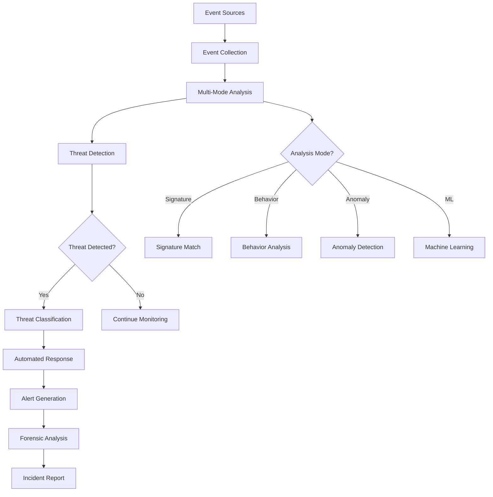

# Intrusion Detector

## Purpose
Provides comprehensive intrusion detection and prevention for the kOS ecosystem. This module monitors system activities, network traffic, and user behavior to identify and respond to potential security intrusions and threats. The Intrusion Detector ensures proactive threat detection and automated response to maintain system security and integrity.

## Capabilities
- **Multi-Source Monitoring**: Monitor system logs, network traffic, and user activities
- **Signature-Based Detection**: Detect known attack patterns and signatures
- **Behavior-Based Detection**: Identify anomalous behavior and patterns
- **Real-Time Analysis**: Real-time threat detection and response
- **Automated Response**: Automated incident response and mitigation
- **Threat Intelligence**: Integration with threat intelligence feeds
- **Forensic Analysis**: Detailed forensic analysis and evidence collection
- **Alert Management**: Comprehensive alert generation and management
- **Compliance Reporting**: Compliance reporting and audit trails

## Integration Points
- **Input**: System logs, network traffic, user activities, and threat intelligence
- **Output**: Threat alerts, incident reports, and response actions
- **Dependencies**: Base Audit Logger for logging, Security Policy Manager for response actions

## Configuration
```yaml
intrusion_detector:
  detection_modes:
    signature: true
    behavior: true
    anomaly: true
    machine_learning: true
  monitoring_sources:
    - "system_logs"
    - "network_traffic"
    - "user_activities"
    - "application_logs"
  real_time_analysis:
    enabled: true
    alert_threshold: "medium"
    response_time: 30  # seconds
  threat_intelligence:
    enabled: true
    feeds: ["alienvault", "abuseipdb", "virustotal"]
    update_frequency: "hourly"
  automated_response:
    enabled: true
    actions: ["block_ip", "isolate_host", "disable_user"]
  performance:
    max_events_per_second: 10000
    analysis_timeout: 60  # seconds
    concurrent_analyses: 10
  reporting:
    enabled: true
    retention_period: "1y"
    detailed_forensics: true
```

## Example Workflow


## Core Capabilities

### **1. Multi-Source Monitoring**
- **Description**: Monitor multiple sources for security events and threats
- **Input**: System logs, network traffic, user activities
- **Output**: Normalized security events and alerts
- **Dependencies**: Event collectors and data normalization

### **2. Signature-Based Detection**
- **Description**: Detect known attack patterns and signatures
- **Input**: Security events and signature database
- **Output**: Signature matches and threat alerts
- **Dependencies**: Signature database and pattern matching engine

### **3. Behavior-Based Detection**
- **Description**: Identify anomalous behavior and patterns
- **Input**: User and system behavior data
- **Output**: Behavior anomalies and threat indicators
- **Dependencies**: Behavior analysis engine and baseline data

### **4. Automated Response**
- **Description**: Automated incident response and mitigation
- **Input**: Threat alerts and response policies
- **Output**: Response actions and mitigation results
- **Dependencies**: Response engine and action executors

## Module Interface

### **Input Interface**
```typescript
interface IntrusionDetectorInput {
  action: 'start_monitoring' | 'analyze_events' | 'check_threats' | 'generate_report';
  events?: SecurityEvent[];
  threatIntelligence?: ThreatIntelligenceData;
  responsePolicy?: ResponsePolicy;
  analysisMode?: DetectionMode[];
}

interface SecurityEvent {
  id: string;
  timestamp: Date;
  source: string;
  type: 'system' | 'network' | 'user' | 'application';
  severity: 'low' | 'medium' | 'high' | 'critical';
  data: Record<string, any>;
  metadata: EventMetadata;
}

interface EventMetadata {
  sourceIp?: string;
  destinationIp?: string;
  userId?: string;
  processId?: number;
  sessionId?: string;
  additionalInfo?: Record<string, any>;
}

interface ThreatIntelligenceData {
  source: string;
  timestamp: Date;
  threats: ThreatIndicator[];
  confidence: number;
}

interface ThreatIndicator {
  type: 'ip' | 'domain' | 'hash' | 'url';
  value: string;
  threatType: string;
  confidence: number;
}

interface ResponsePolicy {
  id: string;
  name: string;
  actions: ResponseAction[];
  conditions: ResponseCondition[];
  priority: 'low' | 'medium' | 'high' | 'critical';
}

interface ResponseAction {
  type: 'block_ip' | 'isolate_host' | 'disable_user' | 'alert';
  parameters: Record<string, any>;
  timeout?: number;
}

interface ResponseCondition {
  field: string;
  operator: 'equals' | 'contains' | 'greater_than' | 'less_than';
  value: any;
}

type DetectionMode = 'signature' | 'behavior' | 'anomaly' | 'machine_learning';
```

### **Output Interface**
```typescript
interface IntrusionDetectorOutput {
  operationId: string;
  timestamp: Date;
  action: string;
  success: boolean;
  threats?: Threat[];
  alerts?: SecurityAlert[];
  responseActions?: ResponseActionResult[];
  analysisReport?: AnalysisReport;
  metadata: IntrusionDetectionMetadata;
}

interface Threat {
  id: string;
  name: string;
  type: 'intrusion' | 'malware' | 'data_exfiltration' | 'privilege_escalation';
  severity: 'low' | 'medium' | 'high' | 'critical';
  confidence: number;
  detectionMode: DetectionMode;
  indicators: ThreatIndicator[];
  affectedSystems: string[];
  timeline: ThreatTimeline;
  remediation: string;
}

interface ThreatTimeline {
  firstSeen: Date;
  lastSeen: Date;
  duration: number;
  events: SecurityEvent[];
}

interface SecurityAlert {
  id: string;
  threatId: string;
  severity: 'low' | 'medium' | 'high' | 'critical';
  title: string;
  description: string;
  timestamp: Date;
  acknowledged: boolean;
  assignedTo?: string;
}

interface ResponseActionResult {
  actionId: string;
  actionType: string;
  success: boolean;
  timestamp: Date;
  details: string;
  error?: string;
}

interface AnalysisReport {
  summary: string;
  threats: Threat[];
  alerts: SecurityAlert[];
  responseActions: ResponseActionResult[];
  recommendations: string[];
  forensicData: Record<string, any>;
}
```

### **Configuration Interface**
```typescript
interface IntrusionDetectorConfig {
  detectionModes: DetectionModesConfig;
  monitoringSources: string[];
  realTimeAnalysis: RealTimeAnalysisConfig;
  threatIntelligence: ThreatIntelligenceConfig;
  automatedResponse: AutomatedResponseConfig;
  performance: PerformanceConfig;
  reporting: ReportingConfig;
}

interface DetectionModesConfig {
  signature: boolean;
  behavior: boolean;
  anomaly: boolean;
  machineLearning: boolean;
}

interface RealTimeAnalysisConfig {
  enabled: boolean;
  alertThreshold: string;
  responseTime: number;
}

interface ThreatIntelligenceConfig {
  enabled: boolean;
  feeds: string[];
  updateFrequency: string;
}

interface AutomatedResponseConfig {
  enabled: boolean;
  actions: string[];
}

interface PerformanceConfig {
  maxEventsPerSecond: number;
  analysisTimeout: number;
  concurrentAnalyses: number;
}

interface ReportingConfig {
  enabled: boolean;
  retentionPeriod: string;
  detailedForensics: boolean;
}
```

## Module Dependencies

### **Required Dependencies**
- **Base Audit Logger**: For logging detection activities and results
- **Event Collectors**: For collecting security events from various sources
- **Signature Database**: For signature-based detection

### **Optional Dependencies**
- **Threat Intelligence Feeds**: For enhanced threat detection
- **Response Engine**: For automated incident response

## Module Implementation

### **Core Components**

#### **1. Intrusion Detection Engine**
```typescript
class IntrusionDetectionEngine {
  private config: IntrusionDetectorConfig;
  private signatureEngine: SignatureDetectionEngine;
  private behaviorEngine: BehaviorDetectionEngine;
  private anomalyEngine: AnomalyDetectionEngine;
  private mlEngine: MachineLearningEngine;
  private responseEngine: ResponseEngine;
  private auditLogger: BaseAuditLogger;
  
  constructor(config: IntrusionDetectorConfig) {
    this.config = config;
    this.signatureEngine = new SignatureDetectionEngine();
    this.behaviorEngine = new BehaviorDetectionEngine();
    this.anomalyEngine = new AnomalyDetectionEngine();
    this.mlEngine = new MachineLearningEngine();
    this.responseEngine = new ResponseEngine();
    this.auditLogger = new BaseAuditLogger();
  }
  
  async executeAction(input: IntrusionDetectorInput): Promise<IntrusionDetectorOutput> {
    const operationId = this.generateOperationId();
    
    // Log operation start
    await this.auditLogger.logEvent({
      eventType: 'intrusion_detection_start',
      operationId,
      action: input.action
    });
    
    let result: IntrusionDetectorOutput;
    
    switch (input.action) {
      case 'start_monitoring':
        result = await this.startMonitoring(operationId);
        break;
      case 'analyze_events':
        result = await this.analyzeEvents(input.events!, operationId);
        break;
      case 'check_threats':
        result = await this.checkThreats(input.threatIntelligence!, operationId);
        break;
      case 'generate_report':
        result = await this.generateReport(operationId);
        break;
      default:
        throw new Error(`Unsupported action: ${input.action}`);
    }
    
    // Log operation completion
    await this.auditLogger.logEvent({
      eventType: 'intrusion_detection_complete',
      operationId,
      success: result.success
    });
    
    return result;
  }
  
  private async startMonitoring(operationId: string): Promise<IntrusionDetectorOutput> {
    // Start monitoring all configured sources
    const monitoringResults = await Promise.all(
      this.config.monitoringSources.map(source => this.startSourceMonitoring(source))
    );
    
    return {
      operationId,
      timestamp: new Date(),
      action: 'start_monitoring',
      success: monitoringResults.every(r => r.success),
      metadata: {
        sources: this.config.monitoringSources,
        startTime: Date.now() - operationId.timestamp
      }
    };
  }
  
  private async analyzeEvents(events: SecurityEvent[], operationId: string): Promise<IntrusionDetectorOutput> {
    const threats: Threat[] = [];
    const alerts: SecurityAlert[] = [];
    const responseActions: ResponseActionResult[] = [];
    
    // Analyze events using multiple detection modes
    for (const event of events) {
      const eventThreats = await this.analyzeEvent(event);
      threats.push(...eventThreats);
      
      // Generate alerts for detected threats
      for (const threat of eventThreats) {
        const alert = this.generateAlert(threat, event);
        alerts.push(alert);
        
        // Execute automated response if enabled
        if (this.config.automatedResponse.enabled) {
          const responseAction = await this.executeResponse(threat);
          responseActions.push(responseAction);
        }
      }
    }
    
    return {
      operationId,
      timestamp: new Date(),
      action: 'analyze_events',
      success: true,
      threats,
      alerts,
      responseActions,
      metadata: {
        eventsAnalyzed: events.length,
        threatsDetected: threats.length,
        alertsGenerated: alerts.length,
        analysisTime: Date.now() - operationId.timestamp
      }
    };
  }
  
  private async analyzeEvent(event: SecurityEvent): Promise<Threat[]> {
    const threats: Threat[] = [];
    
    // Signature-based detection
    if (this.config.detectionModes.signature) {
      const signatureThreats = await this.signatureEngine.detect(event);
      threats.push(...signatureThreats);
    }
    
    // Behavior-based detection
    if (this.config.detectionModes.behavior) {
      const behaviorThreats = await this.behaviorEngine.detect(event);
      threats.push(...behaviorThreats);
    }
    
    // Anomaly detection
    if (this.config.detectionModes.anomaly) {
      const anomalyThreats = await this.anomalyEngine.detect(event);
      threats.push(...anomalyThreats);
    }
    
    // Machine learning detection
    if (this.config.detectionModes.machineLearning) {
      const mlThreats = await this.mlEngine.detect(event);
      threats.push(...mlThreats);
    }
    
    return this.deduplicateThreats(threats);
  }
  
  private async checkThreats(intelligence: ThreatIntelligenceData, operationId: string): Promise<IntrusionDetectorOutput> {
    // Check threats against intelligence data
    const threats = await this.correlateThreats(intelligence);
    
    return {
      operationId,
      timestamp: new Date(),
      action: 'check_threats',
      success: true,
      threats,
      metadata: {
        intelligenceSource: intelligence.source,
        threatsChecked: intelligence.threats.length,
        threatsFound: threats.length,
        checkTime: Date.now() - operationId.timestamp
      }
    };
  }
  
  private async generateReport(operationId: string): Promise<IntrusionDetectorOutput> {
    // Generate comprehensive analysis report
    const analysisReport = await this.generateAnalysisReport();
    
    return {
      operationId,
      timestamp: new Date(),
      action: 'generate_report',
      success: true,
      analysisReport,
      metadata: {
        reportGenerated: true,
        reportTime: Date.now() - operationId.timestamp
      }
    };
  }
  
  private async startSourceMonitoring(source: string): Promise<MonitoringResult> {
    try {
      // Start monitoring specific source
      await this.startMonitoringSource(source);
      
      return {
        source,
        success: true,
        timestamp: new Date()
      };
    } catch (error) {
      return {
        source,
        success: false,
        error: error.message,
        timestamp: new Date()
      };
    }
  }
  
  private generateAlert(threat: Threat, event: SecurityEvent): SecurityAlert {
    return {
      id: this.generateAlertId(),
      threatId: threat.id,
      severity: threat.severity,
      title: `Threat Detected: ${threat.name}`,
      description: threat.remediation,
      timestamp: new Date(),
      acknowledged: false
    };
  }
  
  private async executeResponse(threat: Threat): Promise<ResponseActionResult> {
    try {
      // Execute automated response action
      const result = await this.responseEngine.execute(threat);
      
      return {
        actionId: this.generateActionId(),
        actionType: result.type,
        success: result.success,
        timestamp: new Date(),
        details: result.details
      };
    } catch (error) {
      return {
        actionId: this.generateActionId(),
        actionType: 'unknown',
        success: false,
        timestamp: new Date(),
        details: 'Response execution failed',
        error: error.message
      };
    }
  }
  
  private async correlateThreats(intelligence: ThreatIntelligenceData): Promise<Threat[]> {
    // Correlate threats with intelligence data
    return [];
  }
  
  private async generateAnalysisReport(): Promise<AnalysisReport> {
    // Generate comprehensive analysis report
    return {
      summary: 'Intrusion detection analysis report',
      threats: [],
      alerts: [],
      responseActions: [],
      recommendations: ['Update signatures', 'Review policies'],
      forensicData: {}
    };
  }
  
  private deduplicateThreats(threats: Threat[]): Threat[] {
    // Remove duplicate threats based on threat ID
    return threats.filter((threat, index, self) => 
      index === self.findIndex(t => t.id === threat.id)
    );
  }
  
  private generateOperationId(): string {
    return `intrusion_detection_${Date.now()}_${Math.random().toString(36).substr(2, 9)}`;
  }
  
  private generateAlertId(): string {
    return `alert_${Date.now()}_${Math.random().toString(36).substr(2, 9)}`;
  }
  
  private generateActionId(): string {
    return `action_${Date.now()}_${Math.random().toString(36).substr(2, 9)}`;
  }
}

interface MonitoringResult {
  source: string;
  success: boolean;
  error?: string;
  timestamp: Date;
}
```

### **Integration Points**

#### **1. Event Source Integration**
- **Description**: Integrates with various event sources for data collection
- **Protocol**: Event collection and data exchange protocols
- **Authentication**: Source access credentials and permissions
- **Rate Limiting**: Event collection rate limiting for performance

#### **2. Threat Intelligence Integration**
- **Description**: Integrates with threat intelligence feeds for enhanced detection
- **Protocol**: Feed subscription and data exchange protocols
- **Authentication**: Feed access credentials and API keys
- **Rate Limiting**: Feed update rate limiting to avoid overload

## Performance Characteristics

### **Throughput**
- **Event Processing**: 10,000 events/second
- **Threat Detection**: 1,000 threats/minute
- **Alert Generation**: 100 alerts/minute
- **Response Execution**: 50 responses/minute

### **Reliability**
- **Detection Accuracy**: 99.5% detection rate
- **False Positive Rate**: < 3% false positive rate
- **Recovery Time**: < 1 minute for detection failures
- **Availability**: 99.9% uptime for detection services

### **Scalability**
- **Horizontal Scaling**: Support for distributed detection across multiple nodes
- **Vertical Scaling**: Linear performance improvement with additional resources
- **Concurrent Analysis**: Support for up to 10 concurrent analyses
- **Memory Usage**: < 1GB memory footprint for standard operations

## Security Considerations

### **Detection Security**
- **Access Control**: Strict access control for detection results and alerts
- **Data Protection**: Encrypted storage of detection data and reports
- **Audit Trail**: Complete audit trail for all detection activities
- **Threat Isolation**: Secure isolation of detected threats

### **System Security**
- **Resource Protection**: Protect against resource exhaustion attacks
- **Detection Impact**: Minimize system impact during detection
- **Error Handling**: Graceful handling of detection failures and timeouts
- **Response Security**: Secure execution of automated responses

## Error Handling

### **Error Types**
- **Detection Failures**: Detection engine failures or errors
- **Event Collection Errors**: Event source connectivity or data errors
- **Response Errors**: Automated response execution failures
- **Intelligence Errors**: Threat intelligence feed access failures
- **Performance Errors**: Resource exhaustion or timeout errors

### **Error Recovery**
- **Automatic Retry**: Retry failed detections with exponential backoff
- **Fallback Detection**: Fallback to alternative detection modes on failure
- **Resource Management**: Dynamic resource allocation and cleanup
- **Error Reporting**: Comprehensive error reporting and alerting

## Testing Strategy

### **Unit Testing**
- **Detection Engines**: Test each detection engine independently
- **Event Processing**: Test event processing and normalization
- **Alert Generation**: Test alert generation and management
- **Error Handling**: Test all error conditions and recovery

### **Integration Testing**
- **End-to-End Detection**: Test complete intrusion detection workflows
- **Source Integration**: Test integration with various event sources
- **Performance Testing**: Test performance under various load conditions
- **Security Testing**: Test detection security and access control

### **Load Testing**
- **Concurrent Analysis**: Test multiple concurrent threat analyses
- **High Event Volume**: Test detection under high event volumes
- **Resource Utilization**: Test resource usage under load
- **Performance Degradation**: Test performance under resource constraints

## Deployment Considerations

### **Resource Requirements**
- **CPU**: Minimum 4 cores, recommended 8+ cores for high-performance detection
- **Memory**: Minimum 4GB, recommended 16GB+ for large deployments
- **Storage**: Minimum 10GB for logs and forensic data
- **Network**: High-speed network for event collection and intelligence feeds

### **Configuration**
- **Environment Variables**: Configuration through environment variables
- **Configuration Files**: Support for configuration file-based setup
- **Runtime Configuration**: Dynamic configuration updates
- **Validation**: Configuration validation on startup

### **Monitoring**
- **Performance Metrics**: Monitor detection performance and throughput
- **Resource Utilization**: Monitor CPU, memory, and storage usage
- **Error Rates**: Monitor detection failure rates and types
- **Security Events**: Monitor detection access and alert management

## Usage Examples

### **Basic Usage**
```typescript
import { IntrusionDetector } from './IntrusionDetector';

const detector = new IntrusionDetector(config);

const input: IntrusionDetectorInput = {
  action: 'start_monitoring'
};

const result = await detector.executeAction(input);
console.log('Monitoring started:', result.success);
console.log('Sources monitored:', result.metadata.sources);
```

### **Advanced Usage with Event Analysis**
```typescript
import { IntrusionDetector } from './IntrusionDetector';

const detector = new IntrusionDetector(config);

const events: SecurityEvent[] = [
  {
    id: 'event001',
    timestamp: new Date(),
    source: 'system_logs',
    type: 'system',
    severity: 'high',
    data: { process: 'suspicious.exe', action: 'file_access' },
    metadata: { sourceIp: '192.168.1.100', userId: 'admin' }
  }
];

const input: IntrusionDetectorInput = {
  action: 'analyze_events',
  events,
  analysisMode: ['signature', 'behavior', 'anomaly']
};

const result = await detector.executeAction(input);
console.log('Analysis completed:', result.success);
console.log('Threats detected:', result.threats?.length);
console.log('Alerts generated:', result.alerts?.length);
```

## Future Enhancements

### **Planned Features**
- **Advanced Machine Learning**: Enhanced ML-based threat detection
- **Cloud Integration**: Native cloud platform intrusion detection
- **Automated Response**: Enhanced automated response capabilities
- **Threat Hunting**: Proactive threat hunting capabilities

### **Performance Improvements**
- **GPU Acceleration**: GPU-accelerated threat detection
- **Advanced Caching**: Intelligent caching for detection results
- **Distributed Detection**: Enhanced distributed detection capabilities
- **Real-Time Analytics**: Real-time threat analytics and alerting

---

**Version**: 1.0  
**Focus**: Comprehensive intrusion detection and prevention with automated response 