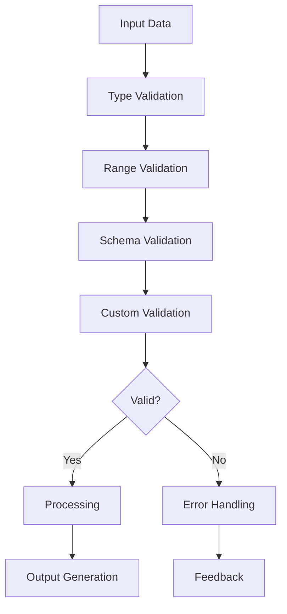
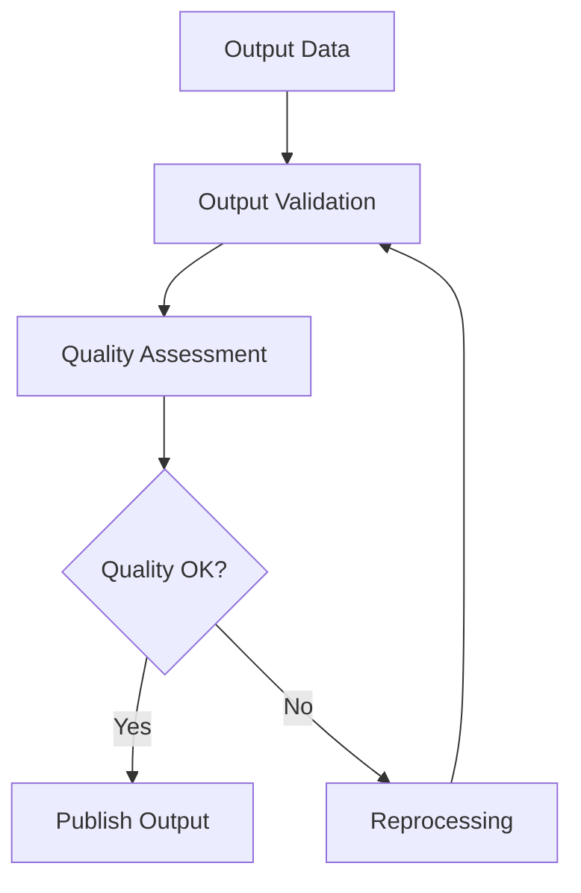

# Validation & Quality

## Overview
Handles all validation and quality assurance functionalities including data validation, schema validation, input validation, output validation, and quality checks across all platforms and contexts.

## Core Principles
- **Accuracy**: Ensure data and outputs are accurate
- **Consistency**: Maintain consistent validation rules
- **Security**: Prevent invalid or malicious data
- **Automation**: Automate validation and quality checks
- **Transparency**: Provide clear validation feedback
- **Compliance**: Meet regulatory and quality standards

## Function Specifications

### Base Functions (4 Functions)
1. [Base Validator](01_Base_Validator.md) - Core validation interface and common functionality
2. [Base Schema Validator](02_Base_Schema_Validator.md) - Core schema validation interface and common functionality
3. [Base Input Validator](03_Base_Input_Validator.md) - Core input validation interface and common functionality
4. [Base Output Validator](04_Base_Output_Validator.md) - Core output validation interface and common functionality

### Data Validation (2 Functions)
5. [Type Validator](05_Type_Validator.md) - Type-based data validation
6. [Range Validator](06_Range_Validator.md) - Range-based data validation

### Schema Validation (2 Functions)
7. [JSON Schema Validator](07_JSON_Schema_Validator.md) - JSON schema validation
8. [XML Schema Validator](08_XML_Schema_Validator.md) - XML schema validation

### Input Validation (2 Functions)
9. [Form Input Validator](09_Form_Input_Validator.md) - Form input validation
10. [API Input Validator](10_API_Input_Validator.md) - API input validation

### Output Validation (2 Functions)
11. [API Output Validator](11_API_Output_Validator.md) - API output validation
12. [Report Output Validator](12_Report_Output_Validator.md) - Report output validation

## Integration Patterns

### Validation Flow


### Quality Check Flow


## Validation Capabilities

### Data Validation Capabilities
- **Type Checking**: Check data types
- **Range Checking**: Check value ranges
- **Format Checking**: Check data formats
- **Custom Rules**: Support custom validation rules
- **Batch Validation**: Validate data in batches

### Schema Validation Capabilities
- **JSON Schema**: Validate against JSON schemas
- **XML Schema**: Validate against XML schemas
- **Schema Inference**: Infer schemas from data
- **Schema Versioning**: Support schema versioning
- **Schema Merging**: Merge multiple schemas

### Input Validation Capabilities
- **Form Validation**: Validate form inputs
- **API Validation**: Validate API inputs
- **Sanitization**: Sanitize input data
- **Required Fields**: Check required fields
- **Pattern Matching**: Match input patterns

### Output Validation Capabilities
- **API Output Validation**: Validate API outputs
- **Report Validation**: Validate report outputs
- **Format Checking**: Check output formats
- **Quality Assessment**: Assess output quality
- **Compliance Checking**: Check compliance with standards

## Configuration Examples

### Validation Configuration
```yaml
validation:
  type:
    enabled: true
    strict: true
  range:
    enabled: true
    min: 0
    max: 100
  schema:
    enabled: true
    type: "json"
    path: "schemas/"
  custom:
    enabled: true
    rules: "validation/rules.js"
```

### Quality Configuration
```yaml
quality:
  assessment:
    enabled: true
    metrics: ["accuracy", "completeness", "consistency"]
    thresholds:
      accuracy: 95
      completeness: 90
      consistency: 98
  reporting:
    enabled: true
    format: "pdf"
    retention: "1y"
```

## Error Handling

### Validation Errors
- **Type Errors**: Handle type validation errors
- **Range Errors**: Handle range validation errors
- **Schema Errors**: Handle schema validation errors
- **Input Errors**: Handle input validation errors
- **Output Errors**: Handle output validation errors

### Quality Errors
- **Assessment Errors**: Handle quality assessment errors
- **Reporting Errors**: Handle reporting errors
- **Compliance Errors**: Handle compliance errors
- **Threshold Errors**: Handle threshold violations
- **Format Errors**: Handle format errors

## Performance Considerations

### Validation Performance
- **Efficient Checking**: Optimize validation checks
- **Batch Processing**: Validate data in batches
- **Caching**: Cache validation results
- **Rule Optimization**: Optimize validation rules
- **Parallel Validation**: Validate in parallel

### Quality Performance
- **Efficient Assessment**: Optimize quality assessments
- **Batch Reporting**: Generate reports in batches
- **Caching**: Cache assessment results
- **Compression**: Compress report data
- **Streaming**: Stream large reports

## Monitoring & Observability

### Validation Metrics
- **Validation Time**: Track validation time
- **Error Rate**: Track validation error rates
- **Rule Usage**: Track rule usage
- **Batch Size**: Track batch sizes
- **Schema Usage**: Track schema usage

### Quality Metrics
- **Assessment Time**: Track assessment time
- **Quality Scores**: Track quality scores
- **Report Generation**: Track report generation times
- **Compliance Rate**: Track compliance rates
- **Threshold Violations**: Track threshold violations

## Security Considerations

### Validation Security
- **Input Sanitization**: Sanitize all inputs
- **Access Control**: Control access to validation rules
- **Audit Logging**: Log validation activities
- **Rule Protection**: Protect validation rules
- **Compliance**: Meet security standards

### Quality Security
- **Report Protection**: Protect quality reports
- **Access Control**: Control report access
- **Audit Logging**: Log report access
- **Data Encryption**: Encrypt sensitive data
- **Compliance**: Meet compliance requirements

## Integration Examples

### Validation Integration
```typescript
const validator = new TypeValidator({
  strict: true
});

const isValid = await validator.validate(data);
if (!isValid) {
  console.log('Validation errors:', validator.errors);
}
```

### Quality Integration
```typescript
const qualityChecker = new ReportOutputValidator({
  metrics: ['accuracy', 'completeness'],
  thresholds: { accuracy: 95, completeness: 90 }
});

const report = await qualityChecker.validate(reportData);
console.log('Quality report:', report);
```

## Future Enhancements

### Advanced Validation
- **AI-Powered Validation**: AI-driven validation
- **Dynamic Rules**: Dynamic validation rules
- **Real-time Validation**: Real-time validation
- **Cross-field Validation**: Cross-field validation
- **Validation Analytics**: Validation analytics

### Enhanced Quality
- **Automated Quality Checks**: Automated quality checks
- **Predictive Quality**: Predictive quality assessment
- **Quality Dashboards**: Real-time quality dashboards
- **Compliance Automation**: Automated compliance checks
- **Continuous Improvement**: Continuous quality improvement

---

**Version**: 1.0  
**Category**: Validation & Quality  
**Total Functions**: 12 