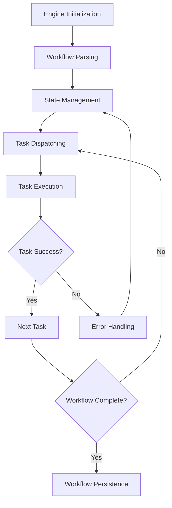

# Workflow Engines

## Overview
Workflow Engines are responsible for the orchestration, scheduling, and execution of complex, multi-step processes within the kOS modular architecture. They provide the backbone for reliable, scalable, and flexible workflow execution across distributed systems.

## Core Principles
- **Reliability**: Ensure workflows execute to completion and recover from failures
- **Extensibility**: Support plug-in modules and custom workflow logic
- **Performance**: Optimize for high-throughput and low-latency execution
- **Observability**: Provide detailed monitoring and logging of workflow execution
- **Configurability**: Allow dynamic workflow definitions and runtime adjustments

## Function Specifications

### Base Functions
1. **Engine Initialization** – Initialize workflow engine state and resources
2. **Workflow Parsing** – Parse workflow definitions and validate structure
3. **State Management** – Track workflow and task state throughout execution
4. **Task Dispatching** – Assign and trigger tasks within the workflow
5. **Error Handling** – Detect, log, and recover from workflow errors
6. **Workflow Persistence** – Persist workflow state for recovery and auditing
7. **Engine Monitoring** – Monitor engine health, performance, and events
8. **Extensibility Hooks** – Support for custom modules and extensions

## Integration Patterns

### Workflow Engine Execution Flow


## Capabilities
- **Dynamic Workflow Loading**: Load and execute workflows at runtime
- **Parallel & Sequential Execution**: Support both execution patterns
- **Stateful Recovery**: Resume workflows after failure or restart
- **Custom Logic Integration**: Plug in custom modules for specialized tasks
- **Comprehensive Monitoring**: Expose metrics and logs for all workflow events

## Configuration Example
```yaml
workflow_engine:
  type: "sequential"
  max_concurrent_workflows: 20
  state_persistence: true
  error_handling:
    retry_attempts: 3
    backoff_strategy: "exponential"
  monitoring:
    enabled: true
    metrics: ["latency", "throughput", "failures"]
  extensions:
    - name: "custom_logger"
      enabled: true
```

## Error Handling
- **Initialization Failures**: Log and abort engine startup
- **Parsing Errors**: Reject invalid workflow definitions with detailed errors
- **Task Dispatch Failures**: Retry or escalate based on policy
- **Persistence Errors**: Fallback to in-memory state and alert operators
- **Monitoring Gaps**: Self-diagnose and attempt to restart monitoring modules

## Usage Scenarios
- Orchestrating multi-step business processes
- Integrating with external workflow systems
- Dynamic workflow composition and execution

## Future Expansion
Additional modules and advanced features (e.g., adaptive workflow engines, AI-driven orchestration) will be added as requirements evolve. 