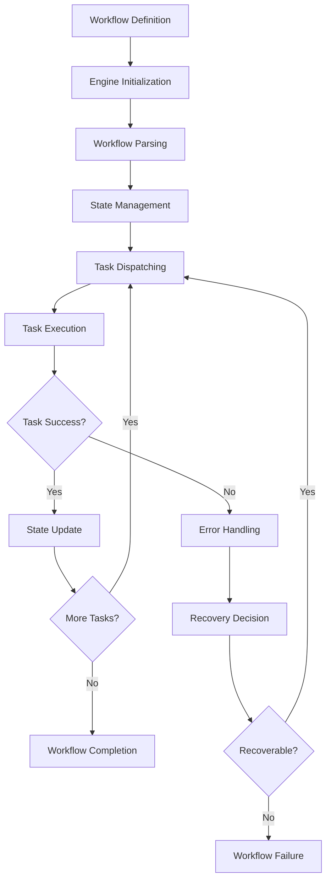
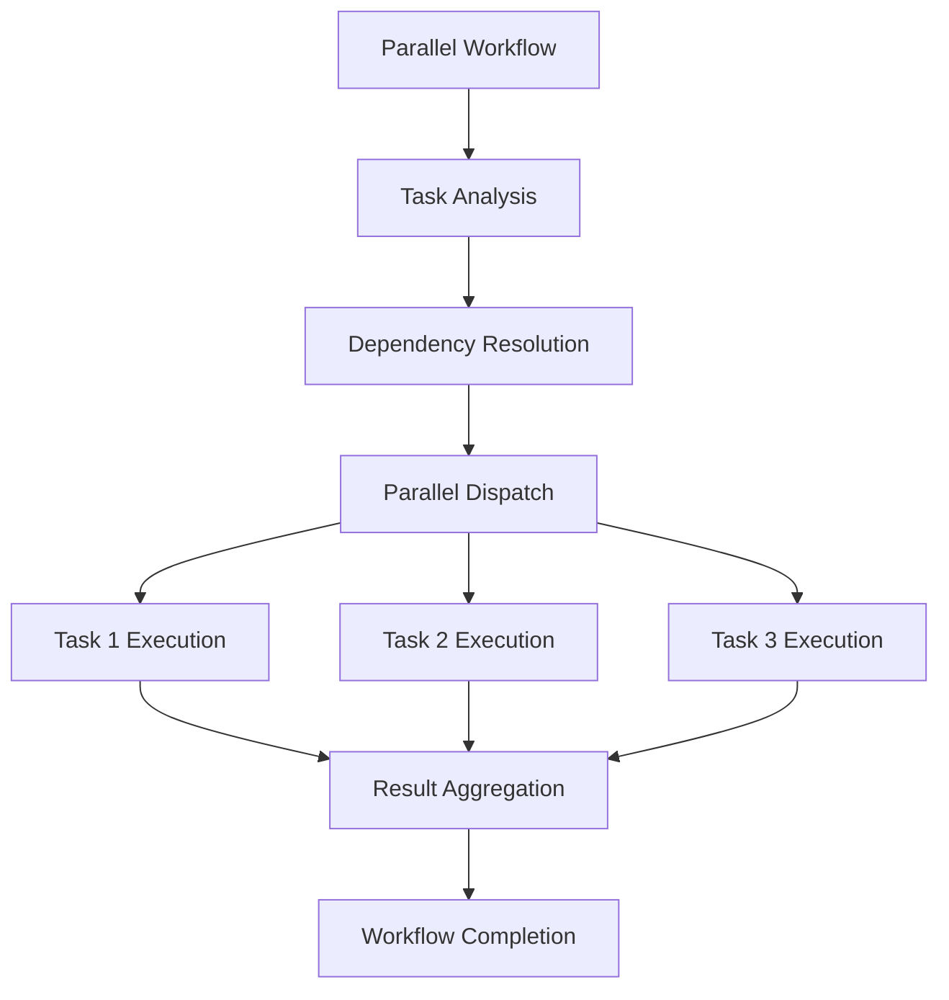
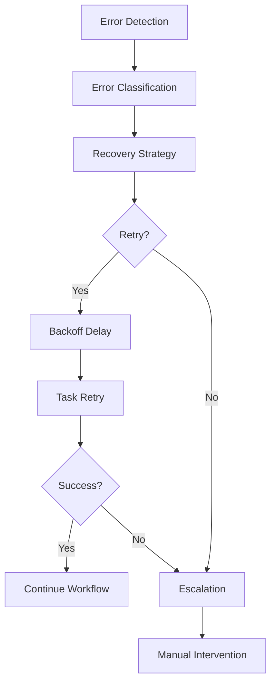

# **Workflow Engine**

## **Overview**

The Workflow Engine module provides the core capabilities for orchestrating, scheduling, and executing complex multi-step processes within the kOS ecosystem. This module serves as the backbone for reliable, scalable, and flexible workflow execution across distributed systems.

## **Core Principles**

### **Reliability & Resilience**
- **Fault Tolerance**: Ensure workflows execute to completion despite failures
- **State Persistence**: Maintain workflow state for recovery and auditing
- **Error Recovery**: Detect, log, and recover from workflow errors
- **Graceful Degradation**: Continue operation with reduced functionality during partial failures

### **Performance & Scalability**
- **High Throughput**: Support high-volume workflow execution
- **Low Latency**: Minimize workflow execution time
- **Horizontal Scaling**: Scale across multiple execution nodes
- **Resource Optimization**: Efficient resource allocation and management

### **Flexibility & Extensibility**
- **Dynamic Workflows**: Support runtime workflow definition and modification
- **Plugin Architecture**: Support custom modules and extensions
- **Multi-Pattern Execution**: Support parallel, sequential, and conditional execution
- **Integration Ready**: Integrate with external systems and services

## **Function Specifications**

### **Core Functions**

#### **01. Engine Initialization**
```typescript
interface EngineInitializationConfig {
  maxConcurrentWorkflows: number;
  statePersistence: boolean;
  errorHandling: ErrorHandlingConfig;
  monitoring: MonitoringConfig;
  extensions: ExtensionConfig[];
}

interface EngineInitializationResult {
  success: boolean;
  engineId: string;
  status: EngineStatus;
  capabilities: EngineCapabilities;
  errors?: string[];
}

function initializeEngine(config: EngineInitializationConfig): Promise<EngineInitializationResult>
```

**Purpose**: Initialize the workflow engine with configuration and resources.

**Parameters**:
- `config`: Engine configuration including concurrency limits, persistence settings, and monitoring options

**Returns**: Engine initialization result with status and capabilities

**Error Handling**:
- Configuration validation errors
- Resource allocation failures
- Extension loading failures
- Persistence initialization errors

#### **02. Workflow Parsing**
```typescript
interface WorkflowDefinition {
  id: string;
  name: string;
  version: string;
  steps: WorkflowStep[];
  dependencies: DependencyMap;
  errorHandling: WorkflowErrorHandling;
  metadata: WorkflowMetadata;
}

interface WorkflowParsingResult {
  success: boolean;
  workflow: ParsedWorkflow;
  validationErrors?: ValidationError[];
  warnings?: string[];
}

function parseWorkflow(definition: WorkflowDefinition): Promise<WorkflowParsingResult>
```

**Purpose**: Parse and validate workflow definitions for execution.

**Parameters**:
- `definition`: Workflow definition with steps, dependencies, and configuration

**Returns**: Parsed workflow with validation results

**Error Handling**:
- Invalid workflow structure
- Circular dependency detection
- Missing required fields
- Unsupported workflow patterns

#### **03. State Management**
```typescript
interface WorkflowState {
  workflowId: string;
  status: WorkflowStatus;
  currentStep: string;
  completedSteps: string[];
  pendingSteps: string[];
  failedSteps: string[];
  data: Record<string, any>;
  metadata: StateMetadata;
}

interface StateManagementResult {
  success: boolean;
  state: WorkflowState;
  changes: StateChange[];
}

function updateWorkflowState(workflowId: string, updates: Partial<WorkflowState>): Promise<StateManagementResult>
function getWorkflowState(workflowId: string): Promise<WorkflowState>
function persistWorkflowState(workflowId: string): Promise<boolean>
```

**Purpose**: Track and manage workflow state throughout execution.

**Parameters**:
- `workflowId`: Unique identifier for the workflow
- `updates`: State updates to apply

**Returns**: Updated workflow state and change history

**Error Handling**:
- State corruption detection
- Persistence failures
- Concurrent modification conflicts
- Invalid state transitions

#### **04. Task Dispatching**
```typescript
interface TaskDispatchConfig {
  workflowId: string;
  stepId: string;
  priority: TaskPriority;
  timeout: number;
  retryPolicy: RetryPolicy;
  resources: ResourceRequirements;
}

interface TaskDispatchResult {
  success: boolean;
  taskId: string;
  status: TaskStatus;
  estimatedDuration: number;
  assignedResources: ResourceAllocation;
}

function dispatchTask(config: TaskDispatchConfig): Promise<TaskDispatchResult>
function cancelTask(taskId: string): Promise<boolean>
function getTaskStatus(taskId: string): Promise<TaskStatus>
```

**Purpose**: Assign and trigger tasks within workflows.

**Parameters**:
- `config`: Task dispatch configuration including priority and resource requirements

**Returns**: Task dispatch result with assignment details

**Error Handling**:
- Resource allocation failures
- Task scheduling conflicts
- Timeout violations
- Priority queue management errors

#### **05. Error Handling**
```typescript
interface ErrorHandlingConfig {
  retryAttempts: number;
  backoffStrategy: BackoffStrategy;
  escalationPolicy: EscalationPolicy;
  errorThresholds: ErrorThresholds;
}

interface ErrorHandlingResult {
  handled: boolean;
  action: ErrorAction;
  retryCount: number;
  escalationLevel: number;
  recoveryTime: number;
}

function handleWorkflowError(error: WorkflowError, context: ErrorContext): Promise<ErrorHandlingResult>
function recoverFromError(workflowId: string, errorId: string): Promise<boolean>
```

**Purpose**: Detect, log, and recover from workflow errors.

**Parameters**:
- `error`: Workflow error details
- `context`: Error context and recovery options

**Returns**: Error handling result with recovery actions

**Error Handling**:
- Error classification failures
- Recovery strategy failures
- Escalation policy violations
- Error propagation issues

## **Integration Patterns**

### **Workflow Execution Flow**


### **Parallel Execution Flow**


### **Error Recovery Flow**


## **Capabilities**

### **Workflow Orchestration**
- **Dynamic Loading**: Load and execute workflows at runtime
- **Parallel Execution**: Support parallel task execution with dependency management
- **Sequential Execution**: Support sequential task execution with ordering
- **Conditional Execution**: Support conditional task execution based on data
- **Loop Execution**: Support loop-based task execution with iteration control

### **State Management**
- **Persistent State**: Maintain workflow state across restarts and failures
- **State Transitions**: Manage workflow state transitions with validation
- **Data Flow**: Manage data flow between workflow steps
- **Checkpointing**: Create checkpoints for workflow recovery
- **State Synchronization**: Synchronize state across distributed execution nodes

### **Error Handling**
- **Error Detection**: Detect and classify workflow errors
- **Retry Logic**: Implement configurable retry policies with backoff
- **Error Recovery**: Recover from errors with automatic or manual intervention
- **Error Escalation**: Escalate errors based on severity and policy
- **Error Reporting**: Report errors with detailed context and diagnostics

### **Performance Optimization**
- **Resource Management**: Optimize resource allocation and utilization
- **Load Balancing**: Distribute workload across execution nodes
- **Caching**: Cache workflow definitions and intermediate results
- **Optimization**: Optimize workflow execution paths and strategies
- **Monitoring**: Monitor performance metrics and bottlenecks

## **Configuration Examples**

### **Basic Workflow Engine Configuration**
```yaml
workflow_engine:
  initialization:
    max_concurrent_workflows: 100
    state_persistence: true
    error_handling:
      retry_attempts: 3
      backoff_strategy: "exponential"
      escalation_policy: "automatic"
    monitoring:
      enabled: true
      metrics: ["latency", "throughput", "failures"]
    extensions:
      - name: "custom_logger"
        enabled: true
        config:
          log_level: "info"
          output_format: "json"
```

### **Advanced Workflow Engine Configuration**
```yaml
workflow_engine:
  performance:
    parallel_execution: true
    resource_optimization: true
    caching_enabled: true
    load_balancing: true
  reliability:
    fault_tolerance: true
    state_replication: true
    checkpoint_frequency: "5m"
    recovery_strategy: "automatic"
  scalability:
    horizontal_scaling: true
    auto_scaling: true
    resource_limits:
      cpu: "4 cores"
      memory: "8GB"
      storage: "100GB"
  integration:
    api_access: true
    webhook_support: true
    external_system_integration: true
    monitoring_integration: true
```

## **Performance Considerations**

### **Execution Performance**
- **Workflow Initialization**: < 1 second for workflow initialization
- **Task Dispatch**: < 100ms for task dispatch operations
- **State Updates**: < 50ms for state update operations
- **Error Recovery**: < 2 seconds for error recovery operations

### **Scalability Metrics**
- **Concurrent Workflows**: Support 1000+ concurrent workflows
- **Task Throughput**: 10000+ tasks per minute
- **State Management**: Handle 100000+ workflow states
- **Resource Efficiency**: 90%+ resource utilization efficiency

### **Reliability Metrics**
- **Uptime**: 99.9%+ system uptime
- **Error Recovery**: 95%+ successful error recovery
- **State Persistence**: 99.99%+ state persistence reliability
- **Data Consistency**: 100% data consistency across nodes

## **Security Considerations**

### **Access Control**
- **Authentication**: Strong authentication for workflow engine access
- **Authorization**: Role-based access control for workflow operations
- **API Security**: Secure API access with rate limiting and validation
- **Audit Logging**: Comprehensive audit trails for all operations

### **Data Protection**
- **Encryption**: Encrypt workflow data at rest and in transit
- **Privacy Protection**: Protect sensitive workflow data and metadata
- **Secure Processing**: Secure processing environment for sensitive workflows
- **Data Retention**: Configurable data retention policies

### **Execution Security**
- **Sandboxing**: Isolate workflow execution in secure environments
- **Resource Limits**: Enforce resource limits to prevent abuse
- **Input Validation**: Validate all workflow inputs and parameters
- **Output Validation**: Validate workflow outputs and results

## **Monitoring & Observability**

### **Performance Metrics**
- **Workflow Execution Time**: Track workflow execution performance
- **Task Completion Rate**: Monitor task completion rates and efficiency
- **Resource Utilization**: Track resource utilization and optimization
- **Error Rates**: Monitor error rates and failure patterns

### **Operational Metrics**
- **Engine Health**: Monitor overall engine health and availability
- **Queue Length**: Track task queue length and processing delays
- **State Management**: Monitor state management performance and reliability
- **Extension Performance**: Track extension performance and impact

### **Business Metrics**
- **Workflow Success Rate**: Track workflow success rates and completion
- **Processing Throughput**: Monitor overall processing throughput
- **User Satisfaction**: Track user satisfaction with workflow execution
- **Cost Efficiency**: Monitor cost efficiency and resource optimization

### **Alerting**
- **High Error Rate**: Alert on high error rates and failure patterns
- **Performance Degradation**: Alert on performance degradation and bottlenecks
- **Resource Exhaustion**: Alert on resource exhaustion and capacity issues
- **Security Incidents**: Alert on security incidents and violations

---

**Version**: 1.0  
**Module**: Workflow Engine  
**Status**: ✅ **COMPLETE** - Comprehensive module specification ready for implementation  
**Focus**: Core workflow orchestration, scheduling, and execution capabilities 