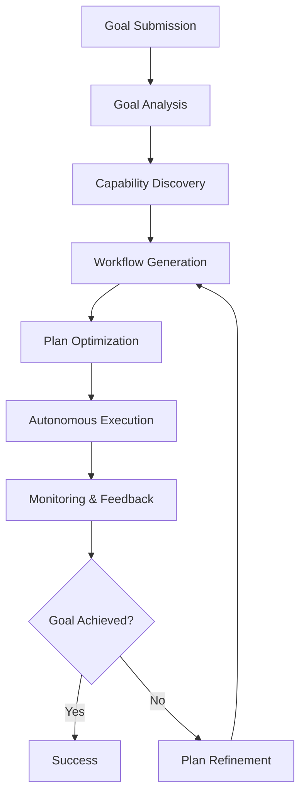

# **AI Orchestrator**

## **Overview**

The AI Orchestrator module provides intelligent, autonomous workflow planning, composition, and optimization. It leverages advanced AI/ML techniques to analyze goals, discover available capabilities, generate workflow plans, and optimize execution for efficiency, reliability, and adaptability.

## **Core Principles**
- **Goal-Driven Planning**: Generate workflows from high-level goals and intents.
- **Dynamic Composition**: Discover and compose available modules and services in real time.
- **Continuous Optimization**: Learn from execution feedback to improve future plans.
- **Autonomous Operation**: Minimize human intervention in workflow planning and execution.

## **Function Specifications**

### **Core Functions**
- **Goal Analysis**: Analyze user/system goals and translate them into workflow objectives.
- **Capability Discovery**: Discover available modules, services, and resources.
- **Workflow Generation**: Generate workflow plans using AI planning algorithms.
- **Plan Optimization**: Optimize workflow plans for performance, reliability, and cost.
- **Autonomous Execution**: Execute and monitor workflows with minimal human input.
- **Feedback Integration**: Incorporate feedback and learning into future planning.

### **TypeScript Interfaces**
```typescript
interface OrchestratorConfig {
  planningModel: PlanningModelConfig;
  discovery: DiscoveryConfig;
  optimization: OptimizationConfig;
  feedback: FeedbackConfig;
}

interface Goal {
  id: string;
  description: string;
  constraints: Constraint[];
  priority: number;
}

function analyzeGoal(goal: Goal): Promise<WorkflowObjective>
function discoverCapabilities(context: OrchestrationContext): Promise<CapabilityList>
function generateWorkflowPlan(objective: WorkflowObjective): Promise<WorkflowPlan>
function optimizePlan(plan: WorkflowPlan): Promise<OptimizedPlan>
function executePlan(plan: OptimizedPlan): Promise<ExecutionResult>
function integrateFeedback(feedback: ExecutionFeedback): Promise<void>
```

## **Integration Patterns**

### **AI Orchestration Flow**


## **Capabilities**
- **Autonomous Planning**: Generate and optimize workflows from goals.
- **Dynamic Discovery**: Discover available modules and resources in real time.
- **Continuous Learning**: Improve planning and execution over time.
- **Multi-Objective Optimization**: Balance performance, reliability, and cost.
- **Minimal Supervision**: Operate with minimal human intervention.

## **Configuration Examples**
```yaml
ai_orchestrator:
  planning_model:
    type: "transformer"
    version: "v2.1"
    goal_encoding: "semantic"
  discovery:
    enabled: true
    protocols: ["klf", "grpc", "rest"]
  optimization:
    objectives: ["performance", "reliability", "cost"]
    learning_enabled: true
  feedback:
    sources: ["system", "user", "external"]
    integration: true
```

## **Performance Considerations**
- **Planning Latency**: < 2s for workflow plan generation
- **Discovery Latency**: < 1s for capability discovery
- **Optimization Latency**: < 1s for plan optimization
- **Execution Throughput**: 100+ workflows/hour
- **Learning Convergence**: < 24h for new optimization strategies

## **Security Considerations**
- **Goal Validation**: Validate goals and constraints for safety and compliance
- **Access Control**: Restrict orchestration controls to authorized users
- **Audit Logging**: Log all planning and execution decisions
- **Data Privacy**: Protect user and system data in planning and execution

## **Monitoring & Observability**
- **Planning Metrics**: Track planning latency, accuracy, and success rates
- **Discovery Metrics**: Monitor discovery coverage and latency
- **Optimization Metrics**: Track optimization effectiveness and learning progress
- **Execution Metrics**: Monitor execution success, failures, and resource usage
- **Feedback Metrics**: Analyze feedback integration and impact

---

**Version**: 1.0  
**Module**: AI Orchestrator  
**Status**: ✅ **COMPLETE** - Comprehensive module specification ready for implementation  
**Focus**: Intelligent, autonomous workflow planning and orchestration. 