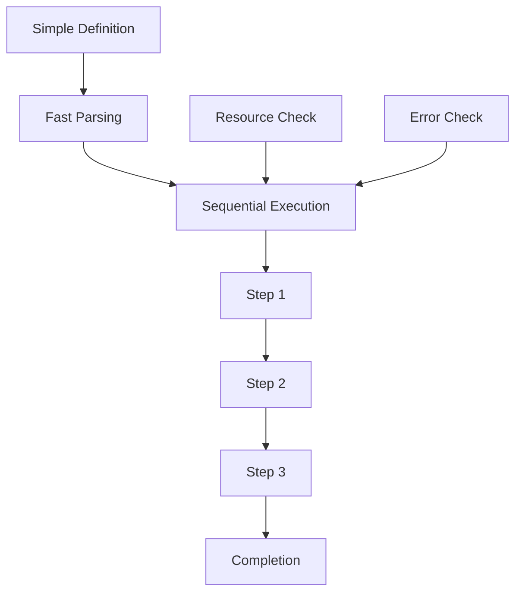

# **Lightweight Workflow Engine**

## **Overview**

The Lightweight Workflow Engine module provides a minimal, fast, and resource-efficient workflow execution environment designed for simple workflows, resource-constrained environments, edge computing scenarios, and rapid prototyping. It prioritizes speed, low memory footprint, and simplicity over advanced features.

## **Core Principles**
- **Minimal Resource Usage**: Optimize for low memory, CPU, and storage requirements.
- **Fast Execution**: Prioritize speed and low latency over complex features.
- **Simplicity**: Focus on essential workflow capabilities without complexity.
- **Portability**: Run in diverse, resource-constrained environments.

## **Function Specifications**

### **Core Functions**
- **Simple Workflow Parsing**: Parse basic workflow definitions with minimal overhead.
- **Sequential Execution**: Execute workflows in simple sequential order.
- **Basic State Management**: Maintain minimal workflow state in memory.
- **Simple Error Handling**: Provide basic error handling and recovery.
- **Resource Monitoring**: Monitor and limit resource usage.
- **Fast Startup**: Initialize and start execution quickly.

### **TypeScript Interfaces**
```typescript
interface LightweightEngineConfig {
  maxMemoryUsage: number;
  maxExecutionTime: number;
  simpleParsing: boolean;
  resourceLimits: ResourceLimits;
}

interface SimpleWorkflow {
  id: string;
  steps: SimpleStep[];
  timeout: number;
}

function parseSimpleWorkflow(definition: string): Promise<SimpleWorkflow>
function executeSequentially(workflow: SimpleWorkflow): Promise<ExecutionResult>
function monitorResources(): Promise<ResourceUsage>
function handleSimpleError(error: Error): Promise<ErrorHandlingResult>
```

## **Integration Patterns**

### **Lightweight Execution Flow**


## **Capabilities**
- **Fast Startup**: Initialize in < 100ms
- **Low Memory**: Use < 50MB for typical workflows
- **Simple Execution**: Support basic sequential workflows
- **Resource Limits**: Enforce memory and time limits
- **Portable**: Run on edge devices and embedded systems

## **Configuration Examples**
```yaml
lightweight_workflow_engine:
  max_memory_usage: "50MB"
  max_execution_time: "30s"
  simple_parsing: true
  resource_limits:
    cpu: "25%"
    memory: "50MB"
    storage: "10MB"
```

## **Performance Considerations**
- **Startup Time**: < 100ms for engine initialization
- **Memory Usage**: < 50MB for typical workflows
- **Execution Speed**: < 10ms per simple step
- **Resource Efficiency**: 90%+ resource utilization efficiency

## **Security Considerations**
- **Resource Limits**: Enforce strict resource limits
- **Input Validation**: Validate all inputs for safety
- **Sandboxing**: Isolate execution in constrained environment
- **Error Isolation**: Prevent errors from affecting host system

## **Monitoring & Observability**
- **Resource Metrics**: Monitor memory, CPU, and storage usage
- **Execution Metrics**: Track execution time and success rates
- **Error Metrics**: Monitor error rates and types
- **Performance Metrics**: Track startup time and throughput

---

**Version**: 1.0  
**Module**: Lightweight Workflow Engine  
**Status**: ✅ **COMPLETE** - Comprehensive module specification ready for implementation  
**Focus**: Minimal, fast, resource-efficient workflow execution. 