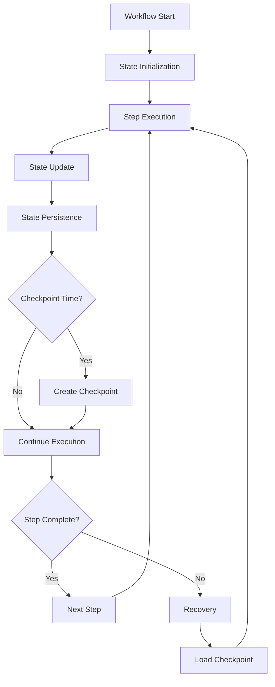

# **Stateful Workflow Engine**

## **Overview**

The Stateful Workflow Engine module provides robust state management capabilities for long-running workflows, with persistent state storage, checkpointing, recovery mechanisms, and state synchronization. It ensures workflow resilience and data consistency across restarts and failures.

## **Core Principles**
- **Persistent State**: Maintain workflow state across restarts and failures.
- **Checkpointing**: Create checkpoints for workflow recovery and debugging.
- **State Consistency**: Ensure state consistency across distributed environments.
- **Recovery Mechanisms**: Provide robust recovery from failures and interruptions.

## **Function Specifications**

### **Core Functions**
- **State Persistence**: Persist workflow state to durable storage.
- **Checkpoint Creation**: Create checkpoints at configurable intervals.
- **State Recovery**: Recover workflow state from checkpoints.
- **State Synchronization**: Synchronize state across distributed instances.
- **State Validation**: Validate state consistency and integrity.
- **State Migration**: Migrate state between different storage backends.

### **TypeScript Interfaces**
```typescript
interface StatefulEngineConfig {
  stateStorage: StateStorageConfig;
  checkpointing: CheckpointingConfig;
  recovery: RecoveryConfig;
  synchronization: SyncConfig;
}

interface WorkflowState {
  workflowId: string;
  currentStep: string;
  variables: Map<string, any>;
  history: StateChange[];
  checkpoint: CheckpointInfo;
  metadata: StateMetadata;
}

interface Checkpoint {
  id: string;
  workflowId: string;
  timestamp: Date;
  state: WorkflowState;
  checksum: string;
}

function persistState(workflowId: string, state: WorkflowState): Promise<boolean>
function createCheckpoint(workflowId: string): Promise<Checkpoint>
function recoverFromCheckpoint(workflowId: string, checkpointId: string): Promise<WorkflowState>
function synchronizeState(workflowId: string): Promise<SyncResult>
function validateState(workflowId: string): Promise<ValidationResult>
```

## **Integration Patterns**

### **Stateful Execution Flow**


## **Capabilities**
- **Durable State**: Maintain state across system restarts and failures.
- **Checkpoint Recovery**: Recover workflows from any checkpoint.
- **State Consistency**: Ensure state consistency in distributed environments.
- **State Migration**: Migrate state between storage systems.
- **State Validation**: Validate state integrity and consistency.

## **Configuration Examples**
```yaml
stateful_workflow_engine:
  state_storage:
    type: "postgresql"
    connection: "postgresql://localhost/workflows"
    encryption: true
  checkpointing:
    enabled: true
    interval: "5m"
    retention: "30d"
    compression: true
  recovery:
    enabled: true
    auto_recovery: true
    max_recovery_time: "10m"
  synchronization:
    enabled: true
    sync_interval: "1s"
    conflict_resolution: "last_write_wins"
```

## **Performance Considerations**
- **State Persistence**: < 100ms for state persistence operations
- **Checkpoint Creation**: < 500ms for checkpoint creation
- **State Recovery**: < 2s for state recovery from checkpoint
- **State Sync**: < 200ms for state synchronization
- **Storage Efficiency**: 90%+ storage utilization efficiency

## **Security Considerations**
- **State Encryption**: Encrypt state data at rest and in transit
- **Access Control**: Control access to state storage and checkpoints
- **State Validation**: Validate state integrity and prevent corruption
- **Audit Logging**: Log all state changes and checkpoint operations

## **Monitoring & Observability**
- **State Metrics**: Track state persistence, checkpoint, and recovery operations
- **Storage Metrics**: Monitor storage usage and performance
- **Recovery Metrics**: Track recovery success rates and times
- **Sync Metrics**: Monitor state synchronization and consistency

---

**Version**: 1.0  
**Module**: Stateful Workflow Engine  
**Status**: ✅ **COMPLETE** - Comprehensive module specification ready for implementation  
**Focus**: Persistent, recoverable workflow state management. 