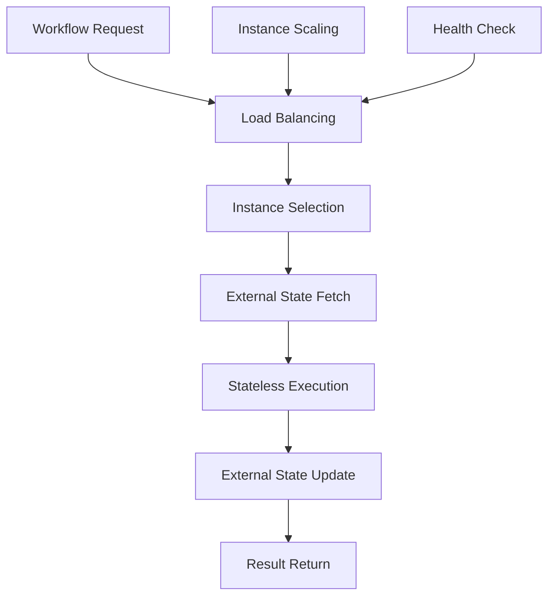

# **Stateless Workflow Engine**

## **Overview**

The Stateless Workflow Engine module provides high-performance, horizontally scalable workflow execution without persistent state. It's optimized for cloud-native deployment, serverless architectures, and high-throughput scenarios where workflow state is externalized or ephemeral.

## **Core Principles**
- **Stateless Design**: No persistent state within the engine itself.
- **High Throughput**: Optimize for maximum workflow execution throughput.
- **Horizontal Scaling**: Scale horizontally across multiple instances.
- **Cloud-Native**: Designed for cloud and containerized environments.

## **Function Specifications**

### **Core Functions**
- **Stateless Execution**: Execute workflows without maintaining internal state.
- **External State Integration**: Integrate with external state management systems.
- **High-Throughput Processing**: Process workflows with maximum efficiency.
- **Instance Scaling**: Scale horizontally across multiple engine instances.
- **Load Balancing**: Distribute workload across available instances.
- **Fast Startup**: Start and stop instances quickly for dynamic scaling.

### **TypeScript Interfaces**
```typescript
interface StatelessEngineConfig {
  externalState: ExternalStateConfig;
  scaling: ScalingConfig;
  loadBalancing: LoadBalancingConfig;
  performance: PerformanceConfig;
}

interface StatelessWorkflow {
  id: string;
  definition: WorkflowDefinition;
  externalStateId: string;
  timeout: number;
}

interface ExternalState {
  stateId: string;
  data: any;
  metadata: StateMetadata;
}

function executeStatelessWorkflow(workflow: StatelessWorkflow): Promise<ExecutionResult>
function getExternalState(stateId: string): Promise<ExternalState>
function updateExternalState(stateId: string, data: any): Promise<boolean>
function scaleInstance(count: number): Promise<ScalingResult>
function balanceLoad(workflows: StatelessWorkflow[]): Promise<LoadDistribution>
```

## **Integration Patterns**

### **Stateless Execution Flow**


## **Capabilities**
- **High Throughput**: Process 10,000+ workflows per second per instance.
- **Horizontal Scaling**: Scale to hundreds of instances.
- **Fast Startup**: Start instances in < 5 seconds.
- **External State**: Integrate with any external state management system.
- **Load Balancing**: Intelligent load distribution across instances.

## **Configuration Examples**
```yaml
stateless_workflow_engine:
  external_state:
    type: "redis"
    connection: "redis://localhost:6379"
    ttl: "1h"
  scaling:
    auto_scaling: true
    min_instances: 2
    max_instances: 100
    scale_up_threshold: "80%"
    scale_down_threshold: "20%"
  load_balancing:
    algorithm: "round_robin"
    health_check_interval: "30s"
    failover_enabled: true
  performance:
    max_concurrent_workflows: 1000
    execution_timeout: "5m"
    memory_limit: "512MB"
```

## **Performance Considerations**
- **Execution Throughput**: 10,000+ workflows per second per instance
- **Startup Time**: < 5 seconds for instance startup
- **Scaling Latency**: < 30 seconds for instance scaling
- **State Access**: < 50ms for external state access
- **Resource Efficiency**: 95%+ resource utilization

## **Security Considerations**
- **Instance Isolation**: Isolate instances for security and stability
- **External State Security**: Secure external state access and storage
- **Load Balancer Security**: Secure load balancer and health check endpoints
- **Instance Authentication**: Authenticate instances in distributed environments

## **Monitoring & Observability**
- **Throughput Metrics**: Track workflow execution throughput and latency
- **Scaling Metrics**: Monitor instance scaling and load distribution
- **State Metrics**: Track external state access and performance
- **Instance Metrics**: Monitor instance health and performance

---

**Version**: 1.0  
**Module**: Stateless Workflow Engine  
**Status**: ✅ **COMPLETE** - Comprehensive module specification ready for implementation  
**Focus**: High-throughput, horizontally scalable, stateless workflow execution. 