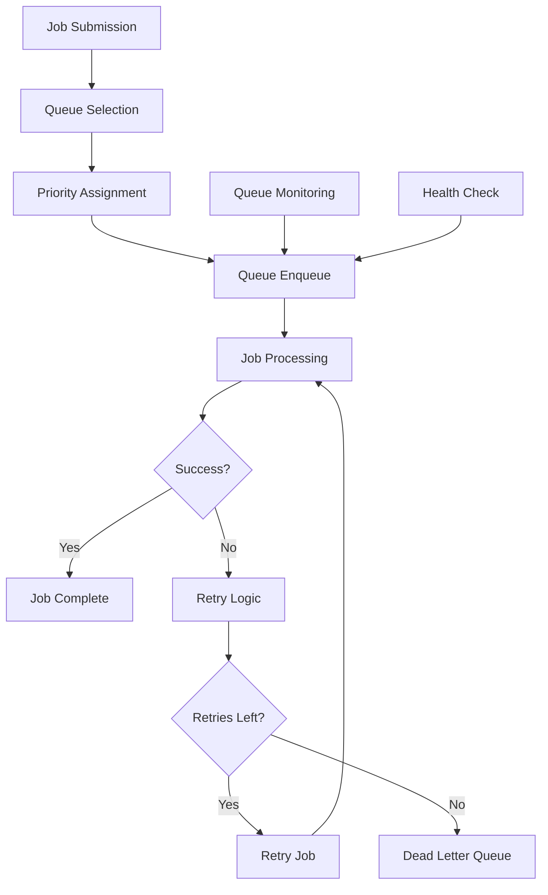

# **Job Queue Manager**

## **Overview**

The Job Queue Manager module provides comprehensive job queue management capabilities, including priority queues, retry mechanisms, dead letter queues, distributed queue coordination, and advanced queue monitoring. It ensures reliable job processing, handles failures gracefully, and provides visibility into queue performance and health.

## **Core Principles**
- **Reliable Processing**: Ensure jobs are processed reliably with failure recovery.
- **Priority Handling**: Support multiple priority levels and queue types.
- **Failure Management**: Handle failures gracefully with retry and dead letter queues.
- **Distributed Coordination**: Coordinate queues across distributed systems.

## **Function Specifications**

### **Core Functions**
- **Queue Management**: Create, configure, and manage job queues.
- **Job Enqueueing**: Add jobs to appropriate queues with priority handling.
- **Job Dequeueing**: Retrieve and process jobs from queues.
- **Retry Management**: Handle job failures with configurable retry policies.
- **Dead Letter Queue**: Manage failed jobs that exceed retry limits.
- **Queue Monitoring**: Monitor queue health, performance, and metrics.

### **TypeScript Interfaces**
```typescript
interface JobQueueManagerConfig {
  queues: QueueConfig[];
  retryPolicies: RetryPolicy[];
  deadLetterQueue: DeadLetterConfig;
  monitoring: MonitoringConfig;
}

interface Job {
  id: string;
  queueId: string;
  priority: number;
  data: any;
  retryCount: number;
  maxRetries: number;
  createdAt: Date;
  scheduledFor?: Date;
}

interface Queue {
  id: string;
  name: string;
  priority: number;
  maxSize: number;
  retryPolicy: RetryPolicy;
  deadLetterQueue: string;
}

function createQueue(config: QueueConfig): Promise<Queue>
function enqueueJob(queueId: string, job: Job): Promise<boolean>
function dequeueJob(queueId: string): Promise<Job | null>
function retryJob(jobId: string): Promise<boolean>
function moveToDeadLetter(jobId: string, reason: string): Promise<boolean>
function monitorQueue(queueId: string): Promise<QueueMetrics>
```

## **Integration Patterns**

### **Job Queue Processing Flow**


## **Capabilities**
- **Multiple Queue Types**: Support priority, FIFO, LIFO, and custom queue types.
- **Retry Mechanisms**: Configurable retry policies with exponential backoff.
- **Dead Letter Queues**: Handle permanently failed jobs.
- **Distributed Coordination**: Coordinate queues across multiple instances.
- **Queue Monitoring**: Real-time monitoring of queue health and performance.
- **Job Scheduling**: Support delayed job execution and scheduling.

## **Configuration Examples**
```yaml
job_queue_manager:
  queues:
    - id: "high_priority"
      name: "High Priority Jobs"
      priority: 1
      max_size: 10000
      retry_policy: "exponential_backoff"
      max_retries: 3
    - id: "normal_priority"
      name: "Normal Priority Jobs"
      priority: 5
      max_size: 50000
      retry_policy: "linear_backoff"
      max_retries: 5
  retry_policies:
    exponential_backoff:
      initial_delay: "1s"
      max_delay: "1h"
      multiplier: 2
    linear_backoff:
      initial_delay: "5s"
      max_delay: "30m"
      increment: "5s"
  dead_letter_queue:
    enabled: true
    queue_id: "dead_letter"
    retention: "30d"
  monitoring:
    enabled: true
    metrics_interval: "30s"
    alert_thresholds:
      queue_size: 80
      processing_time: "5m"
```

## **Performance Considerations**
- **Enqueue Latency**: < 10ms for job enqueueing
- **Dequeue Latency**: < 50ms for job dequeuing
- **Queue Throughput**: 100,000+ jobs per minute per queue
- **Retry Processing**: < 100ms for retry decision and processing
- **Monitoring Overhead**: < 1% performance impact

## **Security Considerations**
- **Job Validation**: Validate all jobs for safety and compliance
- **Queue Access Control**: Control access to queues and job data
- **Data Encryption**: Encrypt job data at rest and in transit
- **Audit Logging**: Log all queue operations and job processing

## **Monitoring & Observability**
- **Queue Metrics**: Track queue sizes, processing rates, and latency
- **Job Metrics**: Monitor job success rates, retry counts, and processing times
- **Retry Metrics**: Track retry success rates and failure patterns
- **Dead Letter Metrics**: Monitor dead letter queue size and failure reasons
- **Performance Metrics**: Track queue performance and resource utilization

---

**Version**: 1.0  
**Module**: Job Queue Manager  
**Status**: ✅ **COMPLETE** - Comprehensive module specification ready for implementation  
**Focus**: Reliable job queue management with retry mechanisms and failure handling. 