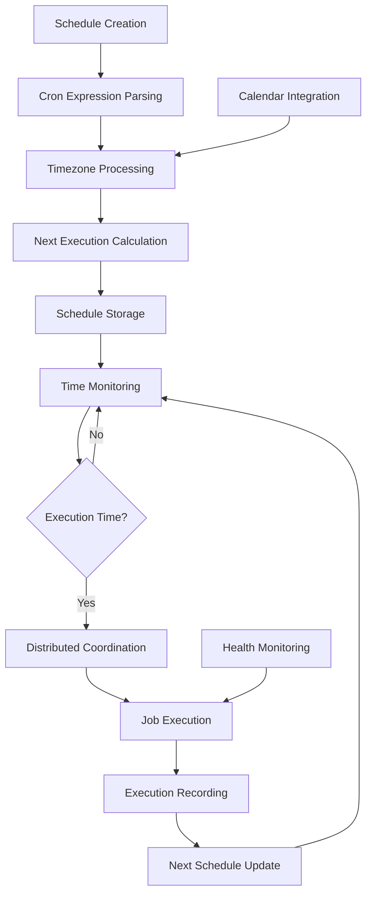

# **Cron Job Manager**

## **Overview**

The Cron Job Manager module provides comprehensive time-based job scheduling capabilities, including cron expression parsing, timezone support, calendar integration, distributed execution coordination, and advanced scheduling features. It ensures reliable execution of time-based tasks across distributed systems with precise timing and coordination.

## **Core Principles**
- **Precise Timing**: Ensure jobs execute at precisely the specified times.
- **Timezone Support**: Handle timezone-aware scheduling across global deployments.
- **Distributed Coordination**: Coordinate cron jobs across distributed systems.
- **Calendar Integration**: Support calendar-based scheduling and holiday handling.

## **Function Specifications**

### **Core Functions**
- **Cron Expression Parsing**: Parse and validate cron expressions.
- **Schedule Management**: Create, update, and manage cron job schedules.
- **Timezone Handling**: Handle timezone conversions and daylight saving time.
- **Calendar Integration**: Integrate with calendar systems for holiday scheduling.
- **Distributed Coordination**: Coordinate execution across distributed instances.
- **Execution Monitoring**: Monitor cron job execution and health.

### **TypeScript Interfaces**
```typescript
interface CronJobManagerConfig {
  timezone: string;
  calendarIntegration: CalendarConfig;
  distributedCoordination: CoordinationConfig;
  monitoring: MonitoringConfig;
}

interface CronJob {
  id: string;
  name: string;
  cronExpression: string;
  timezone: string;
  enabled: boolean;
  lastExecution?: Date;
  nextExecution?: Date;
  executionHistory: ExecutionRecord[];
}

interface CronExpression {
  minute: string;
  hour: string;
  dayOfMonth: string;
  month: string;
  dayOfWeek: string;
  year?: string;
}

function parseCronExpression(expression: string): Promise<CronExpression>
function createCronJob(config: CronJobConfig): Promise<CronJob>
function updateSchedule(jobId: string, cronExpression: string): Promise<boolean>
function calculateNextExecution(cronExpression: string, timezone: string): Promise<Date>
function executeCronJob(jobId: string): Promise<ExecutionResult>
function monitorExecution(jobId: string): Promise<ExecutionMetrics>
```

## **Integration Patterns**

### **Cron Job Execution Flow**


## **Capabilities**
- **Cron Expression Support**: Support standard cron expressions with extensions.
- **Timezone Awareness**: Handle multiple timezones and daylight saving time.
- **Calendar Integration**: Integrate with calendar systems for holiday scheduling.
- **Distributed Coordination**: Prevent duplicate execution across instances.
- **Execution History**: Maintain complete execution history and statistics.
- **Flexible Scheduling**: Support one-time, recurring, and calendar-based schedules.

## **Configuration Examples**
```yaml
cron_job_manager:
  timezone: "UTC"
  calendar_integration:
    enabled: true
    calendar_type: "google_calendar"
    holiday_calendar: "company_holidays"
    skip_holidays: true
  distributed_coordination:
    enabled: true
    coordination_strategy: "leader_election"
    lock_timeout: "5m"
    heartbeat_interval: "30s"
  monitoring:
    enabled: true
    execution_logging: true
    metrics_collection: true
    alert_thresholds:
      missed_executions: 3
      execution_duration: "10m"
  cron_jobs:
    - id: "daily_backup"
      name: "Daily Database Backup"
      cron_expression: "0 2 * * *"
      timezone: "America/New_York"
      enabled: true
    - id: "weekly_report"
      name: "Weekly Report Generation"
      cron_expression: "0 9 * * 1"
      timezone: "UTC"
      enabled: true
```

## **Performance Considerations**
- **Schedule Calculation**: < 10ms for next execution calculation
- **Expression Parsing**: < 5ms for cron expression parsing
- **Timezone Conversion**: < 1ms for timezone conversions
- **Coordination Overhead**: < 50ms for distributed coordination
- **Execution Latency**: < 100ms for job execution initiation

## **Security Considerations**
- **Expression Validation**: Validate cron expressions for safety
- **Execution Control**: Control which jobs can be scheduled and executed
- **Access Control**: Control access to cron job management
- **Audit Logging**: Log all scheduling and execution activities

## **Monitoring & Observability**
- **Execution Metrics**: Track execution success rates and timing accuracy
- **Schedule Metrics**: Monitor schedule calculations and timezone handling
- **Coordination Metrics**: Track distributed coordination and lock management
- **Performance Metrics**: Monitor execution performance and resource usage
- **Calendar Metrics**: Track calendar integration and holiday handling

---

**Version**: 1.0  
**Module**: Cron Job Manager  
**Status**: ✅ **COMPLETE** - Comprehensive module specification ready for implementation  
**Focus**: Precise time-based job scheduling with timezone and calendar support. 