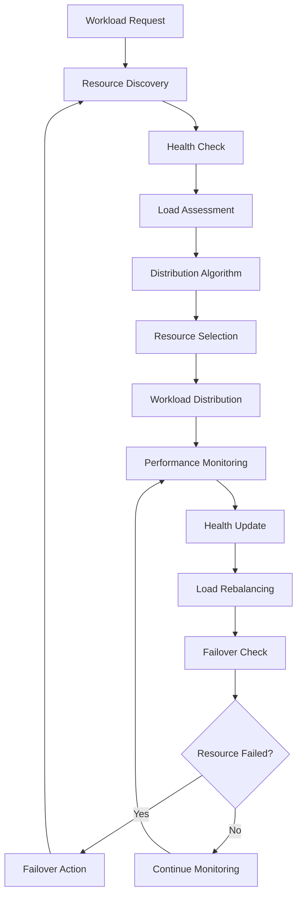

# **Load Balancer**

## **Overview**

The Load Balancer module provides intelligent workload distribution capabilities, balancing tasks across multiple resources while monitoring health, managing failover, and optimizing performance. It ensures high availability, efficient resource utilization, and adaptive load distribution based on real-time conditions.

## **Core Principles**
- **Intelligent Distribution**: Distribute workloads intelligently across available resources.
- **Health Monitoring**: Monitor resource health and availability continuously.
- **Failover Management**: Handle resource failures with automatic failover.
- **Performance Optimization**: Optimize load distribution for maximum performance.

## **Function Specifications**

### **Core Functions**
- **Load Distribution**: Distribute workloads across multiple resources.
- **Health Monitoring**: Monitor resource health and availability.
- **Failover Management**: Handle resource failures with automatic failover.
- **Performance Optimization**: Optimize load distribution for performance.
- **Traffic Management**: Manage traffic flow and routing.
- **Resource Discovery**: Discover and register available resources.

### **TypeScript Interfaces**
```typescript
interface LoadBalancerConfig {
  distributionAlgorithm: DistributionAlgorithm;
  healthMonitoring: HealthConfig;
  failover: FailoverConfig;
  performance: PerformanceConfig;
}

interface Resource {
  id: string;
  endpoint: string;
  health: HealthStatus;
  performance: PerformanceMetrics;
  load: LoadMetrics;
  availability: boolean;
}

interface DistributionResult {
  resourceId: string;
  endpoint: string;
  confidence: number;
  estimatedLatency: number;
  loadFactor: number;
}

interface HealthStatus {
  status: 'healthy' | 'unhealthy' | 'degraded';
  lastCheck: Date;
  responseTime: number;
  errorRate: number;
}

function distributeLoad(workload: Workload): Promise<DistributionResult>
function monitorHealth(resourceId: string): Promise<HealthStatus>
function handleFailover(failedResourceId: string): Promise<FailoverResult>
function optimizePerformance(): Promise<OptimizationResult>
function manageTraffic(route: Route): Promise<TrafficResult>
function discoverResources(): Promise<Resource[]>
```

## **Integration Patterns**

### **Load Balancing Flow**


## **Capabilities**
- **Multiple Algorithms**: Support round-robin, weighted, least-connections, and AI-based algorithms.
- **Health Monitoring**: Continuous health monitoring with configurable thresholds.
- **Automatic Failover**: Automatic failover with configurable strategies.
- **Performance Optimization**: Optimize load distribution based on performance metrics.
- **Traffic Management**: Advanced traffic management and routing capabilities.
- **Resource Discovery**: Automatic discovery and registration of resources.

## **Configuration Examples**
```yaml
load_balancer:
  distribution_algorithm:
    type: "ai_optimized"
    optimization_criteria: ["latency", "throughput", "availability"]
    learning_enabled: true
  health_monitoring:
    enabled: true
    check_interval: "30s"
    timeout: "5s"
    failure_threshold: 3
    success_threshold: 2
    health_endpoints:
      - path: "/health"
        method: "GET"
        expected_status: 200
  failover:
    enabled: true
    strategy: "automatic"
    failover_time: "10s"
    recovery_time: "30s"
    max_failover_attempts: 3
  performance:
    optimization_enabled: true
    optimization_interval: "1m"
    performance_metrics:
      - "response_time"
      - "throughput"
      - "error_rate"
      - "resource_utilization"
  resources:
    - id: "resource-1"
      endpoint: "http://resource1:8080"
      weight: 1.0
      max_connections: 1000
    - id: "resource-2"
      endpoint: "http://resource2:8080"
      weight: 1.0
      max_connections: 1000
```

## **Performance Considerations**
- **Distribution Latency**: < 10ms for load distribution decisions
- **Health Check Overhead**: < 1% performance impact
- **Failover Time**: < 10s for automatic failover
- **Throughput**: 100,000+ requests per second
- **Optimization Accuracy**: 95%+ optimization effectiveness

## **Security Considerations**
- **Resource Authentication**: Authenticate resources and endpoints
- **Traffic Encryption**: Encrypt traffic between load balancer and resources
- **Access Control**: Control access to load balancer configuration
- **Audit Logging**: Log all distribution decisions and failover events

## **Monitoring & Observability**
- **Distribution Metrics**: Track load distribution and resource utilization
- **Health Metrics**: Monitor resource health and availability
- **Performance Metrics**: Track performance optimization and effectiveness
- **Failover Metrics**: Monitor failover events and recovery times
- **Traffic Metrics**: Track traffic flow and routing efficiency

---

**Version**: 1.0  
**Module**: Load Balancer  
**Status**: ✅ **COMPLETE** - Comprehensive module specification ready for implementation  
**Focus**: Intelligent workload distribution with health monitoring and failover management. 