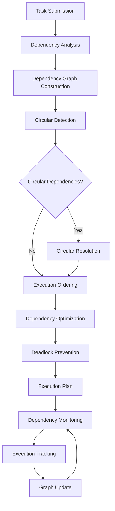

# **Dependency Resolver**

## **Overview**

The Dependency Resolver module provides sophisticated dependency management capabilities, including dependency resolution, circular dependency detection, dependency optimization, and intelligent execution ordering. It ensures proper task execution order, prevents deadlocks, and optimizes dependency chains for maximum efficiency.

## **Core Principles**
- **Dependency Resolution**: Resolve complex dependency relationships accurately.
- **Circular Detection**: Detect and handle circular dependencies to prevent deadlocks.
- **Execution Optimization**: Optimize dependency chains for efficient execution.
- **Deadlock Prevention**: Prevent deadlocks through intelligent dependency management.

## **Function Specifications**

### **Core Functions**
- **Dependency Analysis**: Analyze and validate dependency relationships.
- **Circular Detection**: Detect circular dependencies and resolve conflicts.
- **Execution Ordering**: Determine optimal execution order for dependent tasks.
- **Dependency Optimization**: Optimize dependency chains for performance.
- **Deadlock Prevention**: Prevent deadlocks through dependency management.
- **Dependency Monitoring**: Monitor dependency resolution and execution.

### **TypeScript Interfaces**
```typescript
interface DependencyResolverConfig {
  resolutionStrategy: ResolutionStrategy;
  circularDetection: CircularDetectionConfig;
  optimizationPolicy: OptimizationPolicy;
  deadlockPrevention: DeadlockConfig;
}

interface Dependency {
  id: string;
  sourceTaskId: string;
  targetTaskId: string;
  type: DependencyType;
  strength: number;
  metadata: DependencyMetadata;
}

interface DependencyGraph {
  nodes: TaskNode[];
  edges: DependencyEdge[];
  cycles: Cycle[];
  executionOrder: string[];
}

interface TaskNode {
  id: string;
  dependencies: string[];
  dependents: string[];
  executionTime: number;
  priority: number;
}

function analyzeDependencies(tasks: Task[]): Promise<DependencyGraph>
function detectCircularDependencies(graph: DependencyGraph): Promise<Cycle[]>
function resolveExecutionOrder(graph: DependencyGraph): Promise<string[]>
function optimizeDependencies(graph: DependencyGraph): Promise<OptimizedGraph>
function preventDeadlocks(graph: DependencyGraph): Promise<DeadlockResult>
function monitorDependencies(graph: DependencyGraph): Promise<DependencyMetrics>
```

## **Integration Patterns**

### **Dependency Resolution Flow**


## **Capabilities**
- **Complex Dependency Support**: Handle complex dependency relationships and hierarchies.
- **Circular Dependency Detection**: Detect and resolve circular dependencies automatically.
- **Execution Optimization**: Optimize execution order for maximum efficiency.
- **Deadlock Prevention**: Prevent deadlocks through intelligent dependency management.
- **Dependency Visualization**: Visualize dependency relationships and execution plans.
- **Real-Time Monitoring**: Monitor dependency resolution and execution in real-time.

## **Configuration Examples**
```yaml
dependency_resolver:
  resolution_strategy:
    algorithm: "topological_sort"
    optimization_enabled: true
    parallel_execution: true
    max_parallel_tasks: 10
  circular_detection:
    enabled: true
    detection_algorithm: "tarjan"
    resolution_strategy: "break_cycle"
    max_cycle_length: 10
  optimization_policy:
    enabled: true
    optimization_criteria:
      - "execution_time"
      - "resource_utilization"
      - "parallelism"
    optimization_algorithm: "genetic"
  deadlock_prevention:
    enabled: true
    prevention_strategy: "timeout_based"
    timeout_duration: "5m"
    retry_attempts: 3
  dependency_types:
    - type: "strong"
      description: "Task must complete before dependent task starts"
      resolution: "sequential"
    - type: "weak"
      description: "Task should complete before dependent task starts"
      resolution: "parallel_with_monitoring"
    - type: "resource"
      description: "Tasks share resources and should not run simultaneously"
      resolution: "mutual_exclusion"
  monitoring:
    enabled: true
    metrics_collection: true
    visualization_enabled: true
    alert_thresholds:
      resolution_time: "10s"
      cycle_detection_time: "5s"
      optimization_time: "30s"
```

## **Performance Considerations**
- **Dependency Analysis**: < 100ms for dependency analysis
- **Circular Detection**: < 50ms for circular dependency detection
- **Execution Ordering**: < 200ms for execution order calculation
- **Optimization Overhead**: < 1% performance impact
- **Monitoring Latency**: < 10ms for dependency monitoring

## **Security Considerations**
- **Dependency Validation**: Validate all dependencies for safety and compliance
- **Access Control**: Control access to dependency management functions
- **Graph Integrity**: Ensure dependency graph integrity and consistency
- **Audit Logging**: Log all dependency changes and resolution decisions

## **Monitoring & Observability**
- **Resolution Metrics**: Track dependency resolution times and success rates
- **Cycle Metrics**: Monitor circular dependency detection and resolution
- **Execution Metrics**: Track execution order optimization and effectiveness
- **Deadlock Metrics**: Monitor deadlock prevention and resolution
- **Performance Metrics**: Track dependency optimization and performance impact

---

**Version**: 1.0  
**Module**: Dependency Resolver  
**Status**: ✅ **COMPLETE** - Comprehensive module specification ready for implementation  
**Focus**: Advanced dependency resolution with circular detection and optimization. 