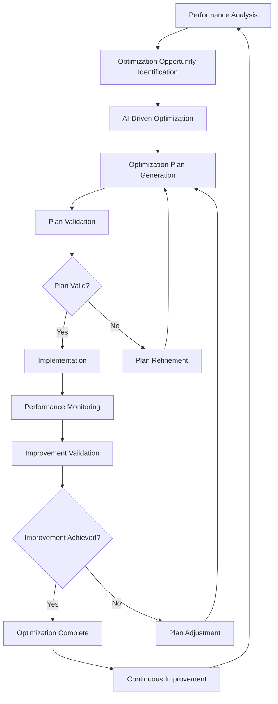

# **Process Optimizer**

## **Overview**

The Process Optimizer module provides AI-driven process optimization capabilities, enabling continuous process improvement, performance optimization, and intelligent process redesign. It uses machine learning algorithms, analytics insights, and optimization techniques to enhance process efficiency, reduce costs, and improve outcomes.

## **Core Principles**
- **AI-Driven Optimization**: Use AI/ML algorithms for intelligent process optimization.
- **Continuous Improvement**: Enable continuous process improvement and optimization.
- **Performance Optimization**: Optimize process performance and efficiency.
- **Intelligent Redesign**: Intelligently redesign processes based on analytics insights.

## **Function Specifications**

### **Core Functions**
- **Performance Analysis**: Analyze process performance and identify optimization opportunities.
- **AI-Driven Optimization**: Use AI/ML algorithms for process optimization.
- **Process Redesign**: Intelligently redesign processes for better performance.
- **Continuous Improvement**: Enable continuous process improvement cycles.
- **Optimization Validation**: Validate optimization results and improvements.
- **Performance Tracking**: Track optimization effectiveness and performance improvements.

### **TypeScript Interfaces**
```typescript
interface ProcessOptimizerConfig {
  aiEngine: AIEngineConfig;
  optimizationStrategy: OptimizationStrategy;
  continuousImprovement: ImprovementConfig;
  validation: ValidationConfig;
}

interface ProcessOptimization {
  id: string;
  processId: string;
  optimizationType: OptimizationType;
  currentMetrics: ProcessMetrics;
  targetMetrics: ProcessMetrics;
  optimizationPlan: OptimizationPlan;
  status: OptimizationStatus;
}

interface OptimizationPlan {
  steps: OptimizationStep[];
  estimatedImprovement: number;
  implementationTime: number;
  riskAssessment: RiskAssessment;
  rollbackPlan: RollbackPlan;
}

interface OptimizationStep {
  id: string;
  description: string;
  action: OptimizationAction;
  expectedImpact: number;
  dependencies: string[];
}

function analyzePerformance(processId: string): Promise<PerformanceAnalysis>
function optimizeProcess(processId: string): Promise<ProcessOptimization>
function redesignProcess(processId: string): Promise<RedesignResult>
function implementOptimization(optimizationId: string): Promise<ImplementationResult>
function validateOptimization(optimizationId: string): Promise<ValidationResult>
function trackImprovement(processId: string): Promise<ImprovementMetrics>
```

## **Integration Patterns**

### **Process Optimization Flow**


## **Capabilities**
- **AI-Driven Optimization**: Use advanced AI/ML algorithms for process optimization.
- **Performance Analysis**: Comprehensive performance analysis and bottleneck identification.
- **Process Redesign**: Intelligent process redesign based on analytics insights.
- **Continuous Improvement**: Enable continuous improvement cycles and optimization.
- **Optimization Validation**: Validate optimization results and measure improvements.
- **Risk Assessment**: Assess optimization risks and provide rollback capabilities.

## **Configuration Examples**
```yaml
process_optimizer:
  ai_engine:
    enabled: true
    optimization_algorithm: "genetic_algorithm"
    learning_rate: 0.1
    training_data_window: "90d"
    model_retraining_interval: "7d"
  optimization_strategy:
    enabled: true
    optimization_criteria:
      - "execution_time"
      - "resource_utilization"
      - "cost_efficiency"
      - "quality_metrics"
    optimization_constraints:
      - constraint: "budget_limit"
        value: 10000
      - constraint: "implementation_time"
        value: "30d"
    optimization_approaches:
      - approach: "incremental"
        description: "Gradual process improvements"
      - approach: "radical"
        description: "Complete process redesign"
  continuous_improvement:
    enabled: true
    improvement_cycles: "weekly"
    feedback_integration: true
    stakeholder_involvement: true
    improvement_metrics:
      - "efficiency_gain"
      - "cost_reduction"
      - "quality_improvement"
      - "user_satisfaction"
  validation:
    enabled: true
    validation_methods:
      - method: "a_b_testing"
        duration: "7d"
      - method: "simulation"
        scenarios: ["normal", "peak", "failure"]
      - method: "pilot_testing"
        scope: "10%"
    success_criteria:
      - criterion: "performance_improvement"
        threshold: "20%"
      - criterion: "cost_reduction"
        threshold: "15%"
      - criterion: "quality_maintenance"
        threshold: "95%"
  optimization_templates:
    - template: "bottleneck_elimination"
      description: "Eliminate process bottlenecks"
      steps:
        - "identify_bottlenecks"
        - "analyze_causes"
        - "design_solutions"
        - "implement_changes"
    - template: "resource_optimization"
      description: "Optimize resource allocation"
      steps:
        - "analyze_resource_usage"
        - "identify_inefficiencies"
        - "redesign_allocation"
        - "implement_changes"
```

## **Performance Considerations**
- **Performance Analysis**: < 5s for comprehensive performance analysis
- **Optimization Planning**: < 30s for optimization plan generation
- **AI Optimization**: < 1m for AI-driven optimization calculations
- **Validation Processing**: < 10s for optimization validation
- **Implementation Tracking**: < 100ms for implementation progress tracking

## **Security Considerations**
- **Optimization Security**: Secure optimization algorithms and prevent manipulation
- **Data Security**: Secure optimization data and prevent unauthorized access
- **Implementation Security**: Secure optimization implementation and rollback
- **Access Control**: Control access to optimization functions and results

## **Monitoring & Observability**
- **Optimization Metrics**: Track optimization effectiveness and performance improvements
- **AI Model Metrics**: Monitor AI model performance and accuracy
- **Implementation Metrics**: Track optimization implementation progress and success
- **Validation Metrics**: Monitor optimization validation and effectiveness
- **Improvement Metrics**: Track continuous improvement cycles and outcomes

---

**Version**: 1.0  
**Module**: Process Optimizer  
**Status**: ✅ **COMPLETE** - Comprehensive module specification ready for implementation  
**Focus**: AI-driven process optimization with continuous improvement and intelligent redesign. 