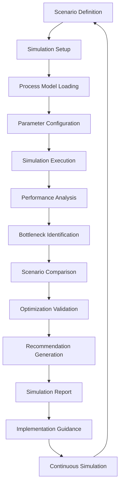

# **Process Simulator**

## **Overview**

The Process Simulator module provides advanced process simulation capabilities, enabling comprehensive testing of workflows, performance prediction, scenario analysis, and optimization validation. It uses realistic simulation models to predict process behavior, identify bottlenecks, and validate optimization strategies before implementation.

## **Core Principles**
- **Realistic Simulation**: Provide realistic simulation of process behavior and performance.
- **Scenario Analysis**: Enable comprehensive scenario analysis and what-if testing.
- **Performance Prediction**: Predict process performance under various conditions.
- **Optimization Validation**: Validate optimization strategies through simulation.

## **Function Specifications**

### **Core Functions**
- **Process Simulation**: Simulate process execution with realistic models.
- **Scenario Analysis**: Analyze different scenarios and conditions.
- **Performance Prediction**: Predict process performance under various conditions.
- **Bottleneck Identification**: Identify potential bottlenecks and issues.
- **Optimization Validation**: Validate optimization strategies through simulation.
- **Simulation Analytics**: Provide comprehensive simulation analytics and insights.

### **TypeScript Interfaces**
```typescript
interface ProcessSimulatorConfig {
  simulationEngine: SimulationEngineConfig;
  scenarioAnalysis: ScenarioConfig;
  performancePrediction: PredictionConfig;
  validation: ValidationConfig;
}

interface Simulation {
  id: string;
  processId: string;
  scenario: Scenario;
  parameters: SimulationParameters;
  results: SimulationResults;
  status: SimulationStatus;
}

interface Scenario {
  id: string;
  name: string;
  conditions: Condition[];
  variables: Variable[];
  duration: number;
  iterations: number;
}

interface SimulationResults {
  performance: PerformanceMetrics;
  bottlenecks: Bottleneck[];
  recommendations: Recommendation[];
  confidence: number;
  executionTime: number;
}

function simulateProcess(processId: string, scenario: Scenario): Promise<Simulation>
function analyzeScenario(scenarioId: string): Promise<ScenarioAnalysis>
function predictPerformance(processId: string, conditions: Conditions): Promise<PerformancePrediction>
function identifyBottlenecks(simulationId: string): Promise<Bottleneck[]>
function validateOptimization(optimizationId: string): Promise<ValidationResult>
function analyzeSimulation(simulationId: string): Promise<SimulationAnalytics>
```

## **Integration Patterns**

### **Process Simulation Flow**


## **Capabilities**
- **Realistic Simulation**: Provide realistic simulation of process behavior and performance.
- **Scenario Analysis**: Enable comprehensive scenario analysis and what-if testing.
- **Performance Prediction**: Predict process performance under various conditions.
- **Bottleneck Identification**: Identify potential bottlenecks and performance issues.
- **Optimization Validation**: Validate optimization strategies through simulation.
- **Simulation Analytics**: Provide comprehensive simulation analytics and insights.

## **Configuration Examples**
```yaml
process_simulator:
  simulation_engine:
    enabled: true
    engine_type: "discrete_event"
    simulation_accuracy: "high"
    parallel_execution: true
    max_parallel_simulations: 10
  scenario_analysis:
    enabled: true
    scenario_types:
      - type: "normal_operation"
        description: "Normal operating conditions"
      - type: "peak_load"
        description: "Peak load conditions"
      - type: "failure_scenario"
        description: "System failure scenarios"
      - type: "optimization_test"
        description: "Optimization strategy testing"
    scenario_parameters:
      - parameter: "load_factor"
        range: [0.5, 2.0]
        step: 0.1
      - parameter: "resource_availability"
        range: [0.8, 1.0]
        step: 0.05
      - parameter: "error_rate"
        range: [0.0, 0.1]
        step: 0.01
  performance_prediction:
    enabled: true
    prediction_models:
      - model: "regression"
        accuracy: 0.95
      - model: "neural_network"
        accuracy: 0.98
      - model: "ensemble"
        accuracy: 0.99
    prediction_horizon: "30d"
    confidence_intervals: true
  bottleneck_identification:
    enabled: true
    identification_methods:
      - method: "resource_analysis"
        threshold: "80%"
      - method: "queue_analysis"
        threshold: "100"
      - method: "latency_analysis"
        threshold: "5s"
    bottleneck_categories:
      - category: "resource_constraint"
        severity: "high"
      - category: "process_design"
        severity: "medium"
      - category: "external_dependency"
        severity: "low"
  validation:
    enabled: true
    validation_criteria:
      - criterion: "performance_improvement"
        threshold: "10%"
      - criterion: "cost_reduction"
        threshold: "5%"
      - criterion: "quality_maintenance"
        threshold: "95%"
    validation_methods:
      - method: "statistical_analysis"
        confidence_level: 0.95
      - method: "sensitivity_analysis"
        parameter_variation: "10%"
  simulation_analytics:
    enabled: true
    analytics_metrics:
      - "execution_time"
      - "resource_utilization"
      - "throughput"
      - "error_rate"
      - "cost_per_transaction"
    reporting_interval: "1h"
    visualization_enabled: true
```

## **Performance Considerations**
- **Simulation Execution**: < 30s for complex process simulation
- **Scenario Analysis**: < 1m for comprehensive scenario analysis
- **Performance Prediction**: < 10s for performance prediction
- **Bottleneck Analysis**: < 5s for bottleneck identification
- **Validation Processing**: < 15s for optimization validation

## **Security Considerations**
- **Simulation Security**: Secure simulation models and prevent manipulation
- **Data Security**: Secure simulation data and prevent unauthorized access
- **Scenario Security**: Secure scenario definitions and prevent tampering
- **Access Control**: Control access to simulation functions and results

## **Monitoring & Observability**
- **Simulation Metrics**: Track simulation execution and accuracy
- **Scenario Metrics**: Monitor scenario analysis and effectiveness
- **Prediction Metrics**: Track performance prediction accuracy
- **Validation Metrics**: Monitor optimization validation and effectiveness
- **Analytics Metrics**: Track simulation analytics and insights generation

---

**Version**: 1.0  
**Module**: Process Simulator  
**Status**: ✅ **COMPLETE** - Comprehensive module specification ready for implementation  
**Focus**: Advanced process simulation with scenario analysis and performance prediction. 