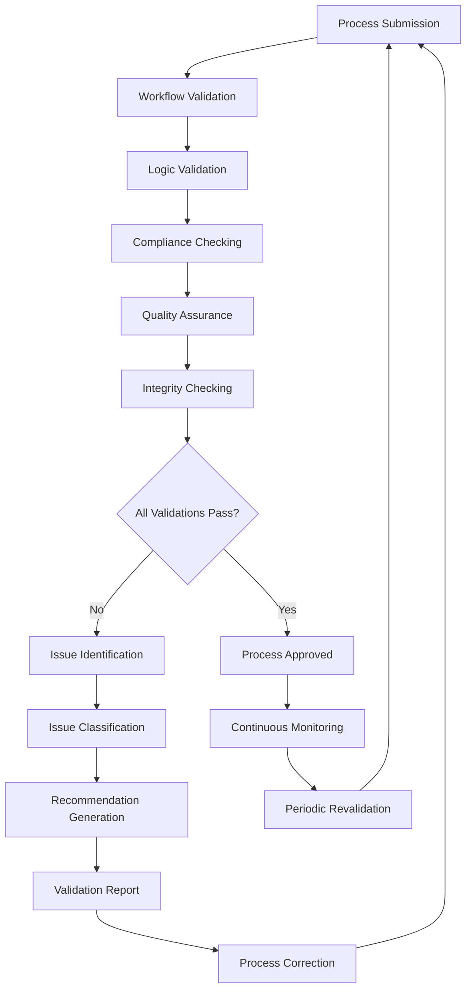

# **Process Validator**

## **Overview**

The Process Validator module provides comprehensive process validation capabilities, ensuring workflow correctness, compliance with standards, quality assurance, and process integrity. It validates processes against business rules, compliance requirements, and quality standards to ensure reliable and compliant process execution.

## **Core Principles**
- **Workflow Correctness**: Validate workflow logic and ensure correct execution paths.
- **Compliance Checking**: Ensure processes comply with business rules and regulations.
- **Quality Assurance**: Validate process quality and performance standards.
- **Process Integrity**: Ensure process integrity and reliability.

## **Function Specifications**

### **Core Functions**
- **Workflow Validation**: Validate workflow logic and execution paths.
- **Compliance Checking**: Check process compliance with business rules and regulations.
- **Quality Assurance**: Validate process quality and performance standards.
- **Process Integrity**: Ensure process integrity and reliability.
- **Validation Reporting**: Provide comprehensive validation reports and recommendations.
- **Continuous Validation**: Enable continuous validation and monitoring.

### **TypeScript Interfaces**
```typescript
interface ProcessValidatorConfig {
  workflowValidation: WorkflowValidationConfig;
  complianceChecking: ComplianceConfig;
  qualityAssurance: QualityConfig;
  integrityChecking: IntegrityConfig;
}

interface ValidationResult {
  id: string;
  processId: string;
  validationType: ValidationType;
  status: ValidationStatus;
  issues: ValidationIssue[];
  recommendations: Recommendation[];
  timestamp: Date;
}

interface ValidationIssue {
  id: string;
  type: IssueType;
  severity: Severity;
  description: string;
  location: IssueLocation;
  impact: string;
  remediation: string;
}

interface ComplianceRule {
  id: string;
  name: string;
  category: ComplianceCategory;
  rule: RuleDefinition;
  enforcement: EnforcementLevel;
  validation: ValidationMethod;
}

function validateWorkflow(processId: string): Promise<ValidationResult>
function checkCompliance(processId: string): Promise<ComplianceResult>
function assureQuality(processId: string): Promise<QualityResult>
function checkIntegrity(processId: string): Promise<IntegrityResult>
function generateReport(validationId: string): Promise<ValidationReport>
function monitorValidation(processId: string): Promise<ValidationMetrics>
```

## **Integration Patterns**

### **Process Validation Flow**


## **Capabilities**
- **Workflow Validation**: Comprehensive workflow logic and execution path validation.
- **Compliance Checking**: Automated compliance checking against business rules and regulations.
- **Quality Assurance**: Quality validation and performance standard checking.
- **Process Integrity**: Process integrity and reliability validation.
- **Validation Reporting**: Comprehensive validation reports and recommendations.
- **Continuous Validation**: Continuous validation and monitoring capabilities.

## **Configuration Examples**
```yaml
process_validator:
  workflow_validation:
    enabled: true
    validation_rules:
      - rule: "no_dead_ends"
        description: "All execution paths must reach an end state"
        severity: "critical"
      - rule: "no_infinite_loops"
        description: "No infinite loops in workflow execution"
        severity: "critical"
      - rule: "proper_error_handling"
        description: "All error conditions must be handled"
        severity: "high"
    validation_methods:
      - method: "static_analysis"
        enabled: true
      - method: "dynamic_analysis"
        enabled: true
      - method: "model_checking"
        enabled: true
  compliance_checking:
    enabled: true
    compliance_frameworks:
      - framework: "sox"
        rules:
          - rule: "dual_approval"
            condition: "transaction_amount > 50000"
            enforcement: "mandatory"
          - rule: "audit_trail"
            condition: "all_transactions"
            enforcement: "mandatory"
      - framework: "gdpr"
        rules:
          - rule: "data_consent"
            condition: "personal_data_processing"
            enforcement: "mandatory"
          - rule: "data_retention"
            condition: "data_storage"
            enforcement: "mandatory"
    compliance_validation:
      - validation: "rule_engine"
        engine: "drools"
      - validation: "policy_checker"
        policies: "business_policies.json"
  quality_assurance:
    enabled: true
    quality_standards:
      - standard: "performance"
        metrics:
          - metric: "execution_time"
            threshold: "5s"
          - metric: "throughput"
            threshold: "1000/min"
      - standard: "reliability"
        metrics:
          - metric: "success_rate"
            threshold: "99%"
          - metric: "error_rate"
            threshold: "1%"
      - standard: "maintainability"
        metrics:
          - metric: "complexity"
            threshold: "10"
          - metric: "coupling"
            threshold: "5"
  integrity_checking:
    enabled: true
    integrity_checks:
      - check: "data_integrity"
        validation: "schema_validation"
      - check: "process_integrity"
        validation: "state_validation"
      - check: "security_integrity"
        validation: "access_control"
    integrity_monitoring:
      - monitoring: "real_time"
        interval: "1s"
      - monitoring: "periodic"
        interval: "1h"
  validation_reporting:
    enabled: true
    report_formats:
      - format: "html"
        template: "validation_report.html"
      - format: "pdf"
        template: "validation_report.pdf"
      - format: "json"
        template: "validation_report.json"
    report_sections:
      - section: "executive_summary"
        include: true
      - section: "detailed_findings"
        include: true
      - section: "recommendations"
        include: true
      - section: "compliance_status"
        include: true
```

## **Performance Considerations**
- **Workflow Validation**: < 5s for complex workflow validation
- **Compliance Checking**: < 10s for comprehensive compliance checking
- **Quality Assurance**: < 15s for quality validation
- **Integrity Checking**: < 5s for integrity validation
- **Report Generation**: < 30s for comprehensive validation reports

## **Security Considerations**
- **Validation Security**: Secure validation processes and prevent bypassing
- **Compliance Security**: Secure compliance checking and prevent violations
- **Report Security**: Secure validation reports and prevent unauthorized access
- **Access Control**: Control access to validation functions and results

## **Monitoring & Observability**
- **Validation Metrics**: Track validation success rates and performance
- **Compliance Metrics**: Monitor compliance checking and violation rates
- **Quality Metrics**: Track quality validation and standard compliance
- **Integrity Metrics**: Monitor integrity checking and violation detection
- **Reporting Metrics**: Track validation report generation and delivery

---

**Version**: 1.0  
**Module**: Process Validator  
**Status**: ✅ **COMPLETE** - Comprehensive module specification ready for implementation  
**Focus**: Comprehensive process validation with compliance checking and quality assurance. 