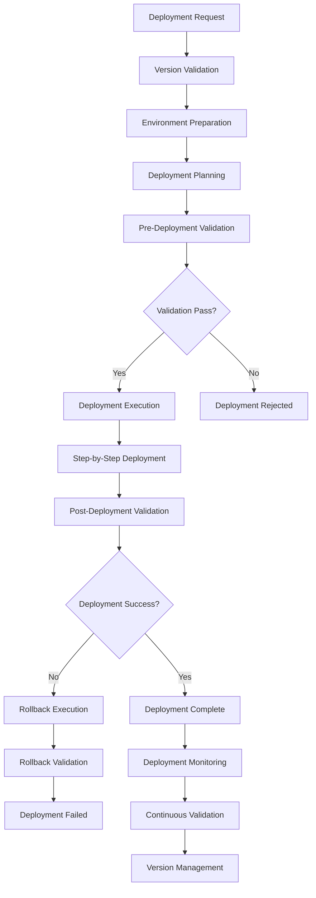

# **Process Deployer**

## **Overview**

The Process Deployer module provides advanced process deployment capabilities, enabling automated deployment, version management, rollback capabilities, and multi-environment process distribution. It ensures reliable, consistent, and validated process deployment across different environments and platforms.

## **Core Principles**
- **Automated Deployment**: Enable automated and reliable process deployment.
- **Version Management**: Manage process versions and deployment history.
- **Rollback Capabilities**: Provide safe rollback mechanisms for failed deployments.
- **Multi-Environment Support**: Support deployment across multiple environments.

## **Function Specifications**

### **Core Functions**
- **Automated Deployment**: Automate process deployment across environments.
- **Version Management**: Manage process versions and deployment history.
- **Rollback Management**: Provide rollback capabilities for failed deployments.
- **Environment Management**: Manage deployment across multiple environments.
- **Deployment Validation**: Validate deployments before and after execution.
- **Deployment Monitoring**: Monitor deployment progress and success.

### **TypeScript Interfaces**
```typescript
interface ProcessDeployerConfig {
  automatedDeployment: DeploymentConfig;
  versionManagement: VersionConfig;
  rollbackManagement: RollbackConfig;
  environmentManagement: EnvironmentConfig;
}

interface Deployment {
  id: string;
  processId: string;
  version: string;
  environment: string;
  status: DeploymentStatus;
  deploymentPlan: DeploymentPlan;
  validationResults: ValidationResult[];
  rollbackPlan: RollbackPlan;
}

interface DeploymentPlan {
  steps: DeploymentStep[];
  dependencies: Dependency[];
  estimatedDuration: number;
  riskAssessment: RiskAssessment;
  validationChecks: ValidationCheck[];
}

interface DeploymentStep {
  id: string;
  name: string;
  action: DeploymentAction;
  order: number;
  dependencies: string[];
  validation: StepValidation;
}

function deployProcess(processId: string, environment: string): Promise<Deployment>
function manageVersion(processId: string, version: string): Promise<VersionResult>
function rollbackDeployment(deploymentId: string): Promise<RollbackResult>
function manageEnvironment(environmentId: string): Promise<EnvironmentResult>
function validateDeployment(deploymentId: string): Promise<ValidationResult>
function monitorDeployment(deploymentId: string): Promise<DeploymentMetrics>
```

## **Integration Patterns**

### **Process Deployment Flow**


## **Capabilities**
- **Automated Deployment**: Fully automated process deployment with minimal human intervention.
- **Version Management**: Comprehensive version management and deployment history tracking.
- **Rollback Capabilities**: Safe and reliable rollback mechanisms for failed deployments.
- **Multi-Environment Support**: Support for deployment across development, staging, and production environments.
- **Deployment Validation**: Comprehensive validation before and after deployment.
- **Deployment Monitoring**: Real-time monitoring of deployment progress and success.

## **Configuration Examples**
```yaml
process_deployer:
  automated_deployment:
    enabled: true
    deployment_strategy: "blue_green"
    deployment_timeout: "30m"
    parallel_deployments: 3
    deployment_validation:
      - validation: "health_check"
        endpoint: "/health"
        timeout: "30s"
      - validation: "smoke_test"
        tests: ["basic_functionality", "critical_paths"]
      - validation: "performance_test"
        threshold: "response_time < 2s"
  version_management:
    enabled: true
    version_strategy: "semantic_versioning"
    version_history: "100"
    version_metadata:
      - field: "author"
        required: true
      - field: "description"
        required: true
      - field: "change_log"
        required: true
    version_approval:
      - approval: "code_review"
        required: true
      - approval: "security_scan"
        required: true
      - approval: "performance_test"
        required: true
  rollback_management:
    enabled: true
    rollback_strategy: "automatic"
    rollback_triggers:
      - trigger: "health_check_failure"
        threshold: 3
        timeout: "5m"
      - trigger: "performance_degradation"
        threshold: "50%"
        timeout: "10m"
      - trigger: "error_rate_spike"
        threshold: "10%"
        timeout: "5m"
    rollback_validation:
      - validation: "data_integrity"
        enabled: true
      - validation: "service_availability"
        enabled: true
  environment_management:
    enabled: true
    environments:
      - environment: "development"
        auto_deploy: true
        validation_level: "basic"
        rollback_enabled: false
      - environment: "staging"
        auto_deploy: false
        validation_level: "comprehensive"
        rollback_enabled: true
      - environment: "production"
        auto_deploy: false
        validation_level: "extensive"
        rollback_enabled: true
        approval_required: true
    environment_sync:
      - sync: "configuration"
        enabled: true
      - sync: "secrets"
        enabled: true
      - sync: "dependencies"
        enabled: true
  deployment_validation:
    enabled: true
    validation_phases:
      - phase: "pre_deployment"
        validations:
          - "process_validation"
          - "environment_validation"
          - "dependency_validation"
      - phase: "deployment"
        validations:
          - "step_validation"
          - "health_check"
          - "integration_test"
      - phase: "post_deployment"
        validations:
          - "smoke_test"
          - "performance_test"
          - "monitoring_setup"
  deployment_monitoring:
    enabled: true
    monitoring_metrics:
      - "deployment_duration"
      - "deployment_success_rate"
      - "rollback_frequency"
      - "validation_pass_rate"
    alert_thresholds:
      - metric: "deployment_failure_rate"
        threshold: "5%"
      - metric: "rollback_frequency"
        threshold: "10%"
```

## **Performance Considerations**
- **Deployment Execution**: < 10m for complex process deployment
- **Validation Processing**: < 2m for comprehensive deployment validation
- **Rollback Execution**: < 5m for rollback execution
- **Version Management**: < 30s for version operations
- **Environment Sync**: < 1m for environment synchronization

## **Security Considerations**
- **Deployment Security**: Secure deployment processes and prevent unauthorized deployments
- **Version Security**: Secure version management and prevent version tampering
- **Environment Security**: Secure environment access and configuration
- **Rollback Security**: Secure rollback processes and prevent unauthorized rollbacks

## **Monitoring & Observability**
- **Deployment Metrics**: Track deployment success rates and performance
- **Version Metrics**: Monitor version management and deployment history
- **Rollback Metrics**: Track rollback frequency and effectiveness
- **Environment Metrics**: Monitor environment management and synchronization
- **Validation Metrics**: Track deployment validation and success rates

---

**Version**: 1.0  
**Module**: Process Deployer  
**Status**: ✅ **COMPLETE** - Comprehensive module specification ready for implementation  
**Focus**: Advanced process deployment with version management and rollback capabilities. 