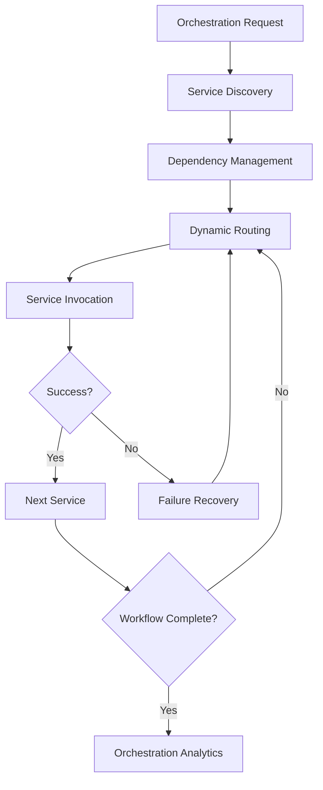

# Orchestration

## Overview
Orchestration modules coordinate the execution of complex workflows, integrating multiple services, managing dependencies, and enabling adaptive, resilient workflow execution across distributed systems.

## Core Principles
- **Composability**: Enable dynamic composition of services and tasks
- **Resilience**: Recover from failures and adapt to changing conditions
- **Transparency**: Provide clear visibility into orchestration flows
- **Policy-Driven**: Support flexible orchestration policies and rules
- **Scalability**: Orchestrate workflows at any scale

## Function Specifications

### Base Functions
1. **Service Orchestration** – Coordinate multiple services in a workflow
2. **Dependency Management** – Manage and resolve task/service dependencies
3. **Dynamic Routing** – Route tasks/services based on runtime conditions
4. **Failure Recovery** – Detect and recover from orchestration failures
5. **Orchestration Policies** – Define and enforce orchestration rules
6. **Adaptive Orchestration** – Adjust orchestration flows dynamically
7. **Cross-Node Coordination** – Orchestrate workflows across distributed nodes
8. **Orchestration Analytics** – Analyze orchestration performance and outcomes

## Integration Patterns

### Orchestration Flow


## Capabilities
- **Multi-Service Coordination**: Orchestrate multiple services in a single workflow
- **Dynamic Adaptation**: Adjust orchestration based on real-time data
- **Policy Enforcement**: Apply custom orchestration policies
- **Cross-Node Execution**: Coordinate workflows across distributed systems
- **Comprehensive Analytics**: Monitor and analyze orchestration outcomes

## Configuration Example
```yaml
orchestration:
  service_discovery:
    type: "consul"
    refresh_interval: 30s
    health_check: true
  policies:
    - name: "failover"
      enabled: true
    - name: "load_balancing"
      algorithm: "round_robin"
      enabled: true
  analytics:
    enabled: true
    metrics: ["latency", "success_rate", "failures"]
  adaptive:
    enabled: true
    triggers: ["load", "latency", "error_rate"]
```

## Error Handling
- **Service Failures**: Retry or reroute failed service calls
- **Dependency Resolution Errors**: Block or reschedule dependent tasks
- **Policy Violations**: Log and revert to default orchestration policy
- **Analytics Gaps**: Fallback to basic monitoring and alert operators
- **Cross-Node Coordination Failures**: Attempt local recovery and escalate 