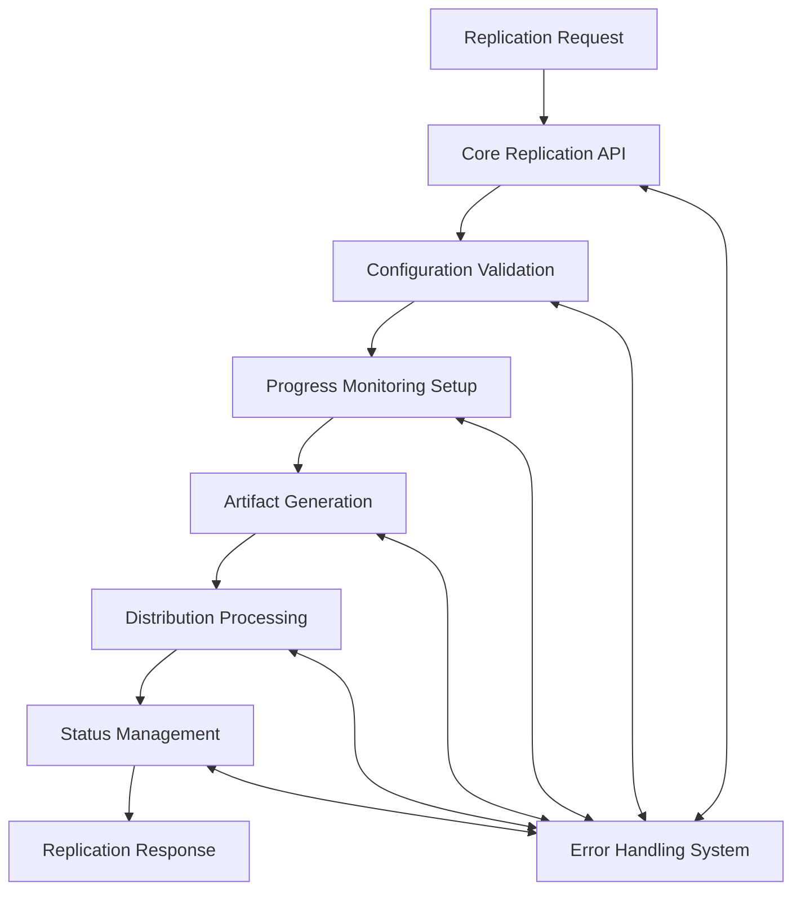

# Griot Class Universal Adapter Architecture

## 🏗️ System Architecture Overview

The Griot node implements a **comprehensive universal artifact generation and replication framework** designed to adapt to any platform, packaging system, distribution protocol, or service ecosystem. As a core component of the universal adapter library, Griot provides AI agents with complete knowledge necessary to dynamically learn and implement any artifact generation pattern, replication strategy, or distribution mechanism across any technology stack.

```
┌─────────────────────────────────────────────────────────────────────────────────────┐
│                        GRIOT UNIVERSAL ADAPTER ARCHITECTURE                        │
├─────────────────────────────────────────────────────────────────────────────────────┤
│  ┌───────────────────┐  ┌───────────────────┐  ┌───────────────────┐  ┌─────────────┐ │
│  │ Core Replication  │  │ Advanced          │  │ Progress & Status │  │ Error       │ │
│  │ API               │  │ Configuration     │  │ Management        │  │ Handling &  │ │
│  │                   │  │ & Parameters      │  │                   │  │ Recovery    │ │
│  └───────────────────┘  └───────────────────┘  └───────────────────┘  └─────────────┘ │
├─────────────────────────────────────────────────────────────────────────────────────┤
│                      Universal Adapter Foundation Layer                             │
└─────────────────────────────────────────────────────────────────────────────────────┘
```

## Modular Architecture Components

This architecture has been designed with a **modular approach** to ensure maintainability, scalability, and ease of understanding. Each major component is implemented as a separate module:

### 1. Core Replication API Module
**File**: [`modules/01_Core_Replication_API.md`](modules/01_Core_Replication_API.md)

The foundational replication operations and basic request/response patterns for artifact generation and distribution.

**Key Capabilities**:
- Universal replication operations (20+ replication types)
- Basic request/response patterns
- Artifact packaging and distribution
- Platform-agnostic deployment strategies
- Content transformation pipelines

### 2. Advanced Configuration & Parameters Module
**File**: [`modules/02_Advanced_Configuration_Parameters.md`](modules/02_Advanced_Configuration_Parameters.md)

Comprehensive configuration options and parameter systems for sophisticated replication scenarios and customization.

**Key Capabilities**:
- 50+ package format types (Docker, NPM, DEB, APK, etc.)
- Multi-platform target support (30+ platforms)
- Advanced compression algorithms
- Build system configurations
- Platform-specific optimizations

### 3. Progress Tracking & Status Management Module
**File**: [`modules/03_Progress_Status_Management.md`](modules/03_Progress_Status_Management.md)

Comprehensive progress monitoring and status management systems for tracking artifact generation and distribution operations.

**Key Capabilities**:
- Real-time progress tracking
- Multi-stage operation monitoring
- Performance metrics collection
- Resource utilization monitoring
- Telemetry and analytics systems

### 4. Error Handling & Recovery Module
**File**: [`modules/04_Error_Handling_Recovery.md`](modules/04_Error_Handling_Recovery.md)

Comprehensive error management and intelligent recovery strategies for robust artifact generation and distribution workflows.

**Key Capabilities**:
- 25+ error classification types
- Intelligent error recovery strategies
- Rollback and restoration systems
- Health monitoring and diagnostics
- Quality assurance frameworks

## Core Architecture Principles

### Universal Adapter Pattern
Each module implements the universal adapter pattern with:

1. **Comprehensive Protocol Coverage**: Extensive support for all packaging formats, distribution protocols, and deployment systems
2. **Multi-Platform Framework Matrices**: Complex configuration options for any target platform or technology stack
3. **Cultural Adaptation Mechanisms**: Support for diverse cultural contexts and deployment practices
4. **Performance Optimization Systems**: Adaptive algorithms and resource management for optimal replication
5. **Security Integration**: Multi-layer protection and compliance frameworks for secure artifact handling
6. **Error Handling Systems**: Comprehensive detection and recovery strategies for reliable operations
7. **Real-World Implementation**: Practical examples and architectural guidance for production deployment

### Interface Integration
```typescript
interface GriotUniversalAdapter {
  coreReplicationAPI: CoreReplicationAPI;
  advancedConfiguration: AdvancedConfigurationParameters;
  progressStatusManager: ProgressStatusManagement;
  errorHandlingRecovery: ErrorHandlingRecovery;
  
  async processReplicationRequest(
    request: ReplicationRequest,
    context: ReplicationContext,
    requirements: ReplicationRequirements
  ): Promise<ReplicationResponse>;
  
  async adaptToContext(
    formatType: PackageFormatType,
    platform: PlatformTarget,
    distribution: DistributionContext
  ): Promise<AdaptedReplicationSystem>;
}
```

## Module Interaction Flow



## Quality Standards

- **Comprehensive Coverage**: 30-50+ enums per domain (package formats, platforms, protocols)
- **Multi-Protocol Support**: Support for any existing or future packaging/distribution system
- **Cultural Sensitivity**: HIEROS compliance with respectful artifact generation practices
- **Production Ready**: Complete enough to generate working implementations for any platform
- **Modular Design**: Composable with other nodes for complex deployment workflows

## Implementation Guidance

### Getting Started
1. **Review Module Documentation**: Read each module specification thoroughly
2. **Understand Platform Requirements**: Ensure platform compatibility and cultural appropriateness
3. **Select Appropriate Formats**: Choose packaging formats and distribution methods that fit your needs
4. **Configure Integration Points**: Set up connections to build systems and distribution channels
5. **Implement Error Handling**: Establish robust error detection and recovery for reliable operations

### Best Practices
- Always validate platform compatibility before implementing replication strategies
- Use comprehensive error handling for all external integrations and build processes
- Monitor progress continuously and adapt based on performance metrics
- Maintain audit trails for all artifact generation and distribution activities
- Respect security requirements and cultural considerations in deployment contexts

## Module Dependencies

```typescript
// Core dependencies between modules
interface ModuleDependencies {
  coreReplicationAPI: {
    requires: ["errorHandling"];
    provides: ["replicationOperations", "artifactGeneration"];
  };
  advancedConfiguration: {
    requires: ["coreReplicationAPI", "errorHandling"];
    provides: ["configurationManagement", "platformAdaptation"];
  };
  progressStatusManager: {
    requires: ["coreReplicationAPI", "errorHandling"];
    provides: ["progressTracking", "performanceMonitoring"];
  };
  errorHandlingRecovery: {
    requires: [];
    provides: ["errorManagement", "recoveryStrategies"];
  };
}
```

## Production Implementation Notes

This modular architecture enables:
- **Independent Development**: Each module can be developed and tested separately
- **Scalable Deployment**: Modules can be deployed across different infrastructure components  
- **Maintenance Efficiency**: Updates and fixes can be applied to specific modules
- **Cultural Compliance**: Framework ensures all implementations respect cultural deployment practices
- **Universal Compatibility**: Integration bridge handles any external build system or distribution protocol

For detailed implementation guidance, refer to each module's specific documentation in the `modules/` directory. 