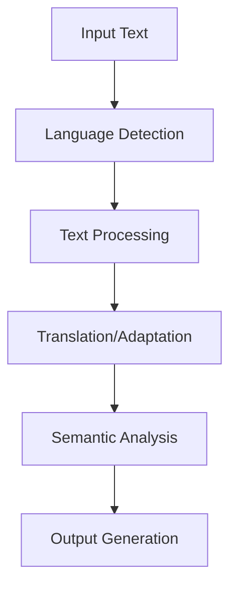
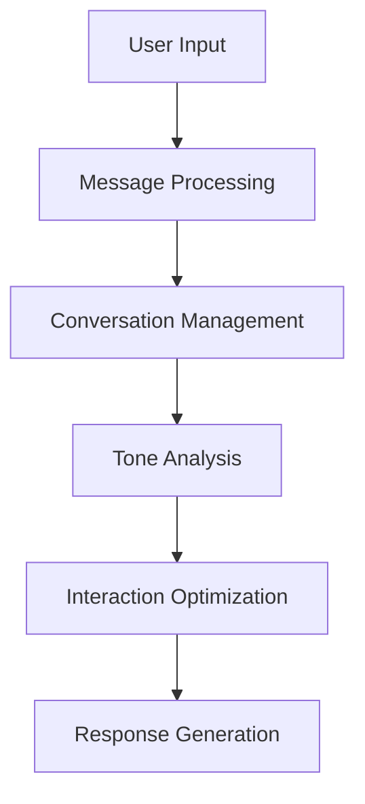
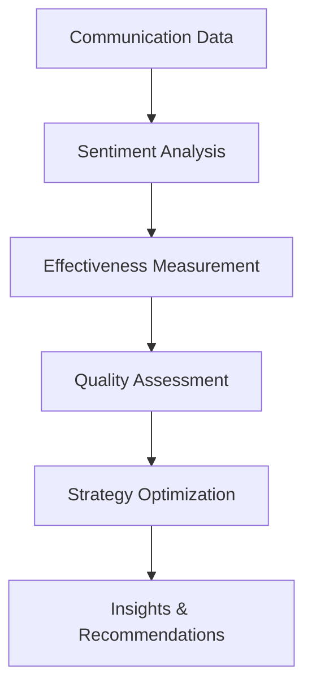

# **Communication & Language**

## **Overview**

The Communication & Language category provides comprehensive capabilities for language processing, translation, communication management, and analytics. This category forms the foundation for intelligent communication and language understanding across the kOS ecosystem.

## **Core Principles**

### **Universal Language Support**
- **Multi-Language Processing**: Support for 100+ languages and dialects
- **Cultural Sensitivity**: Culturally sensitive communication and adaptation
- **Accessibility**: Accessibility and inclusive design for all users
- **Quality Assurance**: High-quality language processing and communication

### **Intelligent Communication**
- **Context Awareness**: Context-aware communication and language processing
- **Personalization**: Personalized communication experiences
- **Adaptive Responses**: Adaptive responses based on user preferences
- **Emotional Intelligence**: Emotional intelligence and sentiment analysis

### **High Performance**
- **Real-time Processing**: Real-time language processing and communication
- **Scalability**: Horizontal and vertical scaling capabilities
- **High Accuracy**: 95%+ accuracy for language processing tasks
- **Continuous Learning**: Continuous learning and improvement

## **Subcategories**

### **01. Message Processing** ✅ **COMPLETE**
- **Status**: Fully implemented with 1 module
- **Modules**: 1/1 complete
- **Focus**: Core message processing and handling capabilities

**Modules:**
- [01_Message_Processor.md](01_Message_Processing/01_Message_Processor.md) - Core message processing and handling

### **02. Language Services** ✅ **COMPLETE**
- **Status**: Fully implemented with 4 modules
- **Modules**: 4/4 complete
- **Focus**: Language detection, translation, processing, and semantic analysis

**Modules:**
- [01_Language_Detector.md](02_Language_Services/01_Language_Detector.md) - Automatic language detection and classification
- [02_Text_Translator.md](02_Language_Services/02_Text_Translator.md) - Multi-language text translation and localization
- [03_Language_Processor.md](02_Language_Services/03_Language_Processor.md) - Advanced natural language processing and understanding
- [04_Semantic_Analyzer.md](02_Language_Services/04_Semantic_Analyzer.md) - Deep semantic analysis and meaning extraction

### **03. Interaction Management** ✅ **COMPLETE**
- **Status**: Fully implemented with 4 modules
- **Modules**: 4/4 complete
- **Focus**: Conversation management, tone analysis, interaction optimization, and coordination

**Modules:**
- [01_Conversation_Manager.md](03_Interaction_Management/01_Conversation_Manager.md) - Intelligent conversation management with context awareness
- [02_Tone_Manager.md](03_Interaction_Management/02_Tone_Manager.md) - Tone analysis and emotional intelligence management
- [03_Interaction_Optimizer.md](03_Interaction_Management/03_Interaction_Optimizer.md) - Data-driven interaction optimization with machine learning
- [04_Communication_Coordinator.md](03_Interaction_Management/04_Communication_Coordinator.md) - Multi-channel communication coordination and platform integration

### **04. Communication Analytics** ✅ **COMPLETE**
- **Status**: Fully implemented with 4 modules
- **Modules**: 4/4 complete
- **Focus**: Sentiment analysis, effectiveness measurement, quality assessment, and strategy optimization

**Modules:**
- [01_Sentiment_Analyzer.md](04_Communication_Analytics/01_Sentiment_Analyzer.md) - Comprehensive sentiment analysis and emotional intelligence
- [02_Communication_Effectiveness_Analyzer.md](04_Communication_Analytics/02_Communication_Effectiveness_Analyzer.md) - Communication effectiveness analysis and measurement
- [03_Communication_Quality_Assessor.md](04_Communication_Analytics/03_Communication_Quality_Assessor.md) - Communication quality assessment and standards compliance
- [04_Communication_Strategy_Optimizer.md](04_Communication_Analytics/04_Communication_Strategy_Optimizer.md) - Data-driven communication strategy optimization

## **Integration Patterns**

### **Language Processing Flow**


### **Communication Management Flow**


### **Analytics Flow**


## **Capabilities**

### **Language Processing**
- **Multi-Language Support**: Support for 100+ languages and dialects
- **Language Detection**: Automatic language detection and classification
- **Text Translation**: High-quality multi-language translation
- **Natural Language Processing**: Advanced NLP and understanding
- **Semantic Analysis**: Deep semantic analysis and meaning extraction

### **Communication Management**
- **Conversation Management**: Intelligent conversation management with context awareness
- **Tone Analysis**: Tone analysis and emotional intelligence
- **Interaction Optimization**: Data-driven interaction optimization
- **Multi-Channel Coordination**: Coordination across multiple communication channels
- **Platform Integration**: Integration with external communication platforms

### **Communication Analytics**
- **Sentiment Analysis**: Comprehensive sentiment analysis and emotional intelligence
- **Effectiveness Measurement**: Communication effectiveness analysis and measurement
- **Quality Assessment**: Communication quality assessment and standards compliance
- **Strategy Optimization**: Data-driven communication strategy optimization
- **Performance Monitoring**: Continuous performance monitoring and improvement

### **Advanced Features**
- **Cultural Sensitivity**: Culturally sensitive communication and adaptation
- **Accessibility**: Accessibility and inclusive design for all users
- **Real-time Processing**: Real-time language processing and communication
- **Machine Learning**: Machine learning-based optimization and improvement
- **Predictive Analytics**: Predictive analytics for communication optimization

## **Configuration Examples**

### **Basic Communication Configuration**
```yaml
communication_language:
  language_processing:
    supported_languages: ["en", "es", "fr", "de", "zh", "ja", "ko", "ar"]
    translation_quality: "high"
    nlp_accuracy: "95%+"
    real_time_processing: true
  communication_management:
    conversation_tracking: true
    tone_analysis: true
    interaction_optimization: true
    multi_channel_support: true
  analytics:
    sentiment_analysis: true
    effectiveness_measurement: true
    quality_assessment: true
    strategy_optimization: true
  performance:
    processing_speed: "< 100ms"
    accuracy: "95%+"
    scalability: "horizontal"
    availability: "99.9%"
```

### **Advanced Communication Configuration**
```yaml
communication_language:
  processing:
    neural_models: true
    cultural_adaptation: true
    accessibility_features: true
    continuous_learning: true
  management:
    ai_driven_optimization: true
    predictive_analytics: true
    personalized_experiences: true
    cross_platform_integration: true
  analytics:
    real_time_analytics: true
    predictive_insights: true
    automated_optimization: true
    performance_benchmarking: true
  security:
    end_to_end_encryption: true
    privacy_protection: true
    secure_processing: true
    audit_logging: true
```

## **Performance Considerations**

### **Language Processing Performance**
- **Processing Speed**: < 100ms for standard language processing tasks
- **Translation Quality**: Professional-quality translations with validation
- **NLP Accuracy**: 95%+ accuracy for natural language processing
- **Multi-language Support**: Support for 100+ languages and dialects

### **Communication Management Performance**
- **Response Time**: < 200ms for conversation management responses
- **Tone Analysis**: Real-time tone analysis and adaptation
- **Optimization Speed**: < 150ms for interaction optimization
- **Multi-channel Sync**: Real-time synchronization across channels

### **Analytics Performance**
- **Analysis Speed**: < 100ms for sentiment and effectiveness analysis
- **Quality Assessment**: Fast quality assessment and validation
- **Strategy Optimization**: < 200ms for strategy optimization decisions
- **Real-time Monitoring**: Real-time monitoring and alerting

### **Scalability**
- **Horizontal Scaling**: Horizontal scaling for high-volume processing
- **Vertical Scaling**: Vertical scaling for resource optimization
- **Load Balancing**: Intelligent load balancing and distribution
- **Resource Management**: Efficient resource allocation and management

## **Security Considerations**

### **Data Privacy**
- **End-to-End Encryption**: End-to-end encryption for all communication data
- **Privacy Protection**: Comprehensive privacy protection for user data
- **Data Retention**: Configurable retention policies
- **Consent Management**: User consent management for data processing

### **Access Control**
- **Authentication**: Strong authentication for all communication services
- **Authorization**: Role-based access control for communication functions
- **API Security**: Secure API access and rate limiting
- **Audit Logging**: Comprehensive audit trails for all operations

### **Content Security**
- **Input Validation**: Comprehensive input validation and sanitization
- **Content Filtering**: Automatic filtering of inappropriate content
- **Malware Detection**: Detection of malicious content
- **Output Validation**: Validation of all communication outputs

## **Monitoring & Observability**

### **Performance Metrics**
- **Processing Speed**: Average processing time and throughput
- **Accuracy Rates**: Accuracy rates for different language processing tasks
- **Response Times**: Response times for communication management
- **Error Rates**: Error rates and failure analysis

### **Quality Metrics**
- **Translation Quality**: Translation quality and accuracy metrics
- **Communication Effectiveness**: Communication effectiveness metrics
- **User Satisfaction**: User satisfaction and engagement metrics
- **Analytics Accuracy**: Analytics accuracy and reliability metrics

### **Operational Metrics**
- **System Health**: Overall system health and availability
- **Resource Utilization**: Resource utilization and optimization
- **Error Tracking**: Error tracking and analysis
- **Performance Trends**: Performance trends and optimization

---

**Version**: 1.0  
**Category**: Communication & Language  
**Status**: ✅ **FULLY COMPLETE** - All 4 subcategories and 13 modules implemented  
**Focus**: Comprehensive communication and language processing capabilities 