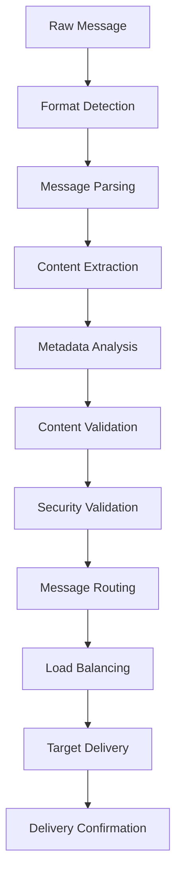
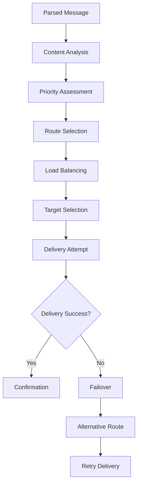
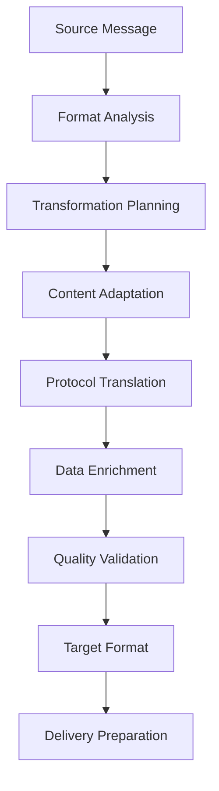

# **Message Processing Index**

## **Purpose**

This subcategory provides comprehensive message processing capabilities for the kOS ecosystem. It handles message parsing, routing, validation, and transformation across all communication channels and protocols with intelligent processing and high-performance delivery.

## **Core Principles**

### **Universal Message Support**
- **Multi-Format Support**: Support for all message formats and protocols
- **Protocol Agnostic**: Protocol-agnostic message processing and handling
- **Format Flexibility**: Flexible format conversion and transformation
- **Backward Compatibility**: Backward compatibility with legacy formats

### **Intelligent Processing**
- **Smart Routing**: Intelligent message routing based on content and context
- **Content Analysis**: Advanced content analysis and understanding
- **Priority Management**: Priority-based message processing and delivery
- **Load Balancing**: Intelligent load balancing and distribution

### **Reliability & Performance**
- **High Performance**: High-performance message processing and delivery
- **Reliability**: Reliable message delivery with error handling and recovery
- **Scalability**: Horizontal and vertical scaling for high-volume processing
- **Quality Assurance**: Quality assurance and optimization for all messages

## **Function Specifications**

### **Message Parsing Functions**
1. **[Message Parser](01_Message_Parser.md)** - Advanced message parsing and structure analysis
2. **[Format Detector](02_Format_Detector.md)** - Automatic message format detection and classification
3. **[Content Extractor](03_Content_Extractor.md)** - Content extraction and structure analysis
4. **[Metadata Analyzer](04_Metadata_Analyzer.md)** - Message metadata analysis and enrichment

### **Message Routing Functions**
5. **[Message Router](05_Message_Router.md)** - Intelligent message routing and distribution
6. **[Load Balancer](06_Load_Balancer.md)** - Message load balancing and distribution
7. **[Priority Manager](07_Priority_Manager.md)** - Priority-based message processing and delivery
8. **[Failover Manager](08_Failover_Manager.md)** - Message failover and redundancy management

### **Message Validation Functions**
9. **[Message Validator](09_Message_Validator.md)** - Message validation and integrity checking
10. **[Schema Validator](10_Schema_Validator.md)** - Schema-based message validation
11. **[Content Validator](11_Content_Validator.md)** - Content validation and quality checking
12. **[Security Validator](12_Security_Validator.md)** - Security validation and threat detection

### **Message Transformation Functions**
13. **[Message Transformer](13_Message_Transformer.md)** - Message transformation and format conversion
14. **[Protocol Translator](14_Protocol_Translator.md)** - Protocol translation and adaptation
15. **[Content Adapter](15_Content_Adapter.md)** - Content adaptation and optimization
16. **[Data Enricher](16_Data_Enricher.md)** - Data enrichment and augmentation

## **Integration Patterns**

### **Message Processing Flow**


### **Message Routing Flow**


### **Message Transformation Flow**


## **Message Processing Capabilities**

### **Message Parsing**
- **Multi-Format Parsing**: Support for JSON, XML, YAML, Protocol Buffers, Avro, and more
- **Structure Analysis**: Deep structure analysis and content understanding
- **Metadata Extraction**: Comprehensive metadata extraction and analysis
- **Content Classification**: Intelligent content classification and categorization
- **Error Recovery**: Robust error recovery and partial parsing support

### **Message Routing**
- **Intelligent Routing**: Content-aware and context-aware message routing
- **Load Balancing**: Advanced load balancing with health monitoring
- **Priority Management**: Priority-based processing and delivery
- **Failover Support**: Automatic failover and redundancy management
- **Route Optimization**: Dynamic route optimization and performance tuning

### **Message Validation**
- **Schema Validation**: Comprehensive schema validation and compliance checking
- **Content Validation**: Content quality and integrity validation
- **Security Validation**: Security threat detection and validation
- **Format Validation**: Format compliance and structure validation
- **Business Rule Validation**: Business rule validation and enforcement

### **Message Transformation**
- **Format Conversion**: Seamless format conversion and adaptation
- **Protocol Translation**: Protocol translation and interoperability
- **Content Adaptation**: Content adaptation for different platforms and contexts
- **Data Enrichment**: Intelligent data enrichment and augmentation
- **Optimization**: Message optimization for performance and efficiency

## **Configuration Examples**

### **Message Parsing Configuration**
```yaml
message_parsing:
  formats:
    json:
      enabled: true
      strict_mode: false
      error_handling: "graceful"
    xml:
      enabled: true
      namespace_aware: true
      validation: true
    yaml:
      enabled: true
      safe_mode: true
      error_handling: "strict"
    protobuf:
      enabled: true
      schema_registry: true
      version_handling: true
  analysis:
    structure_analysis: true
    metadata_extraction: true
    content_classification: true
    error_recovery: true
  performance:
    caching: true
    parallel_processing: true
    optimization: true
```

### **Message Routing Configuration**
```yaml
message_routing:
  intelligent_routing:
    enabled: true
    content_aware: true
    context_aware: true
    learning_enabled: true
  load_balancing:
    algorithm: "round_robin"
    health_checking: true
    dynamic_adjustment: true
    failover: true
  priority_management:
    priority_levels: 5
    priority_queuing: true
    preemption: true
    aging: true
  failover:
    automatic: true
    redundancy: true
    recovery_time: "30s"
    health_monitoring: true
```

### **Message Validation Configuration**
```yaml
message_validation:
  schema_validation:
    enabled: true
    strict_mode: false
    error_reporting: true
    schema_registry: true
  content_validation:
    enabled: true
    quality_checking: true
    integrity_validation: true
    format_compliance: true
  security_validation:
    enabled: true
    threat_detection: true
    content_filtering: true
    encryption_validation: true
  business_rules:
    enabled: true
    rule_engine: true
    compliance_checking: true
    enforcement: true
```

### **Message Transformation Configuration**
```yaml
message_transformation:
  format_conversion:
    enabled: true
    bidirectional: true
    lossless: true
    optimization: true
  protocol_translation:
    enabled: true
    protocol_mapping: true
    adaptation: true
    interoperability: true
  content_adaptation:
    enabled: true
    platform_adaptation: true
    context_adaptation: true
    optimization: true
  data_enrichment:
    enabled: true
    external_sources: true
    intelligent_enrichment: true
    quality_assurance: true
```

## **Error Handling**

### **Parsing Errors**
- **Format Errors**: Graceful format error handling with fallback parsing
- **Structure Errors**: Partial parsing with error recovery and reporting
- **Content Errors**: Content error handling with validation and correction
- **Metadata Errors**: Metadata error recovery and default value handling
- **Recovery Errors**: Comprehensive error recovery and system resilience

### **Routing Errors**
- **Route Failures**: Automatic route failure detection and alternative routing
- **Load Balancing Errors**: Load balancing error recovery and redistribution
- **Priority Errors**: Priority error handling and default priority assignment
- **Failover Errors**: Failover error recovery and manual intervention
- **Delivery Errors**: Delivery error handling with retry mechanisms

### **Validation Errors**
- **Schema Violations**: Schema violation reporting and correction suggestions
- **Content Errors**: Content error handling with validation and correction
- **Security Violations**: Security violation detection and threat response
- **Format Errors**: Format error handling with compliance reporting
- **Business Rule Violations**: Business rule violation handling and enforcement

### **Transformation Errors**
- **Format Conversion Errors**: Format conversion error recovery and fallback
- **Protocol Translation Errors**: Protocol translation error handling and adaptation
- **Content Adaptation Errors**: Content adaptation error recovery and optimization
- **Data Enrichment Errors**: Data enrichment error handling and partial enrichment
- **Optimization Errors**: Optimization error recovery and performance degradation

## **Performance Considerations**

### **Parsing Performance**
- **Parallel Parsing**: Parallel parsing with optimized algorithms
- **Caching Strategies**: Intelligent caching for frequently parsed formats
- **Memory Optimization**: Memory-efficient parsing with streaming support
- **CPU Optimization**: CPU-optimized parsing with hardware acceleration
- **Scalability**: Horizontal scaling for high-volume parsing

### **Routing Performance**
- **Fast Routing**: Fast routing with intelligent caching and optimization
- **Load Balancing**: Efficient load balancing with health monitoring
- **Priority Processing**: Fast priority processing with optimized queues
- **Failover Performance**: Fast failover with minimal service disruption
- **Scalability**: Horizontal scaling for high-volume routing

### **Validation Performance**
- **Fast Validation**: Fast validation with optimized algorithms and caching
- **Parallel Validation**: Parallel validation for multiple validation types
- **Incremental Validation**: Incremental validation for large messages
- **Caching**: Intelligent caching for validation results and schemas
- **Scalability**: Horizontal scaling for high-volume validation

### **Transformation Performance**
- **Fast Transformation**: Fast transformation with optimized algorithms
- **Parallel Processing**: Parallel processing for complex transformations
- **Caching**: Intelligent caching for transformation results and mappings
- **Optimization**: Continuous optimization for transformation performance
- **Scalability**: Horizontal scaling for high-volume transformation

## **Monitoring & Observability**

### **Processing Metrics**
- **Message Throughput**: Track message processing throughput and performance
- **Parsing Performance**: Monitor parsing performance and accuracy
- **Routing Performance**: Track routing performance and efficiency
- **Validation Performance**: Monitor validation performance and effectiveness
- **Transformation Performance**: Track transformation performance and quality

### **Quality Metrics**
- **Parsing Accuracy**: Monitor parsing accuracy and error rates
- **Routing Accuracy**: Track routing accuracy and delivery success
- **Validation Effectiveness**: Monitor validation effectiveness and compliance
- **Transformation Quality**: Track transformation quality and fidelity
- **Error Rates**: Monitor error rates and system reliability

### **Performance Metrics**
- **Response Times**: Track response times and system responsiveness
- **Throughput**: Monitor system throughput and capacity utilization
- **Resource Usage**: Track resource usage and optimization effectiveness
- **Scalability**: Monitor scalability and performance under load
- **Availability**: Track system availability and uptime

### **Alerting**
- **Performance Alerts**: Alerts for performance degradation and resource issues
- **Quality Alerts**: Alerts for quality degradation and accuracy issues
- **Error Alerts**: Alerts for error rates and system failures
- **Capacity Alerts**: Alerts for capacity issues and scaling requirements
- **Availability Alerts**: Alerts for availability issues and system health

## **Security Considerations**

### **Message Security**
- **Data Protection**: Protection of message data and content
- **Access Control**: Strict access control for message processing systems
- **Encryption**: Encryption of messages in transit and at rest
- **Authentication**: Strong authentication for message processing services
- **Audit Trails**: Complete audit trails for all message processing operations

### **Content Security**
- **Content Filtering**: Content filtering and inappropriate content detection
- **Threat Detection**: Threat detection and security validation
- **Privacy Protection**: Protection of message content and user privacy
- **Compliance**: Compliance with message processing regulations
- **Governance**: Clear governance and accountability for message processing

### **Processing Security**
- **Processing Isolation**: Secure processing isolation and sandboxing
- **Input Validation**: Comprehensive input validation and sanitization
- **Output Validation**: Output validation and integrity checking
- **Error Handling**: Secure error handling without information disclosure
- **Monitoring**: Continuous security monitoring and threat detection

---

**Version**: 1.0  
**Focus**: Comprehensive message processing capabilities for kOS ecosystem 