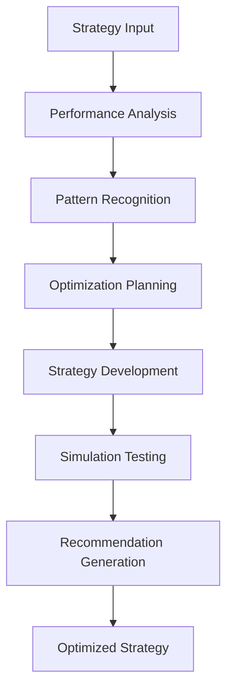
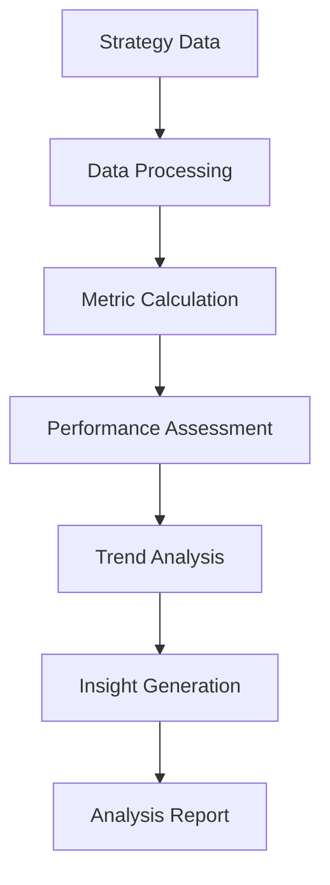
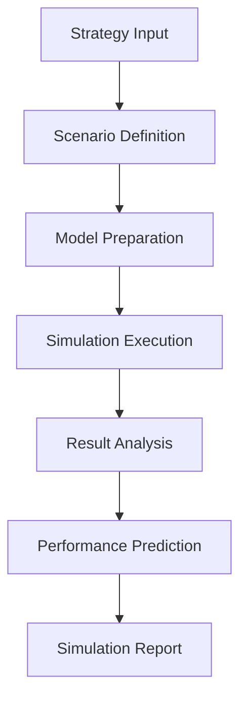

# **Communication Strategy Optimizer**

## **Overview**

The Communication Strategy Optimizer module provides comprehensive capabilities for optimizing communication strategies, analyzing performance patterns, generating strategic recommendations, and continuously improving communication effectiveness. It enables data-driven strategy optimization and performance maximization.

## **Core Principles**

### **Strategy Optimization**
- **Performance Analysis**: Analyze communication strategy performance
- **Pattern Recognition**: Recognize effective strategy patterns
- **Optimization Algorithms**: Apply optimization algorithms for better outcomes
- **Strategic Recommendations**: Generate strategic recommendations for improvement

### **Data-Driven Decisions**
- **Analytics Integration**: Integration of communication analytics and metrics
- **Predictive Analytics**: Predictive analytics for strategy optimization
- **Machine Learning**: Machine learning-based optimization algorithms
- **Performance Modeling**: Performance modeling and simulation

### **Continuous Improvement**
- **Strategy Monitoring**: Continuous strategy monitoring and tracking
- **Performance Optimization**: Performance optimization and enhancement
- **A/B Testing**: A/B testing for strategy optimization
- **Feedback Integration**: Integration of performance feedback and insights

## **Function Specifications**

### **Primary Functions**

#### **optimizeStrategy(strategy: CommunicationStrategy, goals: StrategyGoals): OptimizationResult**
- **Purpose**: Optimize communication strategy for better outcomes
- **Parameters**:
  - `strategy`: Current communication strategy
  - `goals`: Strategy goals and objectives
- **Returns**: Optimization result with recommendations and performance metrics
- **Performance**: < 200ms optimization time, comprehensive analysis

#### **analyzePerformance(strategyData: StrategyData): PerformanceAnalysis**
- **Purpose**: Analyze communication strategy performance
- **Parameters**:
  - `strategyData`: Strategy performance data for analysis
- **Returns**: Performance analysis with insights and trends
- **Performance**: < 150ms analysis time, detailed insights

#### **generateRecommendations(strategy: CommunicationStrategy, context: Context): RecommendationSet**
- **Purpose**: Generate strategic recommendations for improvement
- **Parameters**:
  - `strategy`: Current communication strategy
  - `context`: Context for recommendation generation
- **Returns**: Set of strategic recommendations with priority and impact
- **Performance**: < 180ms recommendation generation, actionable insights

#### **simulateStrategy(strategy: CommunicationStrategy, scenarios: Scenario[]): SimulationResult**
- **Purpose**: Simulate strategy performance under different scenarios
- **Parameters**:
  - `strategy`: Communication strategy for simulation
  - `scenarios`: Scenarios to simulate
- **Returns**: Simulation results with performance predictions
- **Performance**: < 300ms simulation time, accurate predictions

### **Configuration Functions**

#### **configureOptimization(options: OptimizationConfig): void**
- **Purpose**: Configure strategy optimization parameters
- **Parameters**:
  - `options`: Optimization configuration object
- **Returns**: void
- **Performance**: < 10ms configuration time

#### **addOptimizationRule(rule: OptimizationRule): void**
- **Purpose**: Add custom optimization rule
- **Parameters**:
  - `rule`: Custom optimization rule configuration
- **Returns**: void
- **Performance**: < 50ms addition time

## **Integration Patterns**

### **Strategy Optimization Flow**


### **Performance Analysis Flow**


### **Strategy Simulation Flow**


## **Capabilities**

### **Strategy Optimization**
- **Performance Analysis**: Analyze communication strategy performance
- **Pattern Recognition**: Recognize effective strategy patterns and trends
- **Optimization Algorithms**: Apply optimization algorithms for better outcomes
- **Strategic Recommendations**: Generate strategic recommendations for improvement
- **Performance Modeling**: Performance modeling and simulation

### **Analytics Integration**
- **Data Integration**: Integration with communication analytics platforms
- **Metric Analysis**: Analysis of comprehensive strategy metrics
- **Trend Analysis**: Analysis of strategy performance trends
- **Predictive Analytics**: Predictive analytics for strategy optimization
- **Performance Benchmarking**: Benchmarking against industry standards

### **Machine Learning**
- **Optimization Algorithms**: Machine learning-based optimization algorithms
- **Pattern Recognition**: Recognition of effective strategy patterns
- **Predictive Modeling**: Predictive modeling for strategy outcomes
- **Performance Prediction**: Performance prediction and forecasting
- **Continuous Learning**: Continuous learning and improvement

### **Simulation & Testing**
- **Strategy Simulation**: Simulation of strategy performance under different scenarios
- **A/B Testing**: A/B testing for strategy optimization
- **Scenario Analysis**: Analysis of different strategy scenarios
- **Risk Assessment**: Risk assessment and mitigation strategies
- **Performance Validation**: Performance validation and verification

## **Configuration Examples**

### **Basic Optimization Configuration**
```yaml
strategy_optimization:
  analysis:
    performance_analysis: true
    pattern_recognition: true
    trend_analysis: true
    predictive_analytics: true
  optimization:
    algorithm_selection: "adaptive"
    optimization_level: "comprehensive"
    recommendation_engine: true
    continuous_improvement: true
  simulation:
    strategy_simulation: true
    scenario_analysis: true
    performance_prediction: true
    risk_assessment: true
  performance:
    optimization_speed: "< 200ms"
    analysis_accuracy: "95%+"
    simulation_accuracy: "90%+"
    real_time_optimization: true
```

### **Advanced Optimization Configuration**
```yaml
strategy_optimization:
  algorithms:
    primary_algorithm: "reinforcement_learning"
    fallback_algorithm: "genetic_algorithm"
    ensemble_methods: ["boosting", "bagging"]
    multi_objective: true
  features:
    predictive_analytics: true
    real_time_optimization: true
    cross_channel_optimization: true
    personalized_strategies: true
  learning:
    continuous_learning: true
    feedback_integration: true
    model_updates: true
    accuracy_tracking: true
  simulation:
    comprehensive_simulation: true
    scenario_modeling: true
    risk_analysis: true
    performance_validation: true
```

### **Performance Analysis Configuration**
```yaml
performance_analysis:
  metrics:
    effectiveness_metrics:
      - "reach"
      - "engagement"
      - "conversion"
      - "retention"
    efficiency_metrics:
      - "cost_per_acquisition"
      - "return_on_investment"
      - "time_to_conversion"
      - "resource_utilization"
    quality_metrics:
      - "satisfaction_score"
      - "brand_lift"
      - "awareness"
      - "preference"
  analysis:
    real_time_analysis: true
    trend_analysis: true
    pattern_recognition: true
    predictive_modeling: true
  optimization:
    performance_optimization: true
    efficiency_improvement: true
    quality_enhancement: true
    cost_optimization: true
```

## **Error Handling**

### **Optimization Errors**
- **Optimization Failures**: Fallback to standard optimization methods
- **Algorithm Errors**: Algorithm validation and correction
- **Learning Errors**: Learning algorithm validation and correction
- **Performance Issues**: Performance monitoring and optimization

### **Analysis Errors**
- **Analysis Failures**: Graceful degradation with partial results
- **Data Quality Issues**: Data validation and quality checking
- **Metric Errors**: Metric validation and correction
- **Insight Errors**: Insight validation and verification

### **Simulation Errors**
- **Simulation Failures**: Simulation validation and error recovery
- **Model Errors**: Model validation and correction
- **Scenario Errors**: Scenario validation and correction
- **Prediction Errors**: Prediction validation and correction

### **Configuration Errors**
- **Invalid Configuration**: Configuration validation and error reporting
- **Rule Errors**: Rule validation and correction
- **Resource Errors**: Resource management and optimization
- **Performance Errors**: Performance monitoring and optimization

## **Performance Considerations**

### **Optimization Performance**
- **Optimization Speed**: < 200ms for strategy optimization
- **Learning Rate**: Adaptive learning rate for continuous improvement
- **Accuracy Improvement**: Continuous accuracy improvement over time
- **Scalability**: Horizontal scaling for optimization algorithms

### **Analysis Performance**
- **Analysis Speed**: < 150ms for performance analysis
- **Data Processing**: Fast data processing and analysis
- **Insight Generation**: Fast insight generation and reporting
- **Recommendation Speed**: < 180ms for recommendation generation

### **Simulation Performance**
- **Simulation Speed**: < 300ms for strategy simulation
- **Model Accuracy**: High accuracy for performance predictions
- **Scenario Analysis**: Fast scenario analysis and modeling
- **Risk Assessment**: Fast risk assessment and analysis

### **Scalability**
- **Horizontal Scaling**: Horizontal scaling for high-volume processing
- **Vertical Scaling**: Vertical scaling for resource optimization
- **Load Balancing**: Intelligent load balancing and distribution
- **Resource Management**: Efficient resource allocation and management

## **Monitoring & Observability**

### **Optimization Metrics**
- **Optimization Effectiveness**: Strategy optimization effectiveness
- **Learning Performance**: Learning algorithm performance metrics
- **Improvement Rate**: Rate of improvement and optimization success
- **Recommendation Quality**: Quality and relevance of recommendations

### **Performance Metrics**
- **Processing Speed**: Average processing time and throughput
- **Memory Usage**: Memory usage and optimization metrics
- **CPU Usage**: CPU usage and optimization metrics
- **Throughput**: Overall system throughput and capacity

### **Quality Metrics**
- **Strategy Quality**: Strategy optimization quality and effectiveness
- **Performance Improvement**: Performance improvement trends
- **Simulation Accuracy**: Simulation accuracy and reliability
- **Recommendation Impact**: Impact of strategic recommendations

### **Operational Metrics**
- **System Health**: Overall system health and availability
- **Resource Utilization**: Resource utilization and optimization
- **Error Tracking**: Error tracking and analysis
- **Performance Trends**: Performance trends and optimization

## **Security Considerations**

### **Data Privacy**
- **Strategy Privacy**: End-to-end encryption for strategy data
- **Performance Privacy**: Privacy protection for performance data
- **Simulation Privacy**: Privacy protection for simulation data
- **Data Retention**: Configurable retention policies

### **Access Control**
- **Authentication**: Strong authentication for optimization services
- **Authorization**: Role-based access control for optimization functions
- **API Security**: Secure API access and rate limiting
- **Audit Logging**: Comprehensive audit trails for all operations

### **Content Security**
- **Input Validation**: Comprehensive input validation and sanitization
- **Data Validation**: Data validation and integrity checking
- **Strategy Security**: Security for strategy data and algorithms
- **Output Validation**: Validation of optimization outputs and results

---

**Version**: 1.0  
**Category**: Communication & Language  
**Subcategory**: Communication Analytics  
**Focus**: Data-driven communication strategy optimization and performance maximization 