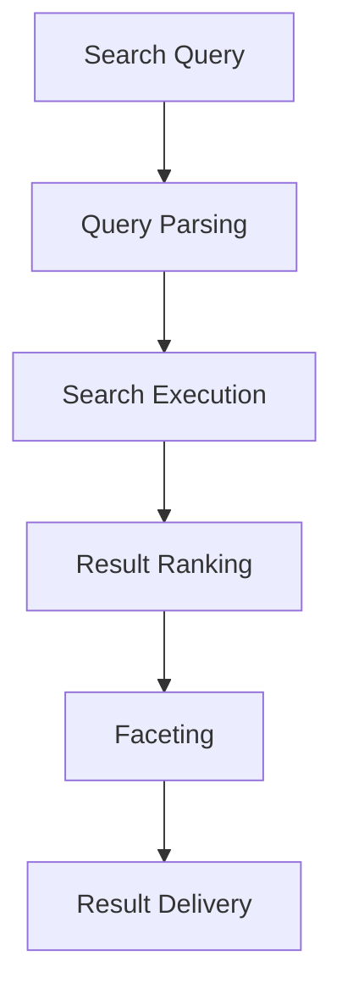

# **Content Search Engine**

## **Purpose**

The Content Search Engine provides advanced content search and discovery capabilities. It supports full-text search, semantic search, faceted search, and relevance ranking for efficient content retrieval across the kOS ecosystem.

## **Core Principles**

- **Full-Text Search**: Support for fast, accurate full-text search
- **Semantic Search**: Understand context and meaning for better results
- **Faceted Search**: Filter and refine search results by facets
- **Relevance Ranking**: Rank results by relevance and quality
- **Continuous Improvement**: Learn from user feedback to improve search

## **Function Specifications**

### **Core Functions**

#### **searchContent(query: string, options?: SearchOptions): Promise<SearchResult[]>**
Performs a search for content matching the query and options.

**Parameters:**
- `query`: Search query string
- `options`: Optional search options (facets, filters, ranking, etc.)

**Returns:**
- `SearchResult[]`: Array of matching content results

**Example:**
```typescript
const results = await contentSearchEngine.searchContent("AI ethics", { facets: ["category"], ranking: "relevance" });
results.forEach(r => console.log(r.title));
```

#### **getFacets(query: string): Promise<Facet[]>**
Retrieves available facets for a given query.

**Parameters:**
- `query`: Search query string

**Returns:**
- `Facet[]`: Array of available facets

**Example:**
```typescript
const facets = await contentSearchEngine.getFacets("AI ethics");
console.log(facets);
```

## **Integration Patterns**

### **Search Flow**


## **Capabilities**

- **Full-Text Search**: Fast, accurate search
- **Semantic Search**: Context-aware search
- **Faceted Search**: Filter by facets
- **Relevance Ranking**: Rank by relevance
- **Batch Search**: Support for batch queries

## **Configuration Examples**

```yaml
content_search_engine:
  full_text: true
  semantic: true
  faceted: true
  ranking: "relevance"
  batch_search: true
```

## **Error Handling**

- **Search Failure**: Return error with details
- **Facet Retrieval Failure**: Return error with details
- **Ranking Failure**: Return error with details
- **Query Too Broad**: Return error with suggestions

## **Performance Considerations**

- **Search Latency**: Optimized for < 1s
- **Batch Search**: Support for batch queries
- **Resource Usage**: Efficient indexing and retrieval

## **Security Considerations**

- **Access Control**: Restrict access to search features
- **Audit Logging**: Log all search actions
- **Query Privacy**: Protect sensitive queries

## **Monitoring & Observability**

- **Search Metrics**: Track request count, latency, and errors
- **Ranking Metrics**: Track ranking quality and feedback
- **Alerting**: Alerts for search or ranking failures

---

**Version**: 1.0
**Focus**: Fast, intelligent content search for kOS ecosystem 