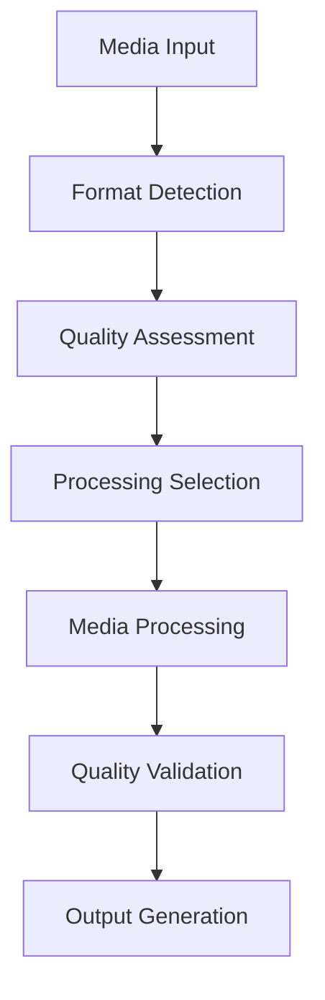
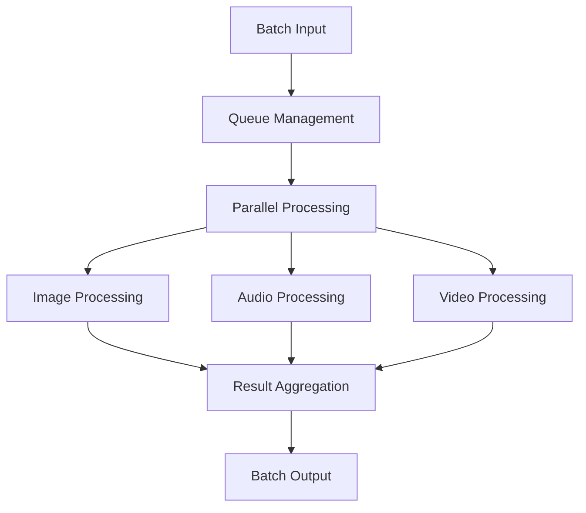
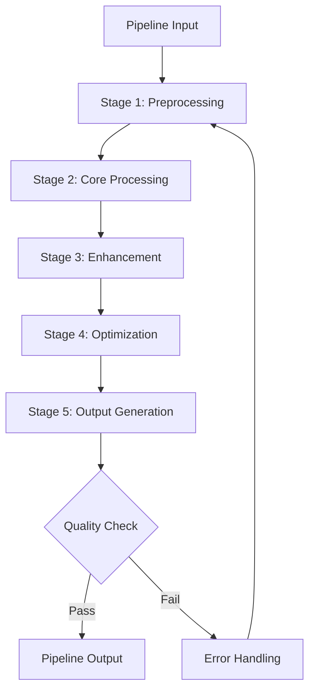

# **Media Processing**

## **Overview**

The Media Processing subcategory provides comprehensive capabilities for processing, transforming, enhancing, and optimizing various types of media including images, audio, video, and documents. This subcategory ensures high-quality media output and efficient processing workflows with **explicit support for all major, vector, CAD, 3D, scientific, and niche formats**.

## **Core Principles**

### **Quality-First Processing**
- **High-Quality Output**: Maintain or enhance media quality during processing
- **Format Preservation**: Preserve important media characteristics and metadata
- **Lossless Operations**: Support lossless processing where possible
- **Quality Validation**: Validate output quality against defined standards

### **Efficient Processing**
- **Optimized Algorithms**: Use optimized algorithms for fast processing
- **Resource Management**: Efficient resource usage and memory management
- **Parallel Processing**: Support parallel processing for improved performance
- **Batch Operations**: Support batch processing for multiple media files

### **Flexible Transformation**
- **Multi-Format Support**: Support multiple input and output formats including raster, vector, CAD, 3D, scientific, and niche formats
- **Customizable Processing**: Allow customization of processing parameters
- **Pipeline Support**: Support complex processing pipelines
- **Real-time Processing**: Support real-time media processing capabilities

## **Modules**

### **01. Image Processor** ✅ **COMPLETE**
- **Status**: Implementation-ready with comprehensive format support
- **Focus**: Image processing, enhancement, and transformation
- **Capabilities**: Resizing, filtering, enhancement, format conversion
- **Format Support**: JPEG, PNG, GIF, WebP, TIFF, SVG, AVIF, HEIC, BMP, ICO, AI, CDR, GeoTIFF, medical imaging, satellite data, HDR formats

### **02. Audio Processor** ✅ **COMPLETE**
- **Status**: Implementation-ready with comprehensive format support
- **Focus**: Audio processing, enhancement, and transformation
- **Capabilities**: Noise reduction, equalization, format conversion, effects
- **Format Support**: MP3, AAC, FLAC, WAV, AIFF, OGG, MIDI, SoundFont, vector/procedural audio, professional formats (DSD, MQA), scientific formats, gaming formats, mobile formats

### **03. Video Processor** ✅ **COMPLETE**
- **Status**: Implementation-ready with comprehensive format support
- **Focus**: Video processing, editing, and transformation
- **Capabilities**: Encoding, decoding, effects, format conversion
- **Format Support**: MP4, WebM, AVI, MOV, H.264, H.265, AV1, VP8, VP9, professional formats (RED RAW, ARRI RAW, ProRes), 360°/VR formats, 3D formats, holographic formats, gaming formats, surveillance formats

### **04. Document Processor** ✅ **COMPLETE**
- **Status**: Implementation-ready with comprehensive format support
- **Focus**: Document processing and transformation
- **Capabilities**: Format conversion, OCR, text extraction, layout analysis
- **Format Support**: PDF, DOCX, XLSX, PPTX, HTML, LaTeX, Jupyter notebooks, CAD formats (DWG, DXF, STEP), 3D formats (OBJ, STL, BLEND), scientific formats, legal formats, financial formats, geographic formats, blockchain formats

### **05. Media Optimizer** ⏳ **PENDING**
- **Status**: Module specification needed
- **Focus**: Media optimization for size and quality
- **Capabilities**: Compression, quality optimization, format optimization

### **06. Media Analyzer** ⏳ **PENDING**
- **Status**: Module specification needed
- **Focus**: Media analysis and metadata extraction
- **Capabilities**: Content analysis, metadata extraction, quality assessment

### **07. Media Pipeline Manager** ⏳ **PENDING**
- **Status**: Module specification needed
- **Focus**: Complex media processing pipelines
- **Capabilities**: Pipeline orchestration, workflow management, error handling

### **08. Real-time Media Processor** ⏳ **PENDING**
- **Status**: Module specification needed
- **Focus**: Real-time media processing and streaming
- **Capabilities**: Live processing, streaming optimization, latency management

## **Integration Patterns**

### **Media Processing Flow**


### **Batch Processing Flow**


### **Pipeline Processing Flow**


## **Capabilities**

### **Image Processing**
- **Resizing**: Intelligent image resizing with quality preservation
- **Filtering**: Apply various filters and effects to images
- **Enhancement**: Enhance image quality and clarity
- **Format Conversion**: Convert between different image formats including raster, vector, CAD, and scientific formats
- **Metadata Management**: Preserve and manage image metadata

### **Audio Processing**
- **Noise Reduction**: Reduce background noise and interference
- **Equalization**: Apply audio equalization and filtering
- **Effects Processing**: Apply audio effects and enhancements
- **Format Conversion**: Convert between different audio formats including lossy, lossless, professional, scientific, and specialized formats
- **Quality Enhancement**: Enhance audio quality and clarity

### **Video Processing**
- **Encoding/Decoding**: Efficient video encoding and decoding
- **Effects Application**: Apply video effects and transitions
- **Format Conversion**: Convert between different video formats including web, professional, scientific, 360°, VR, and specialized formats
- **Quality Optimization**: Optimize video quality and file size
- **Streaming Optimization**: Optimize video for streaming

### **Document Processing**
- **OCR Processing**: Optical character recognition for text extraction
- **Format Conversion**: Convert between different document formats including office, PDF, CAD, 3D, scientific, and specialized formats
- **Layout Analysis**: Analyze document layout and structure
- **Text Extraction**: Extract text and content from documents
- **Metadata Extraction**: Extract document metadata and properties

## **Configuration Examples**

### **Basic Media Processing Configuration**
```yaml
media_processing:
  image_processing:
    resize_enabled: true
    quality_preservation: true
    format_support: ["jpg", "png", "gif", "webp", "svg", "tiff", "avif", "heic"]
    max_resolution: "8K"
  audio_processing:
    noise_reduction: true
    equalization: true
    format_support: ["mp3", "wav", "aac", "flac", "ogg", "midi", "dsd", "mqa"]
    quality_enhancement: true
  video_processing:
    encoding_support: ["h264", "h265", "av1", "vp8", "vp9"]
    format_support: ["mp4", "avi", "mov", "webm", "mkv", "3gp"]
    streaming_optimization: true
    quality_optimization: true
  document_processing:
    ocr_enabled: true
    format_support: ["pdf", "docx", "txt", "html", "latex", "ipynb", "dwg", "dxf"]
    layout_analysis: true
    metadata_extraction: true
```

### **Advanced Media Processing Configuration**
```yaml
media_processing:
  processing:
    ai_enhancement: true
    parallel_processing: true
    batch_optimization: true
    real_time_processing: true
  optimization:
    quality_optimization: true
    size_optimization: true
    format_optimization: true
    performance_optimization: true
  pipeline:
    workflow_orchestration: true
    error_recovery: true
    quality_validation: true
    performance_monitoring: true
  integration:
    api_access: true
    webhook_support: true
    cloud_integration: true
    storage_optimization: true
```

## **Performance Considerations**

### **Processing Performance**
- **Image Processing**: < 2 seconds for 4K image processing
- **Audio Processing**: < 5 seconds for 10-minute audio processing
- **Video Processing**: < 30 seconds for 1-minute video processing
- **Document Processing**: < 10 seconds for 100-page document processing

### **Quality Metrics**
- **Quality Preservation**: 95%+ quality preservation during processing
- **Format Compatibility**: 100% format compatibility and conversion accuracy
- **Processing Accuracy**: 99%+ processing accuracy and reliability
- **Error Rate**: < 0.1% processing errors

### **Scalability**
- **Concurrent Processing**: Support 100+ concurrent processing requests
- **Batch Processing**: Support 1000+ files in batch processing
- **Resource Efficiency**: Optimal resource usage and cost management
- **Performance Scaling**: Horizontal scaling for performance

## **Security Considerations**

### **Media Security**
- **Content Validation**: Validate media content for security threats
- **Malware Detection**: Detect and prevent malware in media files
- **Format Validation**: Validate media formats and prevent format-based attacks
- **Access Control**: Control access to media processing capabilities

### **Data Protection**
- **Encryption**: Encrypt media data during processing and storage
- **Privacy Protection**: Protect sensitive media content and metadata
- **Secure Processing**: Secure processing environment for sensitive media
- **Audit Logging**: Comprehensive audit trails for all processing activities

### **Processing Security**
- **Input Validation**: Validate all input media for security threats
- **Output Validation**: Validate processed output for quality and security
- **Resource Isolation**: Isolate processing resources for security
- **Error Handling**: Secure error handling and information disclosure

## **Monitoring & Observability**

### **Processing Metrics**
- **Processing Speed**: Track processing speed and performance
- **Quality Metrics**: Monitor output quality and user satisfaction
- **Error Rates**: Track processing errors and failure rates
- **Resource Usage**: Monitor resource utilization and optimization

### **Performance Metrics**
- **Response Time**: Monitor processing response times
- **Throughput**: Track processing throughput and capacity
- **Resource Utilization**: Monitor CPU, memory, and storage usage
- **Quality Metrics**: Track quality scores and user feedback

### **Alerting & Notifications**
- **Error Alerts**: Alert on processing errors and failures
- **Performance Alerts**: Alert on performance degradation
- **Quality Alerts**: Alert on quality issues and concerns
- **Capacity Alerts**: Alert on capacity and resource issues

---

**Version**: 1.1  
**Subcategory**: Media Processing  
**Status**: 🔄 **IN PROGRESS** - 4/8 modules complete, remaining modules need implementation 