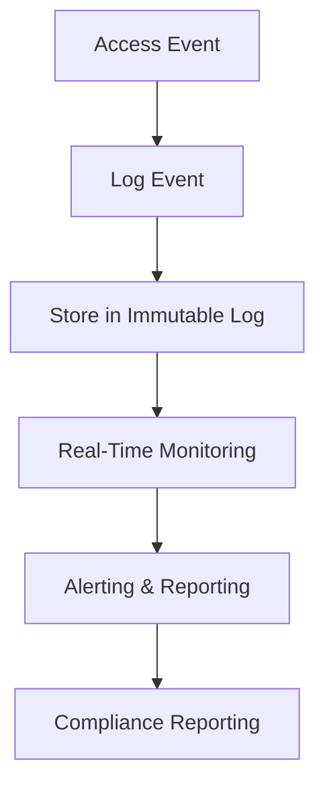
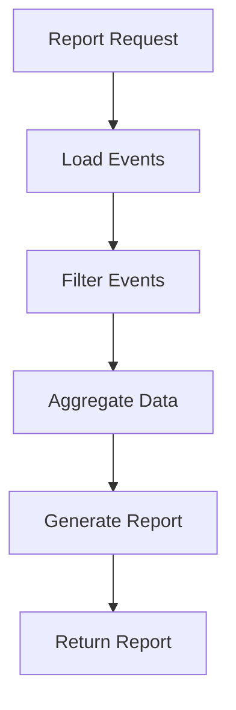

# **Authorization Auditor**

## **Purpose**

The Authorization Auditor provides comprehensive audit logging and compliance reporting for all authentication and authorization events in the kOS ecosystem. It ensures traceability, accountability, and regulatory compliance by capturing detailed records of access decisions, policy evaluations, and permission changes.

## **Core Principles**

### **Audit Logging**
- **Comprehensive Logging**: Capture all authentication and authorization events
- **Immutable Records**: Ensure audit logs are tamper-proof and immutable
- **Real-Time Monitoring**: Support real-time monitoring and alerting
- **Granular Detail**: Log user, resource, action, context, and decision
- **Retention Policies**: Enforce configurable log retention and disposal

### **Compliance Reporting**
- **Regulatory Compliance**: Support for GDPR, HIPAA, SOX, and other standards
- **Automated Reporting**: Generate compliance reports on demand or schedule
- **Anomaly Detection**: Detect suspicious or non-compliant activity
- **Audit Trails**: Provide complete audit trails for investigations
- **Separation of Duties**: Ensure audit independence from access control

## **Function Specifications**

### **Core Functions**

#### **logEvent(event: AuthEvent): Promise<void>**
Logs an authentication or authorization event with full context.

**Parameters:**
- `event`: Authentication or authorization event object

**Returns:**
- `void`: Success confirmation

**Example:**
```typescript
await authorizationAuditor.logEvent({
  userId: "user123",
  resource: "database:users",
  action: "read",
  decision: "allow",
  timestamp: new Date(),
  context: { ipAddress: "192.168.1.100", deviceId: "device456" }
});
```

#### **generateReport(criteria: AuditReportCriteria): Promise<AuditReport>**
Generates an audit report based on specified criteria.

**Parameters:**
- `criteria`: Criteria for the audit report (time range, user, resource, action, etc.)

**Returns:**
- `AuditReport`: Generated audit report

**Example:**
```typescript
const report = await authorizationAuditor.generateReport({
  startTime: new Date(Date.now() - 86400000),
  endTime: new Date(),
  userId: "user123"
});
console.log(`Report contains ${report.events.length} events`);
```

#### **listEvents(filter: EventFilter): Promise<AuthEvent[]>**
Lists all audit events matching the specified filter.

**Parameters:**
- `filter`: Filter criteria (user, resource, action, time range, etc.)

**Returns:**
- `AuthEvent[]`: Array of matching audit events

**Example:**
```typescript
const events = await authorizationAuditor.listEvents({
  resource: "database:users",
  action: "read"
});
console.log(`Found ${events.length} read events on users database`);
```

#### **detectAnomalies(criteria: AnomalyCriteria): Promise<AnomalyReport>**
Detects anomalies or suspicious activity in the audit logs.

**Parameters:**
- `criteria`: Criteria for anomaly detection (user, resource, action, time range, etc.)

**Returns:**
- `AnomalyReport`: Report of detected anomalies

**Example:**
```typescript
const anomalies = await authorizationAuditor.detectAnomalies({
  userId: "user123",
  timeRange: { start: new Date(Date.now() - 3600000), end: new Date() }
});
console.log(`Detected ${anomalies.count} anomalies`);
```

### **Advanced Functions**

#### **exportLogs(format: 'json' | 'csv', criteria: ExportCriteria): Promise<string>**
Exports audit logs in the specified format based on criteria.

**Parameters:**
- `format`: Export format ('json' or 'csv')
- `criteria`: Criteria for export (time range, user, resource, etc.)

**Returns:**
- `string`: Path or URL to exported file

**Example:**
```typescript
const exportPath = await authorizationAuditor.exportLogs('csv', { userId: "user123" });
console.log(`Logs exported to ${exportPath}`);
```

#### **purgeOldLogs(retentionPeriod: string): Promise<void>**
Purges audit logs older than the specified retention period.

**Parameters:**
- `retentionPeriod`: Retention period (e.g., "90d", "1y")

**Returns:**
- `void`: Success confirmation

**Example:**
```typescript
await authorizationAuditor.purgeOldLogs("90d");
console.log("Old logs purged successfully");
```

## **Integration Patterns**

### **Audit Logging Flow**


### **Audit Report Generation Flow**


## **Authorization Auditor Capabilities**

- **Comprehensive Audit Logging**: Capture all authentication and authorization events
- **Immutable Logs**: Tamper-proof, append-only log storage
- **Real-Time Monitoring**: Real-time event monitoring and alerting
- **Automated Compliance Reporting**: Generate reports for regulatory compliance
- **Anomaly Detection**: Detect suspicious or non-compliant activity
- **Audit Trails**: Complete audit trails for investigations
- **Separation of Duties**: Ensure audit independence from access control
- **Log Export & Purge**: Export logs and purge old records as needed

## **Configuration Examples**

### **Basic Audit Logging Configuration**
```yaml
authorization_auditor:
  log_retention: "90d"
  immutable_storage: true
  real_time_monitoring: true
  alerting_enabled: true
  compliance_reporting: true
```

### **Compliance Reporting Example**
```yaml
compliance_reporting:
  standards:
    - GDPR
    - HIPAA
    - SOX
  report_schedule: "monthly"
  anomaly_detection: true
  audit_trail_export: true
```

## **Error Handling**

- **Log Write Failure**: Retry with exponential backoff
- **Report Generation Failure**: Return error with details
- **Export Failure**: Return error with export details
- **Anomaly Detection Failure**: Return error with detection details
- **Purge Failure**: Return error with purge details

## **Performance Considerations**

- **Write Latency**: Optimized for sub-50ms log writes
- **Batch Operations**: Support for batch log export and purge
- **Scalability**: Horizontal scaling for high-volume environments
- **Resource Usage**: Efficient storage and retrieval

## **Security Considerations**

- **Log Integrity**: Cryptographic integrity checks for all logs
- **Access Control**: Restrict access to audit logs and reports
- **Audit Logging**: Immutable, append-only log storage
- **Compliance**: Ensure all logs meet regulatory requirements

## **Monitoring & Observability**

- **Log Metrics**: Track log write, read, and export events
- **Report Metrics**: Track report generation and compliance status
- **Anomaly Metrics**: Track anomaly detection events
- **Alerting**: Alerts for log failures, compliance violations, and suspicious activity

---

**Version**: 1.0  
**Focus**: Comprehensive audit logging and compliance reporting for secure access control in kOS ecosystem 