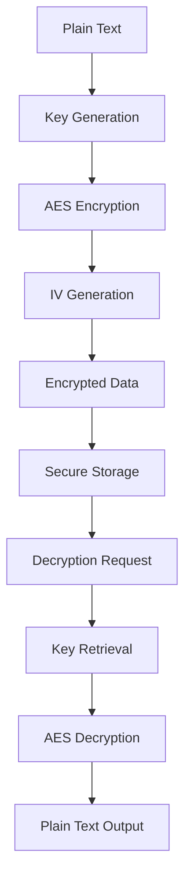
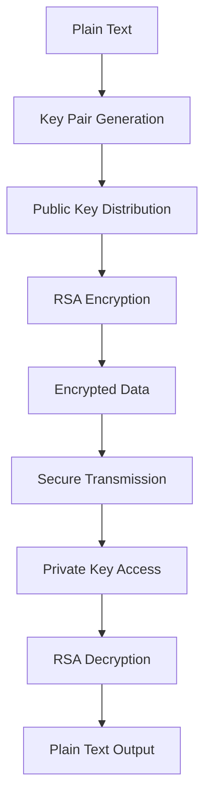
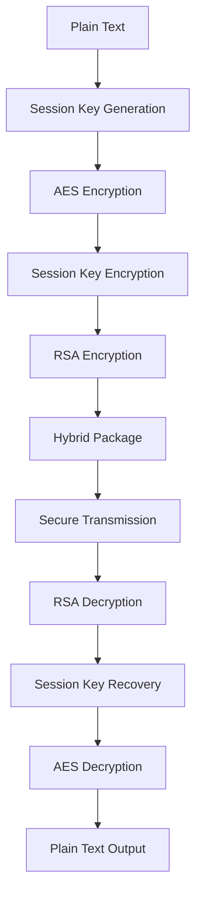
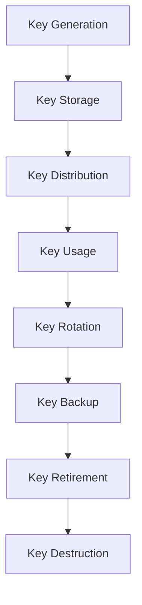

# **Encryption & Protection Index**

## **Purpose**

This subcategory provides comprehensive encryption and data protection capabilities for the kOS ecosystem. It handles data encryption, decryption, hashing, key management, and privacy protection with enterprise-grade cryptographic standards and compliance frameworks.

## **Core Principles**

### **Cryptographic Security**
- **Strong Encryption**: Use of industry-standard cryptographic algorithms (AES-256, RSA-2048)
- **Key Management**: Secure key generation, storage, rotation, and backup
- **Algorithm Agility**: Support for multiple encryption algorithms and key sizes
- **Cryptographic Validation**: FIPS 140-2 validated cryptographic modules

### **Data Protection**
- **Encryption at Rest**: All data encrypted at rest with strong algorithms
- **Encryption in Transit**: All data encrypted in transit with TLS 1.3
- **End-to-End Encryption**: Complete data protection from source to destination
- **Privacy by Design**: Privacy protection built into all encryption functions

### **Compliance & Standards**
- **Regulatory Compliance**: Meet GDPR, SOX, HIPAA, PCI DSS encryption requirements
- **Industry Standards**: Follow NIST, ISO, and other cryptographic standards
- **Audit Trails**: Complete audit trails for all cryptographic operations
- **Key Escrow**: Support for key escrow and recovery procedures

## **Function Specifications**

### **Encryption Functions**
1. **[Base Encryptor](01_Base_Encryptor.md)** - Core encryption interface and common functionality
2. **[AES Encryptor](02_AES_Encryptor.md)** - AES encryption implementation with advanced security features
3. **[RSA Encryptor](03_RSA_Encryptor.md)** - RSA encryption implementation for secure key exchange
4. **[Hybrid Encryptor](04_Hybrid_Encryptor.md)** - Hybrid encryption combining symmetric and asymmetric algorithms

### **Decryption Functions**
5. **[Base Decryptor](05_Base_Decryptor.md)** - Core decryption interface and common functionality
6. **[AES Decryptor](06_AES_Decryptor.md)** - AES decryption implementation with integrity verification
7. **[RSA Decryptor](07_RSA_Decryptor.md)** - RSA decryption implementation with signature verification
8. **[Hybrid Decryptor](08_Hybrid_Decryptor.md)** - Hybrid decryption with automatic algorithm selection

### **Hashing Functions**
9. **[Base Hash Generator](09_Base_Hash_Generator.md)** - Core hashing interface and common functionality
10. **[SHA256 Hash Generator](10_SHA256_Hash_Generator.md)** - SHA256 hashing implementation for data integrity
11. **[BCrypt Hash Generator](11_BCrypt_Hash_Generator.md)** - BCrypt hashing implementation for password security
12. **[Argon2 Hash Generator](12_Argon2_Hash_Generator.md)** - Argon2 hashing implementation for memory-hard security

### **Key Management Functions**
13. **[Key Manager](13_Key_Manager.md)** - Centralized key management with lifecycle management
14. **[Key Rotation](14_Key_Rotation.md)** - Automated key rotation with minimal service disruption
15. **[Key Backup](15_Key_Backup.md)** - Secure key backup and recovery procedures
16. **[Key Escrow](16_Key_Escrow.md)** - Key escrow services for compliance and recovery

## **Integration Patterns**

### **Symmetric Encryption Flow**


### **Asymmetric Encryption Flow**


### **Hybrid Encryption Flow**


### **Key Management Flow**


## **Encryption Capabilities**

### **Symmetric Encryption**
- **AES Encryption**: Advanced Encryption Standard with 128, 192, and 256-bit keys
- **Block Cipher Modes**: Support for CBC, GCM, CTR, and other secure modes
- **Key Derivation**: PBKDF2, Argon2, and other key derivation functions
- **Initialization Vectors**: Secure IV generation and management
- **Performance Optimization**: Hardware acceleration and parallel processing

### **Asymmetric Encryption**
- **RSA Encryption**: RSA with 2048, 3072, and 4096-bit key sizes
- **Elliptic Curve**: ECDSA and ECDH with various curves (P-256, P-384, P-521)
- **Digital Signatures**: RSA and ECDSA digital signature generation and verification
- **Key Exchange**: Diffie-Hellman and ECDH key exchange protocols
- **Certificate Management**: X.509 certificate generation and validation

### **Hybrid Encryption**
- **Combined Security**: Symmetric encryption for data, asymmetric for key exchange
- **Performance Optimization**: Fast symmetric encryption with secure key exchange
- **Algorithm Selection**: Automatic algorithm selection based on data size and security requirements
- **Backward Compatibility**: Support for legacy encryption algorithms
- **Forward Secrecy**: Perfect forward secrecy with ephemeral key generation

## **Hashing Capabilities**

### **Cryptographic Hashing**
- **SHA256 Hashing**: SHA-256 for data integrity and digital signatures
- **SHA512 Hashing**: SHA-512 for high-security applications
- **HMAC Generation**: Hash-based Message Authentication Code generation
- **Checksum Generation**: CRC32 and other checksum algorithms
- **Collision Resistance**: Protection against hash collisions and attacks

### **Password Hashing**
- **BCrypt Hashing**: Adaptive password hashing with configurable cost
- **Argon2 Hashing**: Memory-hard password hashing for enhanced security
- **Salt Generation**: Secure random salt generation and management
- **Pepper Addition**: Additional secret for enhanced password security
- **Hash Verification**: Secure hash verification without timing attacks

### **Data Integrity**
- **Message Digests**: Cryptographic message digest generation
- **Digital Fingerprints**: Unique digital fingerprints for data identification
- **Integrity Verification**: Data integrity verification and tamper detection
- **Version Control**: Hash-based version control and change detection
- **Audit Trails**: Hash-based audit trails for data integrity

## **Key Management Capabilities**

### **Key Lifecycle Management**
- **Key Generation**: Secure key generation with entropy sources
- **Key Storage**: Secure key storage with hardware security modules
- **Key Distribution**: Secure key distribution and exchange
- **Key Rotation**: Automated key rotation with minimal disruption
- **Key Retirement**: Secure key retirement and destruction

### **Key Security**
- **Hardware Security**: Hardware security module integration
- **Key Splitting**: Shamir's Secret Sharing for key protection
- **Key Escrow**: Key escrow for compliance and recovery
- **Key Backup**: Secure key backup and recovery procedures
- **Key Monitoring**: Continuous key monitoring and alerting

### **Key Operations**
- **Key Import/Export**: Secure key import and export procedures
- **Key Conversion**: Key format conversion and interoperability
- **Key Validation**: Key validation and integrity checking
- **Key Recovery**: Key recovery procedures and mechanisms
- **Key Archival**: Long-term key archival and management

## **Configuration Examples**

### **Symmetric Encryption Configuration**
```yaml
symmetric_encryption:
  aes:
    key_sizes: [128, 192, 256]
    modes:
      - cbc
      - gcm
      - ctr
    padding: "PKCS7"
    key_derivation:
      algorithm: "PBKDF2"
      iterations: 100000
      salt_length: 32
  performance:
    hardware_acceleration: true
    parallel_processing: true
    cache_enabled: true
    optimization_level: "high"
```

### **Asymmetric Encryption Configuration**
```yaml
asymmetric_encryption:
  rsa:
    key_sizes: [2048, 3072, 4096]
    padding: "OAEP"
    hash_algorithm: "SHA256"
    key_generation:
      entropy_source: "hardware"
      validation: true
  elliptic_curve:
    curves: ["P-256", "P-384", "P-521"]
    signature_algorithm: "ECDSA"
    key_exchange: "ECDH"
  certificate_management:
    x509_support: true
    ca_integration: true
    certificate_validation: true
```

### **Key Management Configuration**
```yaml
key_management:
  lifecycle:
    rotation_interval: "30d"
    backup_enabled: true
    escrow_enabled: false
    retirement_policy: "secure_destruction"
  storage:
    hsm_integration: true
    key_splitting: true
    backup_encryption: true
    access_control: true
  operations:
    import_export: true
    format_conversion: true
    validation: true
    monitoring: true
  compliance:
    audit_logging: true
    retention_policy: "7y"
    regulatory_compliance: true
```

### **Hashing Configuration**
```yaml
hashing:
  cryptographic:
    sha256:
      enabled: true
      output_format: "hex"
    sha512:
      enabled: true
      output_format: "hex"
    hmac:
      enabled: true
      key_derivation: true
  password:
    bcrypt:
      cost_factor: 12
      salt_rounds: 10
    argon2:
      memory_cost: 14
      time_cost: 2
      parallelism: 1
    salt_generation:
      length: 32
      entropy_source: "hardware"
  integrity:
    checksum_generation: true
    digital_fingerprints: true
    tamper_detection: true
```

## **Error Handling**

### **Encryption Errors**
- **Key Generation Failures**: Automatic retry with different entropy sources
- **Algorithm Errors**: Fallback to alternative encryption algorithms
- **Performance Errors**: Graceful degradation with performance monitoring
- **Compliance Errors**: Automatic compliance violation reporting and remediation
- **Hardware Failures**: Software fallback with security alerts

### **Decryption Errors**
- **Key Retrieval Failures**: Key recovery procedures and administrator notification
- **Algorithm Mismatches**: Automatic algorithm detection and selection
- **Integrity Failures**: Data integrity verification and corruption detection
- **Performance Errors**: Optimized decryption with resource monitoring
- **Compliance Violations**: Automatic reporting and remediation procedures

### **Key Management Errors**
- **Key Generation Failures**: Retry mechanisms with entropy source validation
- **Key Storage Failures**: Backup key retrieval and storage recovery
- **Key Distribution Failures**: Secure key redistribution and access recovery
- **Key Rotation Failures**: Manual intervention with audit trail
- **Key Destruction Failures**: Secure key destruction verification

## **Performance Considerations**

### **Encryption Performance**
- **AES Performance**: Hardware-accelerated AES encryption with minimal latency
- **RSA Performance**: Optimized RSA operations with efficient key sizes
- **Hybrid Performance**: Balanced performance with security requirements
- **Parallel Processing**: Multi-threaded encryption for high-throughput applications
- **Caching**: Intelligent caching of encryption keys and parameters

### **Key Management Performance**
- **Key Generation**: Fast key generation with hardware entropy sources
- **Key Storage**: Efficient key storage with optimized data structures
- **Key Distribution**: Optimized key distribution with minimal network overhead
- **Key Rotation**: Background key rotation with minimal service disruption
- **Key Operations**: Cached key operations with intelligent invalidation

### **Hashing Performance**
- **Cryptographic Hashing**: Optimized hashing with hardware acceleration
- **Password Hashing**: Configurable performance with security requirements
- **Integrity Checking**: Fast integrity checking with optimized algorithms
- **Batch Processing**: Efficient batch processing for large datasets
- **Memory Optimization**: Memory-efficient hashing for resource-constrained environments

## **Monitoring & Observability**

### **Encryption Metrics**
- **Encryption Throughput**: Track encryption/decryption operations per second
- **Algorithm Usage**: Monitor usage of different encryption algorithms
- **Key Performance**: Track key generation, rotation, and management performance
- **Error Rates**: Monitor encryption/decryption error rates and types
- **Performance Latency**: Track encryption/decryption response times

### **Key Management Metrics**
- **Key Lifecycle**: Track key generation, rotation, and retirement rates
- **Key Storage**: Monitor key storage utilization and performance
- **Key Distribution**: Track key distribution success and performance
- **Key Security**: Monitor key security events and violations
- **Compliance Status**: Track compliance with key management policies

### **Hashing Metrics**
- **Hash Generation**: Track hash generation throughput and performance
- **Hash Verification**: Monitor hash verification success rates
- **Password Hashing**: Track password hashing performance and security
- **Integrity Checking**: Monitor data integrity checking results
- **Collision Detection**: Track potential hash collisions and security events

### **Alerting**
- **Encryption Alerts**: Alerts for encryption failures and performance issues
- **Key Management Alerts**: Alerts for key management failures and security events
- **Hashing Alerts**: Alerts for hashing failures and integrity violations
- **Performance Alerts**: Alerts for performance degradation and resource issues
- **Compliance Alerts**: Alerts for compliance violations and audit failures

## **Security Considerations**

### **Cryptographic Security**
- **Algorithm Security**: Use of cryptographically secure algorithms and key sizes
- **Key Security**: Secure key generation, storage, and management
- **Implementation Security**: Secure implementation of cryptographic functions
- **Side-Channel Protection**: Protection against timing and power analysis attacks
- **Quantum Resistance**: Preparation for post-quantum cryptography

### **Data Protection**
- **Encryption at Rest**: All sensitive data encrypted at rest
- **Encryption in Transit**: All data encrypted in transit with strong protocols
- **Key Protection**: Keys protected with hardware security modules
- **Access Control**: Strict access control for cryptographic operations
- **Audit Trails**: Complete audit trails for all cryptographic operations

### **Compliance & Governance**
- **Regulatory Compliance**: Full compliance with encryption regulations
- **Industry Standards**: Adherence to cryptographic standards and best practices
- **Audit Requirements**: Complete audit trails and compliance reporting
- **Key Escrow**: Support for key escrow and recovery procedures
- **Governance**: Clear cryptographic governance and accountability

---

**Version**: 1.0  
**Focus**: Comprehensive encryption and data protection capabilities for kOS ecosystem 