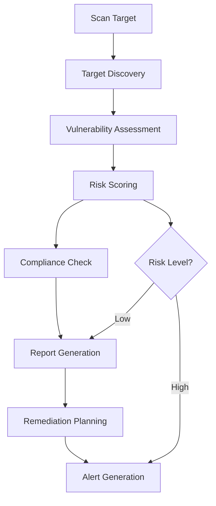

# Vulnerability Scanner

## Purpose
Provides comprehensive vulnerability scanning and assessment for the kOS ecosystem. This module identifies, analyzes, and reports security vulnerabilities across systems, applications, networks, and infrastructure components. The Vulnerability Scanner ensures proactive security monitoring and risk assessment to maintain system integrity and compliance.

## Capabilities
- **Multi-Platform Scanning**: Scan various platforms, operating systems, and applications
- **Vulnerability Database**: Access to comprehensive vulnerability databases and threat intelligence
- **Risk Assessment**: Automated risk scoring and prioritization of vulnerabilities
- **Compliance Checking**: Verify compliance with security standards and regulations
- **Remediation Guidance**: Provide actionable remediation recommendations
- **Scheduled Scanning**: Automated and scheduled vulnerability assessments
- **Real-Time Monitoring**: Continuous monitoring for new vulnerabilities
- **Reporting**: Detailed vulnerability reports and trend analysis
- **Integration**: Integrate with security tools and incident response systems

## Integration Points
- **Input**: System configurations, network topology, and scanning parameters
- **Output**: Vulnerability reports, risk assessments, and remediation recommendations
- **Dependencies**: Base Audit Logger for logging, Security Policy Manager for compliance

## Configuration
```yaml
vulnerability_scanner:
  scan_frequency: "daily"
  scan_depth: "comprehensive"
  risk_threshold: "medium"
  auto_remediation: false
  reporting:
    enabled: true
    format: ["pdf", "json", "html"]
    retention_period: "1y"
  compliance:
    enabled: true
    standards: ["nist", "iso27001", "pci_dss"]
  performance:
    max_concurrent_scans: 10
    scan_timeout: 3600  # seconds
    resource_limits:
      cpu: 80
      memory: 4  # GB
      network: 100  # Mbps
```

## Example Workflow


## Core Capabilities

### **1. Target Discovery**
- **Description**: Automatically discover and inventory scan targets
- **Input**: Network ranges, system lists, and discovery parameters
- **Output**: Comprehensive target inventory and topology
- **Dependencies**: Network discovery tools and asset management

### **2. Vulnerability Assessment**
- **Description**: Perform comprehensive vulnerability scans across targets
- **Input**: Target specifications and scan configurations
- **Output**: Detailed vulnerability findings and evidence
- **Dependencies**: Vulnerability databases and scanning engines

### **3. Risk Scoring**
- **Description**: Calculate and prioritize vulnerability risk scores
- **Input**: Vulnerability data and environmental context
- **Output**: Risk scores and prioritization recommendations
- **Dependencies**: Risk assessment algorithms and threat intelligence

### **4. Compliance Checking**
- **Description**: Verify compliance with security standards and regulations
- **Input**: Compliance requirements and scan results
- **Output**: Compliance status and gap analysis
- **Dependencies**: Compliance frameworks and policy engines

## Module Interface

### **Input Interface**
```typescript
interface VulnerabilityScannerInput {
  targets: ScanTarget[];
  scanType: 'full' | 'quick' | 'compliance';
  riskThreshold: 'low' | 'medium' | 'high' | 'critical';
  complianceStandards?: string[];
  scanParameters?: ScanParameters;
}

interface ScanTarget {
  id: string;
  type: 'system' | 'application' | 'network' | 'database';
  address: string;
  credentials?: Credentials;
  scanProfile: string;
}

interface ScanParameters {
  timeout: number;
  concurrentScans: number;
  scanDepth: 'basic' | 'standard' | 'comprehensive';
  includeExploits: boolean;
}
```

### **Output Interface**
```typescript
interface VulnerabilityScannerOutput {
  scanId: string;
  timestamp: Date;
  targets: ScanTarget[];
  vulnerabilities: Vulnerability[];
  riskScore: number;
  complianceStatus: ComplianceStatus;
  recommendations: RemediationRecommendation[];
  metadata: VulnerabilityScanMetadata;
}

interface Vulnerability {
  id: string;
  title: string;
  description: string;
  severity: 'low' | 'medium' | 'high' | 'critical';
  cvssScore: number;
  affectedTargets: string[];
  evidence: string;
  remediation: string;
  references: string[];
}

interface ComplianceStatus {
  compliant: boolean;
  gaps: ComplianceGap[];
  recommendations: string[];
}

interface RemediationRecommendation {
  vulnerabilityId: string;
  priority: 'low' | 'medium' | 'high' | 'critical';
  action: string;
  estimatedEffort: string;
  resources: string[];
}
```

### **Configuration Interface**
```typescript
interface VulnerabilityScannerConfig {
  scanFrequency: string;
  scanDepth: string;
  riskThreshold: string;
  autoRemediation: boolean;
  reporting: ReportingConfig;
  compliance: ComplianceConfig;
  performance: PerformanceConfig;
}

interface ReportingConfig {
  enabled: boolean;
  format: string[];
  retentionPeriod: string;
}

interface ComplianceConfig {
  enabled: boolean;
  standards: string[];
}

interface PerformanceConfig {
  maxConcurrentScans: number;
  scanTimeout: number;
  resourceLimits: ResourceLimits;
}

interface ResourceLimits {
  cpu: number;
  memory: number;
  network: number;
}
```

## Module Dependencies

### **Required Dependencies**
- **Base Audit Logger**: For logging scan activities and results
- **Vulnerability Database**: For vulnerability definitions and signatures
- **Network Discovery**: For target discovery and inventory

### **Optional Dependencies**
- **Threat Intelligence**: For enhanced risk assessment
- **Remediation Engine**: For automated remediation actions

## Module Implementation

### **Core Components**

#### **1. Vulnerability Scanning Engine**
```typescript
class VulnerabilityScanningEngine {
  private config: VulnerabilityScannerConfig;
  private vulnerabilityDB: VulnerabilityDatabase;
  private auditLogger: BaseAuditLogger;
  
  constructor(config: VulnerabilityScannerConfig) {
    this.config = config;
    this.vulnerabilityDB = new VulnerabilityDatabase();
    this.auditLogger = new BaseAuditLogger();
  }
  
  async scanTargets(input: VulnerabilityScannerInput): Promise<VulnerabilityScannerOutput> {
    const scanId = this.generateScanId();
    
    // Log scan start
    await this.auditLogger.logEvent({
      eventType: 'vulnerability_scan_start',
      scanId,
      targets: input.targets.length
    });
    
    // Discover and validate targets
    const validatedTargets = await this.discoverTargets(input.targets);
    
    // Perform vulnerability assessment
    const vulnerabilities = await this.assessVulnerabilities(validatedTargets, input.scanParameters);
    
    // Calculate risk scores
    const riskScore = this.calculateRiskScore(vulnerabilities);
    
    // Check compliance
    const complianceStatus = await this.checkCompliance(vulnerabilities, input.complianceStandards);
    
    // Generate recommendations
    const recommendations = this.generateRecommendations(vulnerabilities);
    
    // Log scan completion
    await this.auditLogger.logEvent({
      eventType: 'vulnerability_scan_complete',
      scanId,
      vulnerabilitiesFound: vulnerabilities.length,
      riskScore
    });
    
    return {
      scanId,
      timestamp: new Date(),
      targets: validatedTargets,
      vulnerabilities,
      riskScore,
      complianceStatus,
      recommendations,
      metadata: {
        scanDuration: Date.now() - scanId.timestamp,
        scanType: input.scanType,
        riskThreshold: input.riskThreshold
      }
    };
  }
  
  private async discoverTargets(targets: ScanTarget[]): Promise<ScanTarget[]> {
    // Implement target discovery logic
    return targets;
  }
  
  private async assessVulnerabilities(targets: ScanTarget[], parameters: ScanParameters): Promise<Vulnerability[]> {
    // Implement vulnerability assessment logic
    return [];
  }
  
  private calculateRiskScore(vulnerabilities: Vulnerability[]): number {
    // Implement risk scoring algorithm
    return 0;
  }
  
  private async checkCompliance(vulnerabilities: Vulnerability[], standards: string[]): Promise<ComplianceStatus> {
    // Implement compliance checking logic
    return { compliant: true, gaps: [], recommendations: [] };
  }
  
  private generateRecommendations(vulnerabilities: Vulnerability[]): RemediationRecommendation[] {
    // Implement recommendation generation logic
    return [];
  }
  
  private generateScanId(): string {
    return `scan_${Date.now()}_${Math.random().toString(36).substr(2, 9)}`;
  }
}
```

### **Integration Points**

#### **1. Vulnerability Database Integration**
- **Description**: Integrates with vulnerability databases for up-to-date threat intelligence
- **Protocol**: Database synchronization and query protocols
- **Authentication**: Database access control and API authentication
- **Rate Limiting**: Database query rate limiting for performance

#### **2. Network Discovery Integration**
- **Description**: Integrates with network discovery tools for target identification
- **Protocol**: Network scanning and discovery protocols
- **Authentication**: Network access credentials and permissions
- **Rate Limiting**: Network scan rate limiting to avoid disruption

## Performance Characteristics

### **Throughput**
- **Target Discovery**: 1,000 targets/hour
- **Vulnerability Assessment**: 100 targets/hour (comprehensive scan)
- **Risk Scoring**: 10,000 vulnerabilities/minute
- **Report Generation**: 1 report/minute

### **Reliability**
- **Scan Success Rate**: 99.5% successful scans
- **False Positive Rate**: < 5% false positive rate
- **Recovery Time**: < 5 minutes for scan failures
- **Availability**: 99.9% uptime for scanning services

### **Scalability**
- **Horizontal Scaling**: Support for distributed scanning across multiple nodes
- **Vertical Scaling**: Linear performance improvement with additional resources
- **Concurrent Scans**: Support for up to 10 concurrent comprehensive scans
- **Memory Usage**: < 2GB memory footprint for standard operations

## Security Considerations

### **Scan Security**
- **Access Control**: Strict access control for scan targets and results
- **Credential Management**: Secure storage and handling of scan credentials
- **Data Protection**: Encrypted storage of scan results and reports
- **Audit Trail**: Complete audit trail for all scanning activities

### **Network Security**
- **Scan Impact**: Minimize network and system impact during scanning
- **Rate Limiting**: Implement rate limiting to avoid service disruption
- **Error Handling**: Graceful handling of scan failures and timeouts
- **Resource Protection**: Protect against resource exhaustion attacks

## Error Handling

### **Error Types**
- **Scan Failures**: Target unreachable or scan timeout errors
- **Authentication Errors**: Invalid credentials or access denied
- **Resource Errors**: Insufficient resources for scanning
- **Database Errors**: Vulnerability database access failures
- **Network Errors**: Network connectivity or bandwidth issues

### **Error Recovery**
- **Automatic Retry**: Retry failed scans with exponential backoff
- **Fallback Scans**: Fallback to less intensive scan types on failure
- **Resource Management**: Dynamic resource allocation and cleanup
- **Error Reporting**: Comprehensive error reporting and alerting

## Testing Strategy

### **Unit Testing**
- **Target Discovery**: Test target discovery and validation
- **Vulnerability Assessment**: Test vulnerability detection algorithms
- **Risk Scoring**: Test risk scoring and prioritization
- **Error Handling**: Test all error conditions and recovery

### **Integration Testing**
- **End-to-End Scanning**: Test complete vulnerability scanning workflows
- **Database Integration**: Test vulnerability database integration
- **Performance Testing**: Test performance under various load conditions
- **Security Testing**: Test scan security and access control

### **Load Testing**
- **Concurrent Scans**: Test multiple concurrent vulnerability scans
- **Large Target Sets**: Test scanning of large target inventories
- **Resource Utilization**: Test resource usage under load
- **Performance Degradation**: Test performance under resource constraints

## Deployment Considerations

### **Resource Requirements**
- **CPU**: Minimum 4 cores, recommended 8+ cores for high-performance scanning
- **Memory**: Minimum 4GB, recommended 16GB+ for large scans
- **Storage**: Minimum 10GB for scan results and reports
- **Network**: High-speed network for distributed scanning

### **Configuration**
- **Environment Variables**: Configuration through environment variables
- **Configuration Files**: Support for configuration file-based setup
- **Runtime Configuration**: Dynamic configuration updates
- **Validation**: Configuration validation on startup

### **Monitoring**
- **Performance Metrics**: Monitor scan performance and throughput
- **Resource Utilization**: Monitor CPU, memory, and network usage
- **Error Rates**: Monitor scan failure rates and types
- **Security Events**: Monitor scan access and results access

## Usage Examples

### **Basic Usage**
```typescript
import { VulnerabilityScanner } from './VulnerabilityScanner';

const scanner = new VulnerabilityScanner(config);

const input: VulnerabilityScannerInput = {
  targets: [
    {
      id: 'server001',
      type: 'system',
      address: '192.168.1.100',
      scanProfile: 'comprehensive'
    }
  ],
  scanType: 'full',
  riskThreshold: 'medium'
};

const result = await scanner.scanTargets(input);
console.log('Scan completed:', result.scanId);
console.log('Vulnerabilities found:', result.vulnerabilities.length);
console.log('Risk score:', result.riskScore);
```

### **Advanced Usage with Compliance**
```typescript
import { VulnerabilityScanner } from './VulnerabilityScanner';

const scanner = new VulnerabilityScanner(config);

const input: VulnerabilityScannerInput = {
  targets: [
    {
      id: 'webapp001',
      type: 'application',
      address: 'https://app.example.com',
      scanProfile: 'web_application'
    }
  ],
  scanType: 'compliance',
  riskThreshold: 'high',
  complianceStandards: ['pci_dss', 'iso27001'],
  scanParameters: {
    timeout: 1800,
    concurrentScans: 5,
    scanDepth: 'comprehensive',
    includeExploits: false
  }
};

const result = await scanner.scanTargets(input);
console.log('Compliance status:', result.complianceStatus.compliant);
console.log('Compliance gaps:', result.complianceStatus.gaps.length);
console.log('Remediation recommendations:', result.recommendations.length);
```

## Future Enhancements

### **Planned Features**
- **Machine Learning**: ML-based vulnerability prediction and prioritization
- **Automated Remediation**: Automated vulnerability remediation actions
- **Threat Intelligence**: Enhanced threat intelligence integration
- **Cloud Scanning**: Native cloud platform vulnerability scanning

### **Performance Improvements**
- **GPU Acceleration**: GPU-accelerated vulnerability detection
- **Advanced Caching**: Intelligent caching for scan results
- **Distributed Scanning**: Enhanced distributed scanning capabilities
- **Real-Time Monitoring**: Real-time vulnerability monitoring and alerting

---

**Version**: 1.0  
**Focus**: Comprehensive vulnerability scanning and assessment with compliance support 