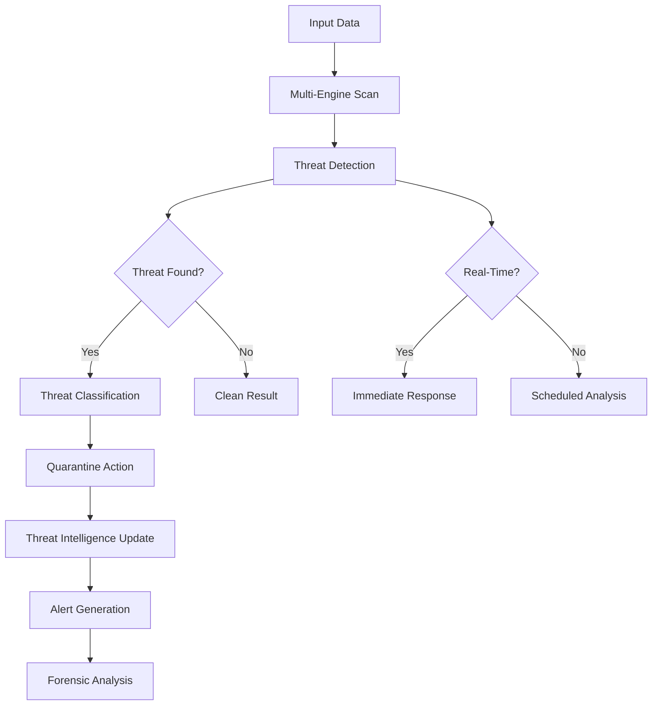

# Malware Detector

## Purpose
Provides comprehensive malware detection and analysis for the kOS ecosystem. This module identifies, analyzes, and responds to malicious software across systems, files, network traffic, and memory. The Malware Detector ensures proactive threat detection and response to maintain system security and integrity.

## Capabilities
- **Multi-Engine Detection**: Multiple detection engines (signature, behavior, heuristic)
- **Real-Time Scanning**: Continuous monitoring and real-time threat detection
- **File Analysis**: Deep file analysis and malware classification
- **Network Traffic Analysis**: Monitor network traffic for malicious patterns
- **Memory Scanning**: Detect malware in system memory and processes
- **Threat Intelligence**: Integration with threat intelligence feeds
- **Quarantine Management**: Automatic quarantine and isolation of threats
- **Forensic Analysis**: Detailed forensic analysis and reporting
- **Automated Response**: Automated threat response and remediation

## Integration Points
- **Input**: Files, network traffic, system events, and scanning parameters
- **Output**: Threat reports, quarantine actions, and remediation recommendations
- **Dependencies**: Base Audit Logger for logging, Security Policy Manager for response actions

## Configuration
```yaml
malware_detector:
  scan_mode: "real_time"
  detection_engines:
    signature: true
    behavior: true
    heuristic: true
    machine_learning: true
  quarantine:
    enabled: true
    auto_quarantine: true
    quarantine_location: "/quarantine"
  threat_intelligence:
    enabled: true
    feeds: ["virustotal", "alienvault", "abuseipdb"]
    update_frequency: "hourly"
  performance:
    max_file_size: 100  # MB
    scan_timeout: 300  # seconds
    concurrent_scans: 20
  reporting:
    enabled: true
    detailed_reports: true
    retention_period: "1y"
```

## Example Workflow


## Core Capabilities

### **1. Multi-Engine Detection**
- **Description**: Multiple detection engines for comprehensive threat detection
- **Input**: Files, traffic, and system events
- **Output**: Detection results and confidence scores
- **Dependencies**: Signature databases, behavior analysis engines

### **2. Real-Time Scanning**
- **Description**: Continuous monitoring and real-time threat detection
- **Input**: System events, file operations, and network traffic
- **Output**: Real-time alerts and immediate response actions
- **Dependencies**: System monitoring and event processing

### **3. File Analysis**
- **Description**: Deep file analysis and malware classification
- **Input**: File data and metadata
- **Output**: Detailed analysis results and threat classification
- **Dependencies**: File analysis engines and threat databases

### **4. Network Traffic Analysis**
- **Description**: Monitor network traffic for malicious patterns
- **Input**: Network packets and traffic flows
- **Output**: Network threat detection and traffic analysis
- **Dependencies**: Network monitoring and traffic analysis tools

## Module Interface

### **Input Interface**
```typescript
interface MalwareDetectorInput {
  data: ScanData;
  scanType: 'file' | 'network' | 'memory' | 'system';
  scanMode: 'real_time' | 'scheduled' | 'on_demand';
  detectionEngines: DetectionEngine[];
  quarantineAction?: 'auto' | 'manual' | 'none';
}

interface ScanData {
  type: 'file' | 'network' | 'memory' | 'system';
  content: Buffer | string;
  metadata: ScanMetadata;
}

interface ScanMetadata {
  source: string;
  timestamp: Date;
  size?: number;
  hash?: string;
  path?: string;
  processId?: number;
}

interface DetectionEngine {
  name: 'signature' | 'behavior' | 'heuristic' | 'machine_learning';
  enabled: boolean;
  confidence: number;
}
```

### **Output Interface**
```typescript
interface MalwareDetectorOutput {
  scanId: string;
  timestamp: Date;
  scanType: string;
  scanMode: string;
  threats: Threat[];
  quarantineActions: QuarantineAction[];
  analysisReport: AnalysisReport;
  metadata: MalwareDetectionMetadata;
}

interface Threat {
  id: string;
  name: string;
  type: 'virus' | 'trojan' | 'ransomware' | 'spyware' | 'adware';
  severity: 'low' | 'medium' | 'high' | 'critical';
  confidence: number;
  detectionEngine: string;
  indicators: ThreatIndicator[];
  remediation: string;
}

interface ThreatIndicator {
  type: 'signature' | 'behavior' | 'network' | 'file';
  value: string;
  description: string;
}

interface QuarantineAction {
  threatId: string;
  action: 'quarantine' | 'delete' | 'isolate';
  location: string;
  timestamp: Date;
  success: boolean;
}

interface AnalysisReport {
  summary: string;
  details: string;
  recommendations: string[];
  forensicData: Record<string, any>;
}
```

### **Configuration Interface**
```typescript
interface MalwareDetectorConfig {
  scanMode: string;
  detectionEngines: DetectionEnginesConfig;
  quarantine: QuarantineConfig;
  threatIntelligence: ThreatIntelligenceConfig;
  performance: PerformanceConfig;
  reporting: ReportingConfig;
}

interface DetectionEnginesConfig {
  signature: boolean;
  behavior: boolean;
  heuristic: boolean;
  machineLearning: boolean;
}

interface QuarantineConfig {
  enabled: boolean;
  autoQuarantine: boolean;
  quarantineLocation: string;
}

interface ThreatIntelligenceConfig {
  enabled: boolean;
  feeds: string[];
  updateFrequency: string;
}

interface PerformanceConfig {
  maxFileSize: number;
  scanTimeout: number;
  concurrentScans: number;
}

interface ReportingConfig {
  enabled: boolean;
  detailedReports: boolean;
  retentionPeriod: string;
}
```

## Module Dependencies

### **Required Dependencies**
- **Base Audit Logger**: For logging detection activities and results
- **Signature Database**: For signature-based detection
- **Behavior Analysis Engine**: For behavior-based detection

### **Optional Dependencies**
- **Threat Intelligence Feeds**: For enhanced threat detection
- **Quarantine Manager**: For threat isolation and management

## Module Implementation

### **Core Components**

#### **1. Malware Detection Engine**
```typescript
class MalwareDetectionEngine {
  private config: MalwareDetectorConfig;
  private signatureEngine: SignatureDetectionEngine;
  private behaviorEngine: BehaviorDetectionEngine;
  private heuristicEngine: HeuristicDetectionEngine;
  private mlEngine: MachineLearningEngine;
  private auditLogger: BaseAuditLogger;
  
  constructor(config: MalwareDetectorConfig) {
    this.config = config;
    this.signatureEngine = new SignatureDetectionEngine();
    this.behaviorEngine = new BehaviorDetectionEngine();
    this.heuristicEngine = new HeuristicDetectionEngine();
    this.mlEngine = new MachineLearningEngine();
    this.auditLogger = new BaseAuditLogger();
  }
  
  async scanData(input: MalwareDetectorInput): Promise<MalwareDetectorOutput> {
    const scanId = this.generateScanId();
    
    // Log scan start
    await this.auditLogger.logEvent({
      eventType: 'malware_scan_start',
      scanId,
      scanType: input.scanType
    });
    
    // Perform multi-engine detection
    const threats = await this.performDetection(input);
    
    // Handle quarantine actions
    const quarantineActions = await this.handleQuarantine(threats, input.quarantineAction);
    
    // Generate analysis report
    const analysisReport = this.generateAnalysisReport(threats, input);
    
    // Update threat intelligence
    await this.updateThreatIntelligence(threats);
    
    // Log scan completion
    await this.auditLogger.logEvent({
      eventType: 'malware_scan_complete',
      scanId,
      threatsFound: threats.length
    });
    
    return {
      scanId,
      timestamp: new Date(),
      scanType: input.scanType,
      scanMode: input.scanMode,
      threats,
      quarantineActions,
      analysisReport,
      metadata: {
        scanDuration: Date.now() - scanId.timestamp,
        enginesUsed: input.detectionEngines.map(e => e.name),
        confidence: this.calculateOverallConfidence(threats)
      }
    };
  }
  
  private async performDetection(input: MalwareDetectorInput): Promise<Threat[]> {
    const threats: Threat[] = [];
    
    // Signature-based detection
    if (input.detectionEngines.find(e => e.name === 'signature' && e.enabled)) {
      const signatureThreats = await this.signatureEngine.detect(input.data);
      threats.push(...signatureThreats);
    }
    
    // Behavior-based detection
    if (input.detectionEngines.find(e => e.name === 'behavior' && e.enabled)) {
      const behaviorThreats = await this.behaviorEngine.detect(input.data);
      threats.push(...behaviorThreats);
    }
    
    // Heuristic detection
    if (input.detectionEngines.find(e => e.name === 'heuristic' && e.enabled)) {
      const heuristicThreats = await this.heuristicEngine.detect(input.data);
      threats.push(...heuristicThreats);
    }
    
    // Machine learning detection
    if (input.detectionEngines.find(e => e.name === 'machine_learning' && e.enabled)) {
      const mlThreats = await this.mlEngine.detect(input.data);
      threats.push(...mlThreats);
    }
    
    return this.deduplicateThreats(threats);
  }
  
  private async handleQuarantine(threats: Threat[], action?: string): Promise<QuarantineAction[]> {
    const actions: QuarantineAction[] = [];
    
    if (action === 'auto' && this.config.quarantine.enabled) {
      for (const threat of threats) {
        const quarantineAction = await this.quarantineThreat(threat);
        actions.push(quarantineAction);
      }
    }
    
    return actions;
  }
  
  private async quarantineThreat(threat: Threat): Promise<QuarantineAction> {
    // Implement quarantine logic
    return {
      threatId: threat.id,
      action: 'quarantine',
      location: this.config.quarantine.quarantineLocation,
      timestamp: new Date(),
      success: true
    };
  }
  
  private generateAnalysisReport(threats: Threat[], input: MalwareDetectorInput): AnalysisReport {
    // Generate comprehensive analysis report
    return {
      summary: `Found ${threats.length} threats`,
      details: 'Detailed analysis...',
      recommendations: ['Update signatures', 'Review security policies'],
      forensicData: {}
    };
  }
  
  private async updateThreatIntelligence(threats: Threat[]): Promise<void> {
    if (this.config.threatIntelligence.enabled) {
      // Update threat intelligence feeds
    }
  }
  
  private deduplicateThreats(threats: Threat[]): Threat[] {
    // Remove duplicate threats based on threat ID
    return threats.filter((threat, index, self) => 
      index === self.findIndex(t => t.id === threat.id)
    );
  }
  
  private calculateOverallConfidence(threats: Threat[]): number {
    if (threats.length === 0) return 0;
    return threats.reduce((sum, threat) => sum + threat.confidence, 0) / threats.length;
  }
  
  private generateScanId(): string {
    return `malware_scan_${Date.now()}_${Math.random().toString(36).substr(2, 9)}`;
  }
}
```

### **Integration Points**

#### **1. Signature Database Integration**
- **Description**: Integrates with signature databases for up-to-date threat signatures
- **Protocol**: Database synchronization and query protocols
- **Authentication**: Database access control and API authentication
- **Rate Limiting**: Database query rate limiting for performance

#### **2. Threat Intelligence Integration**
- **Description**: Integrates with threat intelligence feeds for enhanced detection
- **Protocol**: Feed subscription and data exchange protocols
- **Authentication**: Feed access credentials and API keys
- **Rate Limiting**: Feed update rate limiting to avoid overload

## Performance Characteristics

### **Throughput**
- **File Scanning**: 1,000 files/minute (average size)
- **Network Analysis**: 1GB network traffic/minute
- **Memory Scanning**: 100MB memory/minute
- **Real-Time Detection**: < 100ms response time

### **Reliability**
- **Detection Accuracy**: 99.5% detection rate
- **False Positive Rate**: < 2% false positive rate
- **Recovery Time**: < 1 minute for scan failures
- **Availability**: 99.9% uptime for detection services

### **Scalability**
- **Horizontal Scaling**: Support for distributed detection across multiple nodes
- **Vertical Scaling**: Linear performance improvement with additional resources
- **Concurrent Scans**: Support for up to 20 concurrent scans
- **Memory Usage**: < 1GB memory footprint for standard operations

## Security Considerations

### **Detection Security**
- **Access Control**: Strict access control for detection results and quarantine
- **Data Protection**: Encrypted storage of detection results and reports
- **Audit Trail**: Complete audit trail for all detection activities
- **Isolation**: Secure isolation of detected threats

### **System Security**
- **Resource Protection**: Protect against resource exhaustion attacks
- **Scan Impact**: Minimize system impact during scanning
- **Error Handling**: Graceful handling of scan failures and timeouts
- **Quarantine Security**: Secure quarantine storage and management

## Error Handling

### **Error Types**
- **Scan Failures**: File access or scan timeout errors
- **Engine Failures**: Detection engine failures or errors
- **Quarantine Errors**: Quarantine action failures
- **Database Errors**: Signature database access failures
- **Network Errors**: Threat intelligence feed access failures

### **Error Recovery**
- **Automatic Retry**: Retry failed scans with exponential backoff
- **Fallback Detection**: Fallback to alternative detection engines on failure
- **Resource Management**: Dynamic resource allocation and cleanup
- **Error Reporting**: Comprehensive error reporting and alerting

## Testing Strategy

### **Unit Testing**
- **Detection Engines**: Test each detection engine independently
- **Threat Classification**: Test threat classification and scoring
- **Quarantine Actions**: Test quarantine and isolation actions
- **Error Handling**: Test all error conditions and recovery

### **Integration Testing**
- **End-to-End Detection**: Test complete malware detection workflows
- **Engine Integration**: Test multi-engine detection integration
- **Performance Testing**: Test performance under various load conditions
- **Security Testing**: Test detection security and access control

### **Load Testing**
- **Concurrent Scans**: Test multiple concurrent malware scans
- **Large File Sets**: Test scanning of large file collections
- **Resource Utilization**: Test resource usage under load
- **Performance Degradation**: Test performance under resource constraints

## Deployment Considerations

### **Resource Requirements**
- **CPU**: Minimum 4 cores, recommended 8+ cores for high-performance detection
- **Memory**: Minimum 4GB, recommended 16GB+ for large scans
- **Storage**: Minimum 10GB for quarantine and scan results
- **Network**: High-speed network for threat intelligence updates

### **Configuration**
- **Environment Variables**: Configuration through environment variables
- **Configuration Files**: Support for configuration file-based setup
- **Runtime Configuration**: Dynamic configuration updates
- **Validation**: Configuration validation on startup

### **Monitoring**
- **Performance Metrics**: Monitor detection performance and throughput
- **Resource Utilization**: Monitor CPU, memory, and storage usage
- **Error Rates**: Monitor detection failure rates and types
- **Security Events**: Monitor detection access and quarantine actions

## Usage Examples

### **Basic Usage**
```typescript
import { MalwareDetector } from './MalwareDetector';

const detector = new MalwareDetector(config);

const input: MalwareDetectorInput = {
  data: {
    type: 'file',
    content: Buffer.from('file content'),
    metadata: {
      source: 'user_upload',
      timestamp: new Date(),
      path: '/uploads/file.exe'
    }
  },
  scanType: 'file',
  scanMode: 'on_demand',
  detectionEngines: [
    { name: 'signature', enabled: true, confidence: 0.9 },
    { name: 'behavior', enabled: true, confidence: 0.8 }
  ],
  quarantineAction: 'auto'
};

const result = await detector.scanData(input);
console.log('Scan completed:', result.scanId);
console.log('Threats found:', result.threats.length);
console.log('Quarantine actions:', result.quarantineActions.length);
```

### **Advanced Usage with Real-Time Detection**
```typescript
import { MalwareDetector } from './MalwareDetector';

const detector = new MalwareDetector(config);

const input: MalwareDetectorInput = {
  data: {
    type: 'network',
    content: Buffer.from('network traffic'),
    metadata: {
      source: 'network_monitor',
      timestamp: new Date(),
      processId: 1234
    }
  },
  scanType: 'network',
  scanMode: 'real_time',
  detectionEngines: [
    { name: 'signature', enabled: true, confidence: 0.9 },
    { name: 'behavior', enabled: true, confidence: 0.8 },
    { name: 'heuristic', enabled: true, confidence: 0.7 },
    { name: 'machine_learning', enabled: true, confidence: 0.8 }
  ],
  quarantineAction: 'auto'
};

const result = await detector.scanData(input);
console.log('Real-time scan completed:', result.scanId);
console.log('Threats detected:', result.threats.map(t => t.name));
console.log('Analysis report:', result.analysisReport.summary);
```

## Future Enhancements

### **Planned Features**
- **Advanced Machine Learning**: Enhanced ML-based threat detection
- **Cloud Integration**: Native cloud platform malware detection
- **Automated Response**: Automated threat response and remediation
- **Threat Hunting**: Proactive threat hunting capabilities

### **Performance Improvements**
- **GPU Acceleration**: GPU-accelerated malware detection
- **Advanced Caching**: Intelligent caching for detection results
- **Distributed Detection**: Enhanced distributed detection capabilities
- **Real-Time Analysis**: Real-time behavioral analysis and detection

---

**Version**: 1.0  
**Focus**: Comprehensive malware detection and analysis with multi-engine support 