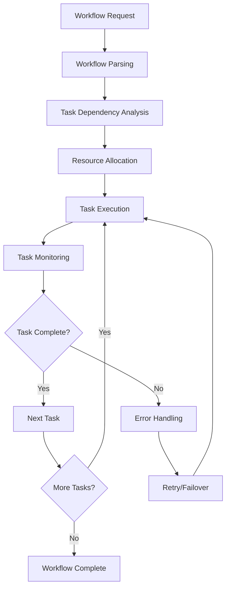
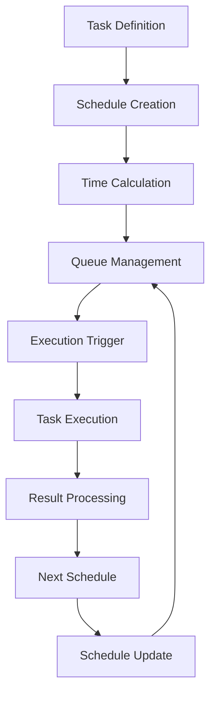
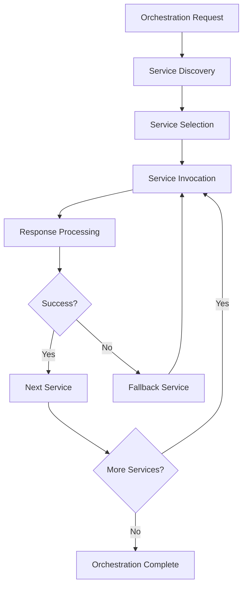

# Workflow & Orchestration

## Overview
Handles all workflow and orchestration functionalities including workflow engines, task scheduling, process management, and service orchestration across all platforms and contexts.

## Core Principles
- **Reliability**: Ensure workflows complete successfully and handle failures gracefully
- **Scalability**: Handle high-volume workflow execution efficiently
- **Flexibility**: Support various workflow patterns and configurations
- **Observability**: Provide comprehensive monitoring and debugging capabilities
- **Performance**: Optimize workflow execution for speed and efficiency
- **Resilience**: Handle failures and recover automatically

## Function Specifications

### Base Functions (4 Functions)
1. [Base Workflow Engine](01_Base_Workflow_Engine.md) - Core workflow engine interface and common functionality
2. [Base Task Scheduler](02_Base_Task_Scheduler.md) - Core task scheduling interface and common functionality
3. [Base Process Manager](03_Base_Process_Manager.md) - Core process management interface and common functionality
4. [Base Orchestrator](04_Base_Orchestrator.md) - Core orchestration interface and common functionality

### Workflow Engines (2 Functions)
5. [Sequential Workflow Engine](05_Sequential_Workflow_Engine.md) - Sequential workflow execution
6. [Parallel Workflow Engine](06_Parallel_Workflow_Engine.md) - Parallel workflow execution

### Task Scheduling (2 Functions)
7. [Cron Task Scheduler](07_Cron_Task_Scheduler.md) - Cron-based task scheduling
8. [Event Task Scheduler](08_Event_Task_Scheduler.md) - Event-driven task scheduling

### Process Management (1 Function)
9. [Process Pool Manager](09_Process_Pool_Manager.md) - Process pool management

### Orchestration (3 Functions)
10. [Service Orchestrator](10_Service_Orchestrator.md) - Service orchestration
11. [Microservice Orchestrator](11_Microservice_Orchestrator.md) - Microservice orchestration
12. [Pipeline Orchestrator](12_Pipeline_Orchestrator.md) - Pipeline orchestration

## Integration Patterns

### Workflow Execution Flow


### Task Scheduling Flow


### Service Orchestration Flow


## Workflow Capabilities

### Workflow Engine Capabilities
- **Workflow Definition**: Define workflows using various formats
- **Task Execution**: Execute individual tasks within workflows
- **Dependency Management**: Manage task dependencies
- **Error Handling**: Handle task and workflow failures
- **State Management**: Manage workflow state

### Task Scheduling Capabilities
- **Time-based Scheduling**: Schedule tasks based on time
- **Event-based Scheduling**: Schedule tasks based on events
- **Condition-based Scheduling**: Schedule tasks based on conditions
- **Priority Management**: Manage task priorities
- **Resource Management**: Manage task resources

### Process Management Capabilities
- **Process Creation**: Create and manage processes
- **Process Monitoring**: Monitor process health and performance
- **Process Scaling**: Scale processes up or down
- **Process Recovery**: Recover failed processes
- **Resource Allocation**: Allocate resources to processes

### Orchestration Capabilities
- **Service Discovery**: Discover available services
- **Service Invocation**: Invoke services with parameters
- **Response Aggregation**: Aggregate service responses
- **Error Handling**: Handle service failures
- **Load Balancing**: Balance load across services

## Configuration Examples

### Workflow Configuration
```yaml
workflow:
  engine:
    type: "sequential"
    max_concurrent_tasks: 10
    timeout: 3600s
    retry_attempts: 3
  tasks:
    - name: "data_processing"
      type: "function"
      timeout: 300s
      retries: 2
    - name: "notification"
      type: "service"
      depends_on: ["data_processing"]
      timeout: 60s
```

### Task Scheduling Configuration
```yaml
task_scheduling:
  cron:
    enabled: true
    timezone: "UTC"
    max_jobs: 1000
  event:
    enabled: true
    event_sources: ["kafka", "redis"]
    max_events: 10000
  resources:
    cpu_limit: "2"
    memory_limit: "4Gi"
    disk_limit: "10Gi"
```

### Process Management Configuration
```yaml
process_management:
  pool:
    min_size: 5
    max_size: 50
    idle_timeout: 300s
  monitoring:
    health_check_interval: 30s
    metrics_collection: true
    alerting: true
  recovery:
    auto_restart: true
    max_restarts: 3
    restart_delay: 10s
```

### Orchestration Configuration
```yaml
orchestration:
  service_discovery:
    type: "consul"
    refresh_interval: 30s
    health_check: true
  load_balancing:
    algorithm: "round_robin"
    health_check: true
    failover: true
  timeout:
    default: 30s
    max: 300s
  retry:
    max_attempts: 3
    backoff: "exponential"
```

## Error Handling

### Workflow Errors
- **Task Failures**: Handle individual task failures
- **Dependency Errors**: Handle dependency resolution errors
- **Resource Errors**: Handle resource allocation errors
- **Timeout Errors**: Handle workflow timeouts
- **State Errors**: Handle state management errors

### Scheduling Errors
- **Schedule Conflicts**: Handle conflicting schedules
- **Resource Errors**: Handle resource allocation errors
- **Execution Errors**: Handle task execution errors
- **Queue Errors**: Handle queue management errors
- **Trigger Errors**: Handle trigger failures

### Process Errors
- **Process Failures**: Handle process failures
- **Resource Errors**: Handle resource exhaustion
- **Communication Errors**: Handle inter-process communication errors
- **Recovery Errors**: Handle recovery failures
- **Scaling Errors**: Handle scaling failures

### Orchestration Errors
- **Service Failures**: Handle service failures
- **Discovery Errors**: Handle service discovery errors
- **Communication Errors**: Handle service communication errors
- **Load Balancing Errors**: Handle load balancing errors
- **Timeout Errors**: Handle service timeouts

## Performance Considerations

### Workflow Performance
- **Parallel Execution**: Execute tasks in parallel where possible
- **Resource Optimization**: Optimize resource usage
- **Caching**: Cache workflow results
- **Compression**: Compress workflow data
- **Streaming**: Stream large data sets

### Scheduling Performance
- **Efficient Scheduling**: Use efficient scheduling algorithms
- **Queue Optimization**: Optimize queue management
- **Resource Pooling**: Pool resources for efficiency
- **Batch Processing**: Process tasks in batches
- **Load Distribution**: Distribute load evenly

### Process Performance
- **Process Pooling**: Pool processes for efficiency
- **Resource Management**: Manage resources efficiently
- **Communication Optimization**: Optimize inter-process communication
- **Memory Management**: Manage memory usage
- **CPU Optimization**: Optimize CPU usage

### Orchestration Performance
- **Service Caching**: Cache service responses
- **Connection Pooling**: Pool service connections
- **Load Balancing**: Balance load efficiently
- **Response Aggregation**: Aggregate responses efficiently
- **Error Recovery**: Recover from errors quickly

## Monitoring & Observability

### Workflow Metrics
- **Execution Time**: Track workflow execution time
- **Success Rate**: Track workflow success rate
- **Error Rate**: Track workflow error rate
- **Resource Usage**: Track resource usage
- **Throughput**: Track workflow throughput

### Scheduling Metrics
- **Schedule Accuracy**: Track schedule accuracy
- **Task Completion**: Track task completion rates
- **Queue Depth**: Track queue depth
- **Resource Utilization**: Track resource utilization
- **Error Rates**: Track scheduling error rates

### Process Metrics
- **Process Health**: Track process health
- **Resource Usage**: Track process resource usage
- **Communication**: Track inter-process communication
- **Recovery Time**: Track recovery time
- **Scaling Events**: Track scaling events

### Orchestration Metrics
- **Service Availability**: Track service availability
- **Response Time**: Track service response time
- **Load Distribution**: Track load distribution
- **Error Rates**: Track service error rates
- **Throughput**: Track orchestration throughput

### Workflow Alerts
- **High Error Rate**: Alert on high error rates
- **Long Execution Time**: Alert on long execution times
- **Resource Exhaustion**: Alert on resource exhaustion
- **Service Failures**: Alert on service failures
- **Queue Overflow**: Alert on queue overflow

## Security Considerations

### Workflow Security
- **Access Control**: Control access to workflows
- **Data Protection**: Protect workflow data
- **Audit Logging**: Log workflow activities
- **Encryption**: Encrypt sensitive data
- **Authentication**: Authenticate workflow users

### Process Security
- **Process Isolation**: Isolate processes securely
- **Resource Limits**: Limit resource usage
- **Communication Security**: Secure inter-process communication
- **Access Control**: Control process access
- **Monitoring**: Monitor for security threats

### Orchestration Security
- **Service Authentication**: Authenticate services
- **Communication Encryption**: Encrypt service communication
- **Access Control**: Control service access
- **Audit Logging**: Log orchestration activities
- **Security Monitoring**: Monitor for security threats

## Integration Examples

### Workflow Integration
```typescript
const workflowEngine = new SequentialWorkflowEngine({
  maxConcurrentTasks: 10,
  timeout: 3600,
  retryAttempts: 3
});

const workflowId = await workflowEngine.execute({
  tasks: [
    { name: 'process_data', function: 'dataProcessor' },
    { name: 'send_notification', function: 'notifier' }
  ],
  dependencies: { 'send_notification': ['process_data'] }
});
```

### Task Scheduling Integration
```typescript
const scheduler = new CronTaskScheduler({
  timezone: 'UTC',
  maxJobs: 1000
});

const jobId = await scheduler.schedule({
  cron: '0 0 * * *',
  task: 'daily_backup',
  options: { retries: 3, timeout: 3600 }
});
```

### Process Management Integration
```typescript
const processManager = new ProcessPoolManager({
  minSize: 5,
  maxSize: 50,
  idleTimeout: 300
});

const processId = await processManager.createProcess({
  command: 'node worker.js',
  options: { env: { NODE_ENV: 'production' } }
});
```

### Orchestration Integration
```typescript
const orchestrator = new ServiceOrchestrator({
  discovery: 'consul',
  loadBalancing: 'round_robin'
});

const result = await orchestrator.orchestrate({
  services: ['auth', 'data', 'notification'],
  workflow: 'user_registration',
  options: { timeout: 30, retries: 3 }
});
```

## Future Enhancements

### Advanced Workflow
- **AI-Powered Workflows**: AI-driven workflow optimization
- **Adaptive Workflows**: Workflows that adapt to conditions
- **Distributed Workflows**: Distributed workflow execution
- **Real-time Workflows**: Real-time workflow processing
- **Event-driven Workflows**: Event-driven workflow execution

### Enhanced Scheduling
- **Intelligent Scheduling**: AI-powered scheduling optimization
- **Predictive Scheduling**: Predictive task scheduling
- **Dynamic Scheduling**: Dynamic schedule adjustment
- **Resource-aware Scheduling**: Resource-aware scheduling
- **Multi-cloud Scheduling**: Multi-cloud task scheduling

### Improved Process Management
- **Container Orchestration**: Container-based process management
- **Serverless Processes**: Serverless process execution
- **Auto-scaling**: Automatic process scaling
- **Process Migration**: Process migration capabilities
- **Fault Tolerance**: Enhanced fault tolerance

### Advanced Orchestration
- **Multi-cloud Orchestration**: Multi-cloud service orchestration
- **Edge Orchestration**: Edge computing orchestration
- **AI Orchestration**: AI service orchestration
- **Blockchain Orchestration**: Blockchain service orchestration
- **IoT Orchestration**: IoT service orchestration

---

**Version**: 1.0  
**Category**: Workflow & Orchestration  
**Total Functions**: 12 