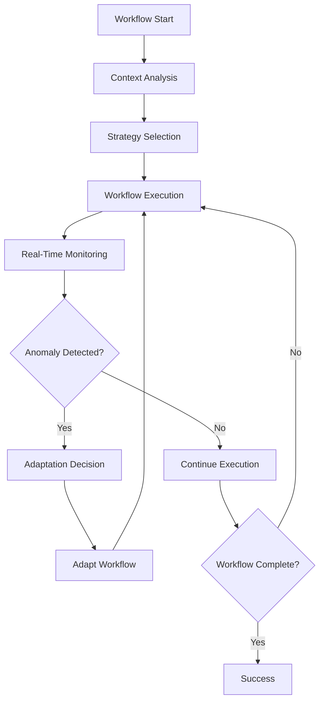

# **Adaptive Workflow Engine**

## **Overview**

The Adaptive Workflow Engine module provides advanced orchestration capabilities, dynamically adjusting workflow execution strategies in real time based on system state, workload, performance metrics, and feedback. It leverages AI/ML to optimize resource allocation, error recovery, and execution paths for maximum efficiency and resilience.

## **Core Principles**
- **Self-Optimization**: Continuously optimize execution strategies using real-time data and feedback.
- **Context Awareness**: Adapt to changing system state, workload, and external events.
- **Resilience**: Proactively detect and recover from failures, bottlenecks, and anomalies.
- **Learning-Driven**: Use machine learning to improve workflow performance and reliability over time.

## **Function Specifications**

### **Core Functions**
- **Dynamic Strategy Selection**: Select optimal execution strategies based on current context.
- **Real-Time Monitoring**: Continuously monitor workflow execution, system health, and resource usage.
- **Feedback Loop Integration**: Incorporate feedback from monitoring, user input, and external signals.
- **Predictive Resource Allocation**: Use predictive analytics to allocate resources and preempt bottlenecks.
- **Anomaly Detection & Recovery**: Detect anomalies and automatically trigger recovery or adaptation routines.
- **Policy-Driven Adaptation**: Support configurable adaptation policies and override rules.

### **TypeScript Interfaces**
```typescript
interface AdaptiveEngineConfig {
  learningEnabled: boolean;
  adaptationPolicies: AdaptationPolicy[];
  monitoring: MonitoringConfig;
  feedbackSources: FeedbackSource[];
}

interface AdaptationDecision {
  strategy: ExecutionStrategy;
  reason: string;
  confidence: number;
  triggeredBy: string;
}

function selectExecutionStrategy(context: ExecutionContext): Promise<AdaptationDecision>
function integrateFeedback(feedback: FeedbackSignal): Promise<void>
function detectAnomaly(metrics: SystemMetrics): Promise<AnomalyDetectionResult>
function adaptWorkflow(workflowId: string, adaptation: AdaptationDecision): Promise<boolean>
```

## **Integration Patterns**

### **Adaptive Execution Flow**


## **Capabilities**
- **Self-Optimizing Execution**: Adjusts execution in real time for optimal performance.
- **Predictive Analytics**: Anticipates bottlenecks and resource needs.
- **Continuous Learning**: Improves adaptation strategies over time.
- **Policy Enforcement**: Enforces adaptation and override policies.
- **Comprehensive Monitoring**: Exposes detailed metrics and adaptation logs.

## **Configuration Examples**
```yaml
adaptive_workflow_engine:
  learning_enabled: true
  adaptation_policies:
    - name: "latency_optimization"
      trigger: "latency > 200ms"
      action: "switch_to_parallel"
    - name: "error_recovery"
      trigger: "error_rate > 2%"
      action: "increase_retries"
  monitoring:
    enabled: true
    metrics: ["latency", "throughput", "anomalies"]
  feedback_sources:
    - type: "user"
    - type: "system"
    - type: "external_api"
```

## **Performance Considerations**
- **Adaptation Latency**: < 500ms for adaptation decisions
- **Learning Convergence**: < 24h for new policy effectiveness
- **Resource Efficiency**: 95%+ resource utilization
- **Anomaly Recovery**: < 2s for anomaly detection and recovery

## **Security Considerations**
- **Policy Validation**: Validate adaptation policies for safety and compliance
- **Access Control**: Restrict adaptation controls to authorized users
- **Audit Logging**: Log all adaptation decisions and overrides
- **Data Privacy**: Protect feedback and monitoring data

## **Monitoring & Observability**
- **Adaptation Metrics**: Track adaptation frequency, triggers, and outcomes
- **Learning Metrics**: Track learning progress and policy effectiveness
- **Anomaly Metrics**: Monitor anomaly detection and recovery events
- **User Feedback**: Analyze user feedback for adaptation quality

---

**Version**: 1.0  
**Module**: Adaptive Workflow Engine  
**Status**: ✅ **COMPLETE** - Comprehensive module specification ready for implementation  
**Focus**: AI-driven, self-optimizing workflow orchestration and adaptation. 