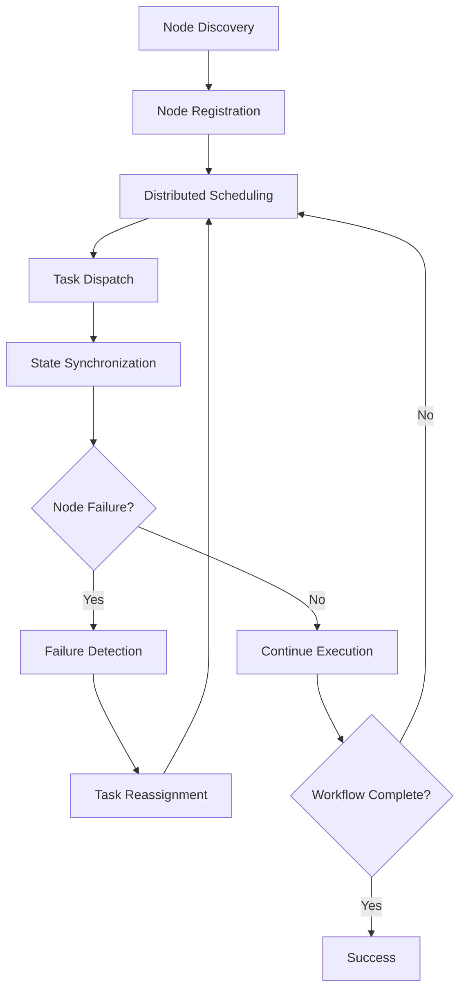

# **Distributed Workflow Engine**

## **Overview**

The Distributed Workflow Engine module enables orchestration, scheduling, and execution of workflows across multiple distributed nodes, clusters, or cloud environments. It provides robust mechanisms for coordination, state synchronization, and fault tolerance in large-scale, heterogeneous systems.

## **Core Principles**
- **Scalability**: Seamlessly scale workflow execution across many nodes.
- **Fault Tolerance**: Detect and recover from node and network failures.
- **Consistency**: Ensure workflow state consistency across distributed environments.
- **Interoperability**: Integrate with diverse platforms, clouds, and protocols.

## **Function Specifications**

### **Core Functions**
- **Node Discovery & Registration**: Discover and register workflow nodes dynamically.
- **Distributed Scheduling**: Schedule tasks and workflows across nodes based on load and capabilities.
- **State Synchronization**: Synchronize workflow state and data across distributed nodes.
- **Consensus & Coordination**: Use consensus protocols (e.g., Raft, Paxos) for coordination.
- **Failure Detection & Recovery**: Detect node failures and reassign tasks as needed.
- **Cross-Cluster Integration**: Orchestrate workflows across multiple clusters or clouds.

### **TypeScript Interfaces**
```typescript
interface DistributedEngineConfig {
  nodeDiscovery: NodeDiscoveryConfig;
  scheduling: SchedulingConfig;
  stateSync: StateSyncConfig;
  consensus: ConsensusConfig;
  failureDetection: FailureDetectionConfig;
}

interface NodeRegistration {
  nodeId: string;
  capabilities: NodeCapabilities;
  status: NodeStatus;
}

function registerNode(config: NodeRegistration): Promise<boolean>
function scheduleDistributedTask(task: DistributedTaskConfig): Promise<TaskDispatchResult>
function synchronizeState(workflowId: string): Promise<StateSyncResult>
function detectNodeFailure(nodeId: string): Promise<FailureDetectionResult>
function coordinateConsensus(workflowId: string): Promise<ConsensusResult>
```

## **Integration Patterns**

### **Distributed Execution Flow**


## **Capabilities**
- **Multi-Node Orchestration**: Coordinate workflows across many nodes and clusters.
- **Dynamic Scaling**: Add or remove nodes at runtime.
- **Resilient Execution**: Recover from node/network failures automatically.
- **Cross-Cloud Integration**: Orchestrate workflows across clouds and platforms.
- **Consistent State**: Maintain consistent workflow state everywhere.

## **Configuration Examples**
```yaml
distributed_workflow_engine:
  node_discovery:
    enabled: true
    protocol: "mdns"
    heartbeat_interval: 10s
  scheduling:
    strategy: "load_balanced"
    max_tasks_per_node: 50
  state_sync:
    enabled: true
    protocol: "raft"
    sync_interval: 5s
  consensus:
    protocol: "raft"
    election_timeout: 2s
  failure_detection:
    enabled: true
    detection_interval: 3s
    recovery_strategy: "reassign"
```

## **Performance Considerations**
- **Node Registration**: < 1s for new node registration
- **Task Dispatch**: < 200ms for distributed task dispatch
- **State Sync**: < 500ms for state synchronization
- **Failure Recovery**: < 2s for node failure detection and recovery
- **Scalability**: 1000+ nodes, 100,000+ concurrent tasks

## **Security Considerations**
- **Node Authentication**: Authenticate nodes before registration
- **Secure Communication**: Encrypt all inter-node communication
- **Consensus Integrity**: Protect consensus protocols from tampering
- **Audit Logging**: Log all distributed operations and state changes
- **Access Control**: Restrict orchestration controls to authorized nodes

## **Monitoring & Observability**
- **Node Health Metrics**: Monitor node health, status, and load
- **Task Distribution Metrics**: Track task distribution and completion
- **State Consistency Metrics**: Monitor state synchronization and consistency
- **Failure Metrics**: Track node failures and recovery events
- **Consensus Metrics**: Monitor consensus protocol performance

---

**Version**: 1.0  
**Module**: Distributed Workflow Engine  
**Status**: ✅ **COMPLETE** - Comprehensive module specification ready for implementation  
**Focus**: Distributed, scalable, and resilient workflow orchestration. 