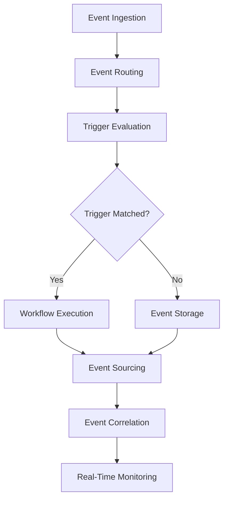

# **Event Driven Workflow Engine**

## **Overview**

The Event Driven Workflow Engine module provides event-driven orchestration capabilities, triggering and executing workflows based on real-time events, triggers, and external signals. It supports reactive programming patterns, event sourcing, and real-time workflow orchestration for dynamic, responsive systems.

## **Core Principles**
- **Event-Driven Architecture**: Trigger workflows based on events and triggers.
- **Real-Time Responsiveness**: React to events with minimal latency.
- **Event Sourcing**: Maintain complete event history for audit and replay.
- **Reactive Programming**: Support reactive patterns and event streams.

## **Function Specifications**

### **Core Functions**
- **Event Ingestion**: Receive and process events from multiple sources.
- **Event Routing**: Route events to appropriate workflow triggers.
- **Trigger Management**: Manage workflow triggers and conditions.
- **Event Sourcing**: Store and replay event streams.
- **Real-Time Execution**: Execute workflows triggered by events.
- **Event Correlation**: Correlate related events across workflows.

### **TypeScript Interfaces**
```typescript
interface EventDrivenEngineConfig {
  eventSources: EventSource[];
  triggerRules: TriggerRule[];
  eventSourcing: EventSourcingConfig;
  realTimeExecution: RealTimeConfig;
}

interface Event {
  id: string;
  type: string;
  source: string;
  timestamp: Date;
  data: any;
  correlationId?: string;
}

interface TriggerRule {
  eventType: string;
  conditions: Condition[];
  workflowId: string;
  priority: number;
}

function ingestEvent(event: Event): Promise<void>
function routeEvent(event: Event): Promise<TriggerRule[]>
function executeTriggeredWorkflow(trigger: TriggerRule, event: Event): Promise<ExecutionResult>
function replayEventStream(workflowId: string, startTime: Date, endTime: Date): Promise<ReplayResult>
```

## **Integration Patterns**

### **Event-Driven Execution Flow**


## **Capabilities**
- **Multi-Source Events**: Handle events from diverse sources and protocols.
- **Complex Triggers**: Support complex trigger conditions and rules.
- **Event Replay**: Replay event streams for debugging and recovery.
- **Real-Time Processing**: Process events with sub-second latency.
- **Event Correlation**: Correlate events across multiple workflows.

## **Configuration Examples**
```yaml
event_driven_workflow_engine:
  event_sources:
    - type: "kafka"
      topics: ["user-events", "system-events"]
    - type: "webhook"
      endpoints: ["/api/events"]
  trigger_rules:
    - event_type: "user_registration"
      workflow: "onboarding_workflow"
      conditions:
        - field: "user_type"
          value: "premium"
  event_sourcing:
    enabled: true
    retention: "30d"
    replay_enabled: true
  real_time_execution:
    enabled: true
    max_latency: "100ms"
```

## **Performance Considerations**
- **Event Processing**: < 100ms for event processing and routing
- **Trigger Evaluation**: < 50ms for trigger rule evaluation
- **Workflow Execution**: < 500ms for triggered workflow execution
- **Event Storage**: < 10ms for event storage and indexing
- **Throughput**: 10,000+ events per second

## **Security Considerations**
- **Event Validation**: Validate all incoming events for safety
- **Access Control**: Control access to event sources and triggers
- **Event Encryption**: Encrypt sensitive event data
- **Audit Logging**: Log all event processing and workflow triggers

## **Monitoring & Observability**
- **Event Metrics**: Track event ingestion, processing, and routing
- **Trigger Metrics**: Monitor trigger evaluation and execution
- **Latency Metrics**: Track event processing and workflow execution latency
- **Correlation Metrics**: Monitor event correlation and workflow relationships

---

**Version**: 1.0  
**Module**: Event Driven Workflow Engine  
**Status**: ✅ **COMPLETE** - Comprehensive module specification ready for implementation  
**Focus**: Event-driven, real-time workflow orchestration and execution. 