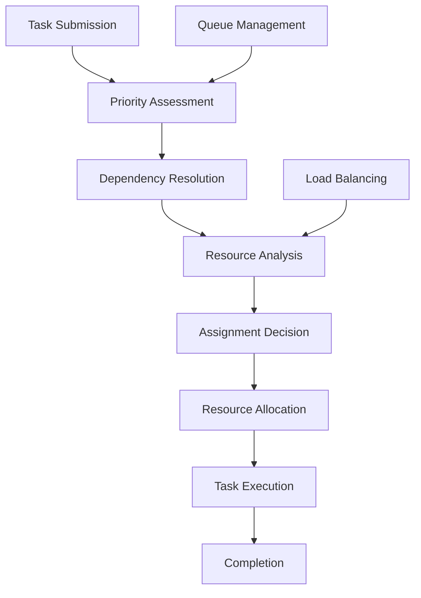

# **Task Scheduler**

## **Overview**

The Task Scheduler module provides intelligent task assignment, prioritization, and execution management capabilities. It optimizes resource utilization, handles task dependencies, manages priorities, and ensures efficient task execution across distributed systems while maintaining fairness and meeting service level agreements.

## **Core Principles**
- **Intelligent Assignment**: Assign tasks based on resource availability, capabilities, and optimization criteria.
- **Priority Management**: Handle task priorities and ensure high-priority tasks are executed first.
- **Resource Optimization**: Optimize resource utilization and minimize idle time.
- **Fairness & Balance**: Ensure fair task distribution and prevent resource starvation.

## **Function Specifications**

### **Core Functions**
- **Task Assignment**: Assign tasks to available resources based on optimization criteria.
- **Priority Management**: Manage task priorities and scheduling order.
- **Resource Allocation**: Allocate resources efficiently for task execution.
- **Dependency Resolution**: Handle task dependencies and execution order.
- **Load Balancing**: Distribute tasks across available resources.
- **Queue Management**: Manage task queues and execution order.

### **TypeScript Interfaces**
```typescript
interface TaskSchedulerConfig {
  assignmentStrategy: AssignmentStrategy;
  priorityManagement: PriorityConfig;
  resourceAllocation: ResourceConfig;
  loadBalancing: LoadBalancingConfig;
}

interface Task {
  id: string;
  priority: number;
  resourceRequirements: ResourceRequirements;
  dependencies: string[];
  estimatedDuration: number;
  deadline?: Date;
}

interface AssignmentResult {
  taskId: string;
  resourceId: string;
  estimatedStartTime: Date;
  estimatedEndTime: Date;
  confidence: number;
}

function assignTask(task: Task): Promise<AssignmentResult>
function managePriority(taskId: string, newPriority: number): Promise<boolean>
function allocateResources(taskId: string, requirements: ResourceRequirements): Promise<ResourceAllocation>
function resolveDependencies(taskId: string): Promise<DependencyResolution>
function balanceLoad(): Promise<LoadBalancingResult>
function manageQueue(queueId: string): Promise<QueueStatus>
```

## **Integration Patterns**

### **Task Scheduling Flow**


## **Capabilities**
- **Intelligent Assignment**: Assign tasks using AI/ML-based optimization algorithms.
- **Priority Handling**: Support complex priority schemes and dynamic priority adjustment.
- **Resource Optimization**: Optimize resource allocation and utilization.
- **Dependency Management**: Handle complex task dependencies and execution order.
- **Load Balancing**: Distribute tasks evenly across available resources.
- **Queue Optimization**: Optimize queue management and task ordering.

## **Configuration Examples**
```yaml
task_scheduler:
  assignment_strategy:
    algorithm: "ai_optimized"
    optimization_criteria: ["latency", "throughput", "cost"]
    learning_enabled: true
  priority_management:
    priority_levels: 10
    dynamic_adjustment: true
    aging_factor: 0.1
  resource_allocation:
    allocation_strategy: "best_fit"
    resource_matching: "capability_based"
    overcommit_ratio: 1.2
  load_balancing:
    algorithm: "weighted_round_robin"
    health_check_interval: "30s"
    failover_enabled: true
```

## **Performance Considerations**
- **Assignment Latency**: < 100ms for task assignment decisions
- **Priority Processing**: < 50ms for priority updates and reordering
- **Resource Allocation**: < 200ms for resource allocation
- **Dependency Resolution**: < 100ms for dependency resolution
- **Throughput**: 10,000+ tasks per minute

## **Security Considerations**
- **Task Validation**: Validate all tasks for safety and compliance
- **Resource Access Control**: Control access to resources and capabilities
- **Priority Manipulation**: Prevent unauthorized priority manipulation
- **Audit Logging**: Log all scheduling decisions and resource allocations

## **Monitoring & Observability**
- **Assignment Metrics**: Track assignment success rates and latency
- **Priority Metrics**: Monitor priority handling and fairness
- **Resource Metrics**: Track resource utilization and allocation efficiency
- **Queue Metrics**: Monitor queue lengths and processing times
- **Load Balancing Metrics**: Track load distribution and balance quality

---

**Version**: 1.0  
**Module**: Task Scheduler  
**Status**: ✅ **COMPLETE** - Comprehensive module specification ready for implementation  
**Focus**: Intelligent task assignment, prioritization, and execution management. 